## What It Does

`/gsd auto` is GSD's autonomous execution mode. Once started, it takes over the full lifecycle: researching the codebase, planning slices and tasks, executing each unit in a fresh context window, committing changes, running verification, writing summaries, and dispatching the next unit. It continues until the active milestone is complete — or until you [stop](../stop/) or [pause](../pause/) it.

Unlike bare [`/gsd`](../gsd/) (which runs one unit and waits for your input), auto mode loops continuously. Each unit gets a clean context window with pre-loaded, focused context — summaries of prior work, the active plan, architectural decisions, and knowledge base entries. This prevents context degradation across long-running projects.

## Usage

```
/gsd auto
/gsd auto --verbose
/gsd auto --debug
```

| Flag | Effect |
|------|--------|
| `--verbose` | Increases logging detail during dispatch and execution |
| `--debug` | Enables debug-level output for troubleshooting dispatch issues |

If you want to execute just **one unit** and decide what to do next, use [`/gsd`](../gsd/) or [`/gsd next`](../next/) instead.

## How It Works

Auto mode is a state machine that reads the `.gsd/` directory to determine what phase the project is in, then dispatches the right type of work. Here's the full initialization and dispatch flow:

```mermaid
flowchart TD
    Start(["/gsd auto"]) --> Stale{Stale worktree?}
    Stale -->|Yes| Clean[Clean up stale state]
    Stale -->|No| Paused
    Clean --> Paused{Paused session?}
    Paused -->|Yes| Resume[Restore saved state]
    Paused -->|No| Git
    Resume --> Dispatch
    Git{Git repo exists?} -->|No| InitGit[Initialize git]
    Git -->|Yes| Crash
    InitGit --> Crash
    Crash{Crash lock found?} -->|Yes| Recover[Offer recovery]
    Crash -->|No| Derive
    Recover --> Derive[Derive project state]
    Derive --> HasMilestone{Milestone exists?}
    HasMilestone -->|No| Wizard[Smart entry wizard]
    HasMilestone -->|Yes| Worktree
    Wizard --> Worktree[Create/enter worktree]
    Worktree --> Metrics[Init metrics DB]
    Metrics --> Dispatch

    Dispatch[Dispatch unit] --> Execute[Execute in fresh session]
    Execute --> Commit[Auto-commit changes]
    Commit --> Doctor[Run doctor checks]
    Doctor --> Sync[Sync worktree]
    Sync --> More{More units?}
    More -->|Yes| Dispatch
    More -->|No| Done([Milestone complete])

    style Start fill:#0d180d,stroke:#39ff14,color:#39ff14
    style Stale fill:#0d180d,stroke:#39ff14,color:#39ff14
    style Paused fill:#0d180d,stroke:#39ff14,color:#39ff14
    style Git fill:#0d180d,stroke:#39ff14,color:#39ff14
    style Crash fill:#0d180d,stroke:#39ff14,color:#39ff14
    style HasMilestone fill:#0d180d,stroke:#39ff14,color:#39ff14
    style More fill:#0d180d,stroke:#39ff14,color:#39ff14
    style Clean fill:#1a3a1a,stroke:#39ff14,color:#e8f4e8
    style Resume fill:#1a3a1a,stroke:#39ff14,color:#e8f4e8
    style InitGit fill:#1a3a1a,stroke:#39ff14,color:#e8f4e8
    style Recover fill:#1a3a1a,stroke:#39ff14,color:#e8f4e8
    style Derive fill:#1a3a1a,stroke:#39ff14,color:#e8f4e8
    style Wizard fill:#1a3a1a,stroke:#39ff14,color:#e8f4e8
    style Worktree fill:#1a3a1a,stroke:#39ff14,color:#e8f4e8
    style Metrics fill:#1a3a1a,stroke:#39ff14,color:#e8f4e8
    style Dispatch fill:#1a3a1a,stroke:#39ff14,color:#e8f4e8
    style Execute fill:#1a3a1a,stroke:#39ff14,color:#e8f4e8
    style Commit fill:#1a3a1a,stroke:#39ff14,color:#e8f4e8
    style Doctor fill:#1a3a1a,stroke:#39ff14,color:#e8f4e8
    style Sync fill:#1a3a1a,stroke:#39ff14,color:#e8f4e8
    style Done fill:#0d180d,stroke:#39ff14,color:#39ff14
```



### Initialization sequence

1. **Stale worktree check** — If a previous session left an orphaned worktree, GSD detects and cleans it up before proceeding.
2. **Resume check** — If a previous session was [paused](../pause/), GSD restores the saved state (base path, current unit, completed units) and jumps straight to dispatch.
3. **Git check** — Ensures the project is in a git repository. If not, initializes one.
4. **Crash recovery** — Checks for a crash lock file in `.gsd/runtime/`. If found, offers to recover the session or start fresh.
5. **Derive state** — Reads all `.gsd/` files to determine the current phase: which milestone is active, which slice, which task. This is the same algorithm used by [`/gsd status`](../status/).
6. **Smart entry wizard** — If no milestone exists yet, launches an interactive wizard to discuss the project and create the first milestone context file.
7. **Worktree setup** — If using worktree isolation (the default), creates `.gsd/worktrees/<MID>/` with a dedicated git worktree on a `milestone/<MID>` branch.
8. **Metrics initialization** — Opens the metrics database and begins session tracking for cost, tokens, and timing.

### The dispatch loop

After initialization, GSD enters its core loop. Each iteration:

1. **Dispatch** — Evaluates a declarative table of 13 ordered dispatch rules. The first matching rule determines the unit type (research, plan, execute, summarize, reassess, etc.).
2. **Execute** — Creates a fresh agent session with the unit's plan pre-loaded. The agent has no memory of prior sessions — everything it needs is in the dispatch prompt.
3. **Auto-commit** — After the unit completes, all changes are committed to the active branch with a structured commit message.
4. **Doctor checks** — Runs health checks on the `.gsd/` directory structure. Catches file corruption, missing summaries, or inconsistent state.
5. **Worktree sync** — Synchronizes the worktree with the integration branch if needed.
6. **Next dispatch** — Re-derives state from disk and loops back to step 1.

The loop continues until all slices in the milestone are complete, or until you run [`/gsd stop`](../stop/) or [`/gsd pause`](../pause/).

### Stuck detection

If the same unit is dispatched 3 times without progress, GSD flags it as stuck and stops. A lifetime limit of 6 stuck detections per session prevents infinite loops. When stuck detection triggers, the session stops with a diagnostic message explaining what unit was repeated and why.

## What Files It Touches

### Reads

| File | Purpose |
|------|---------|
| `.gsd/STATE.md` | Quick-glance status (cache of derived state) |
| `.gsd/KNOWLEDGE.md` | Accumulated patterns and gotchas |
| `.gsd/DECISIONS.md` | Architectural decision register |
| `.gsd/OVERRIDES.md` | User-issued steering overrides |
| `M*-ROADMAP.md` | Slice ordering and completion status |
| `S*-PLAN.md` | Task breakdown and estimates |
| `T*-SUMMARY.md` | Prior task outcomes (fed as context to next task) |

### Writes

| File | Purpose |
|------|---------|
| `.gsd/STATE.md` | Updated after each unit completes |
| `T*-SUMMARY.md` | Written by each task executor |
| `S*-SUMMARY.md` | Written at slice completion |
| `.gsd/runtime/` | Lock files, dispatch state, session metadata |
| `.gsd/activity/` | JSONL execution logs (timestamps, costs, outcomes) |

### Creates

| File | Condition |
|------|-----------|
| `.gsd/worktrees/<MID>/` | When isolation mode is `worktree` (default) |
| Milestone research/roadmap | When dispatch rules determine these are needed |
| Slice research/plan | When a new slice starts |

## Examples

Starting auto mode on a fresh Cookmate project:

```
> /gsd auto

● Deriving project state...
  Active milestone: M001 (Core Recipe Platform)
  Active slice: S01 (Database schema and auth)
  Phase: executing
  Active task: T01

● Creating worktree at .gsd/worktrees/M001/
  Branch: milestone/M001
  ✓ Worktree ready

● Initializing session
  Metrics DB: .gsd/runtime/metrics.db
  Session ID: sess_a8f3k2

● Dispatching unit: execute T01 (Build Prisma schema and seed data)
  Type: task-execution
  Est: 30 minutes
  ─────────────────────────────────

  ... agent executes T01 ...

  ✓ T01 complete — 4 files changed, 1 migration created
  ✓ Auto-committed: "T01: Build Prisma schema and seed data"
  ✓ Doctor: all checks passed

● Dispatching unit: execute T02 (NextAuth configuration)
  Type: task-execution
  Est: 25 minutes
  ─────────────────────────────────

  ... continues until milestone complete or stopped ...
```

Resuming after a pause:

```
> /gsd auto

● Detected paused session (sess_a8f3k2)
  Resuming from: T03 (Signup and login pages)
  Completed: T01, T02
  ─────────────────────────────────

● Dispatching unit: execute T03
  ...
```

## Related Commands

- [`/gsd stop`](../stop/) — Gracefully terminate auto mode
- [`/gsd pause`](../pause/) — Suspend auto mode with state preservation
- [`/gsd next`](../next/) — Execute one unit, then decide
- [`/gsd status`](../status/) — View progress dashboard without interrupting
