## What It Does

`/gsd auto` is GSD's autonomous execution mode. Once started, it takes over the full lifecycle: discussing and researching the codebase, planning slices and tasks, executing each unit in a fresh context window, committing changes, running verification, and dispatching the next unit. It continues until the active milestone is complete — or until you [stop](../stop/) it.

Unlike bare [`/gsd`](../gsd/) (which runs one unit and waits for your input), auto mode loops continuously. Each unit gets a clean context window with pre-loaded, focused context — summaries of prior work, the active plan, architectural decisions, and knowledge base entries. This prevents context degradation across long-running projects.

## Usage

```
/gsd auto
/gsd auto --verbose
/gsd auto --debug
```

| Flag | Effect |
|------|--------|
| `--verbose` | Increases logging detail during dispatch and execution |
| `--debug` | Enables debug-level output for troubleshooting dispatch issues |

If you want to execute just **one unit** and decide what to do next, use [`/gsd next`](../next/) instead.

## How It Works

Auto mode is a state machine that reads the `.gsd/` directory to determine what phase the project is in, then dispatches the right type of work. Here's the full initialization and dispatch flow:

```mermaid
flowchart TD
    Start(["/gsd auto"]) --> Stale{Stale worktree cwd?}
    Stale -->|Yes| Escape[Escape to project root]
    Stale -->|No| Paused
    Escape --> Paused{Paused session?}
    Paused -->|Yes| Resume[Restore state & re-enter worktree]
    Paused -->|No| Git
    Resume --> Dispatch
    Git{Git repo exists?} -->|No| InitGit[Initialize git repo + .gitignore + .gsd/]
    Git -->|Yes| Crash
    InitGit --> Crash
    Crash{Crash lock found?} -->|Yes| Recover[Synthesize recovery context]
    Crash -->|No| Derive
    Recover --> Derive[Derive project state from disk]
    Derive --> HasMilestone{Milestone exists?}
    HasMilestone -->|No| Discuss[discuss-milestone wizard]
    HasMilestone -->|Yes| Worktree
    Discuss --> Worktree[Create or re-enter worktree]
    Worktree --> DB[Open or auto-migrate SQLite DB]
    DB --> Metrics[Init metrics, routing history & skill snapshot]
    Metrics --> Secrets[Secrets collection gate]
    Secrets --> Heal[Self-heal stale runtime records]
    Heal --> Preflight[Pre-flight milestone queue validation]
    Preflight --> Dispatch

    Dispatch[Evaluate 18 dispatch rules] --> Execute[Execute unit in fresh session]
    Execute --> Verify[Verify expected artifact on disk]
    Verify -->|Missing| Retry[Increment dispatch count]
    Retry -->|Count < 3| Dispatch
    Retry -->|Count ≥ 3| Stuck[Stuck detection]
    Verify -->|Present| Commit[Auto-commit changes]
    Commit --> Doctor[Doctor health checks]
    Doctor --> Sync[Sync worktree state]
    Sync --> More{More units?}
    More -->|Yes| Dispatch
    More -->|No| Merge[Squash-merge to integration branch]
    Merge --> Done([Milestone complete])

    style Start fill:#0d180d,stroke:#39ff14,color:#39ff14
    style Stale fill:#0d180d,stroke:#39ff14,color:#39ff14
    style Paused fill:#0d180d,stroke:#39ff14,color:#39ff14
    style Git fill:#0d180d,stroke:#39ff14,color:#39ff14
    style Crash fill:#0d180d,stroke:#39ff14,color:#39ff14
    style HasMilestone fill:#0d180d,stroke:#39ff14,color:#39ff14
    style Verify fill:#0d180d,stroke:#39ff14,color:#39ff14
    style More fill:#0d180d,stroke:#39ff14,color:#39ff14
    style Escape fill:#1a3a1a,stroke:#39ff14,color:#e8f4e8
    style Resume fill:#1a3a1a,stroke:#39ff14,color:#e8f4e8
    style InitGit fill:#1a3a1a,stroke:#39ff14,color:#e8f4e8
    style Recover fill:#1a3a1a,stroke:#39ff14,color:#e8f4e8
    style Derive fill:#1a3a1a,stroke:#39ff14,color:#e8f4e8
    style Discuss fill:#1a3a1a,stroke:#39ff14,color:#e8f4e8
    style Worktree fill:#1a3a1a,stroke:#39ff14,color:#e8f4e8
    style DB fill:#1a3a1a,stroke:#39ff14,color:#e8f4e8
    style Metrics fill:#1a3a1a,stroke:#39ff14,color:#e8f4e8
    style Secrets fill:#1a3a1a,stroke:#39ff14,color:#e8f4e8
    style Heal fill:#1a3a1a,stroke:#39ff14,color:#e8f4e8
    style Preflight fill:#1a3a1a,stroke:#39ff14,color:#e8f4e8
    style Dispatch fill:#1a3a1a,stroke:#39ff14,color:#e8f4e8
    style Execute fill:#1a3a1a,stroke:#39ff14,color:#e8f4e8
    style Retry fill:#1a3a1a,stroke:#39ff14,color:#e8f4e8
    style Stuck fill:#1a3a1a,stroke:#39ff14,color:#e8f4e8
    style Commit fill:#1a3a1a,stroke:#39ff14,color:#e8f4e8
    style Doctor fill:#1a3a1a,stroke:#39ff14,color:#e8f4e8
    style Sync fill:#1a3a1a,stroke:#39ff14,color:#e8f4e8
    style Merge fill:#1a3a1a,stroke:#39ff14,color:#e8f4e8
    style Done fill:#0d180d,stroke:#39ff14,color:#39ff14
```



### Initialization sequence

1. **Stale worktree escape** — If the process `cwd` is still inside a previous milestone's worktree (e.g., after an unclean stop), GSD detects it and escapes back to the project root before proceeding.
2. **Resume check** — If a previous session was paused, GSD restores the saved state (base path, current unit, completed units), re-enters the worktree if needed, and jumps straight to dispatch. A recovery briefing is synthesized from the paused session's tool call history so the next agent knows what already happened.
3. **Git check** — Ensures the project is in a git repository. If not, initializes one with the configured main branch, sets up `.gitignore` baseline patterns, and bootstraps the `.gsd/` directory structure.
4. **Crash recovery** — Checks for a crash lock file in `.gsd/`. If found and the process is no longer alive, GSD synthesizes a recovery context from the prior session's tool call history and prepends it to the first dispatch prompt. If the lock belongs to a live process, GSD aborts to prevent two concurrent sessions.
5. **Derive state** — Reads all `.gsd/` files to determine the current phase: which milestone is active, which slice, which task. This is the same algorithm used by [`/gsd status`](../status/).
6. **Discuss-milestone** — If no milestone exists yet, or the active milestone has a draft context file that needs discussion, GSD dispatches a `discuss-milestone` unit to talk through the project goals and produce a `CONTEXT.md` before planning begins.
7. **Worktree setup** — If using worktree isolation (the default), creates or re-enters `.gsd/worktrees/<MID>/` with a `milestone/<MID>` branch. When re-attaching to an existing branch, GSD forward-merges any plan checkpoint state from the project root into the worktree to handle crash scenarios. A user-configured post-create hook (`git.worktree_post_create` in preferences) is run after creation — useful for copying `.env` files or symlinking assets.
8. **Database** — Opens or auto-migrates the SQLite database at `.gsd/gsd.db`. If the database doesn't exist yet but `.gsd/` has markdown files (decisions, requirements, milestones), GSD automatically imports them into the database before the first dispatch.
9. **Metrics & routing initialization** — Initializes the metrics ledger, routing history, and (if skill discovery is enabled) takes a snapshot of installed skills. Begins session tracking for cost, tokens, and timing.
10. **Secrets collection gate** — If a secrets manifest exists for the active milestone and contains uncollected keys, GSD prompts the user to provide them before the first unit is dispatched.
11. **Self-heal** — Clears stale unit runtime records where artifacts already exist on disk (prevents phantom re-dispatch on restart). Also auto-fixes `complete-slice` records where SUMMARY and UAT files exist but the roadmap checkbox was not flipped (e.g., a crash between writing artifacts and updating the roadmap). Removes stale `.git/index.lock` files left by prior crashes.
12. **Pre-flight validation** — When multiple milestones are queued, checks each for draft context files that will require user discussion before planning. Reports any blockers upfront rather than mid-run.

### The dispatch loop

After initialization, GSD enters its core loop. Each iteration:

1. **Dispatch** — Evaluates a declarative table of 18 ordered dispatch rules. The first matching rule determines the unit type and builds the prompt for that unit.
2. **Execute** — Creates a fresh agent session with the unit's plan pre-loaded. The agent has no memory of prior sessions — everything it needs is in the dispatch prompt.
3. **Artifact verification** — After the unit completes, GSD checks that the expected artifact was written to disk (e.g., a `PLAN.md` for `plan-slice`, a task `SUMMARY.md` and `[x]` checkbox for `execute-task`). For `complete-slice`, both a `SUMMARY.md` and `UAT.md` must exist and the slice must be marked `[x]` in the roadmap. If verification fails, the unit is re-dispatched.
4. **Auto-commit** — All changes are committed to the active milestone branch with a structured commit message.
5. **Doctor checks** — Runs health checks on the `.gsd/` directory structure. Catches file corruption, missing summaries, or inconsistent state.
6. **Worktree sync** — Synchronizes state between the worktree and the project root.
7. **Next dispatch** — Re-derives state from disk and loops back to step 1.

When the final unit (`complete-milestone`) finishes, GSD squash-merges the `milestone/<MID>` branch into the integration branch (default: `main`) with a rich commit message listing all completed slices, then tears down the worktree.

### Unit types

The dispatch table maps project phases to these unit types:

| Unit type | Phase | What it does |
|-----------|-------|-------------|
| `discuss-milestone` | `pre-planning` / `needs-discussion` | Discusses project goals with the user and writes `CONTEXT.md`; runs before research when no context exists or when the milestone has a draft |
| `research-milestone` | `pre-planning` | Scouts the codebase and writes RESEARCH.md |
| `plan-milestone` | `pre-planning` | Creates the milestone ROADMAP.md |
| `research-slice` | `planning` | Researches implementation approach for a slice (skipped for S01 when milestone research exists) |
| `plan-slice` | `planning` | Decomposes a slice into tasks and writes PLAN.md + per-task PLAN files |
| `execute-task` | `executing` | Implements a task in a fresh session |
| `reactive-execute` | `executing` | Executes multiple dependency-independent tasks in parallel; only dispatched when `reactive_execution.enabled` is set and the task graph has ≥2 ready tasks |
| `replan-slice` | `replanning-slice` | Rewrites the slice plan when a blocker is found; writes REPLAN.md |
| `complete-slice` | `summarizing` | Writes the slice SUMMARY.md, UAT.md, and marks the slice `[x]` in the roadmap |
| `run-uat` | post-completion | Runs automated UAT checks against the completed slice; pauses for user interaction when UAT is not artifact-driven |
| `reassess-roadmap` | post-completion | Reviews the roadmap after a slice completes and writes ASSESSMENT.md; opt-in via `phases.reassess_after_slice` preference |
| `validate-milestone` | `validating-milestone` | Final QA check before milestone completion; can be skipped via `skip_milestone_validation` preference |
| `complete-milestone` | `completing-milestone` | Writes milestone SUMMARY.md and triggers squash-merge |
| `rewrite-docs` | any (override gate) | Applies a [`/gsd steer`](../steer/) override to plan documents |

Some phases can be skipped entirely via preferences: `skip_research` (milestone and slice research), `skip_slice_research` (slice research only), `skip_reassess` (roadmap reassessment), and `skip_milestone_validation` (milestone validation). Roadmap reassessment only runs when `phases.reassess_after_slice` is also set to `true`.

### UAT verdict gate

When the `uat_dispatch` preference is enabled, GSD checks all completed slices for non-PASS UAT verdicts before advancing. If any `UAT-RESULT.md` file contains a verdict other than `pass` or `passed`, GSD stops with a warning rather than progressing to the next slice. Fix the issue and set the verdict to `PASS`, then resume auto mode.

### Reactive execution

When `reactive_execution.enabled` is set to `true` with `max_parallel > 1`, GSD derives a dependency graph from each slice's task I/O definitions before dispatching. If two or more tasks have no dependency on each other and no file-write conflicts, GSD dispatches them in parallel as a single `reactive-execute` unit. The batch is encoded in the unit ID (`M001/S01/reactive+T02,T03`) for verification and recovery. Setting `max_parallel: 1` keeps the graph derivation active (logged for observability) without enabling parallel dispatch — useful for inspecting graph quality before enabling parallelism.

### Safety guards

Two safety guards block milestone completion when the pipeline state is inconsistent:

- **Missing SUMMARY guard** — Both `validating-milestone` and `completing-milestone` check that every slice in the roadmap has a SUMMARY file before proceeding. If any slice is missing a summary, auto mode stops with an error and a list of the affected slices.
- **Implementation artifact guard** — `completing-milestone` verifies that the milestone branch contains at least one non-`.gsd/` file change compared to the integration branch. A milestone that only wrote plan files and no implementation code is not considered complete.

### Stuck detection

If the same unit is re-dispatched 3 times without producing its expected artifact (`MAX_UNIT_DISPATCHES = 3`), GSD flags it as stuck. A lifetime limit of 6 stuck detections per session (`MAX_LIFETIME_DISPATCHES = 6`) prevents infinite loops. When stuck detection triggers, GSD either writes a blocker placeholder artifact to advance the pipeline, or stops with a diagnostic message and manual remediation steps.

### Progress widget

While auto mode runs, a live progress widget is displayed in the terminal. The widget shows the current unit, milestone/slice context, slice progress bar, task checklist, cost, cache hit rate, and context window usage. Four display modes are available — cycle through them with **Esc**:

| Mode | What's shown |
|------|-------------|
| `full` | Two-column layout: progress bar + task checklist, stats, last commit |
| `small` | Compact: current action + progress bar + cost/context |
| `min` | Header line only |
| `off` | Hidden |

The selected mode is persisted to preferences so it survives restarts.

## What Files It Touches

### Reads

| File | Purpose |
|------|---------|
| `.gsd/STATE.md` | Quick-glance status (cache of derived state) |
| `.gsd/KNOWLEDGE.md` | Accumulated patterns and gotchas |
| `.gsd/DECISIONS.md` | Architectural decision register |
| `.gsd/OVERRIDES.md` | User-issued steering overrides |
| `.gsd/milestones/<MID>/<MID>-ROADMAP.md` | Slice ordering and completion status |
| `.gsd/milestones/<MID>/<SID>/<SID>-PLAN.md` | Task breakdown for a slice |
| `.gsd/milestones/<MID>/<SID>/tasks/<TID>-SUMMARY.md` | Prior task outcomes fed as context to next tasks |

### Writes

| File | Purpose |
|------|---------|
| `.gsd/STATE.md` | Updated after each unit completes |
| `.gsd/auto.lock` | Written at startup, cleared on stop — used for crash detection and cross-process signaling |
| `.gsd/gsd.db` | SQLite database opened or auto-migrated at startup |
| `.gsd/milestones/<MID>/<SID>/tasks/<TID>-SUMMARY.md` | Written by each task executor |
| `.gsd/milestones/<MID>/<SID>/<SID>-SUMMARY.md` | Written at slice completion |
| `.gsd/milestones/<MID>/<SID>/<SID>-UAT.md` | Acceptance criteria written at slice completion |
| `.gsd/milestones/<MID>/<SID>/<SID>-UAT-RESULT.md` | UAT execution results written by `run-uat` |
| `.gsd/milestones/<MID>/<SID>/<SID>-ASSESSMENT.md` | Roadmap reassessment written by `reassess-roadmap` |
| `.gsd/milestones/<MID>/<MID>-VALIDATION.md` | Written at milestone validation |
| `.gsd/milestones/<MID>/<MID>-SUMMARY.md` | Written at milestone completion |
| `.gsd/runtime/` | Lock files, per-unit runtime records, session metadata |
| `.gsd/activity/` | JSONL execution logs (timestamps, costs, outcomes) |
| `.gsd/completed-units.json` | Disk-backed idempotency log of completed unit keys |

### Creates

| File | Condition |
|------|-----------|
| `.gsd/worktrees/<MID>/` | When isolation mode is `worktree` (default) |
| `milestone/<MID>` git branch | When a new worktree is created for the milestone |
| Milestone CONTEXT.md / RESEARCH.md / ROADMAP.md | When dispatch rules determine these are needed |
| Slice RESEARCH.md / PLAN.md | When a new slice starts |

## Examples

Starting auto mode on a project with an active milestone:

```
> /gsd auto

● Deriving project state...
  Active milestone: M001 (Core Recipe Platform)
  Active slice: S01 (Database schema and auth)
  Phase: executing
  Active task: T01

● Creating worktree at .gsd/worktrees/M001/
  Branch: milestone/M001
  ✓ Worktree ready

● Dispatching unit: execute T01 (Build Prisma schema and seed data)
  Type: execute-task
  ─────────────────────────────────

  ... agent executes T01 ...

  ✓ T01 complete — 4 files changed, 1 migration created
  ✓ Artifact verified: task summary written and [x] checked in plan
  ✓ Auto-committed: "T01: Build Prisma schema and seed data"
  ✓ Doctor: all checks passed

● Dispatching unit: execute T02 (NextAuth configuration)
  Type: execute-task
  ─────────────────────────────────

  ... continues until milestone complete or stopped ...

● Milestone M001 complete — squash-merging to main
  ✓ Merged: "feat(M001): Core Recipe Platform"
  ✓ Worktree removed
```

Resuming after a pause:

```
> /gsd auto

● Detected paused session
  Resuming from: T03 (Signup and login pages)
  Completed: T01, T02
  ─────────────────────────────────

● Dispatching unit: execute T03
  ...
```

Resuming after a crash:

```
> /gsd auto

⚠ Crash detected — previous session (PID 12345) exited unexpectedly
  Recovered 47 tool calls from crashed session. Resuming with full context.

● Dispatching unit: execute T03 (with recovery context)
  ...
```

UAT verdict blocking progression:

```
> /gsd auto

⚠ UAT verdict for S01 is "fail" — blocking progression until resolved.
  Review the UAT result and update the verdict to PASS, or re-run /gsd auto after fixing.
```

## Prompts Used

- [`complete-milestone`](../../prompts/complete-milestone/) — Closes out a milestone after all slices are done
- [`complete-slice`](../../prompts/complete-slice/) — Verifies that all tasks in a slice actually deliver the slice goal, then writes the summary and UAT
- [`discuss-milestone`](../../prompts/discuss-milestone/) — Collects project context from the user and writes CONTEXT.md before planning begins
- [`execute-task`](../../prompts/execute-task/) — The core executor prompt
- [`plan-milestone`](../../prompts/plan-milestone/) — Reads milestone research and decomposes the work into demoable, risk-ordered slices
- [`plan-slice`](../../prompts/plan-slice/) — Decomposes a slice into a set of executable tasks, each sized to fit one context window
- [`reassess-roadmap`](../../prompts/reassess-roadmap/) — Reviews the milestone roadmap after each slice completes, deciding whether remaining slices still make sense
- [`replan-slice`](../../prompts/replan-slice/) — Rewrites the remaining tasks in a slice when a blocker is discovered mid-execution
- [`research-milestone`](../../prompts/research-milestone/) — Opens the auto-mode pipeline by scouting the codebase and producing a research document
- [`research-slice`](../../prompts/research-slice/) — Scouts the codebase at the start of each slice, producing a research document for the planner
- [`rewrite-docs`](../../prompts/rewrite-docs/) — Documentation refresh prompt
- [`run-uat`](../../prompts/run-uat/) — User acceptance testing prompt
- [`validate-milestone`](../../prompts/validate-milestone/) — Reconciliation gate before milestone completion

## Related Commands

- [`/gsd stop`](../stop/) — Gracefully terminate auto mode
- [`/gsd next`](../next/) — Execute one unit, then pause for input
- [`/gsd status`](../status/) — View progress dashboard without interrupting
- [`/gsd steer`](../steer/) — Inject a course-correction override while auto mode runs
- [`/gsd capture`](../capture/) — Record a thought without interrupting auto mode
