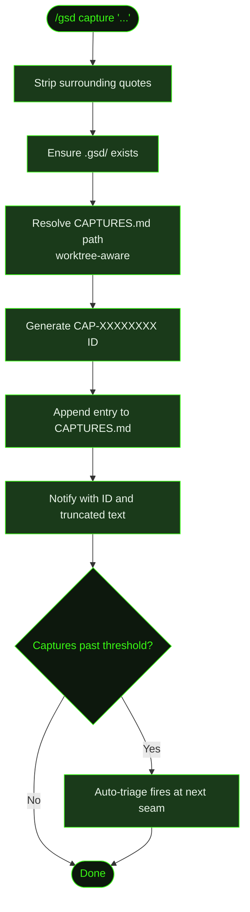

## What It Does

`/gsd capture` saves a thought to `.gsd/CAPTURES.md` without interrupting whatever's running. It's a fire-and-forget command — type your thought, hit enter, and the agent keeps working. No confirmation dialog, no context switch.

Captures are tagged as `pending` until triaged. You can triage them manually with [`/gsd triage`](../triage/) or let auto-mode handle them at natural pause points between tasks. Each capture gets a unique ID (like `CAP-a1b2c3d4`) for tracking.

The command works in all modes — auto-mode running, paused, stopped, or even without a milestone. If `.gsd/` doesn't exist yet, it creates it. This makes capture the lowest-friction way to record a thought.

## Usage

```
/gsd capture <thought>
```

Quotes around the thought are optional — they're stripped if present.

```
/gsd capture consider adding rate limiting to the API
/gsd capture "the login form needs better error messages"
/gsd capture 'should we use Redis for session storage?'
```

## How It Works

### Capture Flow



The full pipeline is:

1. **Parse input** — Strips surrounding quotes (single or double) from the argument.
2. **Ensure `.gsd/` exists** — Creates the directory if missing. Captures work even before any milestone is created.
3. **Resolve path** — Determines the correct `CAPTURES.md` path, accounting for worktree isolation.
4. **Generate ID** — Creates a unique ID like `CAP-a1b2c3d4` using the first 8 characters of a UUID.
5. **Append entry** — Adds an H3 section with the capture text, timestamp, and `pending` status.
6. **Notify** — Shows a confirmation with the capture ID and text (truncated to 60 characters if longer).

### Automatic Triage

When captures accumulate past a threshold, triage fires automatically at the next natural seam between tasks — after a unit completes and before the next unit is dispatched. The triage is enqueued as a sidecar unit on the internal `sidecarQueue`. Triage does not fire while auto-mode is in step mode, or when the completing unit was itself a `triage-captures` or `quick-task` unit.

The progress widget shows a pending capture count badge so you can see how many are waiting.

You can also trigger triage at any time with [`/gsd triage`](../triage/).

### Worktree Awareness

When running inside a worktree, captures resolve to the **original project root's** `CAPTURES.md`, not the worktree-local copy. Two worktree layouts are detected:

- **Direct layout**: `/.gsd/worktrees/MXXX/`
- **Symlink-resolved layout**: `/.gsd/projects/<hash>/worktrees/`

In both cases the project root is resolved by walking up to the directory that contains `.gsd/worktrees/`. This ensures all captures from all worktrees end up in a single file.

### Capture Entry Format

Each capture is stored as a markdown section. New files start with a `# Captures` header:

```markdown
### CAP-a1b2c3d4
**Text:** consider adding rate limiting to the API
**Captured:** 2025-01-15T10:30:00.000Z
**Status:** pending
```

After triage, the status is updated and classification fields are appended:

```markdown
### CAP-a1b2c3d4
**Text:** consider adding rate limiting to the API
**Captured:** 2025-01-15T10:30:00.000Z
**Status:** resolved
**Classification:** defer
**Resolution:** deferred to a future slice
**Rationale:** Not in scope for current slice
**Resolved:** 2025-01-15T14:00:00.000Z
```

For actionable captures (`quick-task`, `inject`, `replan`), an `**Executed:**` timestamp is added once their resolution has been carried out:

```markdown
**Executed:** 2025-01-15T15:00:00.000Z
```

### Classifications

Captures are classified during triage into one of five types:

| Classification | Meaning |
|----------------|---------|
| `quick-task` | Execute as a one-off at the next seam — no plan modification |
| `inject` | Add a new task to the current slice plan |
| `defer` | Move to a future slice or milestone — not urgent now |
| `replan` | Remaining tasks need rewriting — triggers slice replan |
| `note` | Informational only — no action needed |

`note` and `defer` captures are auto-confirmed during triage. `quick-task`, `inject`, and `replan` classifications require user confirmation before being applied — you can also change the proposed classification or skip the capture (leaving it `pending` for later).

### How Triage Classifies

When triage runs, the LLM reads the **current slice plan** and **active roadmap** as context before proposing classifications. This lets it make informed decisions — for example, preferring `inject` when the work fits naturally into the current slice, or `defer` when it belongs in a later phase.

**Triage only classifies — it does not execute resolutions.** After the triage unit completes, `executeTriageResolutions` runs to carry out the actions:

- **`inject`** — Reads the active slice plan, finds the highest existing task ID, and appends a new task entry before the `## Files Likely Touched` section:
  ```markdown
  - [ ] **T05: <capture text>** `est:30m`
    - Why: Injected from capture CAP-a1b2c3d4 during triage
    - Do: <capture text>
    - Done when: Capture intent fulfilled
  ```
  Marks the capture as executed on success.

- **`replan`** — Writes a `SXX-REPLAN-TRIGGER.md` marker file in the slice directory. The trigger records the source capture ID, text, rationale, and a timestamp. The next dispatch cycle detects this file and enters the `replanning-slice` phase.

- **`quick-task`** — A dedicated prompt (`buildQuickTaskPrompt`) is generated from the capture text and dispatched as a self-contained unit. The agent executes the task without modifying any plan files. The capture is marked as executed after the unit completes.

- **`defer`** — If the target milestone doesn't exist yet, creates its directory and seeds a `MXXX-CONTEXT-DRAFT.md` with the deferred captures listed. This ensures `deriveState()` discovers the milestone and routes to the discussion phase.

Each executed capture is stamped with `**Executed:**` in `CAPTURES.md` to prevent double-execution on retries or restarts.

### Context Injection

Capture context flows into downstream prompts automatically:

- **Replan-slice prompts** — know what capture triggered the replan, so the replan is informed by the original thought.
- **Reassess-roadmap prompts** — deferred captures appear as input, letting the roadmap reflect work that was intentionally pushed out.

## What Files It Touches

### Creates

| File | Purpose |
|------|---------|
| `.gsd/CAPTURES.md` | Created on first capture if it doesn't exist (with `# Captures` header) |
| `.gsd/` | Created if the directory doesn't exist |
| `.gsd/milestones/MXXX/slices/SXX/SXX-REPLAN-TRIGGER.md` | Written when a `replan` capture is executed — triggers replanning-slice phase |
| `.gsd/milestones/MXXX/MXXX-CONTEXT-DRAFT.md` | Seeded when a `defer` target milestone doesn't exist yet |

### Reads

| File | Purpose |
|------|---------|
| `.gsd/CAPTURES.md` | Existing content to append to |
| `.gsd/milestones/MXXX/slices/SXX/SXX-PLAN.md` | Read during `inject` execution to find the next task ID |
| `.gsd/milestones/MXXX/MXXX-ROADMAP.md` | Read during triage for classification context |

### Writes

| File | Purpose |
|------|---------|
| `.gsd/CAPTURES.md` | New capture entry appended; status and classification fields updated after triage |
| `.gsd/milestones/MXXX/slices/SXX/SXX-PLAN.md` | New task appended when an `inject` capture is executed |

## Examples

Capturing a thought during auto-mode:

```
> /gsd capture consider adding rate limiting to the API

● Captured: CAP-a1b2c3d4 — "consider adding rate limiting to the API"
```

Capturing with quotes:

```
> /gsd capture "the login form needs better error messages"

● Captured: CAP-f9e8d7c6 — "the login form needs better error messages"
```

Long captures are truncated in the notification (at 60 characters) but stored in full:

```
> /gsd capture the authentication service needs to support refresh token rotation for better security

● Captured: CAP-c3d4e5f6 — "the authentication service needs to support refresh to..."
```

Checking pending captures:

```
> /gsd triage

● Triaging 3 pending captures...
```

## Prompts Used

- [`triage-captures`](../../prompts/triage-captures/) — Capture triage prompt

## Related Commands

- [`/gsd triage`](../triage/) — Classify and act on pending captures
- [`/gsd steer`](../steer/) — Direct plan override (stronger than capture)
- [`/gsd queue`](../queue/) — Add future milestones (for larger work)
- [`/gsd quick`](../quick/) — Execute a small task immediately
