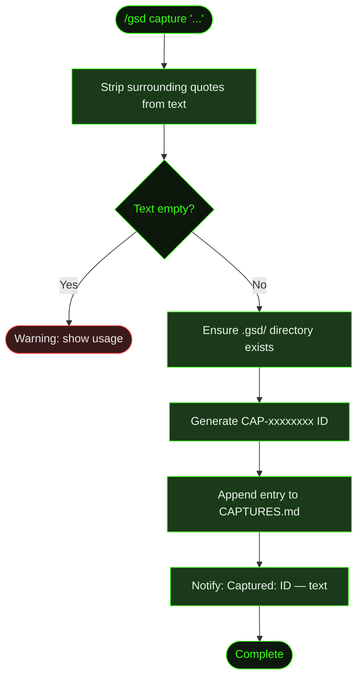

## What It Does

`/gsd capture` is the mechanism for recording a thought mid-session without acting on it. You run it with a plain-English description, and GSD appends an entry to `.gsd/CAPTURES.md` with a unique ID, a timestamp, and status `pending`. The current task keeps running. Nothing changes in the plan.

The point of capture is deferral. When something lands in your head while work is in progress — a bug you noticed, a feature idea, an edge case you want to revisit — running `/gsd capture` gets it out of your head and into a file. Triage happens later, either automatically when auto-mode reaches a natural seam, or manually via [`/gsd triage`](../triage/).

The command works even without an active milestone. If `.gsd/` doesn't exist yet, GSD creates it. This makes capture safe to use at any point in a project's lifecycle.

## Usage

```
/gsd capture <text>
```

Everything after `capture` is the captured text. Surrounding quotes are stripped, so these are equivalent:

```
/gsd capture the error message on 404 is confusing for logged-out users
/gsd capture "add rate limiting to the recipe search endpoint"
/gsd capture we should revisit the auth token refresh logic before launch
```

Running the command without text shows usage:

```
/gsd capture
→ Usage: /gsd capture "your thought here"
```

## How It Works


```mermaid
flowchart TD
    Start(["/gsd capture '...'"]) --> Strip[Strip surrounding quotes from text]
    Strip --> Empty{Text empty?}
    Empty -->|Yes| Warn([Warning: show usage])
    Empty -->|No| EnsureDir[Ensure .gsd/ directory exists]
    EnsureDir --> GenID[Generate CAP-xxxxxxxx ID]
    GenID --> Append[Append entry to CAPTURES.md]
    Append --> Notify[Notify: Captured: ID — text]
    Notify --> Done([Complete])

    style Start fill:#0d180d,stroke:#39ff14,color:#39ff14
    style Empty fill:#0d180d,stroke:#39ff14,color:#39ff14
    style Warn fill:#3a1a1a,stroke:#ff4444,color:#e8e8e8
    style Strip fill:#1a3a1a,stroke:#39ff14,color:#e8f4e8
    style EnsureDir fill:#1a3a1a,stroke:#39ff14,color:#e8f4e8
    style GenID fill:#1a3a1a,stroke:#39ff14,color:#e8f4e8
    style Append fill:#1a3a1a,stroke:#39ff14,color:#e8f4e8
    style Notify fill:#1a3a1a,stroke:#39ff14,color:#e8f4e8
    style Done fill:#0d180d,stroke:#39ff14,color:#39ff14
```

### Capture Entry Format

Each capture is an H3 section in `CAPTURES.md` with bold metadata fields:

```markdown
# Captures

### CAP-a3f1bc2d
**Text:** the error message on 404 is confusing for logged-out users
**Captured:** 2026-01-15T10:32:00.000Z
**Status:** pending
```

The ID is `CAP-` followed by 8 hex characters from a random UUID. The file is append-only — new entries are added after a blank line at the end.

### Worktree Awareness

When GSD is running in worktree-isolated mode, the active agent runs inside `.gsd/worktrees/<MID>/`. Captures always resolve to the **original project root's** `.gsd/CAPTURES.md`, not the worktree-local copy. This ensures all captures accumulate in one place regardless of which worktree is active.

### Automatic Triage in Auto-mode

When auto-mode is running, GSD checks for pending captures at the end of every primary unit (not hooks or triage units themselves). If any exist and there is an active milestone and slice, a `triage-captures` sidecar unit is enqueued immediately after the current unit closes out.

The triage prompt classifies each pending capture against the current slice plan and roadmap, then presents proposals for confirmation:

| Classification | Meaning |
|----------------|---------|
| `quick-task` | Small, self-contained fix — executable in minutes |
| `inject` | Belongs in the current slice but wasn't planned |
| `defer` | Belongs in a future slice or milestone |
| `replan` | Changes the shape of remaining tasks in the current slice |
| `note` | Informational — no action required |
| `stop` | Directive to halt auto-mode |
| `backtrack` | Directive to abandon the current milestone |

After triage, `CAPTURES.md` is updated with the classification, resolution, rationale, and a timestamp. Quick-task captures are dispatched as sidecar units immediately after triage completes.

### Fast-path Stop Detection

Before waiting for a triage sidecar, GSD scans pending captures for stop/halt language at the start of the text (e.g., `stop`, `halt`, `abort`, `pause`, `cease`). If a match is found, auto-mode pauses immediately — no triage round-trip needed. This path specifically matches directives, not descriptions: "stop the timer from re-rendering" does not trigger it.

### Capture Lifecycle

A capture moves through these states in `CAPTURES.md`:

1. **`pending`** — Written by `/gsd capture`. Awaiting triage.
2. **`resolved`** — Written by the triage agent. Classification and rationale are added.
3. **`executed`** — Written after a quick-task or inject resolution is carried out. An `**Executed:**` timestamp is appended.

If a non-triage agent writes `**Status:** resolved` to a capture (bypassing triage), GSD reverts it to `pending` at the next post-unit check. This ensures all captures go through the triage pipeline before being acted on.

## What Files It Touches

### Creates

| File | Purpose |
|------|---------|
| `.gsd/CAPTURES.md` | Created with `# Captures` header if it doesn't exist |
| `.gsd/` | Created if it doesn't exist (capture works without a milestone) |

### Reads

| File | Purpose |
|------|---------|
| `.gsd/CAPTURES.md` | Existing content read before appending to preserve prior entries |

### Writes

| File | Purpose |
|------|---------|
| `.gsd/CAPTURES.md` | New capture entry appended with ID, text, timestamp, and `Status: pending` |

## Examples

Capturing a thought mid-session:

```
> /gsd capture the 404 error page doesn't handle logged-out users well

● Captured: CAP-a3f1bc2d — "the 404 error page doesn't handle logged-out users well"
```

Multiple captures accumulate in CAPTURES.md:

```markdown
# Captures

### CAP-a3f1bc2d
**Text:** the 404 error page doesn't handle logged-out users well
**Captured:** 2026-01-15T10:32:00.000Z
**Status:** pending

### CAP-7e92d15f
**Text:** add rate limiting to the recipe search endpoint
**Captured:** 2026-01-15T11:14:00.000Z
**Status:** pending
```

After auto-mode triages them, each entry is updated with its classification:

```markdown
### CAP-a3f1bc2d
**Text:** the 404 error page doesn't handle logged-out users well
**Captured:** 2026-01-15T10:32:00.000Z
**Status:** resolved
**Classification:** quick-task
**Resolution:** Update 404 page component to show login prompt for logged-out users
**Rationale:** Self-contained UI fix, no plan changes required
**Resolved:** 2026-01-15T12:05:00.000Z
**Milestone:** M003
```

Stopping auto-mode via capture:

```
> /gsd capture stop — we need to revisit the data model before continuing

● Captured: CAP-b21cc9a0 — "stop — we need to revisit the data model before continuing"
● Stop directive detected in pending capture CAP-b21cc9a0 — pausing auto-mode.
```

## Related Commands

- [`/gsd triage`](../triage/) — Manually classify and route pending captures
- [`/gsd auto`](../auto/) — Auto-mode that enqueues triage sidecars when captures accumulate
- [`/gsd quick`](../quick/) — Execute a task immediately without capturing for later
- [`/gsd steer`](../steer/) — Stronger course correction — rewrites active plan documents
