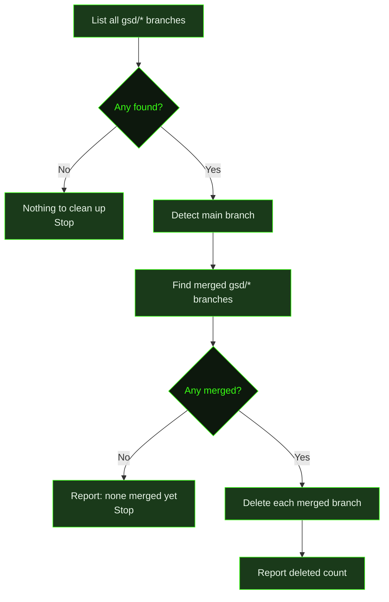
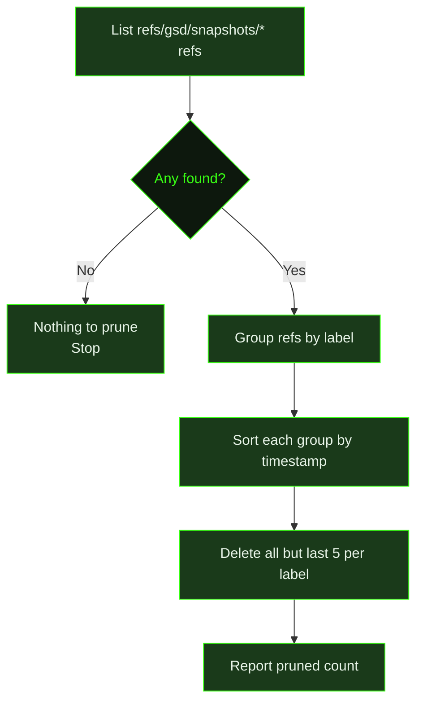

## What It Does

`/gsd cleanup` is a maintenance command that removes accumulated git cruft from GSD's normal operation. It does two things: deletes `gsd/*` branches that have already been merged into your main branch, and prunes old snapshot refs under `refs/gsd/snapshots/`, keeping only the most recent five per label.

You can run both cleanups at once or target just one:

- `/gsd cleanup` — runs branch cleanup, then snapshot cleanup
- `/gsd cleanup branches` — merged branch cleanup only
- `/gsd cleanup snapshots` — snapshot pruning only

Neither operation modifies files or commits anything — they only remove git refs and local branches. The command is safe to run at any time; it skips gracefully when there's nothing to clean.

## Usage

```
/gsd cleanup [branches|snapshots]
```

Without a subcommand, both cleanups run in sequence.

```
/gsd cleanup
/gsd cleanup branches
/gsd cleanup snapshots
```

## How It Works

### Branch Cleanup



1. **List GSD branches** — Finds all local branches matching the `gsd/*` pattern (e.g., `gsd/M01-S01`).
2. **Detect main branch** — Determines the main branch name (`main`, `master`, etc.).
3. **Find merged branches** — Checks which `gsd/*` branches are already merged into main.
4. **Delete** — Removes each merged branch. Branches that can't be deleted (e.g., currently checked out) are silently skipped.
5. **Report** — Shows how many branches were deleted and how many remain.

### Snapshot Cleanup



1. **List snapshot refs** — Finds all refs under `refs/gsd/snapshots/`.
2. **Group by label** — Each snapshot ref has the form `refs/gsd/snapshots/<label>/<timestamp>`. Refs are grouped by their label prefix.
3. **Sort by timestamp** — Within each group, refs are sorted chronologically by their timestamp suffix.
4. **Prune old snapshots** — All but the five most recent refs per label are deleted. The five newest are always kept.
5. **Report** — Shows how many snapshot refs were pruned and how many remain.

### About Snapshots

Snapshots are point-in-time git refs that GSD creates before destructive operations (like squash merges). They're enabled via the `snapshots` preference. Each snapshot captures the current HEAD at `refs/gsd/snapshots/<label>/<timestamp>`, providing a recovery point without creating visible branches. Over time these accumulate; cleanup prunes the old ones while keeping recent history intact.

### Early Exit Conditions

Both cleanups stop without error when there's nothing to do:

- **No `gsd/*` branches** — Reports "No GSD branches to clean up."
- **Branches exist but none merged** — Reports how many branches exist and that none are merged yet.
- **No snapshot refs** — Reports "No snapshot refs to clean up."

## What Files It Touches

`/gsd cleanup` operates exclusively on git refs and local branches. It does not read or write any files in the working tree or commit anything.

### Git Refs Modified

| Ref Pattern | Operation |
|-------------|-----------|
| `gsd/*` (local branches) | Deleted if merged into main branch |
| `refs/gsd/snapshots/<label>/*` | Old entries deleted, newest 5 per label kept |

## Examples

Running full cleanup when both branches and snapshots need pruning:

```
> /gsd cleanup

Cleaned up 4 merged branches. 1 remain.
Pruned 12 old snapshot refs. 10 remain.
```

Running branch-only cleanup when no branches are merged yet:

```
> /gsd cleanup branches

3 GSD branches found, none are merged into main yet.
```

Running snapshot cleanup when no snapshots exist (snapshots not enabled):

```
> /gsd cleanup snapshots

No snapshot refs to clean up.
```

Nothing to clean up at all:

```
> /gsd cleanup

No GSD branches to clean up.
No snapshot refs to clean up.
```

## Related Commands

- [`/gsd doctor`](../doctor/) — Diagnose and repair `.gsd/` state issues
- [`/gsd prefs`](../prefs/) — Enable the `snapshots` preference that generates snapshot refs
- [`/gsd update`](../update/) — Update GSD to the latest version
- [`/gsd health`](../health/) — Diagnose planning directory health issues
