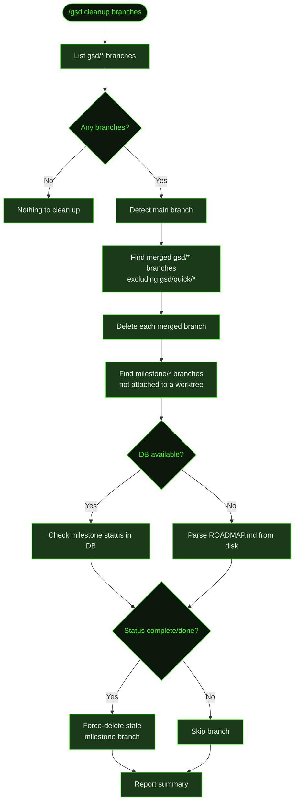
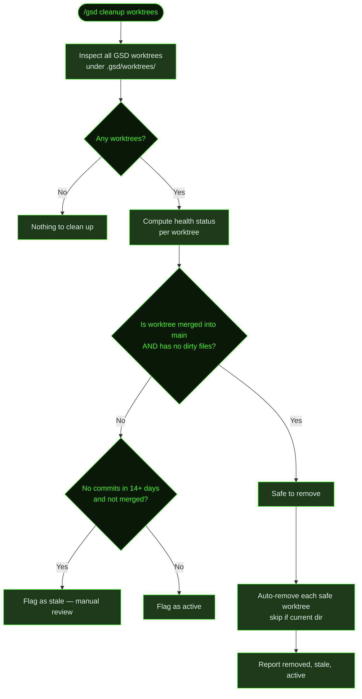

## What It Does

`/gsd cleanup` is a housekeeping command that removes accumulated git debris from a GSD project. It covers four categories of stale artifacts: merged GSD branches, old execution snapshot refs, merged worktrees, and orphaned project-state directories in `~/.gsd/projects/`.

Running `/gsd cleanup` with no arguments handles the two most common cases at once — merged branches and old snapshots. Each category can also be targeted individually with a subcommand.

The command reports what it removed (or why it skipped), then exits. There's no dry-run confirmation step for branches and snapshots — cleanup is low-risk because it only removes artifacts that are already merged or are old copies of data that's been superseded.

## Usage

```
/gsd cleanup
/gsd cleanup branches
/gsd cleanup snapshots
/gsd cleanup worktrees
/gsd cleanup projects
/gsd cleanup projects --fix
```

| Form | What it does |
|------|-------------|
| `/gsd cleanup` | Runs both `branches` and `snapshots` cleanup together |
| `/gsd cleanup branches` | Delete merged `gsd/*` branches and detached stale milestone branches |
| `/gsd cleanup snapshots` | Prune old `refs/gsd/snapshots/` refs, keeping the 5 most recent per label |
| `/gsd cleanup worktrees` | Remove worktrees that are merged into main and have no uncommitted changes |
| `/gsd cleanup projects` | Audit `~/.gsd/projects/` for orphaned state directories (dry-run) |
| `/gsd cleanup projects --fix` | Delete orphaned project state directories (permanent) |

## How It Works

### Branch Cleanup



Branch cleanup runs in two passes:

1. **Merged GSD branches** — Lists all branches matching `gsd/*`, then uses `git branch --merged` to find which ones are already in the main branch. Deletes each merged branch. `gsd/quick/*` branches are always skipped — quick-task branches are short-lived and managed separately.

2. **Stale milestone branches** — Lists all `milestone/*` branches and cross-references the currently registered worktrees. Any `milestone/*` branch that is **not** attached to a live worktree is eligible for deletion if the milestone is complete. Completion is checked **DB-first**: if the GSD database is available and has a row for the milestone, it reads the status field directly. If the DB is unavailable or has no row for that milestone, it falls back to parsing the `ROADMAP.md` from disk. Branches for incomplete milestones are left untouched.

### Snapshot Cleanup

GSD uses `refs/gsd/snapshots/` to store undo snapshots during task execution. These accumulate over time. Snapshot cleanup:

1. Lists all refs under `refs/gsd/snapshots/`
2. Groups them by label (the path prefix, excluding the final segment)
3. For each label group, **keeps the 5 most recent** refs and deletes the rest

This means you always have at least 5 rollback points per label. Old snapshots beyond that window are pruned.

### Worktree Cleanup



Worktree cleanup inspects all GSD-managed worktrees under `.gsd/worktrees/` and classifies each into one of three buckets:

| Category | Criteria | Action |
|----------|----------|--------|
| **Safe to remove** | Merged into main AND no uncommitted changes | Auto-removed (branch deleted) |
| **Stale** | Not merged AND no commits in 14+ days | Listed for manual review — not removed |
| **Active** | In progress | Listed for reference — not removed |

A worktree is safe to remove when its branch is fully contained in main and it has no dirty files (staged or unstaged). Unpushed commits don't block removal — if the branch is merged, the work is already in main. A worktree that is currently your working directory is always skipped, even if it would otherwise be safe to remove.

### Project State Cleanup

GSD stores per-project planning state in `~/.gsd/projects/<hash>/` directories, keyed by a hash of the project's git remote URL. When a project is deleted or moved, its state directory becomes orphaned. The location can be overridden with the `GSD_STATE_DIR` environment variable.

`/gsd cleanup projects` (dry-run) inspects each directory, reads its `repo-meta.json`, and checks whether the recorded git root path still exists on disk:

- **Active** — git root exists → listed but left alone
- **Orphaned** — git root is gone → listed as candidates for deletion
- **Unknown** — no metadata yet → listed with a note to open the project in GSD once

`/gsd cleanup projects --fix` deletes the orphaned directories. This is permanent and cannot be undone.

## What Files It Touches

### Reads

| File | Purpose |
|------|---------|
| git branch list (`gsd/*`, `milestone/*`) | Identifies GSD-managed branches for cleanup |
| git refs (`refs/gsd/snapshots/`) | Finds snapshot refs to prune |
| `.gsd/worktrees/` | Lists active worktrees for health checks |
| `.gsd/milestones/<MID>/<MID>-ROADMAP.md` | Filesystem fallback — checks milestone completion when DB is unavailable |
| `~/.gsd/projects/<hash>/repo-meta.json` | Reads git root path to detect orphaned state directories |

### Deletes

| File / Artifact | Purpose |
|---------|---------|
| git branches (`gsd/*`, `milestone/*`) | Merged or stale branches removed |
| git refs (`refs/gsd/snapshots/<label>/<old>`) | Old snapshot refs beyond the 5-per-label window |
| `.gsd/worktrees/<name>/` | Worktree directory removed (with its branch) |
| `~/.gsd/projects/<hash>/` | Orphaned project state directory (only with `--fix`) |

## Examples

Default cleanup — branches and snapshots together:

```
> /gsd cleanup

Cleaned up 3 merged branches. Deleted 2 stale milestone branches. Skipped 1 quick branch (gsd/quick/*).
Pruned 12 old snapshot refs. 10 remain.
```

Nothing to clean up:

```
> /gsd cleanup branches

No non-quick GSD branches to clean up.
```

Branches exist but none merged yet:

```
> /gsd cleanup branches

4 GSD branches found, none merged into main yet.
```

Worktree cleanup with a mix of states:

```
> /gsd cleanup worktrees

3 worktrees found.

Safe to remove (1) — merged into main, clean:
  ✓ M003-auth  removed (branch worktree/M003-auth deleted)

Removed 1 merged worktree.

Stale (1) — no recent commits, not merged (review manually):
  ⚠ M004-payments  no commits in 21 days

Active (1) — in progress:
  ● M005-api  last commit 2d ago
```

Project state audit (dry-run):

```
> /gsd cleanup projects

~/.gsd/projects  3 project state directories

Active (2) — git root present on disk:
  + a3f9b2c1  /Users/alice/dev/myapp  [github.com/alice/myapp]
  + b8d4e7f0  /Users/alice/dev/backend  [github.com/alice/backend]

Orphaned (1) — git root no longer exists:
  - c1e6a9b2  /Users/alice/dev/old-project  [github.com/alice/old-project]

Run /gsd cleanup projects --fix to permanently delete 1 orphaned directory.
```

Delete orphaned project state:

```
> /gsd cleanup projects --fix

...
Removed 1 orphaned directory.
```

## Related Commands

- [`/gsd health`](../health/) — Diagnose `.gsd/` directory health and repair structural issues
- [`/gsd complete-milestone`](../complete-milestone/) — Archive a shipped milestone
- [`/gsd undo`](../undo/) — Roll back to a recent snapshot
