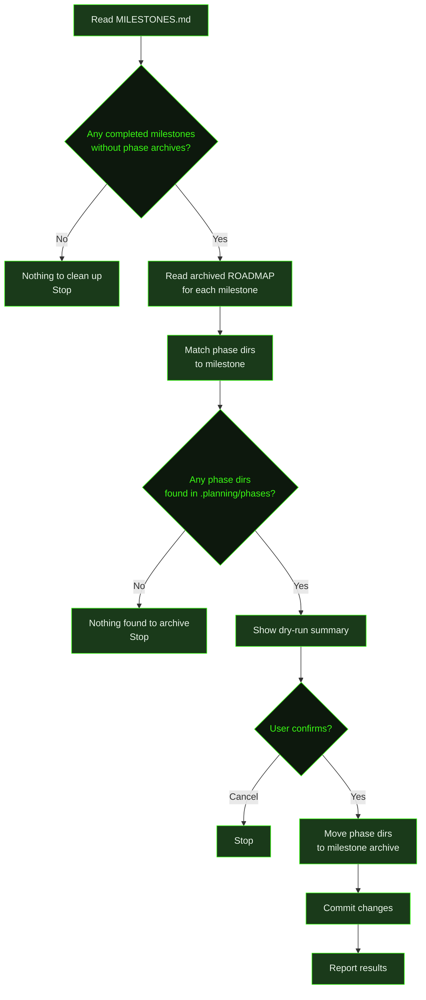

## What It Does

`/gsd cleanup` moves phase directories from `.planning/phases/` into per-milestone archive folders under `.planning/milestones/`. It's housekeeping — after milestones complete, their phase directories accumulate in `.planning/phases/`. This command identifies which phases belong to which milestone and archives them together.

Before making any changes, cleanup shows a dry-run summary and asks for confirmation. You can cancel at that point if something looks wrong. If all completed milestones are already archived, it reports as much and stops early.

The command is safe to run at any time — it only moves phase directories that belong to already-completed milestones, and it determines phase membership by reading the archived ROADMAP snapshot for each milestone rather than guessing.

## Usage

```
/gsd cleanup
```

There are no sub-commands or flags — the command always runs the full archive flow.

## How It Works



### Step-by-Step

1. **Identify completed milestones** — Reads `.planning/MILESTONES.md` to find all completed milestone versions (e.g., `v1.0`, `v1.1`).
2. **Check existing archives** — Lists `.planning/milestones/v*-phases/` directories to find which milestones already have phase archives. Only milestones without existing archives proceed.
3. **Determine phase membership** — For each unarchived milestone, reads `.planning/milestones/v{X.Y}-ROADMAP.md` to extract which phases belong to it. Phase directories are then matched against what actually exists in `.planning/phases/`.
4. **Show dry-run summary** — Presents a grouped list: which phase directories will move, and where they'll end up. If no phase directories are found, it reports and stops.
5. **Confirm** — Asks whether to proceed. Choosing "Cancel" exits without making changes.
6. **Archive** — Creates the destination directory (`.planning/milestones/v{X.Y}-phases/`) and moves each phase directory into it.
7. **Commit** — Commits the changes, staging both `.planning/milestones/` and `.planning/phases/` with the message `chore: archive phase directories from completed milestones`.
8. **Report** — Shows how many phase directories were archived per milestone.

### Early Exit Conditions

Cleanup stops early (without asking for confirmation) in two cases:

- **All milestones already archived** — Every completed milestone already has a `v{X.Y}-phases/` folder. Nothing to do.
- **No matching phase dirs found** — The milestone has unarchived phases per the ROADMAP snapshot, but none of those directories exist in `.planning/phases/` anymore (they may have been manually removed or renamed).

## What Files It Touches

### Reads

| File | Purpose |
|------|---------|
| `.planning/MILESTONES.md` | Identify completed milestones and their version numbers |
| `.planning/milestones/` | Check which milestones already have `v*-phases/` archives |
| `.planning/milestones/v{X.Y}-ROADMAP.md` | Determine which phases belong to each milestone |
| `.planning/phases/` | List phase directories available to archive |

### Creates

| File | Purpose |
|------|---------|
| `.planning/milestones/v{X.Y}-phases/` | Destination directory for archived phases (one per milestone) |

### Writes / Moves

| File | Purpose |
|------|---------|
| `.planning/phases/{phase-dir}/` | Moved from here into the milestone archive |

## Examples

Running cleanup after two milestones have completed:

```
> /gsd cleanup

## Cleanup Summary

### v1.0 — Foundation
These phase directories will be archived:
- 01-setup/
- 02-auth/
- 03-core-api/

Destination: .planning/milestones/v1.0-phases/

### v1.1 — Performance
These phase directories will be archived:
- 04-caching/
- 05-query-optimization/

Destination: .planning/milestones/v1.1-phases/

Proceed with archiving? [Yes — archive listed phases] [Cancel]

● Archived:
- v1.0: 3 phase directories → .planning/milestones/v1.0-phases/
- v1.1: 2 phase directories → .planning/milestones/v1.1-phases/

.planning/phases/ cleaned up.
```

When all completed milestones are already archived:

```
> /gsd cleanup

All completed milestones already have phase directories archived. Nothing to clean up.
```

When phase directories have already been removed manually:

```
> /gsd cleanup

No phase directories found to archive. Phases may have been removed or archived previously.
```

## Related Commands

- [`/gsd complete-milestone`](../complete-milestone/) — Complete a milestone and trigger archiving before starting cleanup
- [`/gsd audit-milestone`](../audit-milestone/) — Audit milestone completion before archiving
- [`/gsd progress`](../progress/) — Check current project state and route to next action
- [`/gsd health`](../health/) — Diagnose planning directory health issues
