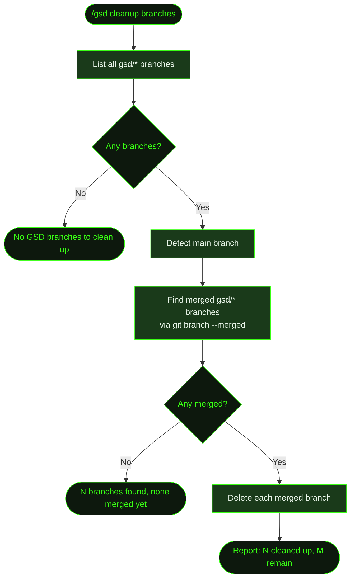

## What It Does

`/gsd cleanup` is a housekeeping command that removes accumulated git debris from a GSD project. It covers two categories of stale artifacts: merged GSD branches and old execution snapshot refs.

Running `/gsd cleanup` with no arguments handles both cases at once. Each category can also be targeted individually with a subcommand.

The command reports what it removed (or why it skipped), then exits. There is no dry-run confirmation step — cleanup is low-risk because it only removes branches that are already merged into main and snapshot refs that have been superseded by newer ones.

## Usage

```
/gsd cleanup
/gsd cleanup branches
/gsd cleanup snapshots
```

| Form | What it does |
|------|-------------|
| `/gsd cleanup` | Runs both `branches` and `snapshots` cleanup together |
| `/gsd cleanup branches` | Delete merged `gsd/*` branches |
| `/gsd cleanup snapshots` | Prune old `refs/gsd/snapshots/` refs, keeping the 5 most recent per label |

## How It Works

### Branch Cleanup


```mermaid
flowchart TD
    A(["/gsd cleanup branches"]) --> B[List all gsd/* branches]
    B --> C{Any branches?}
    C -- No --> D([No GSD branches to clean up])
    C -- Yes --> E[Detect main branch]
    E --> F[Find merged gsd/* branches<br/>via git branch --merged]
    F --> G{Any merged?}
    G -- No --> H([N branches found, none merged yet])
    G -- Yes --> I[Delete each merged branch]
    I --> J([Report: N cleaned up, M remain])

    style A fill:#0d180d,stroke:#39ff14,color:#39ff14
    style D fill:#0d180d,stroke:#39ff14,color:#39ff14
    style H fill:#0d180d,stroke:#39ff14,color:#39ff14
    style J fill:#0d180d,stroke:#39ff14,color:#39ff14
    style C fill:#0d180d,stroke:#39ff14,color:#39ff14
    style G fill:#0d180d,stroke:#39ff14,color:#39ff14
    style B fill:#1a3a1a,stroke:#39ff14,color:#e8f4e8
    style E fill:#1a3a1a,stroke:#39ff14,color:#e8f4e8
    style F fill:#1a3a1a,stroke:#39ff14,color:#e8f4e8
    style I fill:#1a3a1a,stroke:#39ff14,color:#e8f4e8
```

Branch cleanup runs in a straightforward sequence:

1. **List GSD branches** — Finds all local branches matching `gsd/*`.
2. **Check for merges** — Uses `git branch --merged` against the detected main branch to find which `gsd/*` branches are fully contained in main.
3. **Delete merged branches** — Removes each merged branch with a standard (non-force) delete. Branches that can't be deleted are silently skipped.
4. **Report** — Shows how many were removed and how many remain.

If no `gsd/*` branches exist at all, or none are merged yet, the command says so and exits cleanly.

### Snapshot Cleanup

GSD uses `refs/gsd/snapshots/` to store undo snapshots during task execution. These accumulate over time. Snapshot cleanup:

1. Lists all refs under `refs/gsd/snapshots/`
2. Groups them by label (the path prefix, excluding the final timestamp segment)
3. For each label group, **keeps the 5 most recent** refs (sorted lexicographically, which matches chronological order given the `YYYYMMDD-HHMMSS` timestamp format) and deletes the rest

This means you always have at least 5 rollback points per label. Old snapshots beyond that window are pruned.

## What Files It Touches

### Reads

| File | Purpose |
|------|---------|
| git branch list (`gsd/*`) | Identifies GSD-managed branches to check for merges |
| git refs (`refs/gsd/snapshots/`) | Finds snapshot refs to prune |

### Deletes

| Artifact | Condition |
|---------|-----------|
| git branches (`gsd/*`) | Merged into main |
| git refs (`refs/gsd/snapshots/<label>/<old>`) | Beyond the 5-per-label window for that snapshot label |

## Examples

Default cleanup — branches and snapshots together:

```
> /gsd cleanup

Cleaned up 3 merged branches. 1 remain.
Pruned 12 old snapshot refs. 10 remain.
```

No branches exist:

```
> /gsd cleanup branches

No GSD branches to clean up.
```

Branches exist but none merged yet:

```
> /gsd cleanup branches

4 GSD branches found, none are merged into main yet.
```

Branches cleaned up:

```
> /gsd cleanup branches

Cleaned up 2 merged branches. 1 remain.
```

No old snapshots to prune:

```
> /gsd cleanup snapshots

No snapshot refs to clean up.
```

## Related Commands

- [`/gsd health`](../health/) — Diagnose `.gsd/` directory health and repair structural issues
- [`/gsd complete-milestone`](../complete-milestone/) — Archive a shipped milestone
- [`/gsd undo`](../undo/) — Roll back to a recent snapshot
