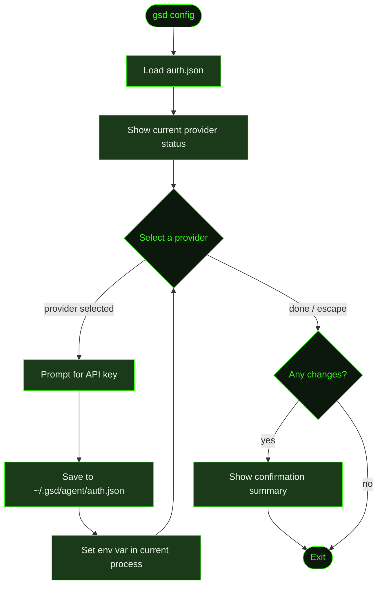

## What It Does

`gsd config` is a CLI subcommand that runs the interactive setup wizard for configuring every external credential GSD needs. It covers LLM providers (Anthropic, OpenAI, etc.), search engines (Tavily, Brave), context tools (Context7, Jina), and voice integrations (Groq). Running it shows which providers are already configured and which aren't, then lets you paste in keys one at a time.

Keys are saved to `~/.gsd/agent/auth.json` and immediately activated — no restart needed. At startup, GSD automatically loads any saved keys from `auth.json` into the environment, but only if the variable isn't already set by other means (shell exports, `.env` files, etc. take precedence).

`gsd config` exits immediately after completing — it does not launch the TUI. Use it during initial setup or to re-configure credentials after installation. For per-key management from inside a running session (add, remove, test, rotate), use [`/gsd keys`](../keys/) instead.

This command is separate from [`/gsd prefs`](../prefs/), which handles model selection, timeouts, git configuration, and workflow behavior.

## Usage

```bash
gsd config
```

No arguments — the wizard is fully interactive.

## How It Works



### Wizard Flow

1. **Load auth.json** — Reads `~/.gsd/agent/auth.json` to determine which providers are already configured.
2. **Show status** — Displays a summary of all configurable providers with ✓ (configured) or ✗ (not set) for each.
3. **Select loop** — Presents the provider list as a select menu. Choose a provider to configure it, or press Escape / select "(done)" to exit.
4. **Key input** — For the selected provider, prompts to paste the API key. Shows the key's dashboard URL as a hint.
5. **Save and activate** — The key is written to `auth.json` and immediately set as an environment variable in the current process. No restart required.
6. **Confirm** — Once the loop exits, if any keys changed, a summary of updated providers is displayed.

### Configurable Providers

#### LLM Providers

| Provider | Env Var | Get Key At |
|----------|---------|------------|
| Anthropic (Claude) | `ANTHROPIC_API_KEY` | console.anthropic.com |
| OpenAI | `OPENAI_API_KEY` | platform.openai.com/api-keys |
| Groq | `GROQ_API_KEY` | console.groq.com |

#### Search & Tools

| Provider | Env Var | Get Key At |
|----------|---------|------------|
| Tavily Search | `TAVILY_API_KEY` | tavily.com/app/api-keys |
| Brave Search | `BRAVE_API_KEY` | brave.com/search/api |
| Context7 Docs | `CONTEXT7_API_KEY` | context7.com/dashboard |
| Jina Page Extract | `JINA_API_KEY` | jina.ai/api |

For the full provider registry including additional LLM providers and remote integrations (Discord, Slack, Telegram), use [`/gsd keys`](../keys/).

### Credential Storage

Keys are stored in `~/.gsd/agent/auth.json` — a global file in your home directory, never inside a project, never committed to git. At session startup, GSD reads this file and loads each stored key into the process environment so tools have access to their credentials automatically.

If a key is already present in the environment via other means (e.g. a `.env` file or shell export), GSD won't overwrite it — the environment variable takes precedence.

## What Files It Touches

### Creates

| File | Purpose |
|------|---------|
| `~/.gsd/agent/auth.json` | Created on first run if it doesn't exist |
| `~/.gsd/agent/` | Directory created if missing |

### Reads

| File | Purpose |
|------|---------|
| `~/.gsd/agent/auth.json` | Current stored API keys |

### Writes

| File | Purpose |
|------|---------|
| `~/.gsd/agent/auth.json` | Updated API keys |

## Examples

Running the setup wizard:

```bash
gsd config

GSD Setup Wizard

  LLM Providers
  ✓ Anthropic (Claude)
  ✗ OpenAI — get key at platform.openai.com/api-keys

  Search & Tools
  ✓ Tavily Search
  ✗ Brave Search — get key at brave.com/search/api
  ✓ Context7 Docs
  ✗ Jina Page Extract — get key at jina.ai/api
  ✗ Groq — get key at console.groq.com

Configure which provider? Press Escape when done.
  ❯ Anthropic (Claude) (configured ✓)
    OpenAI (not set)
    Tavily Search (configured ✓)
    Brave Search (not set)
    Context7 Docs (configured ✓)
    Jina Page Extract (not set)
    Groq (not set)
    (done)
```

After pasting a key:

```bash
API key for Brave Search (brave.com/search/api):
> BSAxxxxxxxxxxxxxxxxxxxx

● Brave Search key saved and activated.
```

Re-running setup after an update:

```bash
gsd config
```

## Related Commands

- [`/gsd keys`](../keys/) — Full in-session key manager: add, remove, test, rotate, and health-check keys for all providers
- [`/gsd prefs`](../prefs/) — Workflow preferences: models, timeouts, git, skills, budget
- [`/gsd doctor`](../doctor/) — Health checks that can surface misconfigured or missing credentials
