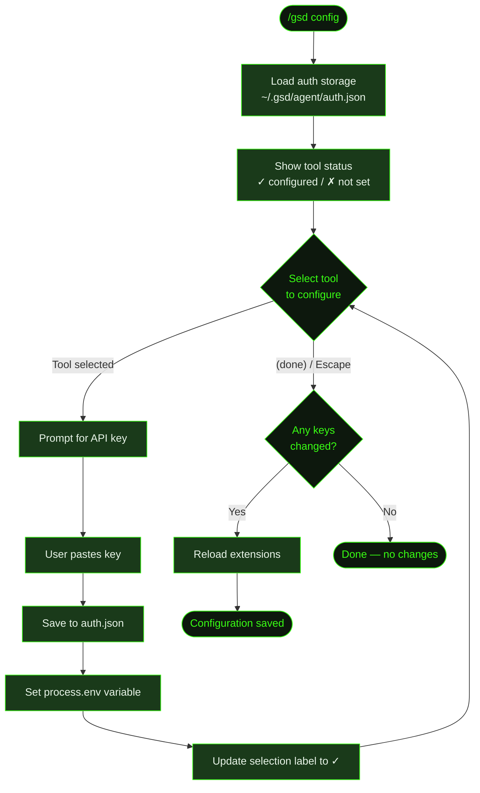

import { Steps } from '@astrojs/starlight/components';

## What It Does

`/gsd config` opens an interactive setup flow for configuring API keys for GSD's tool integrations. It shows which tools are configured and which are missing, then lets you paste keys one at a time. Keys are validated, saved to secure auth storage, loaded into environment variables, and extensions are reloaded to pick up the new credentials.

This is also available as the CLI setup wizard via `gsd config` (without the slash), which runs during initial installation.

## Usage

```
/gsd config
```

No arguments — the command opens an interactive selection loop. Pick a tool, paste the key, repeat. Press Escape or select "(done)" when finished.

## How It Works



### Tool Integrations

| Tool | Environment Variable | Purpose | Get Key At |
|------|---------------------|---------|------------|
| **Tavily Search** | `TAVILY_API_KEY` | Web search for current information | tavily.com/app/api-keys |
| **Brave Search** | `BRAVE_API_KEY` | Alternative web search provider | brave.com/search/api |
| **Context7 Docs** | `CONTEXT7_API_KEY` | Up-to-date library documentation lookup | context7.com/dashboard |
| **Jina Page Extract** | `JINA_API_KEY` | Clean markdown extraction from web pages | jina.ai/api |
| **Groq Voice** | `GROQ_API_KEY` | Real-time speech-to-text for voice mode | console.groq.com |

### Auth Storage

Keys are stored in `~/.gsd/agent/auth.json` as structured credential objects:

```json
{
  "tavily": { "type": "api_key", "key": "tvly-..." },
  "jina": { "type": "api_key", "key": "jina_..." }
}
```

At session startup, `loadToolApiKeys()` reads this file and sets the corresponding environment variables. Keys set via environment variables directly (e.g., in `.env` or shell profile) take precedence — auth.json only fills in keys that aren't already set.

### Extension Reload

After saving new keys, `/gsd config` calls `ctx.reload()` to restart all extensions. This ensures tools like web search and documentation lookup pick up the new credentials immediately without requiring a session restart.

## What Files It Touches

### Reads

| File | Purpose |
|------|---------|
| `~/.gsd/agent/auth.json` | Current tool credentials |
| Environment variables | Check if keys already set via env |

### Writes

| File | Purpose |
|------|---------|
| `~/.gsd/agent/auth.json` | Updated tool credentials |

## Examples

Configuring tool keys:

```
> /gsd config

GSD Tool Configuration

  ✓ Tavily Search
  ✗ Brave Search — get key at brave.com/search/api
  ✓ Context7 Docs
  ✗ Jina Page Extract — get key at jina.ai/api
  ✓ Groq Voice

Configure which tool? Press Escape when done.
  ❯ Brave Search (not set)
    Jina Page Extract (not set)
    Tavily Search (configured ✓)
    Context7 Docs (configured ✓)
    Groq Voice (configured ✓)
    (done)

  → Brave Search

API key for Brave Search (brave.com/search/api):
  > ****************************

Brave Search key saved and activated.

Configure which tool? Press Escape when done.
  → (done)

Configuration saved. Extensions reloaded with new keys.
```

## Related Commands

- [`/gsd prefs`](../prefs/) — Configure skill preferences and behavior settings
- [`/gsd mode`](../mode/) — Set workflow mode (solo/team)
- [`/gsd doctor`](../doctor/) — Health checks (doesn't check tool keys — config is independent)
