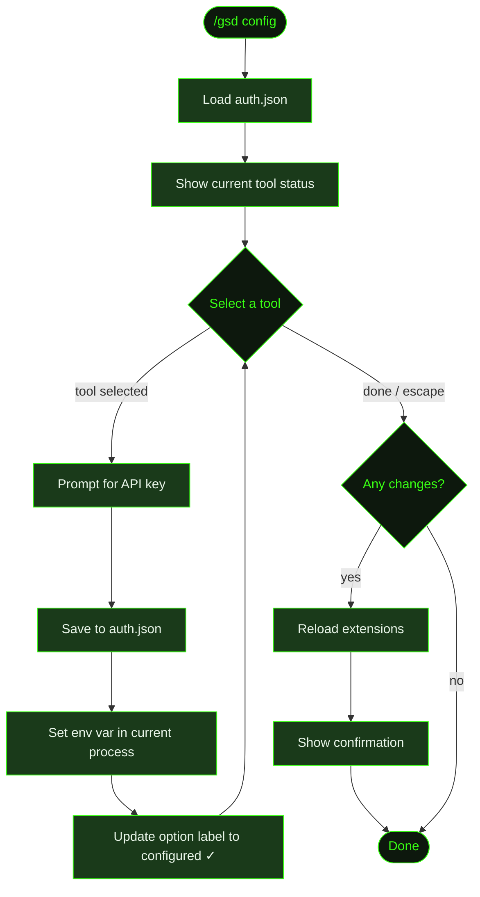

## What It Does

`/gsd config` is an interactive wizard for configuring the tool API keys GSD uses for web search and context retrieval. It covers search engines (Tavily, Brave), context tools (Context7, Jina), and voice (Groq). It shows which tools are already configured and which aren't, then lets you paste keys in one at a time.

Keys are saved to `~/.gsd/agent/auth.json` and immediately activated — no restart needed. At startup, GSD automatically loads any saved keys from `auth.json` into the environment, but only if the variable isn't already set by other means (shell exports, `.env` files, etc. take precedence).

After saving any changes, GSD reloads extensions automatically so new credentials are active in the current session.

`/gsd config` covers tool API keys only. For LLM providers (Anthropic, OpenAI, etc.), remote integrations (Discord, Slack, Telegram), and full per-key management (add, remove, test, rotate), use [`/gsd keys`](../keys/) instead. For workflow preferences — model selection, timeouts, git configuration — use [`/gsd prefs`](../prefs/).

## Usage

```
/gsd config
```

No arguments — the wizard is fully interactive.

## How It Works



### Wizard Flow

1. **Load auth.json** — Reads `~/.gsd/agent/auth.json` (creating it and its parent directory if missing) to determine which tools are already configured.
2. **Show status** — Displays a summary of all configurable tools with ✓ (configured) or ✗ (not set) for each, including the dashboard URL for any unconfigured tool.
3. **Select loop** — Presents the tool list as a select menu. Choose a tool to configure it, or press Escape / select "(done)" to exit.
4. **Key input** — For the selected tool, prompts to paste the API key. Shows the key's dashboard URL as a hint.
5. **Save and activate** — The key is written to `auth.json` and immediately set as an environment variable in the current process. The option label updates to show "(configured ✓)".
6. **Reload** — Once the loop exits, if any keys changed, GSD waits for the current operation to idle, then reloads extensions so the new credentials are active immediately.

### Configurable Tools

| Tool | Env Var | Get Key At |
|------|---------|------------|
| Tavily Search | `TAVILY_API_KEY` | tavily.com/app/api-keys |
| Brave Search | `BRAVE_API_KEY` | brave.com/search/api |
| Context7 Docs | `CONTEXT7_API_KEY` | context7.com/dashboard |
| Jina Page Extract | `JINA_API_KEY` | jina.ai/api |
| Groq Voice | `GROQ_API_KEY` | console.groq.com |

For LLM providers and remote integrations (Discord, Slack, Telegram), use [`/gsd keys`](../keys/).

### Credential Storage

Keys are stored in `~/.gsd/agent/auth.json` — a global file in your home directory, never inside a project, never committed to git. At session startup, GSD reads this file and loads each stored key into the process environment so tools have access to their credentials automatically.

If a key is already present in the environment via other means (e.g. a `.env` file or shell export), GSD won't overwrite it — the environment variable takes precedence.

## What Files It Touches

### Creates

| File | Purpose |
|------|---------|
| `~/.gsd/agent/auth.json` | Created on first run if it doesn't exist |
| `~/.gsd/agent/` | Directory created if missing |

### Reads

| File | Purpose |
|------|---------|
| `~/.gsd/agent/auth.json` | Current stored API keys |

### Writes

| File | Purpose |
|------|---------|
| `~/.gsd/agent/auth.json` | Updated API keys |

## Examples

Running the setup wizard:

```
> /gsd config

GSD Tool Configuration

  ✓ Tavily Search
  ✗ Brave Search — get key at brave.com/search/api
  ✓ Context7 Docs
  ✗ Jina Page Extract — get key at jina.ai/api
  ✗ Groq Voice — get key at console.groq.com

Configure which tool? Press Escape when done.
  ❯ Tavily Search (configured ✓)
    Brave Search (not set)
    Context7 Docs (configured ✓)
    Jina Page Extract (not set)
    Groq Voice (not set)
    (done)
```

After pasting a key:

```
API key for Brave Search (brave.com/search/api):
> BSAxxxxxxxxxxxxxxxxxxxx

● Brave Search key saved and activated.
```

After completing the loop with changes:

```
● Configuration saved. Extensions reloaded with new keys.
```

## Related Commands

- [`/gsd keys`](../keys/) — Full key manager: LLM providers, remote integrations, add, remove, test, rotate, and health-check
- [`/gsd prefs`](../prefs/) — Workflow preferences: models, timeouts, git, skills, budget
- [`/gsd doctor`](../doctor/) — Health checks that can surface misconfigured or missing credentials
