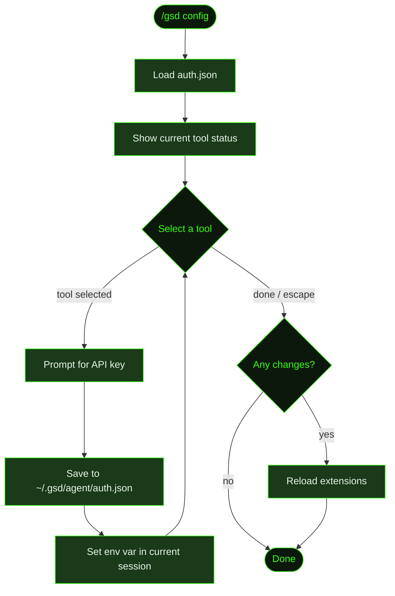

## What It Does

`/gsd config` opens an interactive wizard for setting API keys for external tool integrations. These are the optional third-party services GSD uses to enhance research, document fetching, and voice input — things like web search providers and context-aware doc lookup.

Running `/gsd config` shows which tools are already configured and which aren't, then lets you paste in keys one tool at a time. Keys are saved to `~/.gsd/agent/auth.json` and immediately activated in the current session — no restart needed. At startup, GSD automatically loads any saved keys from `auth.json` into the environment.

This command is separate from [`/gsd prefs`](../prefs/), which handles model selection, timeouts, and workflow behavior.

## Usage

```
/gsd config
```

No arguments — the wizard is fully interactive.

## How It Works



### Wizard Flow

1. **Load auth.json** — Reads `~/.gsd/agent/auth.json` to determine which tools are already configured.
2. **Show status** — Displays a summary of all configurable tools with ✓ (configured) or ✗ (not set) for each.
3. **Select loop** — Presents the tool list as a select menu. Choose a tool to configure it, or press Escape / select "(done)" to exit.
4. **Key input** — For the selected tool, prompts to paste the API key. Shows the key's dashboard URL as a hint.
5. **Save and activate** — The key is written to `auth.json` and immediately set as an environment variable in the current session. No restart required.
6. **Reload** — If any keys changed, GSD reloads its extensions so tools pick up the new credentials immediately.

### Configurable Tools

| Tool | Env Var | Get Key At |
|------|---------|------------|
| Tavily Search | `TAVILY_API_KEY` | tavily.com/app/api-keys |
| Brave Search | `BRAVE_API_KEY` | brave.com/search/api |
| Context7 Docs | `CONTEXT7_API_KEY` | context7.com/dashboard |
| Jina Page Extract | `JINA_API_KEY` | jina.ai/api |
| Groq Voice | `GROQ_API_KEY` | console.groq.com |

### Credential Storage

Keys are stored in `~/.gsd/agent/auth.json` — a global file in your home directory, never inside a project, never committed to git. At session startup, GSD reads this file and loads each stored key into the process environment so tools have access to their credentials automatically.

If a key is already present in the environment via other means (e.g. a `.env` file or shell export), GSD won't overwrite it — the environment variable takes precedence.

## What Files It Touches

### Reads

| File | Purpose |
|------|---------|
| `~/.gsd/agent/auth.json` | Current stored API keys |

### Writes

| File | Purpose |
|------|---------|
| `~/.gsd/agent/auth.json` | Updated API keys |

## Examples

Opening the wizard:

```
> /gsd config

GSD Tool Configuration

  ✓ Tavily Search
  ✗ Brave Search — get key at brave.com/search/api
  ✓ Context7 Docs
  ✗ Jina Page Extract — get key at jina.ai/api
  ✗ Groq Voice — get key at console.groq.com

Configure which tool? Press Escape when done.
  ❯ Tavily Search (configured ✓)
    Brave Search (not set)
    Context7 Docs (configured ✓)
    Jina Page Extract (not set)
    Groq Voice (not set)
    (done)
```

After pasting a key:

```
API key for Brave Search (brave.com/search/api):
> BSAxxxxxxxxxxxxxxxxxxxx

● Brave Search key saved and activated.
```

After exiting the wizard:

```
● Configuration saved. Extensions reloaded with new keys.
```

## Related Commands

- [`/gsd prefs`](../prefs/) — Workflow preferences: models, timeouts, git, skills, budget
- [`/gsd doctor`](../doctor/) — Health checks that can surface misconfigured or missing credentials
- [`/gsd hooks`](../hooks/) — Show configured post-unit and pre-dispatch hooks
