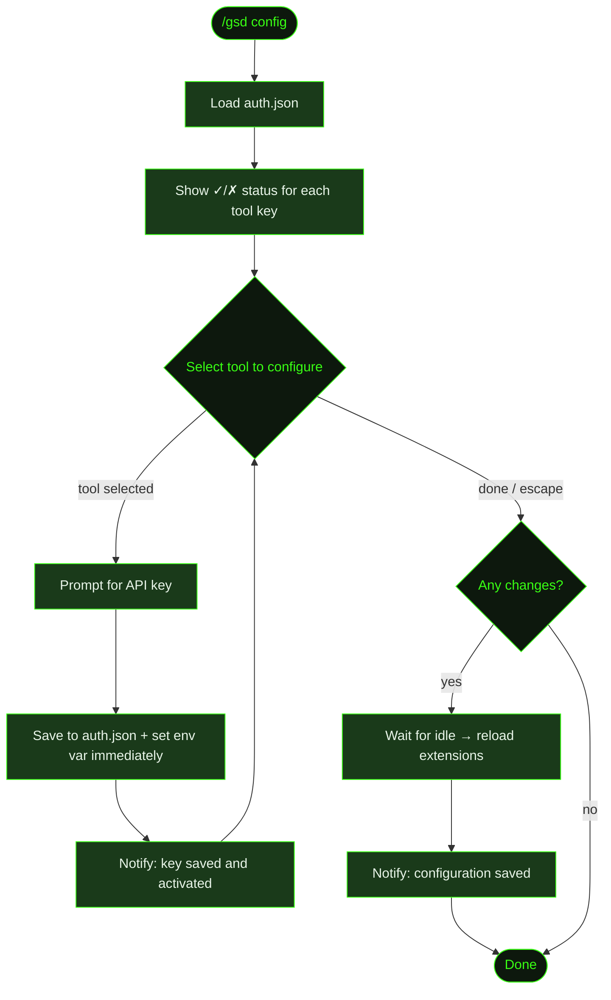

## What It Does

`/gsd config` manages API keys for the external tools GSD uses during agent runs. It shows the current status of every configured tool key, then presents a select menu so you can paste new keys one at a time. The loop continues until you select "(done)" or press Escape.

Five tool integrations are configurable through this command:

| Tool | Purpose |
|------|---------|
| Tavily Search | Web search for non-Anthropic models |
| Brave Search | Web search alternative for non-Anthropic models |
| Context7 Docs | Library and framework documentation lookup |
| Jina Page Extract | Web page content extraction |
| Groq Voice | Voice-mode audio processing |

All keys are written to `~/.gsd/agent/auth.json` — a global file in your home directory, never inside a project, never committed to git. On every session start, GSD reads this file and loads stored keys into the process environment automatically. If a key is already set in your environment via other means (shell export, `.env` file), that value takes precedence and is not overwritten.

`/gsd config` is scoped to tool integrations only. For LLM provider authentication (Anthropic, OpenAI, OpenRouter, and others), use [`/gsd setup`](../setup/) or [`/gsd keys`](../keys/).

## Usage

```
/gsd config
```

No arguments — the wizard is fully interactive.

## How It Works


```mermaid
flowchart TD
    Start(["/gsd config"]) --> LoadAuth[Load auth.json]
    LoadAuth --> ShowStatus[Show ✓/✗ status for each tool key]
    ShowStatus --> Menu{Select tool to configure}
    Menu -->|tool selected| Prompt[Prompt for API key]
    Prompt --> Save[Save to auth.json + set env var immediately]
    Save --> Notify[Notify: key saved and activated]
    Notify --> Menu
    Menu -->|done / escape| Changed{Any changes?}
    Changed -->|yes| Idle[Wait for idle → reload extensions]
    Idle --> Confirm[Notify: configuration saved]
    Confirm --> End([Done])
    Changed -->|no| End

    style Start fill:#0d180d,stroke:#39ff14,color:#39ff14
    style Menu fill:#0d180d,stroke:#39ff14,color:#39ff14
    style Changed fill:#0d180d,stroke:#39ff14,color:#39ff14
    style End fill:#0d180d,stroke:#39ff14,color:#39ff14
    style LoadAuth fill:#1a3a1a,stroke:#39ff14,color:#e8f4e8
    style ShowStatus fill:#1a3a1a,stroke:#39ff14,color:#e8f4e8
    style Prompt fill:#1a3a1a,stroke:#39ff14,color:#e8f4e8
    style Save fill:#1a3a1a,stroke:#39ff14,color:#e8f4e8
    style Notify fill:#1a3a1a,stroke:#39ff14,color:#e8f4e8
    style Idle fill:#1a3a1a,stroke:#39ff14,color:#e8f4e8
    style Confirm fill:#1a3a1a,stroke:#39ff14,color:#e8f4e8
```

### Wizard Flow

1. **Load auth.json** — Reads `~/.gsd/agent/auth.json` (creating it and its parent directory if missing) and checks `process.env` to determine which keys are already active.
2. **Status display** — Prints a summary showing ✓ (configured) or ✗ (not set) for each of the five tool integrations.
3. **Select loop** — Presents each tool as a labelled menu option, with its current status. Select a tool to configure it or select "(done)" to exit.
4. **Key input** — For the selected tool, prompts for the API key. If you enter a non-empty value, it is trimmed and saved.
5. **Save and activate** — The key is written to `auth.json` and immediately set as an environment variable in the current process, so tools can use it without restarting.
6. **Reload** — If any keys changed, GSD waits for the current operation to idle, then reloads extensions so the new credentials are active without restarting.

### Tool API Keys

| Tool | Env Variable | Get a key |
|------|-------------|-----------|
| Tavily Search | `TAVILY_API_KEY` | [tavily.com/app/api-keys](https://tavily.com/app/api-keys) |
| Brave Search | `BRAVE_API_KEY` | [brave.com/search/api](https://brave.com/search/api) |
| Context7 Docs | `CONTEXT7_API_KEY` | [context7.com/dashboard](https://context7.com/dashboard) |
| Jina Page Extract | `JINA_API_KEY` | [jina.ai/api](https://jina.ai/api) |
| Groq Voice | `GROQ_API_KEY` | [console.groq.com](https://console.groq.com) |

> **Note:** Anthropic models have built-in web search and don't require Tavily or Brave. Those keys are most useful when running non-Anthropic models.

### Credential Storage

Keys are stored in `~/.gsd/agent/auth.json` — never inside a project, never committed to git. On every session start, `loadToolApiKeys()` reads this file and sets environment variables so tools have access to their credentials automatically. Environment variables set by other means (shell exports, `.env` files) take precedence over `auth.json` values.

## What Files It Touches

### Creates

| File | Purpose |
|------|---------|
| `~/.gsd/agent/auth.json` | Created on first run if it doesn't exist |
| `~/.gsd/agent/` | Directory created if missing |

### Reads

| File | Purpose |
|------|---------|
| `~/.gsd/agent/auth.json` | Current stored credentials |

### Writes

| File | Purpose |
|------|---------|
| `~/.gsd/agent/auth.json` | Updated tool API keys |

## Examples

Checking and configuring tool keys:

```
> /gsd config

GSD Tool Configuration

  ✓ Tavily Search
  ✗ Brave Search — get key at brave.com/search/api
  ✓ Context7 Docs
  ✗ Jina Page Extract — get key at jina.ai/api
  ✗ Groq Voice — get key at console.groq.com

Configure which tool? Press Escape when done.
  ❯ Tavily Search (configured ✓)
    Brave Search (not set)
    Context7 Docs (configured ✓)
    Jina Page Extract (not set)
    Groq Voice (not set)
    (done)

API key for Brave Search (brave.com/search/api):
> BSAxxxxxxxxxxxxxxxxxxxx

● Brave Search key saved and activated.
```

After configuring Brave Search, the menu updates and loops:

```
Configure which tool? Press Escape when done.
    Tavily Search (configured ✓)
  ❯ Brave Search (configured ✓)
    Context7 Docs (configured ✓)
    Jina Page Extract (not set)
    Groq Voice (not set)
    (done)
```

After selecting "(done)" with changes:

```
● Configuration saved. Extensions reloaded with new keys.
```

## Related Commands

- [`/gsd keys`](../keys/) — Full key manager: list, add, remove, test, rotate, and health-check all credentials including LLM provider keys
- [`/gsd setup`](../setup/) — Global setup status and LLM provider authentication
- [`/gsd prefs`](../prefs/) — Workflow preferences: models, timeouts, git, skills, budget
- [`/gsd doctor`](../doctor/) — Health checks that can surface misconfigured or missing credentials
