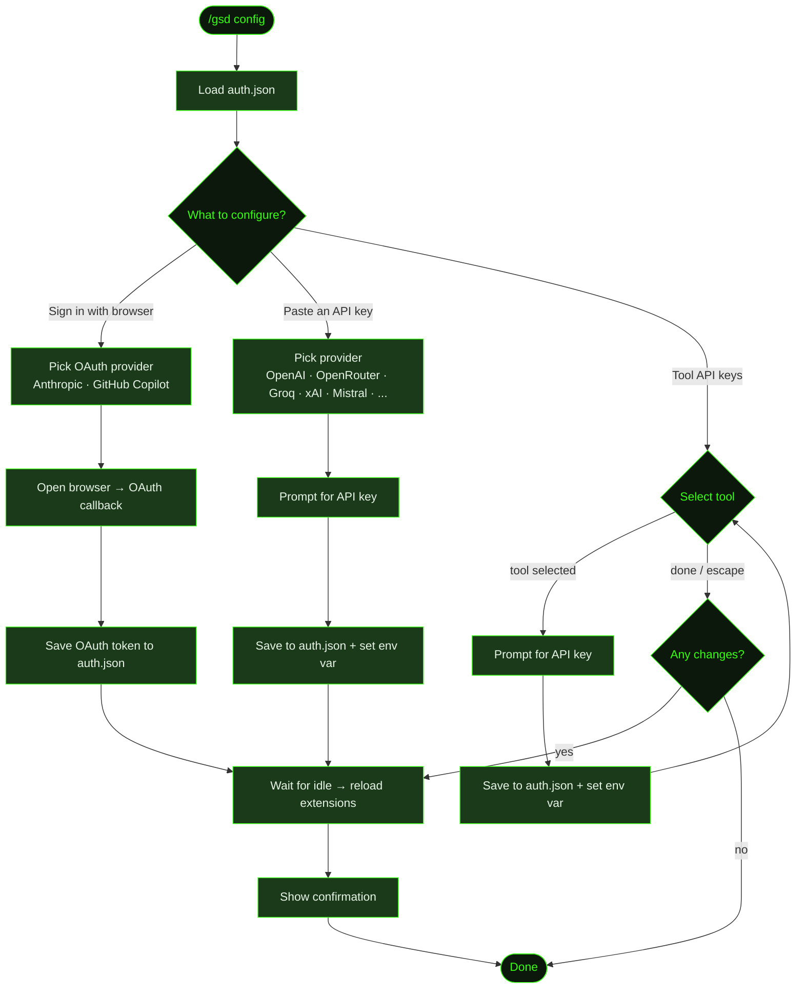

## What It Does

`/gsd config` re-runs the onboarding wizard that GSD shows on first launch. It covers two things in one flow: LLM provider authentication (OAuth browser sign-in or API key) and tool API keys for search and documentation.

On the LLM side, you can sign in with your browser for providers that support OAuth (Anthropic, GitHub Copilot) or paste an API key for any other provider (OpenAI, OpenRouter, Groq, xAI, Mistral, and others). On the tool side, you can configure Tavily Search, Brave Search, and Context7 Docs — the three keys GSD uses for web search and library documentation with non-Anthropic models.

All credentials are saved to `~/.gsd/agent/auth.json` — a global file in your home directory, never inside a project, never committed to git. On every session start, GSD reads this file and loads stored keys into the process environment automatically. If a key is already set in your environment via other means (shell export, `.env` file), that value takes precedence.

After saving, GSD waits for the current operation to idle, then reloads extensions so new credentials are active immediately — no restart needed.

`/gsd config` is the guided wizard for initial setup. For full key management — listing all configured providers, removing keys, testing live validity, rotating credentials, or managing remote integrations (Discord, Slack, Telegram) — use [`/gsd keys`](../keys/) instead. For workflow preferences (model selection, timeouts, git configuration), use [`/gsd prefs`](../prefs/).

## Usage

```
/gsd config
```

No arguments — the wizard is fully interactive.

## How It Works


```mermaid
flowchart TD
    Start(["/gsd config"]) --> LoadAuth[Load auth.json]
    LoadAuth --> TopChoice{What to configure?}
    TopChoice -->|Sign in with browser| OAuthPick[Pick OAuth provider\nAnthropic · GitHub Copilot]
    TopChoice -->|Paste an API key| KeyPick[Pick provider\nOpenAI · OpenRouter · Groq · xAI · Mistral · ...]
    TopChoice -->|Tool API keys| ToolLoop{Select tool}
    OAuthPick --> OAuthFlow[Open browser → OAuth callback]
    OAuthFlow --> SaveOAuth[Save OAuth token to auth.json]
    SaveOAuth --> Reload[Wait for idle → reload extensions]
    KeyPick --> KeyInput[Prompt for API key]
    KeyInput --> SaveKey[Save to auth.json + set env var]
    SaveKey --> Reload
    ToolLoop -->|tool selected| ToolInput[Prompt for API key]
    ToolInput --> SaveTool[Save to auth.json + set env var]
    SaveTool --> ToolLoop
    ToolLoop -->|done / escape| Changed{Any changes?}
    Changed -->|yes| Reload
    Changed -->|no| End([Done])
    Reload --> Confirm[Show confirmation]
    Confirm --> End

    style Start fill:#0d180d,stroke:#39ff14,color:#39ff14
    style TopChoice fill:#0d180d,stroke:#39ff14,color:#39ff14
    style ToolLoop fill:#0d180d,stroke:#39ff14,color:#39ff14
    style Changed fill:#0d180d,stroke:#39ff14,color:#39ff14
    style End fill:#0d180d,stroke:#39ff14,color:#39ff14
    style LoadAuth fill:#1a3a1a,stroke:#39ff14,color:#e8f4e8
    style OAuthPick fill:#1a3a1a,stroke:#39ff14,color:#e8f4e8
    style KeyPick fill:#1a3a1a,stroke:#39ff14,color:#e8f4e8
    style OAuthFlow fill:#1a3a1a,stroke:#39ff14,color:#e8f4e8
    style SaveOAuth fill:#1a3a1a,stroke:#39ff14,color:#e8f4e8
    style KeyInput fill:#1a3a1a,stroke:#39ff14,color:#e8f4e8
    style SaveKey fill:#1a3a1a,stroke:#39ff14,color:#e8f4e8
    style ToolInput fill:#1a3a1a,stroke:#39ff14,color:#e8f4e8
    style SaveTool fill:#1a3a1a,stroke:#39ff14,color:#e8f4e8
    style Reload fill:#1a3a1a,stroke:#39ff14,color:#e8f4e8
    style Confirm fill:#1a3a1a,stroke:#39ff14,color:#e8f4e8
```

### Wizard Flow

1. **Load auth.json** — Reads `~/.gsd/agent/auth.json` (creating it and its parent directory if missing) to determine what is already configured.
2. **Top-level choice** — Presents three paths: sign in with your browser, paste an API key, or configure tool API keys.
3. **Browser sign-in (OAuth)** — For Anthropic (Claude) and GitHub Copilot, opens a browser window for the full OAuth flow and saves the resulting token to `auth.json`.
4. **Paste an API key** — For all other providers (OpenAI, OpenRouter, Groq, xAI, Mistral, and more), prompts for the key and saves it to `auth.json`.
5. **Tool API keys loop** — Presents the three tool keys as a select menu showing ✓ (configured) or ✗ (not set). Choose a tool to paste its key, or press Escape / select "(done)" to exit the loop.
6. **Save and activate** — Each key is written to `auth.json` and immediately set as an environment variable in the current process.
7. **Reload** — If any keys changed, GSD waits for the current operation to idle, then reloads extensions so the new credentials are active without restarting.

### LLM Providers

| Provider | Auth Method | Env Variable |
|----------|-------------|-------------|
| Anthropic (Claude) | OAuth or API key | `ANTHROPIC_API_KEY` |
| GitHub Copilot | OAuth | `GH_TOKEN` |
| OpenAI | API key | `OPENAI_API_KEY` |
| OpenRouter | API key | `OPENROUTER_API_KEY` |
| Groq | API key | `GROQ_API_KEY` |
| xAI (Grok) | API key | `XAI_API_KEY` |
| Mistral | API key | `MISTRAL_API_KEY` |

For a full provider reference including Google Gemini, Amazon Bedrock, Azure OpenAI, Vertex AI, and local providers (Ollama, LM Studio), see the [Provider Setup Guide](../../docs/providers/).

### Tool API Keys

These three keys are configured through the tool API keys section of the wizard. They apply to all projects automatically.

| Tool | Env Variable | Purpose | Get a key |
|------|-------------|---------|-----------|
| Tavily Search | `TAVILY_API_KEY` | Web search for non-Anthropic models | [tavily.com/app/api-keys](https://tavily.com/app/api-keys) |
| Brave Search | `BRAVE_API_KEY` | Web search for non-Anthropic models | [brave.com/search/api](https://brave.com/search/api) |
| Context7 Docs | `CONTEXT7_API_KEY` | Library/framework documentation lookup | [context7.com/dashboard](https://context7.com/dashboard) |

> **Note:** Anthropic models have built-in web search and don't require Tavily or Brave. These keys are most useful when running non-Anthropic models.

Jina Page Extract (`JINA_API_KEY`) is not part of the config wizard but can be added via [`/gsd keys add jina`](../keys/).

### Credential Storage

Keys are stored in `~/.gsd/agent/auth.json` — never inside a project, never committed to git. On every session start, `loadToolApiKeys()` reads this file and sets environment variables so tools have access to their credentials automatically. Environment variables set by other means (shell exports, `.env` files) take precedence over `auth.json` values.

## What Files It Touches

### Creates

| File | Purpose |
|------|---------|
| `~/.gsd/agent/auth.json` | Created on first run if it doesn't exist |
| `~/.gsd/agent/` | Directory created if missing |

### Reads

| File | Purpose |
|------|---------|
| `~/.gsd/agent/auth.json` | Current stored credentials |

### Writes

| File | Purpose |
|------|---------|
| `~/.gsd/agent/auth.json` | Updated credentials (OAuth tokens and API keys) |

## Examples

Signing in with Anthropic via browser:

```
> /gsd config

How do you want to get started?
  ❯ Sign in with your browser
    Paste an API key
    Tool API keys (search, docs)

Sign in with your browser — choose a provider:
  ❯ Anthropic (Claude)
    GitHub Copilot

Opening browser for Anthropic sign-in...
● Signed in to Anthropic (Claude).
```

Pasting an API key for OpenAI:

```
> /gsd config

How do you want to get started?
    Sign in with your browser
  ❯ Paste an API key
    Tool API keys (search, docs)

Paste an API key — choose a provider:
  ❯ OpenAI
    OpenRouter
    Groq
    xAI (Grok)
    ...

API key for OpenAI (platform.openai.com/api-keys):
> sk-...

● OpenAI key saved and activated.
```

Configuring tool API keys:

```
> /gsd config

How do you want to get started?
    Sign in with your browser
    Paste an API key
  ❯ Tool API keys (search, docs)

Tool API keys — which tool?
  ❯ Tavily Search (configured ✓)
    Brave Search (not set)
    Context7 Docs (configured ✓)
    (done)

API key for Brave Search (brave.com/search/api):
> BSAxxxxxxxxxxxxxxxxxxxx

● Brave Search key saved and activated.
```

After completing the wizard with changes:

```
● Configuration saved. Extensions reloaded with new keys.
```

## Related Commands

- [`/gsd keys`](../keys/) — Full key manager: list, add, remove, test, rotate, and health-check all credentials
- [`/gsd prefs`](../prefs/) — Workflow preferences: models, timeouts, git, skills, budget
- [`/gsd setup`](../setup/) — Global setup status overview
- [`/gsd doctor`](../doctor/) — Health checks that can surface misconfigured or missing credentials
