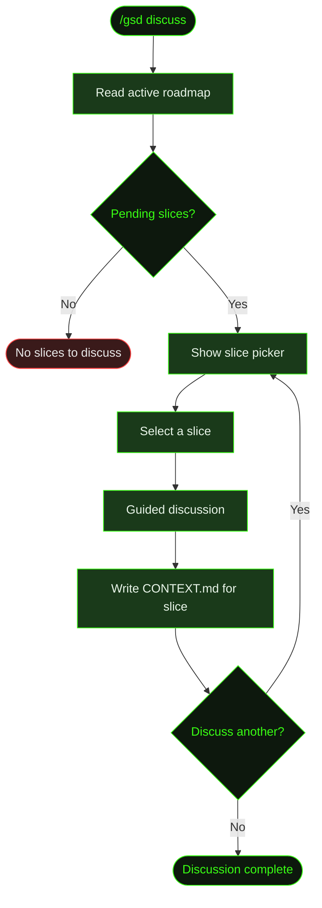

## What It Does

`/gsd discuss` lets you have a conversation about an upcoming slice *before* auto mode plans and executes it. You pick a pending slice from the roadmap, discuss the approach with the agent, and the discussion produces a CONTEXT.md file for that slice — capturing scope, goals, constraints, and key decisions.

This is useful when you want to influence how a slice is implemented without taking over the planning yourself. Maybe you know the auth library should be NextAuth, or the database should use a specific schema pattern, or a particular API endpoint needs special handling. `/gsd discuss` is where that input gets captured.

## Usage

```
/gsd discuss
```

No flags. Requires an active milestone with pending slices in the roadmap.

## How It Works



### The slice picker

GSD reads the active milestone's roadmap and filters to slices that haven't been completed or started yet. These are presented in a selection UI. You pick the one you want to discuss.

### The guided discussion

The discussion is a back-and-forth conversation, not a form. The agent asks about:

- **Scope** — What should this slice include and exclude?
- **Approach** — Any preferences for libraries, patterns, or architecture?
- **Constraints** — Performance requirements, API compatibility, team conventions?
- **Dependencies** — Does this slice depend on external services or other slices?
- **Risks** — What could go wrong? What's the most uncertain part?

You don't have to answer every question. Say what you care about, skip what you don't, and the agent captures the relevant points.

### The CONTEXT.md output

The discussion produces a slice CONTEXT.md file at `.gsd/milestones/<MID>/slices/<SID>/S<NN>-CONTEXT.md`. This file becomes authoritative input for the planning and execution phases — when auto mode later plans this slice, it reads the CONTEXT.md to understand your intent.

### Integration with auto mode

When auto mode encounters a slice that has a CONTEXT.md (from a prior `/gsd discuss`), it uses that context during planning. The planner reads the CONTEXT.md alongside the roadmap entry to produce a more informed slice plan.

This also works with [`/gsd queue`](../../commands/). When you queue a future milestone with draft context, auto mode enters a `needs-discussion` phase before starting that milestone. `/gsd discuss` handles that phase too — using the draft context as a starting point for the conversation.

## What Files It Touches

| Action | Files |
|--------|-------|
| Reads | `M*-ROADMAP.md` (active milestone roadmap) |
| Writes | `S*-CONTEXT.md` (slice context from discussion) |

## Examples

Discussing an upcoming slice in a Cookmate project:

```
> /gsd discuss

● Reading roadmap for M001 (Core Recipe Platform)
  Pending slices:
    1. S03: Recipe search and filtering
    2. S04: Image upload pipeline
    3. S05: User profiles

  Which slice would you like to discuss?
> S04: Image upload pipeline

● Starting discussion for S04: Image upload pipeline

  What approach are you thinking for image handling?
> I want to use Cloudinary for storage. Images should be
  resized on upload — thumbnail, medium, and full size.
  Max upload size 5MB.

  Got it. Any preferences for the upload flow?
> Presigned URLs from the client directly to Cloudinary.
  Don't proxy through our API — too much bandwidth.

  Makes sense. What about error handling for failed uploads?
> Show a retry button. Keep the recipe draft even if the
  image fails. Don't block recipe creation on image upload.

● Discussion captured
  ✓ Written to .gsd/milestones/M001/slices/S04/S04-CONTEXT.md
  
  Key decisions captured:
  • Cloudinary for image storage
  • Client-side presigned URL uploads
  • Three resize variants (thumb, medium, full)
  • 5MB upload limit
  • Non-blocking: recipe saves without waiting for image
```

## Related Commands

- [`/gsd auto`](../auto/) — Autonomous execution (reads CONTEXT.md during planning)
- [`/gsd`](../gsd/) — Step mode execution
- [`/gsd status`](../status/) — Check milestone progress
