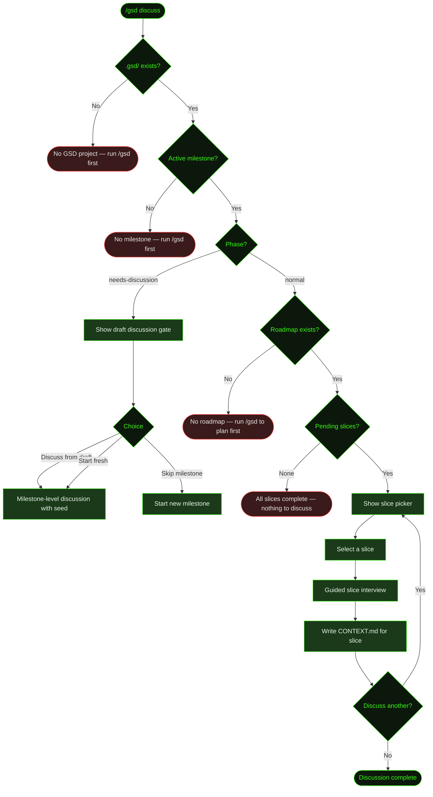

## What It Does

`/gsd discuss` runs a guided interview about a specific slice *before* auto mode plans and executes it. You pick a pending slice from the active milestone's roadmap, have a conversation with the agent, and the interview produces a `CONTEXT.md` file for that slice — capturing behaviour, UX intent, scope boundaries, edge cases, and decisions that won't be obvious from the roadmap entry alone.

This is useful when you know things the agent doesn't: how a feature should feel to the user, what happens in failure states, which edge cases are in scope, or what a slice should explicitly *not* do. `/gsd discuss` is where that intent gets captured before planning starts.

The discussion is behaviour-focused, not tech-focused. The agent asks about what the user sees and experiences, what should happen when things go wrong, and where scope begins and ends. Library choices, architecture, and naming conventions are left for the research and planning phases.

## Usage

```
/gsd discuss
```

No flags. Requires an active milestone with a roadmap and at least one pending slice.

## How It Works



### The slice picker

GSD reads the active milestone's roadmap and filters to slices that are not yet complete. Each slice is shown with its discussion status — "discussed ✓" or "not discussed" — so you can see at a glance what's left. The first undiscussed slice is pre-selected as the recommended choice.

The picker loops: after each discussion finishes, it returns to the picker so you can chain multiple slice interviews in one session. When all pending slices have been discussed, it exits and tells you to run `/gsd` to start planning.

### The guided interview

The interview is a back-and-forth conversation, not a form. Before asking anything, the agent scouts the codebase and reads surrounding context so its questions are grounded in what actually exists. It focuses on:

- **UX and user-facing behaviour** — What does the user see, click, trigger, or experience?
- **Edge cases and failure states** — What happens when things go wrong or are in unusual states?
- **Scope boundaries** — What is explicitly in vs out for this slice? What's deferred to later?
- **Feel and experience** — Tone, responsiveness, feedback, transitions, what "done" feels like

Questions come in rounds of 1–3 at a time. After each round the agent checks in: "I think I have a solid picture. Ready to wrap up, or is there more?" You decide the pace.

### Context loaded before each interview

To make questions grounded and specific, the agent preloads the following before starting each slice interview:

- The milestone roadmap (to understand surrounding slices and dependencies)
- The milestone context file (to understand the broader milestone intent)
- Milestone research notes, if they exist
- The decisions register (for architectural constraints that bound this slice)
- Completed slice summaries (to know what's already been built that this slice builds on)

### The CONTEXT.md output

The interview produces a slice `CONTEXT.md` at `.gsd/milestones/<MID>/slices/<SID>/<SID>-CONTEXT.md`. This file becomes authoritative input for the planning phase — when auto mode later plans this slice, it reads the `CONTEXT.md` to understand your intent for behaviour, scope, and feel.

### Needs-discussion phase

If the active milestone is in a `needs-discussion` state — it has a `CONTEXT-DRAFT.md` from an earlier multi-milestone discussion but no full `CONTEXT.md` or roadmap yet — `/gsd discuss` routes to a milestone-level discussion instead of the slice picker. It offers three choices:

- **Discuss from draft** — Seeds the new discussion with the draft content so nothing from the prior conversation is lost
- **Start fresh discussion** — Discards the draft and begins a clean discussion
- **Skip — create new milestone** — Leaves this milestone as-is and starts a new one

### Integration with auto mode

When auto mode encounters a slice that has a `CONTEXT.md`, it uses that file during planning. The planner reads it alongside the roadmap entry to produce a more informed slice plan — one that reflects your stated behavioural intent rather than only what the roadmap entry describes.

## What Files It Touches

### Reads

| File | Purpose |
|------|---------|
| `.gsd/milestones/<MID>/<MID>-ROADMAP.md` | Slice list and completion status |
| `.gsd/milestones/<MID>/<MID>-CONTEXT.md` | Milestone-level intent and constraints |
| `.gsd/milestones/<MID>/<MID>-RESEARCH.md` | Technical research notes (if present) |
| `.gsd/DECISIONS.md` | Architectural decisions that constrain this slice |
| `.gsd/milestones/<MID>/slices/<SID>/<SID>-SUMMARY.md` | Completed slice summaries (for context) |
| `.gsd/milestones/<MID>/<MID>-CONTEXT-DRAFT.md` | Draft seed for needs-discussion phase |

### Creates

| File | Purpose |
|------|---------|
| `.gsd/milestones/<MID>/slices/<SID>/` | Created if the slice directory doesn't exist |
| `.gsd/milestones/<MID>/slices/<SID>/<SID>-CONTEXT.md` | Written on first discussion of a slice |

### Writes

| File | Purpose |
|------|---------|
| `.gsd/milestones/<MID>/slices/<SID>/<SID>-CONTEXT.md` | Slice context from the interview |

## Examples

Discussing an upcoming slice in a Cookmate project:

```
> /gsd discuss

● GSD — Discuss a slice
  M001: Core Recipe Platform
  Pick a slice to interview. Context file will be written when done.

  Slices:
    S03: Recipe search and filtering  · upcoming · not discussed  (recommended)
    S04: Image upload pipeline        · upcoming · not discussed
    S05: User profiles                · upcoming · not discussed

> S04: Image upload pipeline

● Starting interview for S04: Image upload pipeline
  [Agent scouts codebase, reads roadmap, milestone context, decisions register]

  When a user picks a photo from their camera roll, what should happen before
  they see it on the recipe?
> It should show a preview immediately. Upload in background. If upload fails,
  keep the draft recipe and show a retry banner — don't block saving.

  What's the right feel for the upload progress indicator?
> Subtle — a thin progress bar under the image, not a modal spinner. Upload
  should feel like it's just happening, not like a big deal.

  What image sizes should be stored, and is there a file size cap?
> Three sizes: thumbnail (200px), medium (800px), full (2400px). Max 5MB.
  Use Cloudinary for storage — presigned URLs from client direct, don't
  proxy through our API.

  I think I have a solid picture. Ready to wrap up and write the context file,
  or is there more to cover?
> Wrap up

● Writing .gsd/milestones/M001/slices/S04/S04-CONTEXT.md
  ✓ S04 context written.

● GSD — Discuss a slice
  [Returns to picker with S04 now marked "discussed ✓"]
```

When all slices are covered:

```
> /gsd discuss

● All 3 slices discussed. Run /gsd to start planning.
```

## Related Commands

- [`/gsd auto`](../auto/) — Autonomous execution (reads slice CONTEXT.md during planning)
- [`/gsd`](../gsd/) — Step mode execution and project wizard
- [`/gsd queue`](../queue/) — Add future milestones to the pipeline
- [`/gsd status`](../status/) — Check milestone progress
- [`/gsd steer`](../steer/) — Hard override for changing direction mid-execution
