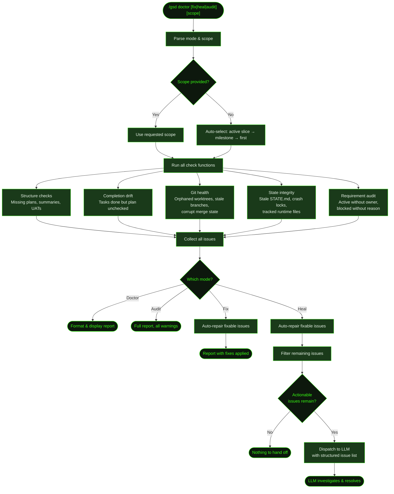

## What It Does

`/gsd doctor` scans your `.gsd/` directory for structural integrity issues — missing summaries, unchecked roadmap entries, stale locks, orphaned worktrees, corrupt git state, and more. It operates in four modes:

- **Doctor** (default) — Scans and reports issues. Read-only, changes nothing.
- **Fix** — Scans and auto-repairs what it can. Creates placeholder summaries, marks tasks done, removes stale locks, cleans up git state.
- **Heal** — Scans, auto-repairs fixable issues, then dispatches remaining errors and UAT warnings to the LLM for interactive investigation and resolution.
- **Audit** — Full scan with all warnings included, up to 50 issues displayed, no fixes applied.

The doctor checks 31 distinct issue codes across four scopes (project, milestone, slice, task). Each issue has a severity (error, warning, info) and a fixability flag. Fix mode only touches issues marked as fixable — it won't rewrite your plan content or make judgment calls.

During auto-mode, a proactive healing layer runs lightweight checks before each unit dispatch, tracks health trends over time, and can escalate to LLM-assisted healing after 5 consecutive units with unresolved errors.

## Usage

```
/gsd doctor              # Report issues (default scope: active slice)
/gsd doctor M001         # Report issues for milestone M001
/gsd doctor M001/S02     # Report issues for a specific slice
/gsd doctor fix          # Auto-repair fixable issues
/gsd doctor fix M001     # Auto-repair within milestone M001
/gsd doctor heal         # Fix what's fixable, dispatch the rest to LLM
/gsd doctor audit        # Full audit — all issues, all scopes, warnings included
```

The scope argument is optional. Without it, doctor auto-selects the active slice (if one exists), then the active milestone, then the first milestone.

## How It Works



### State Loading and Scope Selection

Doctor loads the full project state via `deriveState()` and scans the milestone registry. If no scope is provided, it selects the narrowest active context — the active slice if one exists, otherwise the active milestone, otherwise the first incomplete milestone in the registry.

### Check Functions

The scanner runs two main check functions plus inline checks in the main scan loop:

- **`checkGitHealth`** — Orphaned worktrees, stale milestone branches, corrupt merge/rebase state, tracked runtime files, legacy slice branches. Git checks are skipped entirely if the project is not a git repo. Worktree and branch checks are also skipped when the project's `git.isolation` preference is set to `"none"`.
- **`checkRuntimeHealth`** — Stale crash locks, stale parallel sessions, orphaned completed-unit keys, stale hook state, activity log bloat, STATE.md drift, and gitignore drift.
- **Inline checks** — Preference validation, requirement auditing, and all milestone/slice/task structural integrity checks run directly in `runGSDDoctor`.

Checks are independent — a failure in git health doesn't prevent structure checks from running.

### Fix Mode Behavior

When fix mode is enabled, fixable issues are repaired in place during the scan. Fixes include:

- Creating placeholder summary stubs for missing slice/task summaries
- Marking tasks done in plan files when summaries exist
- Marking slices done in roadmaps when all tasks are complete
- Creating missing `tasks/` directories for slices that have a plan
- Removing stale crash locks (`auto.lock`) where the owning process is dead
- Cleaning up stale parallel session status files
- Removing orphaned completed-unit keys from `completed-units.json`
- Clearing stale hook state from `hook-state.json`
- Removing orphaned worktrees for completed milestones
- Deleting stale milestone branches
- Aborting corrupt git merge/rebase state
- Removing tracked runtime files from git index
- Pruning activity logs (7-day retention)
- Regenerating STATE.md from current disk state
- Ensuring `.gitignore` has required patterns

Note: completion-transition issues (`all_tasks_done_missing_slice_summary`, `all_tasks_done_missing_slice_uat`, `all_tasks_done_roadmap_not_checked`) are fixed in full fix mode (manual `/gsd doctor fix`). However, when doctor runs automatically from auto-mode post-unit hooks, it uses a restricted `fixLevel: "task"` that skips these codes — they are reserved for the `complete-slice` dispatch unit in auto-mode.

### Heal Mode Dispatch

Heal mode first runs all fixes, then filters the remaining issues to find actionable ones — all errors, plus UAT-related warnings (`all_tasks_done_missing_slice_uat`, `slice_checked_missing_uat`). It dispatches these to the LLM as a structured list with issue codes, unit IDs, file paths, and fixability flags. The LLM receives the full doctor report as context and can use standard tools to investigate and resolve each issue. The LLM is instructed to prefer reconstructing real artifacts from existing context over leaving placeholders.

### Proactive Healing During Auto-Mode

During auto-mode, doctor runs a lightweight proactive healing layer in addition to any manual invocations:

1. **Pre-dispatch health gate** — Before each unit dispatch, checks for stale crash locks, corrupt merge state, and missing STATE.md. Attempts auto-repair of each. Blocks dispatch if critical issues cannot be resolved.
2. **Health score tracking** — After each unit, records a health snapshot (error count, warning count, fixes applied). Tracks trends across the last 50 snapshots to detect degradation.
3. **Auto-heal escalation** — After 5 consecutive units with unresolved errors, if the trend is not improving, escalates to LLM-assisted heal. Escalation fires at most once per auto-mode session.

## Issue Code Reference

Doctor checks 31 distinct issue codes grouped by scope.

### Project Scope

| Code | Severity | Description | Fixable |
|------|----------|-------------|---------|
| `invalid_preferences` | warning | Preference file has malformed fields (lists that aren't arrays, invalid skill rules) | No |
| `active_requirement_missing_owner` | error | Requirement is Active but has no primary owning slice | No |
| `blocked_requirement_missing_reason` | warning | Requirement is Blocked but Notes field is empty | No |
| `state_file_stale` | warning | STATE.md active milestone/slice/phase doesn't match derived state | Yes |
| `state_file_missing` | warning | STATE.md doesn't exist but milestones directory does | Yes |
| `gitignore_missing_patterns` | warning | `.gitignore` lacks required GSD runtime exclusion patterns | Yes |
| `activity_log_bloat` | warning | Activity log directory exceeds 500 files or 100MB | Yes |
| `stale_crash_lock` | error | `auto.lock` exists but the owning process is dead | Yes |
| `stale_parallel_session` | warning | Parallel session status file exists but the owning process is dead | Yes |
| `orphaned_completed_units` | warning | `completed-units.json` references units whose expected artifacts no longer exist | Yes |
| `stale_hook_state` | info | `hook-state.json` has residual cycle counts from a previous session | Yes |
| `corrupt_merge_state` | error | MERGE_HEAD, SQUASH_MSG, rebase-apply, or rebase-merge state found | Yes |
| `tracked_runtime_files` | warning | Files in `.gsd/activity/` or `.gsd/runtime/` are tracked by git | Yes |
| `legacy_slice_branches` | info | Per-slice `gsd/*/*` branches found (legacy pattern, branchless architecture no longer uses them) | No |

### Milestone Scope

| Code | Severity | Description | Fixable |
|------|----------|-------------|---------|
| `delimiter_in_title` | warning | Milestone title contains em dash, en dash, or slash — breaks state parsing | No |
| `all_slices_done_missing_milestone_validation` | info | All slices complete but `VALIDATION.md` is missing — milestone is in validating-milestone phase | No |
| `all_slices_done_missing_milestone_summary` | warning | All slices complete but `SUMMARY.md` is missing — milestone stuck in completing-milestone phase | No |
| `orphaned_auto_worktree` | warning | Worktree exists for a completed milestone | Yes |
| `stale_milestone_branch` | info | `milestone/*` branch exists for a completed milestone | Yes |

### Slice Scope

| Code | Severity | Description | Fixable |
|------|----------|-------------|---------|
| `delimiter_in_title` | warning | Slice title contains em dash, en dash, or slash — breaks state parsing | No |
| `unresolvable_dependency` | warning | Slice depends on an ID that is not a known slice in this roadmap — permanently blocks the slice | No |
| `missing_slice_plan` | warning | Slice directory exists but has no plan file (only reported for incomplete slices) | No |
| `missing_tasks_dir` | error/warning | Slice has a plan but no `tasks/` directory (error if incomplete, warning if complete) | Yes |
| `all_tasks_done_missing_slice_summary` | error | All tasks complete but slice summary missing | Yes |
| `all_tasks_done_missing_slice_uat` | warning | All tasks complete but UAT script missing | Yes |
| `all_tasks_done_roadmap_not_checked` | error | All tasks done but slice not checked off in roadmap | Yes |
| `slice_checked_missing_summary` | error | Slice is checked done in roadmap but has no summary | Yes |
| `slice_checked_missing_uat` | warning | Slice is checked done but has no UAT | Yes |
| `blocker_discovered_no_replan` | warning | A task summary has `blocker_discovered: true` but no `REPLAN.md` exists for the slice | No |

### Task Scope

| Code | Severity | Description | Fixable |
|------|----------|-------------|---------|
| `task_done_missing_summary` | error | Task is checked done but has no summary file | Yes |
| `task_summary_without_done_checkbox` | warning | Summary exists but task not checked in plan | Yes |
| `task_done_must_haves_not_verified` | warning | Task done but must-haves from task plan not mentioned in summary | No |

## What Files It Touches

### Reads

| File | Purpose |
|------|---------|
| `.gsd/STATE.md` | Current state for scope selection and staleness check |
| `.gsd/REQUIREMENTS.md` | Requirement audit (active/blocked status) |
| `.gsd/preferences.md` | Preference shape validation |
| `.gsd/milestones/*/` | Full milestone registry scan |
| `.gsd/auto.lock` | Crash lock detection |
| `.gsd/parallel/*.status.json` | Parallel session staleness detection |
| `.gsd/completed-units.json` | Orphaned key detection |
| `.gsd/hook-state.json` | Stale hook state detection |
| `.gsd/activity/` | Activity log size check |
| `.gitignore` | Pattern completeness check |

### Writes (fix/heal mode only)

| File | Purpose |
|------|---------|
| `.gsd/milestones/*/slices/*/S*-SUMMARY.md` | Placeholder summary stubs |
| `.gsd/milestones/*/slices/*/S*-UAT.md` | Placeholder UAT stubs |
| `.gsd/milestones/*/slices/*/tasks/*-SUMMARY.md` | Stub summaries for done tasks missing summaries |
| `.gsd/milestones/*/slices/*/S*-PLAN.md` | Task checkbox updates |
| `.gsd/milestones/*/M*-ROADMAP.md` | Slice checkbox updates |
| `.gsd/milestones/*/slices/*/tasks/` | Created when `tasks/` directory is missing |
| `.gsd/STATE.md` | Regenerated from disk state |
| `.gsd/auto.lock` | Removed when stale |
| `.gsd/parallel/*.status.json` | Removed when session is stale |
| `.gsd/completed-units.json` | Orphaned keys removed |
| `.gsd/hook-state.json` | Cleared when auto-mode is not running |
| `.gsd/activity/` | Pruned to 7-day retention |
| `.gitignore` | Missing GSD runtime patterns added |

## Examples

Running doctor on a project with completion drift:

```
> /gsd doctor

GSD doctor report.
Scope: M002/S03
Issues: 3 total · 1 error(s) · 2 warning(s) · 2 fixable
Top issue types:
- task_summary_without_done_checkbox: 1
- all_tasks_done_missing_slice_uat: 1
- stale_crash_lock: 1
Priority issues:
- [ERROR] M002/S03: stale auto.lock — PID 48221 is dead
- [WARN] M002/S03/T02: summary exists but task not checked in plan
- [WARN] M002/S03: all tasks done but UAT missing
```

Auto-fixing:

```
> /gsd doctor fix

GSD doctor report.
Scope: M002/S03
Issues: 3 total · 1 error(s) · 2 warning(s) · 2 fixable
Fixes applied:
- cleared stale auto.lock
- marked T02 done in .gsd/milestones/M002/slices/S03/S03-PLAN.md
```

Heal mode dispatching to LLM:

```
> /gsd doctor heal

GSD doctor heal prep.
Scope: M002/S03
Issues: 1 total · 1 error(s) · 0 warning(s) · 0 fixable
Doctor heal dispatched 1 issue(s) to the LLM.

● Investigating: all_tasks_done_missing_slice_uat for M002/S03...
  Reading task summaries to build UAT script...
```

Full audit across all scopes:

```
> /gsd doctor audit

GSD doctor audit.
Scope: (all)
Issues: 12 total · 2 error(s) · 7 warning(s) · 3 info(s) · 8 fixable
...
```

## Prompts Used

- [`doctor-heal`](../../prompts/doctor-heal/) — Targeted workspace healing prompt

## Related Commands

- [`/gsd health`](../health/) — Diagnose planning directory health and optionally repair issues
- [`/gsd forensics`](../forensics/) — Deep post-mortem investigation of auto-mode failures
- [`/gsd status`](../status/) — View current project state
- [`/gsd cleanup`](../cleanup/) — Clean up stale branches and worktrees
- [`/gsd prefs`](../prefs/) — Configure preferences (doctor validates these)
