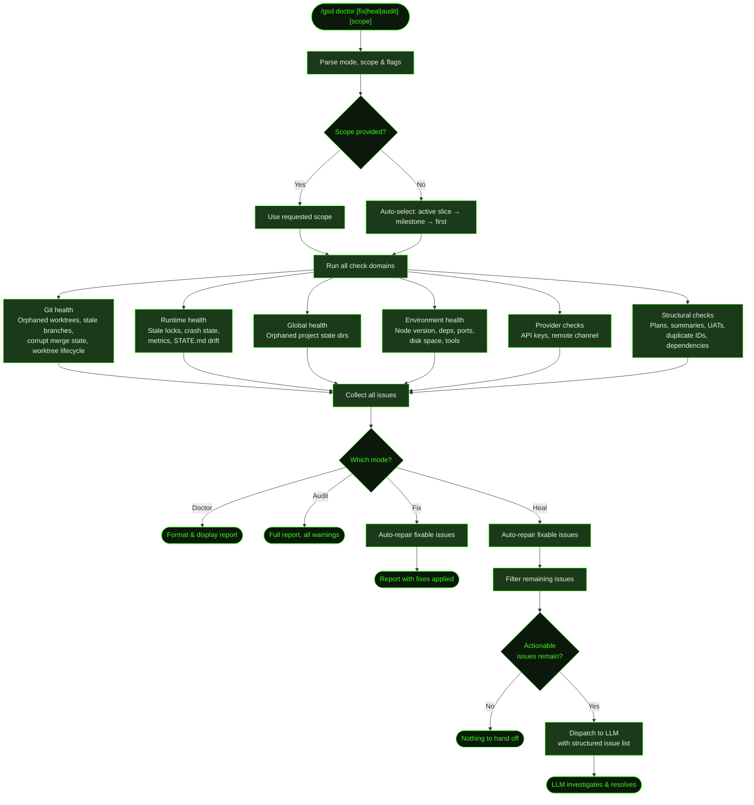

## What It Does

`/gsd doctor` scans your `.gsd/` directory for structural integrity issues — missing summaries, unchecked roadmap entries, stale locks, orphaned worktrees, corrupt git state, environment misconfigurations, missing API keys, and more. It operates in four modes:

- **Doctor** (default) — Scans and reports issues. Read-only, changes nothing.
- **Fix** — Scans and auto-repairs what it can. Creates placeholder summaries, marks tasks done, removes stale locks, cleans up git state.
- **Heal** — Scans, auto-repairs fixable issues, then dispatches remaining errors and UAT warnings to the LLM for interactive investigation and resolution.
- **Audit** — Full scan with all warnings included, up to 50 issues displayed, no fixes applied.

Doctor checks a large set of distinct issue codes spanning six domains (project/runtime, git/worktrees, environment, provider, milestone structure, slice structure, task structure). Each issue has a severity (error, warning, info) and a fixability flag. Fix mode only touches issues marked as fixable — it won't rewrite plan content or make judgment calls.

During auto-mode, a proactive healing layer runs lightweight checks before each unit dispatch, tracks health trends over time (green → yellow → red), and can escalate to LLM-assisted healing after 5 consecutive units with unresolved errors.

## Usage

```
/gsd doctor              # Report issues (default scope: active slice)
/gsd doctor M001         # Report issues for milestone M001
/gsd doctor M001/S02     # Report issues for a specific slice
/gsd doctor fix          # Auto-repair fixable issues
/gsd doctor fix M001     # Auto-repair within milestone M001
/gsd doctor heal         # Fix what's fixable, dispatch the rest to LLM
/gsd doctor audit        # Full audit — all issues, all scopes, warnings included
```

**Flags:**

| Flag | Description |
|------|-------------|
| `--build` | Run `npm run build` and report failures as `env_build` (slow, opt-in) |
| `--test` | Run `npm test` and report failures as `env_test` (slow, opt-in) |
| `--dry-run` | Show what fix mode would change without applying any changes |
| `--json` | Output the doctor report as raw JSON instead of human-readable text |

The scope argument is optional. Without it, doctor auto-selects the active slice (if one exists), then the active milestone, then the first incomplete milestone.

## How It Works



### State Loading and Scope Selection

Doctor loads the full project state via `deriveState()` and scans the milestone registry. If no scope is provided, it selects the narrowest active context — the active slice if one exists, otherwise the active milestone, otherwise the first incomplete milestone in the registry. Audit mode always uses the explicitly requested scope without auto-selection (and defaults to full-project scan when none is given).

### Check Domains

The scanner runs six independent check functions:

- **`checkGitHealth`** — Orphaned auto-worktrees, stale milestone branches, corrupt merge/rebase state, tracked runtime files, legacy slice branches, missing integration branches, orphaned worktree directories, and worktree lifecycle (merged, stale, dirty, unpushed). Git checks are skipped entirely if the project is not a git repo. Worktree and branch checks are also skipped when the project's `git.isolation` preference is set to `"none"`.
- **`checkRuntimeHealth`** — Stale crash locks, stranded lock directories, stale parallel sessions, orphaned completed-unit keys, stale hook state, activity log bloat, STATE.md drift, gitignore drift, failed migration artifacts, broken `.gsd` symlinks, metrics ledger integrity and bloat, large planning file detection, snapshot ref bloat.
- **`checkGlobalHealth`** — Cross-project check that scans `~/.gsd/projects/` for orphaned project state directories whose git root no longer exists on disk.
- **`checkEnvironmentHealth`** — Node version vs. `engines` requirement, `node_modules` staleness, missing `.env` files, port conflicts on common dev ports, disk space, Docker availability, package manager, TypeScript/Python/Rust/Go tool presence, and git remote reachability. The `--build` and `--test` flags add opt-in slow checks that run your build/test scripts.
- **`runProviderChecks`** — When an active milestone exists, checks required LLM provider API keys (based on configured model preferences), remote questions channel token (Slack/Discord/Telegram), and optional tool integrations (Brave, Tavily, Jina, Context7). Fast — reads `auth.json` and env vars only, no network I/O.
- **Inline structural checks** — Preference validation, requirement auditing, and all milestone/slice/task structural integrity checks (circular dependencies, orphaned directories, duplicate task IDs, missing plans, completion drift, must-have verification, future timestamps) run directly in `runGSDDoctor`.

Checks are independent — a failure in one domain doesn't prevent others from running.

### Fix Mode Behavior

When fix mode is enabled, fixable issues are repaired in place during the scan. Fixes include:

- Creating placeholder summary stubs for missing slice summaries
- Creating placeholder UAT stubs for missing slice UAT files
- **Unchecking tasks** in plan files when done-checked tasks are missing summaries (forces re-execution — does *not* create a stub)
- Marking tasks done in plan files when summaries exist but the checkbox is unchecked
- Marking slices done in roadmaps when all tasks are complete
- Creating missing `tasks/` or slice directories
- Removing stale crash locks (`auto.lock`) where the owning process is dead
- Removing stranded lock directories left by hard crashes
- Cleaning up stale parallel session status files
- Removing orphaned completed-unit keys from `completed-units.json`
- Clearing stale hook state from `hook-state.json`
- Removing orphaned worktrees for completed milestones
- Deleting stale milestone branches
- Aborting corrupt git merge/rebase state
- Removing tracked runtime files from git index
- Removing orphaned worktree directories that aren't registered with git
- Pruning activity logs (7-day retention)
- Pruning metrics ledger to newest 1500 entries when over 2000
- Pruning snapshot refs to newest 5 per label when over 50
- Regenerating STATE.md from current disk state
- Ensuring `.gitignore` has required patterns
- Recovering failed external state migrations (`.gsd.migrating`)
- Sanitizing delimiter characters (em dash, en dash) from milestone titles in roadmaps
- Updating recorded integration branch to fallback when original no longer exists

**Fix levels:** When doctor runs automatically from auto-mode post-unit hooks, it uses a restricted `fixLevel: "task"` that skips two protected code sets:

- **`COMPLETION_TRANSITION_CODES`** (`all_tasks_done_missing_slice_summary`): Reserved for the `complete-slice` dispatch unit — requires LLM-generated content. Only fixed in full fix mode (`/gsd doctor fix`).
- **`GLOBAL_STATE_CODES`** (`orphaned_project_state`, `orphaned_completed_units`): Removing completed-unit keys can revert project state, treating finished tasks as incomplete. These are only fixed by explicit manual doctor runs.

All other fixable codes — including roadmap checkbox updates (`all_tasks_done_roadmap_not_checked`) and UAT stubs (`all_tasks_done_missing_slice_uat`) — are fixed immediately even at `fixLevel: "task"` to keep bookkeeping consistent.

### Heal Mode Dispatch

Heal mode first runs all fixes, then filters the remaining issues to find actionable ones — all errors, plus UAT-related warnings (`all_tasks_done_missing_slice_uat`, `slice_checked_missing_uat`). It dispatches these to the LLM as a structured list with issue codes, unit IDs, file paths, and fixability flags. The LLM receives the full doctor report as context and can use standard tools to investigate and resolve each issue. The LLM is instructed to prefer reconstructing real artifacts from existing context over leaving placeholders.

### Proactive Healing During Auto-Mode

During auto-mode, doctor runs a lightweight proactive healing layer in addition to any manual invocations:

1. **Pre-dispatch health gate** — Before each unit dispatch, checks for stale crash locks, corrupt merge state, missing STATE.md, missing integration branches, and low disk space. Attempts auto-repair of each. Blocks dispatch if critical issues cannot be resolved.
2. **Health score tracking** — After each unit, records a health snapshot (error count, warning count, fixes applied, top issues). Tracks trends across the last 50 snapshots to detect degradation. Emits level-change events when health transitions between green (no errors), yellow (1+ errors or degrading trend), and red (3+ consecutive error units).
3. **Auto-heal escalation** — After 5 consecutive units with unresolved errors, if the trend is not improving, escalates to LLM-assisted heal. Escalation fires at most once per auto-mode session.

### Doctor History

After every run, doctor appends a compact JSONL entry to `.gsd/doctor-history.jsonl` with timestamps, error/warning counts, issue codes, fix descriptions, and a human-readable summary. This history is used by auto-mode for trend analysis and by `formatHealthSummary()` in the dashboard overlay.

## Issue Code Reference

Doctor checks a large set of distinct issue codes grouped by domain.

### Project / Runtime

| Code | Severity | Description | Fixable |
|------|----------|-------------|---------|
| `invalid_preferences` | warning | Preference file has malformed fields (lists that aren't arrays, invalid skill rules) | No |
| `active_requirement_missing_owner` | error | Requirement is Active but has no primary owning slice | No |
| `blocked_requirement_missing_reason` | warning | Requirement is Blocked but Notes field is empty | No |
| `state_file_stale` | warning | STATE.md active milestone/slice/phase doesn't match derived state | Yes |
| `state_file_missing` | warning | STATE.md doesn't exist but milestones directory does | Yes |
| `gitignore_missing_patterns` | warning | `.gitignore` lacks required GSD runtime exclusion patterns | Yes |
| `activity_log_bloat` | warning | Activity log directory exceeds 500 files or 100MB | Yes |
| `stale_crash_lock` | error | `auto.lock` exists but the owning process is dead | Yes |
| `stranded_lock_directory` | error | `.gsd.lock/` directory exists but no live process holds the session lock — blocks new sessions | Yes |
| `stale_parallel_session` | warning | Parallel session status file exists but the owning process is dead | Yes |
| `orphaned_completed_units` | warning | `completed-units.json` references units whose expected artifacts no longer exist | Yes |
| `stale_hook_state` | info | `hook-state.json` has residual cycle counts from a previous session | Yes |
| `failed_migration` | error | `.gsd.migrating` found — a previous external state migration failed | Yes |
| `broken_symlink` | error | `.gsd` symlink target does not exist — external state directory was deleted | No |
| `metrics_ledger_corrupt` | warning | `metrics.json` has invalid structure or is not valid JSON | No |
| `metrics_ledger_bloat` | warning | `metrics.json` has over 2000 unit entries | Yes |
| `large_planning_file` | warning | One or more planning `.md` files exceed 100KB — causes LLM context pressure | No |
| `orphaned_project_state` | info | Project state directories in `~/.gsd/projects/` whose git root no longer exists | Yes |

### Git / Worktrees

| Code | Severity | Description | Fixable |
|------|----------|-------------|---------|
| `corrupt_merge_state` | error | MERGE_HEAD, SQUASH_MSG, rebase-apply, or rebase-merge state found | Yes |
| `tracked_runtime_files` | warning | Files in `.gsd/activity/` or `.gsd/runtime/` are tracked by git | Yes |
| `legacy_slice_branches` | info | Per-slice `gsd/*/*` branches found (legacy pattern, no longer used) | Yes |
| `orphaned_auto_worktree` | warning | Worktree exists for a completed milestone | Yes |
| `stale_milestone_branch` | info | `milestone/*` branch exists for a completed milestone | Yes |
| `integration_branch_missing` | warning/error | Active milestone's recorded integration branch no longer exists in git (warning if fallback available, error if none) | Yes (if fallback) |
| `worktree_directory_orphaned` | warning | Worktree directory exists on disk but is not registered with git | Yes |
| `worktree_branch_merged` | info | GSD-managed worktree's branch is fully merged into main — safe to remove | Yes |
| `worktree_stale` | warning | GSD-managed worktree has had no commits in 7+ days | No |
| `worktree_dirty` | warning | Stale worktree has uncommitted changes | No |
| `worktree_unpushed` | warning | Stale worktree has unpushed commits | No |
| `snapshot_ref_bloat` | warning | Over 50 snapshot refs under `refs/gsd/snapshots/` | Yes |

### Environment

| Code | Severity | Description | Fixable |
|------|----------|-------------|---------|
| `env_node_version` | warning | Node.js version doesn't meet the project's `engines.node` requirement | No |
| `env_dependencies` | error/warning | `node_modules` missing, or lockfile is newer than `node_modules` | No |
| `env_env_file` | warning | `.env.example` exists but no `.env` or `.env.local` found | No |
| `env_port_conflict` | warning | A dev server port from `package.json` scripts is already in use | No |
| `env_disk_space` | error/warning | Less than 500MB free disk space (error) or less than 2GB (warning) | No |
| `env_docker` | warning | Project has Docker files but Docker is not installed or daemon is not running | No |
| `env_package_manager` | warning | Project's `packageManager` field requires a tool that isn't installed | No |
| `env_typescript` | warning | TypeScript is a dependency but `tsc` is not available | No |
| `env_python` | warning | Project has Python config but `python` is not installed | No |
| `env_cargo` | warning | Project has `Cargo.toml` but `cargo` is not installed | No |
| `env_go` | warning | Project has `go.mod` but `go` is not installed | No |
| `env_git_remote` | warning | Git remote `origin` is unreachable | No |
| `env_build` | error | `npm run build` exits non-zero (opt-in via `--build`) | No |
| `env_test` | warning | `npm test` exits non-zero (opt-in via `--test`) | No |

### Provider / Auth

| Code | Severity | Description | Fixable |
|------|----------|-------------|---------|
| `provider_key_missing` | warning | A required LLM provider API key is not configured (based on model preferences) | No |
| `provider_key_backedoff` | warning | All credentials for a required provider are currently backed off (rate limited) | No |

### Milestone Scope

| Code | Severity | Description | Fixable |
|------|----------|-------------|---------|
| `delimiter_in_title` | warning | Milestone title contains em dash, en dash, or slash — breaks state parsing | Yes (em/en dash only) |
| `circular_slice_dependency` | error | Circular dependency detected between slices in a milestone's roadmap | No |
| `orphaned_slice_directory` | warning | A directory in `slices/` is not referenced in the roadmap | No |
| `all_slices_done_missing_milestone_validation` | info | All slices complete but `VALIDATION.md` is missing — milestone is in validating-milestone phase | No |
| `all_slices_done_missing_milestone_summary` | warning | All slices complete but `SUMMARY.md` is missing — milestone stuck in completing-milestone phase | No |

### Slice Scope

| Code | Severity | Description | Fixable |
|------|----------|-------------|---------|
| `delimiter_in_title` | warning | Slice title contains em dash, en dash, or slash — breaks state parsing | No |
| `unresolvable_dependency` | warning | Slice depends on an ID that is not a known slice in this roadmap — permanently blocks the slice | No |
| `missing_slice_dir` | error/warning | Slice listed in roadmap has no directory (error if incomplete, warning if complete) | Yes |
| `missing_slice_plan` | warning | Slice directory exists but has no plan file (only reported for incomplete slices) | No |
| `missing_tasks_dir` | error/warning | Slice has a plan but no `tasks/` directory (error if incomplete, warning if complete) | Yes |
| `duplicate_task_id` | error | A task ID appears more than once in a slice plan — causes dispatch failures | No |
| `task_file_not_in_plan` | info | A task summary file on disk references a task ID not found in the slice plan | No |
| `all_tasks_done_missing_slice_summary` | error | All tasks complete but slice summary missing | Yes |
| `all_tasks_done_missing_slice_uat` | warning | All tasks complete but UAT script missing | Yes |
| `all_tasks_done_roadmap_not_checked` | error | All tasks done but slice not checked off in roadmap | Yes |
| `slice_checked_missing_summary` | error | Slice is checked done in roadmap but has no summary | Yes |
| `slice_checked_missing_uat` | warning | Slice is checked done but has no UAT | Yes |
| `blocker_discovered_no_replan` | warning | A task summary has `blocker_discovered: true` but no `REPLAN.md` exists for the slice | No |
| `stale_replan_file` | info | A `REPLAN.md` exists for a slice where all tasks are done — file may be stale | No |

### Task Scope

| Code | Severity | Description | Fixable |
|------|----------|-------------|---------|
| `task_done_missing_summary` | error | Task is marked done but has no summary file — checkbox is unchecked to force re-execution | Yes |
| `task_summary_without_done_checkbox` | warning | Summary exists but task not checked in plan | Yes |
| `task_done_must_haves_not_verified` | warning | Task done but must-haves from task plan not mentioned in summary | No |
| `future_timestamp` | warning | Task summary has a `completed_at` more than 24h in the future | No |

## What Files It Touches

### Reads

| File | Purpose |
|------|---------|
| `.gsd/STATE.md` | Current state for scope selection and staleness check |
| `.gsd/REQUIREMENTS.md` | Requirement audit (active/blocked status) |
| `.gsd/preferences.md` | Preference shape validation |
| `.gsd/milestones/*/` | Full milestone registry scan |
| `.gsd/auto.lock` | Crash lock detection |
| `.gsd/.gsd.lock/` | Stranded lock directory detection |
| `.gsd/parallel/*.status.json` | Parallel session staleness detection |
| `.gsd/completed-units.json` | Orphaned key detection |
| `.gsd/hook-state.json` | Stale hook state detection |
| `.gsd/activity/` | Activity log size check |
| `.gsd/metrics.json` | Metrics ledger integrity and bloat check |
| `.gsd/doctor-history.jsonl` | Doctor run history (read for trend display) |
| `.gitignore` | Pattern completeness check |
| `package.json` | Node version, deps, tools, port checks |
| `auth.json` | Provider API key presence |

### Writes (fix/heal mode only)

| File | Purpose |
|------|---------|
| `.gsd/milestones/*/slices/*/S*-SUMMARY.md` | Placeholder summary stubs |
| `.gsd/milestones/*/slices/*/S*-UAT.md` | Placeholder UAT stubs |
| `.gsd/milestones/*/slices/*/S*-PLAN.md` | Task checkbox updates (check done, or uncheck to force re-run) |
| `.gsd/milestones/*/M*-ROADMAP.md` | Slice checkbox updates; sanitized delimiter characters |
| `.gsd/milestones/*/slices/*/tasks/` | Created when `tasks/` directory is missing |
| `.gsd/milestones/*/slices/*/` | Created when slice directory is missing |
| `.gsd/STATE.md` | Regenerated from disk state |
| `.gsd/auto.lock` | Removed when stale |
| `.gsd/parallel/*.status.json` | Removed when session is stale |
| `.gsd/completed-units.json` | Orphaned keys removed |
| `.gsd/hook-state.json` | Cleared when auto-mode is not running |
| `.gsd/activity/` | Pruned to 7-day retention |
| `.gsd/metrics.json` | Pruned to newest 1500 entries |
| `.gsd/doctor-history.jsonl` | Doctor run appended after every scan |
| `.gitignore` | Missing GSD runtime patterns added |

## Examples

Running doctor on a project with completion drift:

```
> /gsd doctor

GSD doctor report.
Scope: M002/S03
Issues: 3 total · 1 error(s) · 2 warning(s) · 2 fixable
Top issue types:
- task_summary_without_done_checkbox: 1
- all_tasks_done_missing_slice_uat: 1
- stale_crash_lock: 1
Priority issues:
- [ERROR] M002/S03: stale auto.lock — PID 48221 is dead
- [WARN] M002/S03/T02: summary exists but task not checked in plan
- [WARN] M002/S03: all tasks done but UAT missing
```

Auto-fixing:

```
> /gsd doctor fix

GSD doctor report.
Scope: M002/S03
Issues: 3 total · 1 error(s) · 2 warning(s) · 2 fixable
Fixes applied:
- cleared stale auto.lock
- marked T02 done in .gsd/milestones/M002/slices/S03/S03-PLAN.md
```

Previewing fixes without applying them:

```
> /gsd doctor fix --dry-run

GSD doctor report.
Scope: M002/S03
Fixes applied:
- [dry-run] would fix: uncheck T04 in plan for M002/S03/T04
- [dry-run] would fix: create placeholder UAT for M002/S03
```

Heal mode dispatching to LLM:

```
> /gsd doctor heal

GSD doctor heal prep.
Scope: M002/S03
Issues: 1 total · 1 error(s) · 0 warning(s) · 0 fixable
Doctor heal dispatched 1 issue(s) to the LLM.

● Investigating: all_tasks_done_missing_slice_uat for M002/S03...
  Reading task summaries to build UAT script...
```

Full audit across all scopes:

```
> /gsd doctor audit

GSD doctor audit.
Scope: (all)
Issues: 12 total · 2 error(s) · 7 warning(s) · 3 info(s) · 8 fixable
...
```

Running environment checks including a build:

```
> /gsd doctor --build

GSD doctor report.
Scope: M003/S01
Issues: 2 total · 1 error(s) · 1 warning(s) · 0 fixable
- [ERROR] environment: Build failed — npm run build exited non-zero
- [WARN] environment: TypeScript is a dependency but tsc is not available
```

## Prompts Used

- [`doctor-heal`](../../prompts/doctor-heal/) — Targeted workspace healing prompt

## Related Commands

- [`/gsd health`](../health/) — Diagnose planning directory health and optionally repair issues
- [`/gsd forensics`](../forensics/) — Deep post-mortem investigation of auto-mode failures
- [`/gsd status`](../status/) — View current project state
- [`/gsd cleanup`](../cleanup/) — Clean up stale branches and worktrees
- [`/gsd prefs`](../prefs/) — Configure preferences (doctor validates these)
- [`/gsd keys`](../keys/) — Manage provider API keys (doctor checks these)
