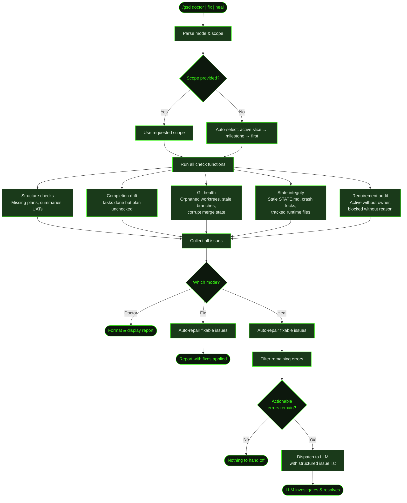

## What It Does

`/gsd doctor` scans your `.gsd/` directory for structural integrity issues — missing summaries, unchecked roadmap entries, stale crash locks, orphaned worktrees, corrupt git state, and more. It operates in three modes:

- **Doctor** (default) — Scans and reports issues. Read-only, changes nothing.
- **Fix** — Scans and auto-repairs what it can. Creates placeholder summaries, marks tasks done, removes stale locks, cleans up git state.
- **Heal** — Scans, auto-repairs fixable issues, then dispatches remaining errors to the LLM for interactive investigation and resolution.

The doctor checks 27 distinct issue codes across four scopes (project, milestone, slice, task). Each issue has a severity (error, warning, info) and a fixability flag. Fix mode only touches issues marked as fixable — it won't rewrite your plan content or make judgment calls.

## Usage

```
/gsd doctor              # Report issues (default scope: active slice)
/gsd doctor M001         # Report issues for milestone M001
/gsd doctor M001/S02     # Report issues for a specific slice
/gsd fix                 # Auto-repair fixable issues
/gsd fix M001            # Auto-repair within milestone M001
/gsd heal                # Fix what's fixable, dispatch the rest to LLM
/gsd doctor audit        # Full audit — all issues, all scopes, warnings included
```

The scope argument is optional. Without it, doctor auto-selects the active slice (if one exists), then the active milestone, then the first milestone.

## How It Works



### State Loading and Scope Selection

Doctor loads the full project state via `deriveState()` and scans the milestone registry. If no scope is provided, it selects the narrowest active context — the active slice if one exists, otherwise the active milestone, otherwise the first milestone in the registry.

### Check Functions

The scanner runs multiple check functions, each targeting a specific category of issues. Checks are independent — a failure in git health doesn't prevent structure checks from running.

### Fix Mode Behavior

When fix mode is enabled, fixable issues are repaired in place during the scan. Fixes include:

- Creating placeholder summary stubs for missing slice/task summaries
- Marking tasks done in plan files when summaries exist
- Marking slices done in roadmaps when all tasks are complete
- Removing stale crash locks where the owning process is dead
- Removing orphaned worktrees for completed milestones
- Deleting stale milestone branches
- Aborting corrupt git merge/rebase state
- Removing tracked runtime files from git index
- Regenerating STATE.md from current disk state
- Ensuring `.gitignore` has required patterns

### Heal Mode Dispatch

Heal mode first runs all fixes, then filters the remaining issues to find actionable errors. It dispatches these to the LLM as a structured list with issue codes, unit IDs, file paths, and fixability flags. The LLM receives the full doctor report as context and can use standard tools to investigate and resolve each issue.

## Issue Code Reference

Doctor checks 27 issue codes grouped by scope. Here are the categories with representative examples:

### Project Scope

| Code | Severity | Description | Fixable |
|------|----------|-------------|---------|
| `invalid_preferences` | error | Preference file has malformed fields (lists that aren't arrays, invalid skill rules) | No |
| `active_requirement_missing_owner` | error | Requirement is Active but has no primary owning slice | No |
| `blocked_requirement_missing_reason` | warning | Requirement is Blocked but Notes field is empty | No |
| `state_file_stale` | warning | STATE.md doesn't match derived state | Yes |
| `state_file_missing` | error | STATE.md doesn't exist | Yes |
| `gitignore_missing_patterns` | warning | `.gitignore` lacks required GSD exclusion patterns | Yes |
| `activity_log_bloat` | info | Activity log directory exceeds size threshold | No |

### Milestone Scope

| Code | Severity | Description | Fixable |
|------|----------|-------------|---------|
| `all_slices_done_missing_milestone_summary` | error | All slices complete but milestone summary is missing | No |
| `orphaned_auto_worktree` | warning | Worktree exists for a completed milestone | Yes |
| `stale_milestone_branch` | info | Branch exists for a completed milestone | Yes |
| `delimiter_in_title` | error | Milestone title contains em dash, en dash, or slash — breaks state parsing | No |

### Slice Scope

| Code | Severity | Description | Fixable |
|------|----------|-------------|---------|
| `missing_slice_plan` | error | Slice directory exists but has no plan file | No |
| `all_tasks_done_missing_slice_summary` | error | All tasks complete but slice summary missing | Yes |
| `all_tasks_done_missing_slice_uat` | warning | All tasks complete but UAT script missing | Yes |
| `all_tasks_done_roadmap_not_checked` | error | All tasks done but slice not checked off in roadmap | Yes |
| `slice_checked_missing_summary` | error | Slice is checked done in roadmap but has no summary | Yes |
| `slice_checked_missing_uat` | warning | Slice is checked done but has no UAT | Yes |
| `legacy_slice_branches` | warning | Per-slice branches found (legacy pattern, no longer used) | Yes |

### Task Scope

| Code | Severity | Description | Fixable |
|------|----------|-------------|---------|
| `missing_tasks_dir` | error | Slice has a plan but no `tasks/` directory | No |
| `task_done_missing_summary` | error | Task is checked done but has no summary file | No |
| `task_summary_without_done_checkbox` | warning | Summary exists but task not checked in plan | Yes |
| `task_done_must_haves_not_verified` | warning | Task done but must-haves from plan not mentioned in summary | No |
| `blocker_discovered_no_replan` | error | Task summary has `blocker_discovered: true` but slice plan wasn't replanned | No |

### Git Health

| Code | Severity | Description | Fixable |
|------|----------|-------------|---------|
| `corrupt_merge_state` | error | MERGE_HEAD, rebase-apply, or rebase-merge state found | Yes |
| `tracked_runtime_files` | warning | Files in `.gsd/runtime/` or `.gsd/activity/` are tracked by git | Yes |
| `stale_crash_lock` | error | Crash lock exists but the owning process is dead | Yes |
| `orphaned_completed_units` | warning | `completed-units.json` references units that no longer exist | No |
| `stale_hook_state` | info | Hook state file references hooks that are no longer configured | No |

## What Files It Touches

### Reads

| File | Purpose |
|------|---------|
| `.gsd/STATE.md` | Current state for scope selection |
| `.gsd/REQUIREMENTS.md` | Requirement audit (active/blocked status) |
| `.gsd/preferences.md` | Preference validation |
| `.gsd/milestones/*/` | Full milestone registry scan |
| `.gsd/runtime/crash.lock` | Crash lock detection |
| `.gsd/activity/*.jsonl` | Activity log size check |
| `.gitignore` | Pattern completeness check |

### Writes (fix/heal mode only)

| File | Purpose |
|------|---------|
| `.gsd/milestones/*/slices/*/S*-SUMMARY.md` | Placeholder summary stubs |
| `.gsd/milestones/*/slices/*/S*-UAT.md` | Placeholder UAT stubs |
| `.gsd/milestones/*/slices/*/S*-PLAN.md` | Task checkbox updates |
| `.gsd/milestones/*/M*-ROADMAP.md` | Slice checkbox updates |
| `.gsd/STATE.md` | Regenerated from disk state |
| `.gsd/runtime/crash.lock` | Removed when stale |
| `.gitignore` | Missing patterns added |

## Examples

Running doctor on a project with completion drift:

```
> /gsd doctor

GSD doctor report.
Scope: M002/S03
Issues: 3 total · 1 error(s) · 2 warning(s) · 2 fixable
Top issue types:
- task_summary_without_done_checkbox: 1
- all_tasks_done_missing_slice_uat: 1
- stale_crash_lock: 1
Priority issues:
- [ERROR] M002/S03: stale crash lock — PID 48221 is dead
- [WARN] M002/S03/T02: summary exists but task not checked in plan
- [WARN] M002/S03: all tasks done but UAT missing
```

Auto-fixing:

```
> /gsd fix

GSD doctor report.
Scope: M002/S03
Issues: 3 total · 1 error(s) · 2 warning(s) · 2 fixable
Fixes applied:
- cleared stale crash lock (.gsd/runtime/crash.lock)
- marked T02 done in .gsd/milestones/M002/slices/S03/S03-PLAN.md
```

Heal mode dispatching to LLM:

```
> /gsd heal

GSD doctor heal prep.
Scope: M002/S03
Issues: 1 total · 1 error(s) · 0 warning(s) · 0 fixable
Doctor heal dispatched 1 issue(s) to the LLM.

● Investigating: all_tasks_done_missing_slice_uat for M002/S03...
  Reading task summaries to build UAT script...
```

## Related Commands

- [`/gsd forensics`](../forensics/) — Deep post-mortem investigation of auto-mode failures
- [`/gsd status`](../status/) — View current project state
- [`/gsd cleanup`](../cleanup/) — Clean up stale branches and worktrees
- [`/gsd prefs`](../prefs/) — Configure preferences (doctor validates these)
