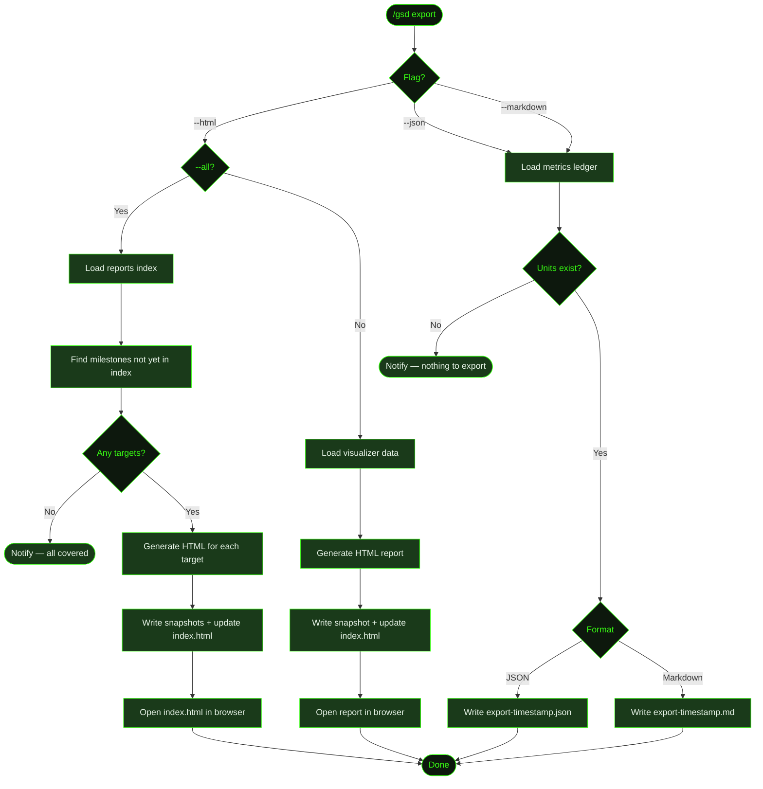

## What It Does

`/gsd export` generates a shareable snapshot of your milestone work in three formats:

- **`--html`** — A self-contained HTML file with progress tree, dependency graph, cost metrics, execution timeline, changelog, knowledge base, blockers, and more. All CSS and JavaScript are inlined — no external dependencies. Opens in your browser automatically.
- **`--json`** — A machine-readable JSON file with totals, cost by phase, cost by slice, cost by model, and the full unit history. Useful for CI dashboards and tooling.
- **`--markdown`** — A human-readable Markdown summary with cost and unit tables. Good for pasting into PRs or Notion.

HTML reports are also generated **automatically** after each milestone completes. This is enabled by default.

An auto-generated `index.html` in the reports directory links all HTML snapshots with progression metrics and a cost sparkline across milestones.

## Usage

```
/gsd export --html
/gsd export --html --all
/gsd export --json
/gsd export --markdown
```

## How It Works

### Export Flow



### HTML Export

Generates a self-contained HTML snapshot at `.gsd/reports/<milestone-id>-<timestamp>.html` (e.g., `M003-2026-03-17T10-30-00.html`). The report renders twelve sections:

| Section | Contents |
|---------|----------|
| Summary | Project name, phase, overall progress bar, key metrics |
| Blockers | Active blockers across all slices |
| Progress | Milestones and slices tree with status and critical path |
| Timeline | Chronological unit execution history |
| Dependencies | Slice dependency graph (SVG DAG per milestone) |
| Metrics | Cost/token/duration charts by phase, slice, model, and tier |
| Health | Configuration overview and missing changelogs |
| Changelog | Completed slice summaries and file modifications |
| Knowledge | Rules, patterns, and lessons from KNOWLEDGE.md |
| Captures | Pending and resolved captures |
| Artifacts | Tracked file and artifact status |
| Planning | Milestone planning notes and discussion |

All CSS and JavaScript are inlined — no external dependencies. The file is printable to PDF from any browser. After writing the file, GSD opens it automatically using your system's default browser.

Each snapshot has a `kind` tag that indicates how it was created:

| Kind | When set |
|------|----------|
| `milestone` | Auto-generated after a milestone completes |
| `manual` | Created by running `/gsd export --html` directly |
| `final` | Full-project final snapshot |

### Report Index

Each time a new snapshot is written, the reports directory is updated with:

- **`index.html`** — browseable gallery of all reports with progression metrics and a cost sparkline across milestones
- **`reports.json`** — machine-readable registry for programmatic access

### `--html --all`

Generates a report snapshot for every milestone that does not already have an entry in the reports registry (`reports.json`). The check is by milestone ID — if any snapshot exists for a milestone, it is skipped. If all milestones already have snapshots, the command notifies you and exits without writing new files.

After generating all snapshots, the reports `index.html` opens in your browser automatically.

Run without `--all` to manually create a new snapshot for the active milestone at any time.

### JSON Export

Writes `.gsd/export-<timestamp>.json` containing:

```json
{
  "exportedAt": "...",
  "project": "my-app",
  "totals": { "units": 42, "cost": 1.23, "tokens": { "total": 120000 }, "duration": 18000, "toolCalls": 340 },
  "byPhase": [ ... ],
  "bySlice": [ ... ],
  "byModel": [ ... ],
  "units": [ ... ]
}
```

Useful for CI dashboards, custom reporting scripts, or feeding into other tooling.

### Markdown Export

Writes `.gsd/export-<timestamp>.md` — a plain-text summary with:

- Project header and generation metadata
- Key totals: units, cost, tokens, duration, tool calls
- **Cost by Phase** table (phase, units, cost, tokens, duration)
- **Cost by Slice** table (slice ID, units, cost, tokens, duration)
- **Unit History** table (type, ID, model, cost, tokens, duration)

Good for pasting into PR descriptions, Notion, or any Markdown-capable destination.

### Auto-Report

HTML reports are generated automatically after each milestone completes. This is enabled by default and can be disabled in preferences:

```yaml
# .gsd/preferences.md
auto_report: false   # set to false to disable auto-generation on milestone completion
```

### Data Sources

For HTML exports, data is loaded through the full visualizer-data pipeline, which reads planning files, metrics, changelogs, captures, and knowledge on disk.

For JSON and Markdown exports, export reads the in-memory metrics ledger if the current session has executed units; otherwise it falls back to reading `.gsd/metrics.json` from disk. If neither source has any units, the command exits with a notification rather than writing an empty file.

## What Files It Touches

### Creates

| File | Purpose |
|------|---------|
| `.gsd/reports/<milestone-id>-<timestamp>.html` | HTML report snapshot |
| `.gsd/reports/index.html` | Report index page (regenerated on each new snapshot) |
| `.gsd/reports/reports.json` | Report registry for programmatic access |
| `.gsd/export-<timestamp>.json` | JSON export (cost, token, and unit data) |
| `.gsd/export-<timestamp>.md` | Markdown export (summary tables) |

### Reads

| File | Purpose |
|------|---------|
| `.gsd/metrics.json` | Cost, token, and duration data (fallback for JSON/Markdown) |
| `.gsd/milestones/<MID>/<MID>-ROADMAP.md` | Milestone progress and slice status |
| `.gsd/KNOWLEDGE.md` | Rules and lessons for the Knowledge section |
| `.gsd/CAPTURES.md` | Pending and resolved captures |

## Examples

Generate an HTML report for the active milestone (opens in browser):

```
> /gsd export --html

● HTML report saved: .gsd/reports/M003-2026-03-17T10-30-00.html
  Opening in browser...
```

Retrospective snapshots for all milestones without reports:

```
> /gsd export --html --all

● Generated 3 report snapshots:
    M001-2026-03-10T09-15-00.html
    M002-2026-03-14T14-00-00.html
    M003-2026-03-17T10-30-00.html
  Opening reports index in browser...
```

If all milestones already have reports:

```
> /gsd export --html --all

● All milestones already have report snapshots. Run without --all to create a new snapshot for the active milestone.
```

Export cost data for CI tooling:

```
> /gsd export --json

● Exported to .gsd/export-2026-03-17T10-30-00.json
```

Export a readable summary to paste into a PR:

```
> /gsd export --markdown

● Exported to .gsd/export-2026-03-17T10-30-00.md
```

## Related Commands

- [`/gsd visualize`](../visualize/) — Interactive TUI overlay with the same data pipeline
- [`/gsd status`](../status/) — Quick progress dashboard
- [`/gsd prefs`](../prefs/) — Configure auto-report and budget settings
