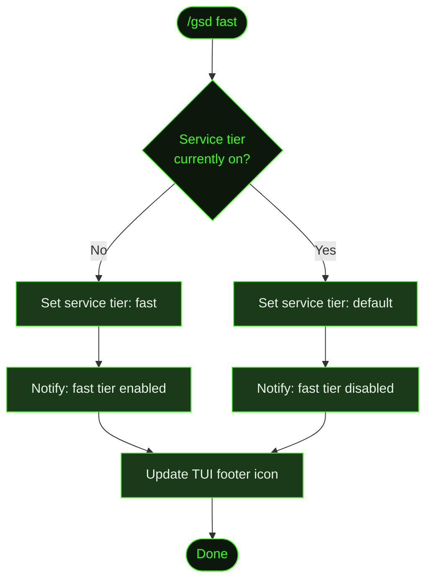

## What It Does

`/gsd fast` toggles the service tier used for API calls to supported models. When enabled, GSD sets the provider's priority routing flag on each request — moving your calls to a fast-lane queue rather than the standard pool. The result is lower latency per API round-trip, which is most noticeable during long auto-mode sessions where many sequential units run back-to-back.

Not every provider or model exposes a service tier parameter. The command only activates prioritized routing for models that support it. When fast mode is active, a service tier icon appears in the TUI footer to indicate the state.

Fast mode is a session-level toggle. Invoking `/gsd fast` once turns it on; invoking it again turns it off. It takes effect immediately — the next unit dispatched will use whichever tier is currently active.

## Usage

```
/gsd fast
```

No flags or arguments. Each invocation flips the toggle.

```
/gsd fast   # Enable fast service tier (if currently off)
/gsd fast   # Disable fast service tier (if currently on)
```

## How It Works



### Service tier

API providers including Anthropic expose a `service_tier` (or equivalent) parameter on their inference endpoints. Setting it to `"fast"` routes your request through a priority queue — requests are scheduled ahead of standard-tier traffic, reducing time-to-first-token and total response duration.

The tradeoff is cost: priority routing typically carries a multiplier on per-token pricing. For short sessions or light workloads the difference is negligible. For long auto-mode runs with many parallel or sequential units, the speed benefit may justify the premium — or you may prefer to leave it off and use the cost savings toward more tasks.

Fast mode is silently skipped for models or providers that don't support the parameter. GSD only applies it where it is recognised by the API.

### TUI indicator

When fast mode is enabled, a service tier icon appears in the TUI footer alongside the active model label. This gives you a persistent at-a-glance reminder that priority routing is active — useful during a session where you toggled it mid-run and want to confirm the current state without running the command again.

### Scope

The toggle is session-scoped. It applies to the current GSD process — both inside and outside auto-mode. Starting a new GSD session resets to the default tier. If you want fast mode as a persistent default, set the `service_tier` preference directly in your preferences file:

```yaml
service_tier: fast
```

This bypasses the toggle entirely and always uses the fast tier for supported models.

## What Files It Touches

`/gsd fast` modifies only in-memory session state. No planning files, state files, or preference files are written.

### Reads

| File | Purpose |
|------|---------|
| `~/.gsd/preferences.md` | Read to determine whether a persistent `service_tier` preference is already set |

## Examples

Enabling fast mode:

```
> /gsd fast

⚡ Fast service tier enabled — prioritized routing active for supported models.
```

Disabling fast mode:

```
> /gsd fast

● Fast service tier disabled — using standard routing.
```

Checking current state via status (the TUI footer shows the service tier icon when active):

```
> /gsd status

  Model: claude-opus-4-6 ⚡
  Phase: executing · T03
  ...
```

## Related Commands

- [`/gsd auto`](../auto/) — Continuous autonomous execution where fast mode has the most impact
- [`/gsd prefs`](../prefs/) — Persist service tier preference so it applies to every session
- [`/gsd status`](../status/) — View the TUI footer to confirm the current tier
- [`/gsd next`](../next/) — Execute one unit — fast mode applies here too
