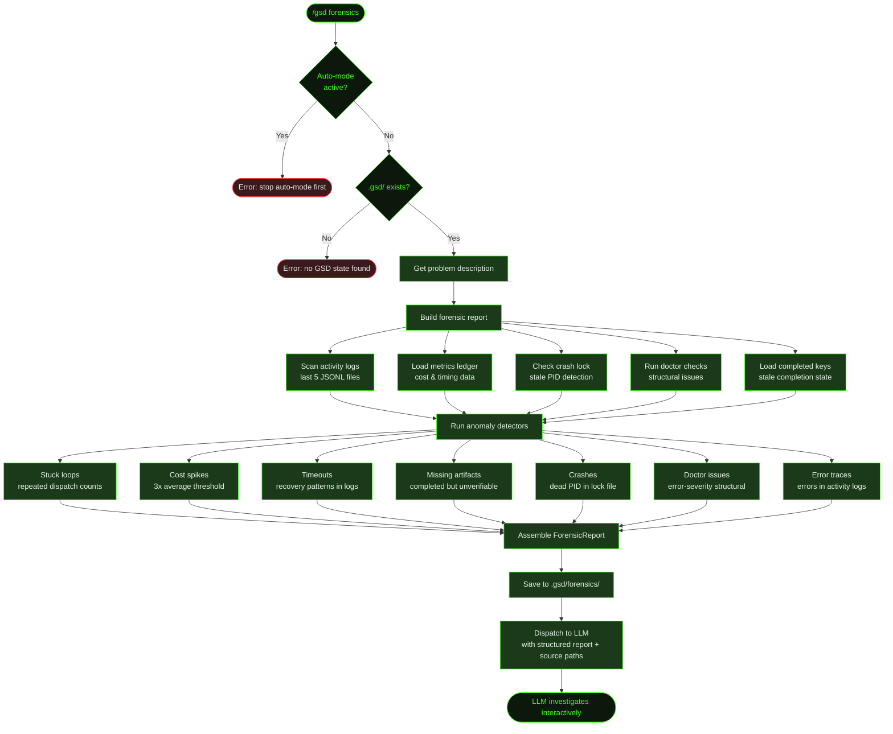

## What It Does

`/gsd forensics` is the deep investigation tool for when auto-mode fails in ways that aren't obvious from the surface. It programmatically scans activity logs, the metrics ledger, crash locks, and doctor diagnostics to build a structured forensic report. It then detects anomalies — stuck loops, cost spikes, timeouts, missing artifacts, error traces — and hands the whole package to the LLM for interactive investigation.

Unlike `/gsd doctor` which checks structural integrity, forensics focuses on *behavioral* anomalies: did a unit run too many times? Did costs spike unexpectedly? Did something time out? Did a completed unit leave missing artifacts?

Forensics cannot run while auto-mode is active — it needs to inspect the state without interference.

## Usage

```
/gsd forensics
```

The command prompts you to describe what went wrong. This problem description helps the LLM focus its investigation. If you provide the description as an argument, it skips the prompt:

```
/gsd forensics auto-mode got stuck on task T03 and kept retrying
```

## How It Works



### Data Sources

The forensic report builder collects data from five sources:

1. **Activity logs** (`.gsd/activity/*.jsonl`) — The last 5 JSONL files are parsed. Each log records tool calls, reasoning traces, errors, and files written during a unit's execution. The filename encodes sequence number, unit type, and unit ID.
2. **Metrics ledger** (`.gsd/metrics.json`) — Cost, token count, timing, and model data for every completed unit. Used to compute averages and detect spikes.
3. **Crash lock** (`.gsd/runtime/crash.lock`) — Written at auto-mode startup with PID, unit type, and unit ID. If the PID is dead, it's a crash indicator.
4. **Doctor checks** — The full doctor scan runs internally. Error-severity issues become forensic anomalies.
5. **Completed keys** (`.gsd/completed-units.json`) — List of units marked as done. Cross-referenced against expected artifacts to detect stale completions.

### Anomaly Types

| Type | Severity | What It Detects | Trigger |
|------|----------|-----------------|---------|
| `stuck-loop` | warning/error | Same unit dispatched multiple times | Count ≥ 2 (warning), ≥ 3 (error) |
| `cost-spike` | warning | Unit cost exceeds 3× the average for its type | Per-unit cost / type average > 3.0 |
| `timeout` | warning | Timeout recovery patterns in activity logs | `gsd-auto-timeout-recovery` in tool calls or reasoning |
| `missing-artifact` | error | Completed unit but expected artifact missing or invalid | `verifyExpectedArtifact()` returns false |
| `crash` | error | Crash lock with dead PID | Lock exists and `isLockProcessAlive()` returns false |
| `doctor-issue` | error | Error-severity structural issue from doctor | Doctor scan finds error-level issues |
| `error-trace` | warning | Errors recorded in activity log traces | `trace.errors.length > 0` |

### Report Persistence

Every forensic report is saved as a timestamped markdown file in `.gsd/forensics/` (e.g., `report-2026-03-17-14-30-22.md`). This creates an audit trail of investigations. The report includes all anomalies, recent unit history, activity log traces, doctor issues, and crash lock state.

### LLM Dispatch

The report is formatted into a structured prompt and dispatched to the LLM with `triggerTurn: true`. The LLM receives the problem description, all anomalies, recent unit history, and paths to the GSD source code. It can then use standard tools (read files, run commands, edit code) to investigate and resolve issues interactively.

## What Files It Touches

### Reads

| File | Purpose |
|------|---------|
| `.gsd/activity/*.jsonl` | Last 5 activity logs for trace extraction |
| `.gsd/metrics.json` | Cost and timing metrics for anomaly detection |
| `.gsd/runtime/crash.lock` | Crash detection |
| `.gsd/completed-units.json` | Stale completion detection |
| `.gsd/STATE.md` | Current project state |
| `.gsd/milestones/*/` | Doctor scan (run internally) |

### Creates

| File | Purpose |
|------|---------|
| `.gsd/forensics/report-*.md` | Timestamped forensic report |

## Examples

Investigating a stuck auto-mode session:

```
> /gsd forensics

● Describe what went wrong:
  auto-mode kept retrying T03 and never moved forward

● Building forensic report...
  Forensic report saved: .gsd/forensics/report-2026-03-17-14-30-22.md

● Analyzing report...

  Found 3 anomalies:

  [ERROR] stuck-loop: Unit execute-task/M001/S02/T03 was dispatched 4 times
    Repeated dispatch suggests the unit completed but its artifacts
    weren't verified, or the state machine kept returning it.

  [WARNING] cost-spike: $2.41 vs $0.38 average for execute-task
    Unit execute-task/M001/S02/T03 cost 6.3x the average.
    May indicate excessive retries or large context.

  [WARNING] error-trace: 7 error(s) in execute-task/M001/S02/T03
    Error: ENOENT: no such file or directory, open 'dist/api/users.js'
    Error: Test suite failed: 3 failing
    Error: ENOENT: no such file or directory...

  Investigating T03 activity log...
```

## Related Commands

- [`/gsd doctor`](../doctor/) — Structural health checks (forensics runs doctor internally)
- [`/gsd status`](../status/) — View current project state
- [`/gsd cleanup`](../cleanup/) — Clean up after resolving forensic issues
- [`/gsd stop`](../stop/) — Stop auto-mode before running forensics
