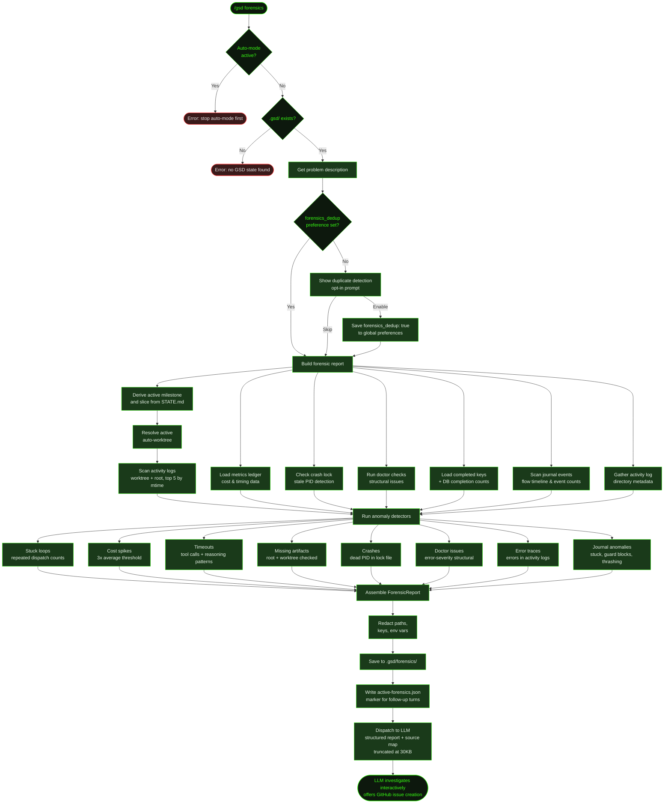

## What It Does

`/gsd forensics` is the deep investigation tool for when auto-mode fails in ways that aren't obvious from the surface. It programmatically scans activity logs, the journal event log, the metrics ledger, crash locks, and doctor diagnostics to build a structured forensic report. It then detects anomalies — stuck loops, cost spikes, timeouts, missing artifacts, journal anomalies, error traces — and hands the whole package to the LLM for interactive investigation.

Unlike [`/gsd doctor`](../doctor/) which checks structural integrity, forensics focuses on *behavioral* anomalies: did a unit run too many times? Did costs spike unexpectedly? Did something time out? Did the auto-mode loop thrash? Did a completed unit leave missing artifacts?

Forensics cannot run while auto-mode is active — it needs to inspect the state without interference.

## Usage

```
/gsd forensics
```

The command prompts you to describe what went wrong. This problem description helps the LLM focus its investigation. If you provide the description as an argument, it skips the prompt:

```
/gsd forensics auto-mode got stuck on task T03 and kept retrying
```

## How It Works


```mermaid
flowchart TD
    Start(["/gsd forensics"]) --> Active{Auto-mode<br/>active?}
    Active -->|Yes| Blocked([Error: stop auto-mode first])
    Active -->|No| GSD{.gsd/ exists?}
    GSD -->|No| NoState([Error: no GSD state found])
    GSD -->|Yes| Prompt[Get problem description]

    Prompt --> DedupPref{forensics_dedup<br/>preference set?}
    DedupPref -->|Yes| Build[Build forensic report]
    DedupPref -->|No| DedupChoice[Show duplicate detection<br/>opt-in prompt]
    DedupChoice -->|Enable| SavePref[Save forensics_dedup: true<br/>to global preferences]
    DedupChoice -->|Skip| Build
    SavePref --> Build

    Build --> State[Derive active milestone<br/>and slice from STATE.md]
    State --> Worktree[Resolve active<br/>auto-worktree]
    Worktree --> Scan1[Scan activity logs<br/>worktree + root, top 5 by mtime]
    Build --> Scan2[Load metrics ledger<br/>cost & timing data]
    Build --> Scan3[Check crash lock<br/>stale PID detection]
    Build --> Scan4[Run doctor checks<br/>structural issues]
    Build --> Scan5[Load completed keys<br/>+ DB completion counts]
    Build --> Scan6[Scan journal events<br/>flow timeline & event counts]
    Build --> Scan7[Gather activity log<br/>directory metadata]

    Scan1 --> Detect[Run anomaly detectors]
    Scan2 --> Detect
    Scan3 --> Detect
    Scan4 --> Detect
    Scan5 --> Detect
    Scan6 --> Detect
    Scan7 --> Detect

    Detect --> D1[Stuck loops<br/>repeated dispatch counts]
    Detect --> D2[Cost spikes<br/>3x average threshold]
    Detect --> D3[Timeouts<br/>tool calls + reasoning patterns]
    Detect --> D4[Missing artifacts<br/>root + worktree checked]
    Detect --> D5[Crashes<br/>dead PID in lock file]
    Detect --> D6[Doctor issues<br/>error-severity structural]
    Detect --> D7[Error traces<br/>errors in activity logs]
    Detect --> D8[Journal anomalies<br/>stuck, guard blocks, thrashing]

    D1 --> Report[Assemble ForensicReport]
    D2 --> Report
    D3 --> Report
    D4 --> Report
    D5 --> Report
    D6 --> Report
    D7 --> Report
    D8 --> Report

    Report --> Redact[Redact paths,<br/>keys, env vars]
    Redact --> Save[Save to .gsd/forensics/]
    Save --> Marker[Write active-forensics.json<br/>marker for follow-up turns]
    Marker --> Dispatch[Dispatch to LLM<br/>structured report + source map<br/>truncated at 30KB]
    Dispatch --> LLM([LLM investigates interactively<br/>offers GitHub issue creation])

    style Start fill:#0d180d,stroke:#39ff14,color:#39ff14
    style Active fill:#0d180d,stroke:#39ff14,color:#39ff14
    style GSD fill:#0d180d,stroke:#39ff14,color:#39ff14
    style DedupPref fill:#0d180d,stroke:#39ff14,color:#39ff14
    style Blocked fill:#3a1a1a,stroke:#ff4444,color:#e8e8e8
    style NoState fill:#3a1a1a,stroke:#ff4444,color:#e8e8e8
    style Prompt fill:#1a3a1a,stroke:#39ff14,color:#e8f4e8
    style DedupChoice fill:#1a3a1a,stroke:#39ff14,color:#e8f4e8
    style SavePref fill:#1a3a1a,stroke:#39ff14,color:#e8f4e8
    style Build fill:#1a3a1a,stroke:#39ff14,color:#e8f4e8
    style State fill:#1a3a1a,stroke:#39ff14,color:#e8f4e8
    style Worktree fill:#1a3a1a,stroke:#39ff14,color:#e8f4e8
    style Scan1 fill:#1a3a1a,stroke:#39ff14,color:#e8f4e8
    style Scan2 fill:#1a3a1a,stroke:#39ff14,color:#e8f4e8
    style Scan3 fill:#1a3a1a,stroke:#39ff14,color:#e8f4e8
    style Scan4 fill:#1a3a1a,stroke:#39ff14,color:#e8f4e8
    style Scan5 fill:#1a3a1a,stroke:#39ff14,color:#e8f4e8
    style Scan6 fill:#1a3a1a,stroke:#39ff14,color:#e8f4e8
    style Scan7 fill:#1a3a1a,stroke:#39ff14,color:#e8f4e8
    style Detect fill:#1a3a1a,stroke:#39ff14,color:#e8f4e8
    style D1 fill:#1a3a1a,stroke:#39ff14,color:#e8f4e8
    style D2 fill:#1a3a1a,stroke:#39ff14,color:#e8f4e8
    style D3 fill:#1a3a1a,stroke:#39ff14,color:#e8f4e8
    style D4 fill:#1a3a1a,stroke:#39ff14,color:#e8f4e8
    style D5 fill:#1a3a1a,stroke:#39ff14,color:#e8f4e8
    style D6 fill:#1a3a1a,stroke:#39ff14,color:#e8f4e8
    style D7 fill:#1a3a1a,stroke:#39ff14,color:#e8f4e8
    style D8 fill:#1a3a1a,stroke:#39ff14,color:#e8f4e8
    style Report fill:#1a3a1a,stroke:#39ff14,color:#e8f4e8
    style Redact fill:#1a3a1a,stroke:#39ff14,color:#e8f4e8
    style Save fill:#1a3a1a,stroke:#39ff14,color:#e8f4e8
    style Marker fill:#1a3a1a,stroke:#39ff14,color:#e8f4e8
    style Dispatch fill:#1a3a1a,stroke:#39ff14,color:#e8f4e8
    style LLM fill:#0d180d,stroke:#39ff14,color:#39ff14
```

### Duplicate Detection Opt-in

The first time you run forensics (when `forensics_dedup` is not set in your global preferences), GSD shows an interactive choice:

- **Enable duplicate detection** — Before reading GSD source code or performing deep analysis, the LLM will first search closed issues, open PRs, and merged PRs. If a match is found, it skips the full investigation. Uses additional AI tokens for the search.
- **Skip for now** — Investigate without checking for duplicates.

If you enable it, the preference is saved to your global GSD preferences file (`~/.gsd/agent/preferences.md`) as `forensics_dedup: true`. You can also set it manually.

When enabled, duplicate detection runs as a **pre-investigation step** — before any source code reading — to avoid wasting tokens on already-fixed bugs.

### Data Sources

The forensic report builder collects data from seven sources:

1. **Activity logs** (`.gsd/activity/*.jsonl`) — Scanned from both the active auto-worktree and the project root. All matching JSONL files from each directory are sorted alphabetically (the filename encodes a sequence number, unit type, and unit ID) and the five most recent from each directory are read. Results are then merged and sorted by modification time, keeping the five most recent overall. Each log records tool calls, reasoning traces, errors, and files written during a unit's execution. Worktree logs take priority over root logs when both exist.
2. **Metrics ledger** (`.gsd/metrics.json`) — Cost, token count, timing, and model data for every completed unit. Used to compute per-type averages and detect cost spikes. The ten most recent units are included in the report.
3. **Crash lock** (`.gsd/auto.lock`) — Written at auto-mode startup with PID, unit type, unit ID, and session file path. If the PID is dead, it's a crash indicator.
4. **Doctor checks** — The full doctor scan runs internally. Error-severity issues become forensic anomalies.
5. **Completed keys** (`.gsd/completed-units.json` and the GSD database) — Units marked as done. Legacy JSON keys are cross-referenced against expected artifacts in both the project root and the active worktree to detect stale completions. If the GSD database is available, milestone, slice, and task completion counts are pulled from it instead.
6. **Journal** (`.gsd/journal/*.jsonl`) — The structured event log for auto-mode iterations. Only the most recent daily files are fully parsed (for event counts, flow IDs, and recent events); older files are line-counted for totals. Provides a decision-level timeline: what the auto-mode loop *decided* to do (dispatches, guards, stuck detections, worktree operations), as opposed to what the LLM *did* (captured in activity logs).
7. **Activity log metadata** — A directory-level summary of `.gsd/activity/`: file count, total size, oldest and newest filenames. Provides volume context without re-parsing all log contents.

### Anomaly Types

| Type | Severity | What It Detects | Trigger |
|------|----------|-----------------|---------|
| `stuck-loop` | warning/error | Same unit dispatched multiple times | Distinct `startedAt` values ≥ 2 (warning), ≥ 3 (error) |
| `cost-spike` | warning | Unit cost exceeds 3× the average for its type | Per-unit cost / type average > 3.0 |
| `timeout` | warning | Timeout patterns in activity logs | `gsd-auto-timeout-recovery` in tool calls, or idle/hard/timeout-recovery keywords in last reasoning |
| `missing-artifact` | error | Completed unit but expected artifact missing or invalid | `verifyExpectedArtifact()` returns false at both root and worktree |
| `crash` | error | Crash lock with dead PID | Lock exists and `isLockProcessAlive()` returns false |
| `doctor-issue` | error | Error-severity structural issue from doctor | Doctor scan finds error-level issues |
| `error-trace` | warning | Errors recorded in activity log traces | `trace.errors.length > 0` |
| `journal-stuck` | warning/error | Auto-mode detected it was stuck | `stuck-detected` events in journal ≥ 1 (warning), ≥ 3 (error) |
| `journal-guard-block` | info/warning | Dispatch repeatedly blocked by guard condition | `guard-block` events ≥ 1 (info), ≥ 5 (warning) |
| `journal-rapid-iterations` | warning | Loop iterating too fast to make real progress | > 10 flows with avg interval < 5 seconds |
| `journal-worktree-failure` | warning | Worktree creation or merge failures | `worktree-create-failed` or `worktree-merge-failed` events > 0 |

Stuck loop detection groups by distinct `startedAt` timestamps per unit key, so idle-watchdog duplicate snapshots don't inflate the count.

### Report Persistence

Every forensic report is saved as a timestamped markdown file in `.gsd/forensics/` (e.g., `report-2026-03-17-14-30-22.md`). This creates an audit trail of investigations. The report includes all anomalies, recent unit history, activity log traces, journal summary, doctor issues, crash lock state, and activity log metadata.

After saving the report, a marker file is written to `.gsd/runtime/active-forensics.json` containing the report path and the full prompt content. This allows follow-up turns in the same conversation to re-inject the forensics context without re-running the full scan.

Before writing, the report is redacted: absolute paths are replaced with relative equivalents, home directories are replaced with `~`, and API keys, Bearer tokens, and environment variable values are scrubbed.

### LLM Dispatch

The report is formatted into a structured prompt (capped at 30KB) and dispatched to the LLM with `triggerTurn: true`. The LLM receives the problem description, all anomalies, a table of the ten most recent units from the metrics ledger, the top three activity log traces (tool calls, files written, errors, last reasoning), a journal summary with recent events and event type distribution, doctor issues, crash lock state, metrics summary, activity log metadata, completion status, and the path to the GSD extension source code with a comprehensive domain-organized source map.

The source map organizes GSD's source files by domain so the LLM can navigate directly to relevant code:

| Domain | Coverage |
|--------|---------|
| **Auto-mode engine** | Dispatch loop, stuck detection, timeout recovery, artifact verification, worktree sync, budget |
| **State & persistence** | State derivation, file paths, JSON persistence, atomic writes |
| **Forensics & recovery** | Trace extraction, crash lock lifecycle, session lock |
| **Metrics & telemetry** | Cost/token ledger, skill telemetry, token counting |
| **Health & diagnostics** | Doctor checks, environment checks, issue formatting |
| **Prompts & context** | Prompt loading, prompt cache optimization, context budget |
| **Git & worktrees** | Git service, worktree manager, self-healing |
| **Commands** | Command dispatcher, inspect commands, maintenance commands |

The LLM follows a structured investigation sequence:
1. **Start with the forensic report** — treat automated anomaly findings as leads, not conclusions
2. **Check the journal timeline** — use flow IDs to trace the auto-mode's decision sequence (dispatches, guards, stuck detection, worktree operations)
3. **Cross-reference activity logs and journal** — activity logs show what the LLM did (tool calls, errors); journal shows what auto-mode decided (dispatch rules, iteration boundaries, state transitions)
4. **Form hypotheses** — identify candidate files using the source map
5. **Read source code** — navigate to the candidate files to confirm or deny hypotheses; do not guess what code does. For DB state, use `gsd_milestone_status` — never run `sqlite3 .gsd/gsd.db` directly
6. **Trace the code path** — follow function calls from entry point through to the failure
7. **Identify the specific file and line** — determine what kind of defect it is (missing edge case, wrong logic, race condition, state corruption, timeout not triggering)
8. **Clarify** — may ask up to 2 questions if the report is genuinely ambiguous (skipped if data is sufficient)

Then the LLM **offers GitHub issue creation** at `gsd-build/gsd-2` with label `auto-generated`. The issue is created via `gh issue create --repo gsd-build/gsd-2 --body-file` (writing the body to a temp file to avoid shell quoting issues), followed by a GraphQL call to set the issue type to "Bug". The issue template includes GSD version, model, the failing unit, reproduction context, forensic findings, and a concrete fix suggestion — automatically redacted of any user-specific data.

When duplicate detection is enabled, the LLM first searches closed issues, open PRs, and merged PRs using keywords from its diagnosis. If a merged PR clearly fixes the described symptom, it reports "Already fixed" and skips the full investigation. If an open issue matches, it offers to add forensic evidence. Otherwise it proceeds with full investigation.

## What Files It Touches

### Creates

| File | Purpose |
|------|---------|
| `.gsd/forensics/report-*.md` | Timestamped, redacted forensic report |
| `.gsd/runtime/active-forensics.json` | Marker written after report save; re-injects forensics context for follow-up turns |
| `~/.gsd/agent/preferences.md` | Updated when user enables duplicate detection for the first time |

### Reads

| File | Purpose |
|------|---------|
| `.gsd/activity/*.jsonl` | Activity logs from project root (last 5 by sequence, merged by mtime) |
| `.gsd/worktrees/<MID>/.gsd/activity/*.jsonl` | Activity logs from active auto-worktree (merged with root, top 5 overall) |
| `.gsd/journal/*.jsonl` | Structured event log; recent files fully parsed, older files line-counted |
| `.gsd/metrics.json` | Cost and timing metrics for anomaly detection |
| `.gsd/auto.lock` | Crash detection (PID, unit type, unit ID, session file) |
| `.gsd/completed-units.json` | Stale completion detection (legacy; DB used when available) |
| `.gsd/STATE.md` | Current project state (active milestone and slice) |
| `.gsd/milestones/*/` | Doctor scan (run internally) |
| `~/.gsd/agent/preferences.md` | Global preferences (reads `forensics_dedup` setting) |

## Examples

Investigating a stuck auto-mode session:

```
> /gsd forensics
● Describe what went wrong:
  auto-mode kept retrying T03 and never moved forward

● Duplicate detection available
  Before filing a GitHub issue, forensics can search existing issues and PRs
  to avoid duplicates. This uses additional AI tokens for analysis.
  > Enable duplicate detection (recommended)
    Skip for now

● Building forensic report...
  Forensic report saved: .gsd/forensics/report-2026-03-17-14-30-22.md

● Analyzing report...

  Found 3 anomalies:

  [ERROR] stuck-loop: Unit execute-task/M001/S02/T03 was dispatched 4 times
    Repeated dispatch suggests the unit completed but its artifacts
    weren't verified, or the state machine kept returning it.

  [WARNING] cost-spike: $2.41 vs $0.38 average for execute-task
    Unit execute-task/M001/S02/T03 cost 6.3x the average.
    May indicate excessive retries or large context.

  [WARNING] error-trace: 7 error(s) in execute-task/M001/S02/T03
    Error: ENOENT: no such file or directory, open 'dist/api/users.js'
    Error: Test suite failed: 3 failing
    Error: ENOENT: no such file or directory...

  Investigating T03 activity log...

  Would you like me to create a GitHub issue for this on gsd-build/gsd-2?
```

Passing the problem description directly to skip the prompt:

```
> /gsd forensics crash lock is stale after terminal was killed

● Building forensic report...
  Forensic report saved: .gsd/forensics/report-2026-03-19-09-12-44.md
```

## Prompts Used

- [`forensics`](../../prompts/forensics/) — Deep diagnostic investigation prompt

## Related Commands

- [`/gsd doctor`](../doctor/) — Structural health checks (forensics runs doctor internally)
- [`/gsd status`](../status/) — View current project state
- [`/gsd cleanup`](../cleanup/) — Clean up after resolving forensic issues
- [`/gsd stop`](../stop/) — Stop auto-mode before running forensics
