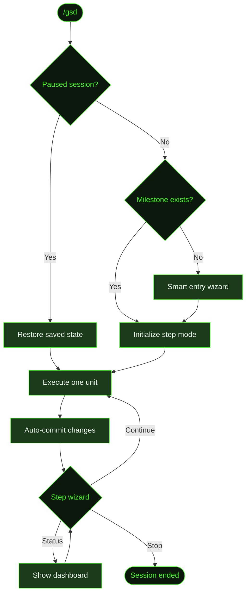

## What It Does

`/gsd` is GSD's primary entry point. It runs in **step mode** — executing one unit of work, then pausing to ask what you'd like to do next. This gives you the same dispatch engine as [`/gsd auto`](../auto/), but with a human decision point between every unit.

If no milestone exists yet, `/gsd` launches the smart entry wizard — a guided conversation that helps you define your first milestone through discussion rather than filling out templates.

Bare `/gsd` is identical to [`/gsd next`](../next/). Both invoke the same code path. The difference is purely about how you think about it: `/gsd` is "start working", `/gsd next` is "give me the next unit."

## Usage

```
/gsd
```

No flags. Same as `/gsd next`.

If auto mode was previously [paused](../pause/), `/gsd` resumes in step mode from where you left off.

## How It Works

Under the hood, `/gsd` runs the same initialization sequence and dispatch engine as [`/gsd auto`](../auto/), but with `step: true`. After each unit completes, execution pauses and a step wizard appears rather than automatically dispatching the next unit.



### Smart entry wizard

If no milestone exists (fresh project or first run after `gsd init`), `/gsd` doesn't ask you to fill out a template. Instead, it launches a guided conversation:

1. Asks about the project — what you're building, what exists already, what the first goal is.
2. Creates a milestone context file from the discussion.
3. Proceeds to research and planning as the first dispatched units.

This means you can go from zero to a running milestone by just typing `/gsd` and talking. If you already have a milestone in a `needs-discussion` state (a `CONTEXT-DRAFT.md` exists but no roadmap yet), the wizard routes to a milestone-level discussion instead.

### The step wizard

After each unit completes and its changes are committed, the step wizard presents three choices:

- **Continue** — dispatch and execute the next unit immediately.
- **Stop** — end the session (same as [`/gsd stop`](../stop/)).
- **Status** — open the [progress dashboard](../status/) to review what's been done, then return to the wizard.

This lets you monitor progress at your own pace. If a unit produces unexpected results, you can stop, inspect, and decide whether to continue.

### What counts as a "unit"

A unit is the smallest dispatchable piece of work. Depending on the project phase, a unit might be:

- A **research** pass (codebase exploration, documentation study)
- A **plan** (slice plan with task breakdown and estimates)
- A **task execution** (implementing a single task from the plan)
- A **summary** (compressing completed work and writing acceptance criteria)
- A **roadmap reassessment** (re-evaluating remaining slices after a slice completes)

The dispatch engine [determines the unit type](../auto/#the-dispatch-loop) by evaluating a declarative table of 15 ordered dispatch rules against the current project state.

## What Files It Touches

Same as [`/gsd auto`](../auto/#what-files-it-touches) — the underlying engine is identical. The only behavioral difference is the pause-and-ask between units.

### Reads

| File | Purpose |
|------|---------|
| `.gsd/STATE.md` | Current project state |
| `.gsd/KNOWLEDGE.md` | Accumulated patterns and gotchas |
| `.gsd/DECISIONS.md` | Architectural decision register |
| `.gsd/milestones/<MID>/<MID>-ROADMAP.md` | Slice ordering and completion status |
| `.gsd/milestones/<MID>/slices/<SID>/<SID>-PLAN.md` | Task breakdown for the active slice |
| `.gsd/milestones/<MID>/slices/<SID>/tasks/<TID>-SUMMARY.md` | Prior task outcomes fed as context |

### Writes

| File | Purpose |
|------|---------|
| `.gsd/STATE.md` | Updated after each unit |
| `.gsd/milestones/<MID>/slices/<SID>/tasks/<TID>-SUMMARY.md` | Written by task executors |
| `.gsd/runtime/` | Session metadata, lock files |
| `.gsd/activity/` | JSONL execution logs |

## Examples

Starting step mode on a Cookmate project:

```
> /gsd

● Deriving project state...
  Active milestone: M001 (Core Recipe Platform)
  Active slice: S02 (Recipe CRUD API)
  Phase: executing
  Next unit: T01 (Build recipe model and migrations)

● Dispatching unit: execute T01
  Type: task-execution
  Est: 25 minutes
  ─────────────────────────────────

  ... agent executes T01 ...

  ✓ T01 complete — 3 files changed, 1 migration created
  ✓ Auto-committed: "T01: Build recipe model and migrations"

● What next?
  ❯ Continue to next unit (T02: Recipe list endpoint)
    Check status
    Stop
```

First run on a fresh project (smart entry wizard):

```
> /gsd

● No milestone found. Let's figure out what to build.

  What are you working on?
> A recipe sharing app called Cookmate — Next.js, Prisma, PostgreSQL.

  What's the first milestone you want to tackle?
> Get the core recipe CRUD working with auth.

● Created milestone M001: Core Recipe Platform
  ✓ Context file written

● Dispatching unit: research (codebase exploration)
  ...
```

## Prompts Used

- [`discuss`](../../prompts/discuss/) — Interactive milestone planning prompt
- [`guided-complete-slice`](../../prompts/guided-complete-slice/) — The interactive counterpart to complete-slice
- [`guided-discuss-milestone`](../../prompts/guided-discuss-milestone/) — An interview-style prompt that surfaces behavioral and architectural unknowns fo…
- [`guided-discuss-slice`](../../prompts/guided-discuss-slice/) — An interview-style prompt that surfaces behavioral, UX, and scope unknowns for a…
- [`guided-execute-task`](../../prompts/guided-execute-task/) — The interactive counterpart to execute-task
- [`guided-plan-milestone`](../../prompts/guided-plan-milestone/) — The interactive counterpart to plan-milestone
- [`guided-plan-slice`](../../prompts/guided-plan-slice/) — The interactive counterpart to plan-slice
- [`guided-research-slice`](../../prompts/guided-research-slice/) — The interactive counterpart to research-slice
- [`guided-resume-task`](../../prompts/guided-resume-task/) — The interactive counterpart to resume-task
- [`system`](../../prompts/system/) — The foundational persona prompt injected into every GSD agent session

## Related Commands

- [`/gsd auto`](../auto/) — Continuous execution without pausing between units
- [`/gsd next`](../next/) — Explicit alias (identical behavior, also supports `--dry-run`)
- [`/gsd discuss`](../discuss/) — Pre-plan a slice with a guided interview before auto mode runs
- [`/gsd status`](../status/) — View progress dashboard
- [`/gsd pause`](../pause/) — Suspend the session with state preservation for later resume
- [`/gsd stop`](../stop/) — Terminate the session
