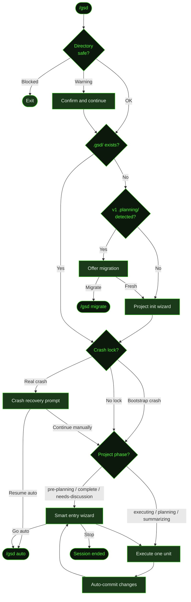

## What It Does

`/gsd` is GSD's primary entry point. It runs in **step mode** — executing one unit of work, then pausing to show a contextual wizard with state-appropriate choices. This gives you the same dispatch engine as [`/gsd auto`](../auto/), but with a human decision point between every unit.

The wizard adapts to wherever you are in the workflow. If you're mid-execution, it shows the next task and offers to execute it, go fully automatic, or view status. If a slice just finished, it offers to complete it. If you need planning, it offers that. At every pause point, milestone-level actions (park, discard, skip) are also available.

If no `.gsd/` directory exists yet, `/gsd` runs a directory safety check, detects whether a v1 `.planning/` directory should be migrated, then launches the project init wizard. If no milestone exists or all milestones are complete, it launches the discuss flow so you can define what to build next. If a previous auto-mode session crashed, it surfaces a crash recovery prompt before the wizard runs.

`/gsd` also serves as the namespace for all GSD subcommands:

```
/gsd auto        /gsd stop          /gsd pause         /gsd discuss
/gsd status      /gsd visualize     /gsd queue         /gsd quick
/gsd capture     /gsd triage        /gsd dispatch      /gsd history
/gsd undo        /gsd skip          /gsd export        /gsd cleanup
/gsd steer       /gsd knowledge     /gsd new-milestone /gsd parallel
/gsd mode        /gsd prefs         /gsd config        /gsd hooks
/gsd run-hook    /gsd skill-health  /gsd doctor        /gsd forensics
/gsd migrate     /gsd remote        /gsd inspect       /gsd update
/gsd park        /gsd unpark        /gsd init          /gsd setup
/gsd keys        /gsd logs          /gsd cmux          /gsd start
/gsd templates   /gsd extensions    /gsd fast          /gsd changelog
/gsd rate        /gsd widget        /gsd next          /gsd workflow
```

Run `/gsd help` for a categorized reference with descriptions.

## Usage

```
/gsd
```

No flags. Identical behavior to `/gsd next`, except that `/gsd next` also supports `--dry-run`, `--verbose`, and `--debug` flags.

If auto mode was previously [paused](../pause/), `/gsd` resumes in step mode from where you left off.

## How It Works

Under the hood, `/gsd` calls the same `startAuto` engine as [`/gsd auto`](../auto/), but with `step: true`. After each unit completes and its changes are committed, execution pauses and the contextual smart entry wizard reappears — showing options appropriate to the current project state.



### Directory safety check

Before doing anything, `/gsd` validates that the working directory is safe to operate in — refusing to run in system or home directories that could cause accidental file changes. Warnings prompt for confirmation; hard blocks exit immediately.

### Session guard

If a `discuss` session is already in flight (e.g., a previous `/gsd` invocation is mid-interview), `/gsd` detects the pending auto-start context and refuses to inject another prompt. This prevents double-injection mid-interview when the user types `/gsd` again before answering a question.

### v1 migration detection

When no `.gsd/` exists, `/gsd` checks whether the project has a v1 `.planning/` directory. If found, it offers to migrate to the `.gsd/` format via [`/gsd migrate`](../migrate/), or start fresh with a clean init.

### Crash recovery

If a previous auto-mode session was interrupted, a crash lock is left on disk. `/gsd` detects this and, for non-trivial crashes (where at least one unit had started), presents a choice:

- **Resume with /gsd auto** — restart auto-mode from where it left off.
- **Continue manually** — clear the lock and open the wizard.

Bootstrap crashes — interrupted before any unit ran — are cleared silently without a prompt, since no work was lost.

The wizard also self-heals stale runtime records: unit records stuck in `dispatched` or `timeout` state, or whose expected artifact already exists, are cleared before dispatch resumes.

### Project init wizard

If no `.gsd/` directory exists at all, `/gsd` runs the project init wizard first. It detects project type, configures GSD, and bootstraps the `.gsd/` tree. It also ensures a git repository exists — initialising one if needed (or if the directory is inside an inherited repo from a parent directory). Once init completes, the normal flow continues — which will detect that no milestones exist and start the discuss prompt.

### Smart entry wizard

`showSmartEntry` is GSD's contextual decision hub. It reads the current project phase from disk and presents options relevant to where you are. The same wizard runs at startup (when no active work exists) and after each unit completes (because step mode loops back to it).

The wizard handles every phase the state machine can be in:

**No milestone / all complete** — Offers to create a new milestone. First-ever run skips the picker and goes straight to "What's the vision?" via the `discuss` prompt. After discussion completes and CONTEXT + ROADMAP are written, auto-mode starts automatically (or step mode, if `/gsd` was the entry point).

**`needs-discussion`** — A `CONTEXT-DRAFT.md` exists but no full context or roadmap yet. Offers to continue from the draft, start fresh, or skip to a new milestone. The draft seeds the discussion so nothing from the previous conversation is lost.

**`pre-planning`** — Context exists but no roadmap. Offers to create a roadmap (`guided-plan-milestone`) or discuss first (`guided-discuss-milestone`). Also allows skipping or discarding the milestone entirely.

**Roadmap exists, no active slice** — Offers to go auto, view status, or take milestone-level actions (park, discard, skip).

**`planning`** — Active slice needs a plan. Offers to plan the slice, discuss it first, or research it first. Shows which of context/research are already present.

**`summarizing`** — All tasks done, slice needs closing. Offers to write the slice summary and UAT.

**Active task / `executing`** — Shows the next task. Offers to execute it (or resume if interrupted), go auto for all remaining work, or view status. Also shows "Milestone actions" to park, discard, or skip at any point.

**`replanning-slice`** — A task surfaced a blocker or a triage replan trigger was written. The wizard shows the next task as if in `executing` phase, but auto-mode routes this phase to a replan unit instead. In step mode, you can manually trigger replan via [`/gsd dispatch replan`](../cli-flags/) or continue executing tasks as-is.

**`validating-milestone` / `completing-milestone`** — All slices are done and the milestone is in its final stages. The wizard falls through to the status view; use [`/gsd auto`](../auto/) or [`/gsd dispatch`](../cli-flags/) to drive these phases forward.

**`blocked`** — Milestone dependency unmet; blocked milestones cannot become active until their dependencies complete. The wizard shows status with blocker details.

**Parked milestones** — Milestones marked with `PARKED` are skipped by the state machine. The `park` / `unpark` commands manage this state.

### The contextual wizard in step mode

After each unit executes and its changes are committed, step mode returns control to the smart entry wizard. The options shown depend on what just finished and what comes next. For example, after a task executes:

- **Execute T02** — start the next task immediately
- **Go auto** — hand off to continuous auto-mode for the rest
- **View status** — open the progress dashboard, then return to the wizard
- **Milestone actions** — park, discard, or skip the active milestone

This lets you monitor progress at your own pace. If a unit produces unexpected results, you can stop, inspect, and decide whether to continue. You can also switch to full auto-mode at any point.

### What counts as a "unit"

A unit is the smallest dispatchable piece of work. Depending on the project phase, a unit might be:

- A **research** pass (codebase exploration, documentation study)
- A **plan** (slice plan with task breakdown and estimates)
- A **task execution** (implementing a single task from the plan)
- A **slice replan** (rewriting remaining tasks after a blocker or triage trigger)
- A **slice completion** (summary, UAT, slice-level commit)
- A **milestone validation** (verification against success criteria)
- A **milestone completion** (milestone summary, squash-merge)
- A **roadmap reassessment** (re-evaluating remaining slices after a slice completes)
- A **hook** (post-unit or pre-dispatch hook configured in preferences)
- A **triage** (processing pending captures before the next dispatch)

The dispatch engine determines the unit type by evaluating a declarative table of ordered dispatch rules against the current project state derived from files on disk.

## What Files It Touches

Same engine as [`/gsd auto`](../auto/) — the underlying dispatch is identical. The only behavioral difference is the pause-and-ask between units.

### Reads

| File | Purpose |
|------|---------|
| `.gsd/STATE.md` | Current project state (cache — rebuilt from disk) |
| `.gsd/KNOWLEDGE.md` | Accumulated patterns and gotchas |
| `.gsd/DECISIONS.md` | Architectural decision register |
| `.gsd/REQUIREMENTS.md` | Requirement contract — active, validated, deferred |
| `.gsd/OVERRIDES.md` | User-issued overrides applied via /gsd steer |
| `.gsd/QUEUE.md` | Queued future milestones |
| `.gsd/PROJECT.md` | Living project description |
| `.gsd/milestones/<MID>/<MID>-CONTEXT.md` | Milestone brief and scope |
| `.gsd/milestones/<MID>/<MID>-CONTEXT-DRAFT.md` | Draft context for unfinished discussion |
| `.gsd/milestones/<MID>/<MID>-ROADMAP.md` | Slice ordering and completion status |
| `.gsd/milestones/<MID>/slices/<SID>/<SID>-PLAN.md` | Task breakdown for the active slice |
| `.gsd/milestones/<MID>/slices/<SID>/tasks/<TID>-SUMMARY.md` | Prior task outcomes fed as context |
| `.gsd/runtime/crash.lock` | Crash lock from a previous interrupted session |

### Writes

| File | Purpose |
|------|---------|
| `.gsd/STATE.md` | Updated after each unit |
| `.gsd/milestones/<MID>/slices/<SID>/tasks/<TID>-SUMMARY.md` | Written by task executors |
| `.gsd/runtime/` | Session metadata, lock files |
| `.gsd/activity/` | JSONL execution logs |

### Creates (first run / on-demand)

| File | Purpose |
|------|---------|
| `.gsd/` | Created by project init wizard if absent |
| `.gsd/PROJECT.md` | Written during first discuss flow |
| `.gsd/REQUIREMENTS.md` | Written during discuss flow |
| `.gsd/DECISIONS.md` | Seeded during discuss flow |
| `.gsd/milestones/<MID>/<MID>-CONTEXT.md` | Milestone context written after discuss |
| `.gsd/milestones/<MID>/<MID>-CONTEXT-DRAFT.md` | Draft written for "Write draft for later" milestones |
| `.gsd/milestones/<MID>/<MID>-ROADMAP.md` | Written after plan-milestone |
| `.gsd/milestones/<MID>/slices/<SID>/<SID>-CONTEXT.md` | Slice context written after slice discuss |
| `.gsd/milestones/<MID>/slices/<SID>/<SID>-RESEARCH.md` | Written after slice research pass |
| `.gsd/DISCUSSION-MANIFEST.json` | Gate-tracking for multi-milestone discussions (deleted on auto-start) |
| `.gitignore` | Baseline GSD patterns added if not present |

## Examples

Starting step mode on a project mid-execution:

```
> /gsd

● Deriving project state...
  Active milestone: M001 (Core Recipe Platform)
  Active slice: S02 (Recipe CRUD API)
  Phase: executing
  Next unit: T01 (Build recipe model and migrations)

● Dispatching unit: execute T01
  Type: task-execution
  Est: 25 minutes
  ─────────────────────────────────

  ... agent executes T01 ...

  ✓ T01 complete — 3 files changed, 1 migration created
  ✓ Auto-committed: "feat(S02/T01): Build recipe model and migrations"

● GSD — M001 / S02: Recipe CRUD API
  Next: T02 — Recipe list endpoint

  ❯ Execute T02
    Go auto
    View status
    Milestone actions
```

First run on a fresh project (init + discuss):

```
> /gsd

● No .gsd/ directory found. Running project init wizard...
  ✓ Detected: Node.js project
  ✓ Bootstrapped .gsd/

● No milestone found. Let's figure out what to build.

  What's the vision?
> A recipe sharing app called Cookmate — Next.js, Prisma, PostgreSQL.
```

After a slice finishes, the wizard offers to complete it:

```
● GSD — M001 / S02: Recipe CRUD API
  All tasks complete. Ready for slice summary.

  ❯ Complete S02
    View status
    Milestone actions
```

Crash recovery on resume:

```
> /gsd

● Interrupted session detected
  Last unit: T03 (Add auth middleware) — interrupted 4 minutes ago

  ❯ Resume with /gsd auto
    Continue manually
```

Milestone with a draft context ready for discussion:

```
> /gsd

● GSD — M002: Sharing & Social
  Draft context from earlier discussion available.

  ❯ Continue from draft (Recommended)
    Start fresh discussion
    Skip — create new milestone
```

## Prompts Used

- [`discuss`](../../prompts/discuss/) — Interactive milestone planning prompt (vision capture, Q&A, requirements, roadmap)
- [`discuss-headless`](../../prompts/discuss-headless/) — Headless milestone creation from a seed specification document
- [`guided-complete-slice`](../../prompts/guided-complete-slice/) — Interactive slice completion (summary + UAT)
- [`guided-discuss-milestone`](../../prompts/guided-discuss-milestone/) — Interview-style prompt for surfacing behavioral and architectural unknowns for a milestone
- [`guided-discuss-slice`](../../prompts/guided-discuss-slice/) — Interview-style prompt for surfacing scope and UX unknowns for a slice
- [`guided-execute-task`](../../prompts/guided-execute-task/) — Interactive task execution
- [`guided-plan-milestone`](../../prompts/guided-plan-milestone/) — Interactive roadmap creation
- [`guided-plan-slice`](../../prompts/guided-plan-slice/) — Interactive slice planning
- [`guided-research-slice`](../../prompts/guided-research-slice/) — Interactive slice research pass
- [`guided-resume-task`](../../prompts/guided-resume-task/) — Resume an interrupted task from its continue-here file
- [`system`](../../prompts/system/) — Foundational persona and hard rules injected into every GSD agent session

## Related Commands

- [`/gsd auto`](../auto/) — Continuous execution without pausing between units
- [`/gsd next`](../next/) — Explicit alias (also supports `--dry-run`, `--verbose`, `--debug`)
- [`/gsd discuss`](../discuss/) — Run a guided slice interview without executing
- [`/gsd status`](../status/) — View progress dashboard
- [`/gsd pause`](../pause/) — Suspend the session with state preservation for later resume
- [`/gsd stop`](../stop/) — Terminate the session
- `/gsd park` — Park a milestone (skip without deleting, reactivate with `/gsd unpark`)
- [`/gsd queue`](../queue/) — Add future milestones to the pipeline
