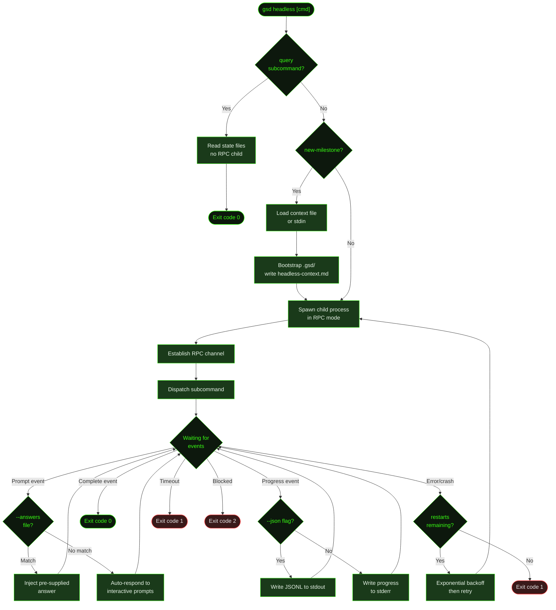

## What It Does

`gsd headless` runs any `/gsd` command without the interactive TUI. It spawns a child process in RPC mode, automatically responds to interactive prompts, detects when the command completes, and exits with a meaningful exit code.

This is GSD's entry point for automation — CI pipelines that run auto-mode on push, cron jobs that execute scheduled maintenance, and scripts that need machine-readable output from GSD commands. Progress is written to stderr; use `--json` to stream structured JSONL events to stdout instead.

## Usage

```bash
gsd headless [subcommand] [flags]
```

Any `/gsd` subcommand works as a positional argument. If no subcommand is given, it defaults to `auto`.

```bash
# Run auto mode (default)
gsd headless

# Run a single unit
gsd headless next

# Check project status
gsd headless status

# Run diagnostics
gsd headless doctor

# Force a specific dispatch phase
gsd headless dispatch plan

# Instant JSON snapshot — no LLM, ~50ms
gsd headless query

# Create a new milestone from a context file and start auto mode
gsd headless new-milestone --context brief.md --auto

# Create a milestone from inline text
gsd headless new-milestone --context-text "Build a REST API with auth"

# Pipe context from stdin
echo "Build a CLI tool" | gsd headless new-milestone --context -
```

## Flags

| Flag | Syntax | Default | Description |
|------|--------|---------|-------------|
| `--timeout` | `--timeout N` | `300000` (5 min) | Overall timeout in milliseconds. The process exits with code `1` if this limit is reached. `new-milestone` auto-extends this to `600000` (10 min) when the timeout is still the default. |
| `--max-restarts` | `--max-restarts N` | `3` | Auto-restart on crash with exponential backoff. Set `0` to disable. |
| `--json` | `--json` | Off | Stream all events as JSONL to stdout. Each line is a self-contained JSON object. |
| `--events` | `--events type1,type2` | — | Filter JSONL output to specific event types. Implies `--json`. |
| `--verbose` | `--verbose` | Off | Show detailed execution output in stderr progress lines. |
| `--model` | `--model ID` | Session default | Override the model for the headless session. |
| `--context` | `--context <file>` | — | Context file for `new-milestone`. Use `-` to read from stdin. |
| `--context-text` | `--context-text <text>` | — | Inline context text for `new-milestone`. |
| `--auto` | `--auto` | Off | Chain into auto-mode after milestone creation. |
| `--answers` | `--answers <file>` | — | JSON file with pre-supplied answers for interactive prompts. See [Answer Injection](#answer-injection) below. |
| `--supervised` | `--supervised` | Off | Enable supervised mode — forward interactive prompts to the orchestrator via stdin/stdout. Implies `--json`. Cannot be combined with `--context -`. |
| `--response-timeout` | `--response-timeout N` | `30000` | In supervised mode, milliseconds to wait for an orchestrator response before falling back to auto-response. |

## Subcommands

### `gsd headless query`

Returns a single JSON object with the full project snapshot — no LLM session, no RPC child, instant response (~50ms). This is the recommended way for orchestrators and scripts to inspect GSD state.

```bash
gsd headless query | jq '.state.phase'
# "executing"

gsd headless query | jq '.next'
# {"action":"dispatch","unitType":"execute-task","unitId":"M001/S01/T03"}

gsd headless query | jq '.cost.total'
# 4.25
```

**Output schema:**

```json
{
  "state": {
    "phase": "executing",
    "activeMilestone": { "id": "M001", "title": "..." },
    "activeSlice": { "id": "S01", "title": "..." },
    "activeTask": { "id": "T01", "title": "..." },
    "nextAction": "Execute T01: Create auth module in slice S01.",
    "registry": [{ "id": "M001", "title": "...", "status": "active" }],
    "progress": {
      "milestones": { "done": 0, "total": 2 },
      "slices": { "done": 1, "total": 3 },
      "tasks": { "done": 2, "total": 5 }
    },
    "blockers": [],
    "requirements": { "active": 4, "validated": 2, "deferred": 0, "outOfScope": 0, "blocked": 0, "total": 6 }
  },
  "next": {
    "action": "dispatch",
    "unitType": "execute-task",
    "unitId": "M001/S01/T01",
    "reason": "Next incomplete task in active slice"
  },
  "cost": {
    "workers": [{ "milestoneId": "M001", "pid": 12345, "state": "running", "cost": 1.50, "lastHeartbeat": 1716000000000 }],
    "total": 1.50
  }
}
```

Fields under `state.progress` (`slices`, `tasks`) are omitted when not applicable (e.g., before slice planning starts). `state.requirements` is omitted when no `REQUIREMENTS.md` exists.

### `gsd headless new-milestone`

Create a new milestone from a context file without the TUI. Combine with `--auto` to immediately start execution after creation.

```bash
# From a file
gsd headless new-milestone --context brief.md

# Inline text
gsd headless new-milestone --context-text "Build a REST API with auth"

# From stdin
echo "Build a CLI tool" | gsd headless new-milestone --context -

# Create and immediately start auto-mode
gsd headless new-milestone --context brief.md --auto
```

The timeout is automatically extended to 10 minutes for `new-milestone` commands when using the default 5-minute timeout, because milestone creation involves codebase investigation and writing multiple planning artifacts. If you pass a custom `--timeout`, it is used as-is.

## How It Works



### RPC Communication

The headless runner spawns GSD with `--mode rpc`, creating a structured communication channel between the parent (headless controller) and child (GSD session) processes. Events flow from the child to the parent as typed messages — prompts, progress updates, completion signals, and errors.

### Auto-Response

When the child process sends an interactive prompt (e.g., confirmation dialogs, next-action choices), the headless controller automatically responds with the recommended action. This keeps execution flowing without human intervention. Quick commands (`status`, `doctor`, `export`, `steer`, etc.) resolve on the first `agent_end` event rather than waiting for a terminal notification.

### Completion Detection

The controller monitors for completion signals — the child process reporting that the dispatched command finished, errored, or hit a blocker. Auto-mode completion is detected by terminal notification messages (`"Auto-mode stopped..."`, `"Step-mode stopped..."`). An idle timeout fires as a fallback: 15 seconds for most commands, 2 minutes for `new-milestone`.

### Auto-Restart

When `--max-restarts` is greater than `0` (default: 3), an error exit triggers an exponential backoff restart — 5 seconds after the first crash, up to a maximum of 30 seconds. SIGINT/SIGTERM interrupts skip the restart and exit immediately.

### Exit Summary

On every exit, headless writes a summary to stderr:

```
[headless] Status: complete
[headless] Duration: 42.3s
[headless] Events: 187 total, 43 tool calls
```

When restarts occurred, a restart count is appended. When `--answers` was used, an injection stats line is appended:

```
[headless] Restarts: 2
[headless] Answers: 5 answered, 1 defaulted, 2 secrets
```

On failure, the last 5 events are also printed to aid diagnostics.

### Answer Injection

`--answers <file>` loads a JSON file with pre-supplied answers for interactive selection prompts. This lets you drive headless sessions through predictable decision trees without supervised mode.

**Answer file format:**

```json
{
  "questions": {
    "question-id": "selected option label",
    "multi-select-id": ["option A", "option B"]
  },
  "secrets": {
    "ENV_VAR_NAME": "secret-value"
  },
  "defaults": {
    "strategy": "first_option"
  }
}
```

- **`questions`** — Map of question ID to the label of the answer to select. Multi-select questions accept an array.
- **`secrets`** — Environment variables injected into the RPC child process (useful for API keys that shouldn't appear in shell history).
- **`defaults.strategy`** — What to do when a question isn't in the file: `"first_option"` (default) selects the first available option; `"cancel"` cancels the prompt.

The injector only handles `select`-type prompts. Confirmations and text inputs are handled by the standard auto-responder.

### Supervised Mode

`--supervised` turns headless into an interactive orchestrator bridge. Rather than auto-responding to every prompt, the headless process forwards `extension_ui_request` events to the outer process via stdout JSONL, and waits for responses on stdin. If no response arrives within `--response-timeout` milliseconds, it falls back to auto-response.

This enables external orchestrators to make real decisions for some prompts while letting the auto-responder handle routine ones.

## Exit Codes

| Code | Meaning | When |
|------|---------|------|
| `0` | Success | Command completed successfully |
| `1` | Error or timeout | Command failed, crashed (and restarts exhausted), or `--timeout` was exceeded |
| `2` | Blocked | Execution hit a blocker requiring human input |

## What Files It Touches

### Creates

| File | Purpose |
|------|---------|
| `.gsd/runtime/headless-context.md` | Temp file written for `new-milestone` — passes the context spec to the RPC child. Deleted by the child after reading. |
| `.gsd/` | Bootstrapped if missing during `new-milestone` |

### Reads

| File | Purpose |
|------|---------|
| `.gsd/` | Checked for existence before spawning RPC child (except `new-milestone`) |
| `--answers <file>` | Answer injection JSON file, if provided |
| `--context <file>` | Context spec for `new-milestone`, or stdin if `-` |

## Examples

Run auto-mode in CI:

```bash
# In a GitHub Actions workflow
gsd headless --timeout 600000 auto
echo "Exit code: $?"
```

Auto-restart on crash (up to 5 times):

```bash
gsd headless --max-restarts 5 auto
```

Get machine-readable status:

```bash
gsd headless --json status 2>/dev/null | jq '.type'
```

Stream only specific event types:

```bash
gsd headless --events tool_execution_start,agent_end auto
```

Run a specific dispatch phase:

```bash
gsd headless dispatch execute
```

Use a different model:

```bash
gsd headless --model claude-sonnet-4-20250514 auto
```

Pre-supply answers for a non-interactive setup wizard:

```bash
gsd headless --answers answers.json new-milestone --context brief.md --auto
```

## Prompts Used

- [`discuss-headless`](../../prompts/discuss-headless/) — Non-interactive milestone creation prompt

## Related Commands

- [`/gsd auto`](../auto/) — Interactive auto-mode (TUI version)
- [`/gsd new-milestone`](../new-milestone/) — Interactive milestone creation
- [CLI Flags](../cli-flags/) — All command-line flags for GSD
- [`/gsd doctor`](../doctor/) — Health checks (can be run headless)
