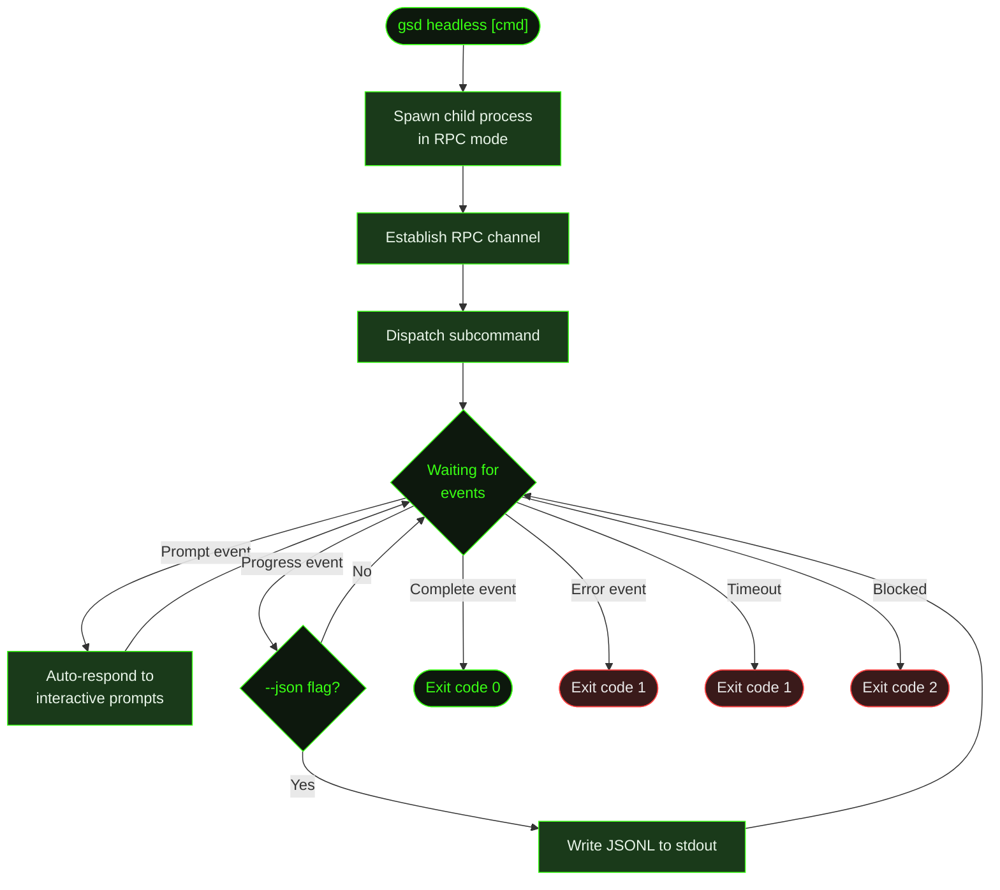

## What It Does

`gsd headless` runs any `/gsd` command without the interactive TUI. It spawns a child process in RPC mode, automatically responds to interactive prompts, detects when the command completes, and exits with a meaningful exit code.

This is GSD's entry point for automation — CI pipelines that run auto-mode on push, cron jobs that execute scheduled maintenance, and scripts that need machine-readable output from GSD commands.

## Usage

```bash
gsd headless [subcommand] [flags]
```

Any `/gsd` subcommand works as a positional argument. If no subcommand is given, it defaults to `auto`.

```bash
# Run auto mode (default)
gsd headless

# Run a single unit
gsd headless next

# Check project status
gsd headless status

# Run diagnostics
gsd headless doctor

# Force a specific dispatch phase
gsd headless dispatch plan
```

## Flags

| Flag | Syntax | Default | Description |
|------|--------|---------|-------------|
| `--timeout` | `--timeout N` | `300000` (5 min) | Overall timeout in milliseconds. The process exits with code `1` if this limit is reached. |
| `--json` | `--json` | Off | Stream all events as JSONL to stdout. Each line is a self-contained JSON object with event type, timestamp, and payload. |
| `--model` | `--model ID` | Session default | Override the model for the headless session. |

## How It Works



### RPC Communication

The headless runner spawns GSD with `--mode rpc`, creating a structured communication channel between the parent (headless controller) and child (GSD session) processes. Events flow from the child to the parent as typed messages — prompts, progress updates, completion signals, and errors.

### Auto-Response

When the child process sends an interactive prompt (e.g., confirmation dialogs, next-action choices), the headless controller automatically responds with the recommended action. This keeps execution flowing without human intervention.

### Completion Detection

The controller monitors for completion signals — the child process reporting that the dispatched command finished, errored, or hit a blocker. Once detected, it tears down the child process and exits.

## Exit Codes

| Code | Meaning | When |
|------|---------|------|
| `0` | Success | Command completed successfully |
| `1` | Error or timeout | Command failed, or `--timeout` was exceeded |
| `2` | Blocked | Execution hit a blocker requiring human input |

## Examples

Run auto-mode in CI:

```bash
# In a GitHub Actions workflow
gsd headless --timeout 600000 auto
echo "Exit code: $?"
```

Get machine-readable status:

```bash
gsd headless --json status 2>/dev/null | jq '.type'
```

Run a specific dispatch phase:

```bash
gsd headless dispatch execute
```

Use a different model:

```bash
gsd headless --model claude-sonnet-4-20250514 auto
```

## Related Commands

- [`/gsd auto`](../auto/) — Interactive auto-mode (TUI version)
- [CLI Flags](../cli-flags/) — All command-line flags for GSD
- [`/gsd doctor`](../doctor/) — Health checks (can be run headless)
