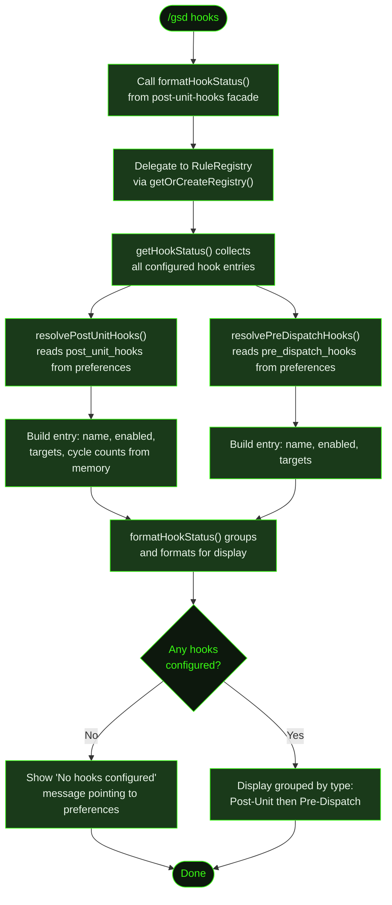

## What It Does

`/gsd hooks` displays a read-only summary of all configured hooks in your project. It shows both **post-unit hooks** (run after a unit completes) and **pre-dispatch hooks** (run before a unit dispatches), along with their enabled/disabled status, target unit types, and active cycle counts.

Hooks are GSD's extensibility mechanism for injecting custom agent work into the auto-mode pipeline. A post-unit hook might run a code review after every task. A pre-dispatch hook might prepend security requirements to every task prompt. `/gsd hooks` lets you see what's configured and whether anything is actively running.

## Usage

```
/gsd hooks
```

No arguments — the command reads hook configuration from preferences and displays a formatted summary.

## How It Works

### Display Flow



The command calls `formatHookStatus()` from the hook engine facade (`post-unit-hooks.ts`), which delegates to the `RuleRegistry` singleton via `getOrCreateRegistry()`. The registry calls `getHookStatus()` to collect all configured hooks and their live cycle counts from in-memory state, then formats them for terminal display.

### Data Collection

1. **Reads post-unit hooks** from `resolvePostUnitHooks()` — these are defined in `.gsd/preferences.md` under `post_unit_hooks`. For each hook, it collects the name, enabled state, target unit types (from the `after` field), and any accumulated cycle counts from the in-memory cycle tracker.

2. **Reads pre-dispatch hooks** from `resolvePreDispatchHooks()` — defined under `pre_dispatch_hooks` in preferences. These have a `before` field listing which unit types they intercept.

3. **Formats the output**, grouping post-unit and pre-dispatch hooks separately. If no hooks are configured, it shows a message pointing to the preferences file.

### Post-Unit Hook Behaviour

Post-unit hooks fire after a core unit completes. When multiple hooks match a unit type, they are all enqueued and run sequentially — each fires in order and completes before the next begins.

The hook engine prevents runaway chains by never triggering hooks for:

- `hook/*` unit types (hook-on-hook)
- `triage-captures` units
- `quick-task` units

Each hook can run multiple times for the same trigger unit, controlled by `max_cycles` (default `1`). Idempotency is enforced via an `artifact` file — if the artifact already exists at the expected path, the hook is skipped entirely.

If a hook produces a `retry_on` artifact instead of the normal artifact, the hook engine signals the caller to re-dispatch the original trigger unit. This allows a hook to force a task to re-run (for example, a review hook flags issues → task re-runs → hook fires again on the next completion). The cycle count is checked before allowing a retry — once `max_cycles` is reached, the retry is suppressed.

**Browser safety injection:** The hook engine automatically appends the following instruction to every post-unit hook prompt before dispatching it:

> **Browser tool safety:** Do NOT use `browser_wait_for` with `condition: "network_idle"` — it hangs indefinitely when dev servers keep persistent connections (Vite HMR, WebSocket). Use `selector_visible`, `text_visible`, or `delay` instead.

Both post-unit and pre-dispatch hook prompts support variable substitution using the trigger unit's context:

| Variable | Resolves to |
|----------|------------|
| `{milestoneId}` | e.g. `M001` |
| `{sliceId}` | e.g. `S01` |
| `{taskId}` | e.g. `T01` |

**Artifact path resolution** is based on the trigger unit's ID depth:

| Unit ID format | Artifact path |
|----------------|--------------|
| `M001/S01/T01` | `.gsd/milestones/M001/slices/S01/tasks/T01-{artifact}` |
| `M001/S01` | `.gsd/milestones/M001/slices/S01/{artifact}` |
| `M001` | `.gsd/milestones/M001/{artifact}` |

### Pre-Dispatch Hook Behaviour

Pre-dispatch hooks intercept a unit before its prompt is sent. Hook units (`hook/*`) are never intercepted. Multiple hooks can match the same unit type and are evaluated in the order they appear in preferences:

- **`modify`** hooks stack — all `prepend`/`append` values are applied sequentially in config order to build up the final prompt.
- **`skip`** short-circuits on first match — the first skip hook encountered cancels the unit entirely. An optional `skip_if` condition file can gate the skip: the unit is only skipped if that file exists at the unit's artifact path.
- **`replace`** short-circuits on first match — the first replace hook encountered swaps the entire unit prompt and optionally overrides the unit type label.

Because iteration is order-based, any `modify` hooks that appear *before* a `skip` or `replace` in the config will still run. Once a skip or replace fires, remaining hooks are bypassed.

### Cycle Persistence

Cycle counts survive crashes and restarts. The engine persists them to `.gsd/hook-state.json` after each hook dispatch and on auto-mode pause, then restores them on resume. On a clean stop, the state file is reset to an empty record.

### Hook Types

| Type | When it runs | Configured in | Key fields |
|------|-------------|---------------|------------|
| Post-unit | After a unit completes | `post_unit_hooks` in preferences | `name`, `after`, `prompt`, `artifact`, `max_cycles`, `retry_on`, `model`, `agent`, `enabled` |
| Pre-dispatch | Before a unit dispatches | `pre_dispatch_hooks` in preferences | `name`, `before`, `action`, `prepend`, `append`, `prompt`, `unit_type`, `skip_if`, `model`, `enabled` |

### Display Fields

For each hook, the display shows:

| Field | Description |
|-------|-------------|
| Name | The hook identifier (e.g., `code-review`, `security-scan`) |
| Status | `enabled` or `disabled` — disabled hooks are skipped during dispatch |
| Targets | Unit types this hook applies to (e.g., `execute-task`, `plan-slice`) |
| Active cycles | Count of distinct trigger keys that have recorded cycles since last reset (post-unit only) |

## What Files It Touches

### Reads

| File | Purpose |
|------|---------|
| `.gsd/preferences.md` | Source of hook configuration (`post_unit_hooks`, `pre_dispatch_hooks`) |
| `.gsd/hook-state.json` | Cycle counts restored into memory during auto-mode startup; reflects accumulated run state |

### Creates / Writes

None — this is a read-only display command.

## Examples

Viewing hooks in a project with a code review hook configured:

```
> /gsd hooks

Configured Hooks:

Post-Unit Hooks (run after unit completes):
  code-review [enabled] → after: execute-task
  lint-check [enabled] → after: execute-task, plan-slice (2 active cycles)

Pre-Dispatch Hooks (run before unit dispatches):
  security-context [enabled] → before: execute-task
```

When a hook is disabled:

```
> /gsd hooks

Configured Hooks:

Post-Unit Hooks (run after unit completes):
  code-review [disabled] → after: execute-task
```

When no hooks are configured:

```
> /gsd hooks

No hooks configured. Add post_unit_hooks or pre_dispatch_hooks
to .gsd/preferences.md
```

## Related Commands

- [`/gsd run-hook`](../run-hook/) — Manually trigger a specific hook, bypassing artifact idempotency checks
- [`/gsd prefs`](../prefs/) — Configure hook settings in preferences
- [`/gsd auto`](../auto/) — Hooks run automatically during auto-mode execution
