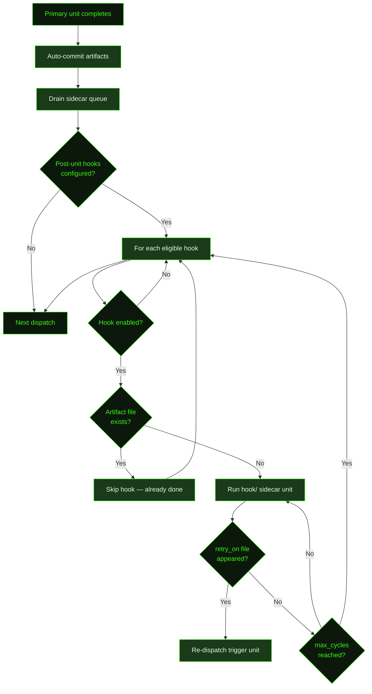

## What It Does

`/gsd hooks` displays every hook configured in your preferences — both post-unit hooks that run after a unit completes and pre-dispatch hooks that intercept units before they start. It shows each hook's name, trigger type, enabled state, and key settings so you can verify your configuration without opening the preferences file.

GSD has two hook systems:

- **Post-unit hooks** fire after a specific unit type completes. They run as lightweight `hook/<name>` sidecar units in the sidecar queue, after the primary unit commits its work. Useful for automated code review, test runs, documentation generation, or any agent-driven step you want after each task.
- **Pre-dispatch hooks** intercept a unit before it starts. They can modify the prompt, skip the unit entirely, or replace the prompt with custom instructions. Useful for injecting coding standards, enforcing skip conditions, or routing units to custom prompt variants.

Both hook types are defined in `.gsd/PREFERENCES.md` under `post_unit_hooks` and `pre_dispatch_hooks`. `/gsd hooks` gives you a live view of what's configured without touching the file.

To manually fire a specific hook outside of auto mode — for testing, debugging, or one-off runs — use [`/gsd run-hook`](#gsd-run-hook).

## Usage

```
/gsd hooks
/gsd run-hook <name>
```

`/gsd hooks` takes no arguments — it renders the current hook table for both hook types.

`/gsd run-hook <name>` takes the hook name as defined in preferences. The name must match exactly.

## How It Works

### Post-unit hooks

Post-unit hooks are configured under `post_unit_hooks` in preferences:

```yaml
post_unit_hooks:
  - name: code-review
    after: [execute-task]
    prompt: "Review {sliceId}/{taskId} for quality and security issues."
    model: claude-opus-4-6          # optional: model override
    max_cycles: 1                   # max fires per trigger (1-10, default: 1)
    artifact: REVIEW.md             # optional: skip if this file exists
    retry_on: NEEDS-REWORK.md       # optional: re-run trigger unit if this file appears
    agent: review-agent             # optional: agent definition to use
    enabled: true                   # optional: disable without removing
```

| Field | Type | Default | Description |
|-------|------|---------|-------------|
| `name` | string | — | Unique hook identifier (used in logs and `/gsd run-hook`) |
| `after` | string[] | — | Unit types that trigger this hook |
| `prompt` | string | — | The prompt given to the hook agent |
| `model` | string | (active model) | Override the model for this hook |
| `max_cycles` | number | `1` | Maximum times this hook can fire per trigger event (1–10) |
| `artifact` | string | (none) | Relative path — if the file exists, the hook is skipped |
| `retry_on` | string | (none) | Relative path — if the file appears after the hook runs, the trigger unit is re-dispatched |
| `agent` | string | (none) | Agent definition to use instead of the default |
| `enabled` | boolean | `true` | Disable without removing the hook definition |

**Prompt substitutions:** `{milestoneId}`, `{sliceId}`, and `{taskId}` are replaced with the current context values when the hook fires.

**Known unit types for `after`:**

| Unit type | When it runs |
|-----------|-------------|
| `research-milestone` | After milestone-level research completes |
| `plan-milestone` | After the milestone ROADMAP is written |
| `research-slice` | After per-slice research completes |
| `plan-slice` | After the slice PLAN is written |
| `execute-task` | After each task execution |
| `complete-slice` | After the slice summary and UAT are written |
| `replan-slice` | After a slice is replanned due to a blocker |
| `reassess-roadmap` | After roadmap reassessment completes |
| `run-uat` | After a UAT run completes |

**Sidecar queue execution:** Post-unit hooks do not block the primary dispatch loop. After a primary unit commits its artifacts, GSD drains the sidecar queue. Each eligible post-unit hook runs as a `hook/<name>` sidecar unit in that queue. When `max_cycles > 1`, the hook can fire multiple times per trigger, stopping when the artifact exists or `max_cycles` is reached.

**Artifact-based skipping and retry:** The `artifact` field lets you make hooks idempotent — if `REVIEW.md` already exists when the hook would fire, the hook is skipped. The `retry_on` field gives you a lightweight blocker mechanism: if the hook agent writes `NEEDS-REWORK.md`, the trigger unit is re-dispatched so the agent can address the feedback before the hook re-runs.

**Dynamic model routing:** When `dynamic_routing.hooks: true` is set (the default when routing is enabled), the model router applies to post-unit hooks — routing them to the `light` tier since they are classification-adjacent rather than implementation work.


```mermaid
flowchart TD
    Primary[Primary unit completes] --> Commit[Auto-commit artifacts]
    Commit --> SidecarDrain[Drain sidecar queue]
    SidecarDrain --> Check{Post-unit hooks\nconfigured?}
    Check -->|No| Next[Next dispatch]
    Check -->|Yes| ForEach[For each eligible hook]
    ForEach --> Enabled{Hook enabled?}
    Enabled -->|No| ForEach
    Enabled -->|Yes| ArtifactCheck{Artifact file\nexists?}
    ArtifactCheck -->|Yes| Skip[Skip hook — already done]
    ArtifactCheck -->|No| Execute[Run hook/<name> sidecar unit]
    Execute --> RetryCheck{retry_on file\nappeared?}
    RetryCheck -->|Yes| Retry[Re-dispatch trigger unit]
    RetryCheck -->|No| Cycles{max_cycles\nreached?}
    Cycles -->|No| Execute
    Cycles -->|Yes| ForEach
    Skip --> ForEach
    ForEach --> Next

    style Primary fill:#0d180d,stroke:#39ff14,color:#39ff14
    style Check fill:#0d180d,stroke:#39ff14,color:#39ff14
    style Enabled fill:#0d180d,stroke:#39ff14,color:#39ff14
    style ArtifactCheck fill:#0d180d,stroke:#39ff14,color:#39ff14
    style RetryCheck fill:#0d180d,stroke:#39ff14,color:#39ff14
    style Cycles fill:#0d180d,stroke:#39ff14,color:#39ff14
    style Commit fill:#1a3a1a,stroke:#39ff14,color:#e8f4e8
    style SidecarDrain fill:#1a3a1a,stroke:#39ff14,color:#e8f4e8
    style ForEach fill:#1a3a1a,stroke:#39ff14,color:#e8f4e8
    style Execute fill:#1a3a1a,stroke:#39ff14,color:#e8f4e8
    style Skip fill:#1a3a1a,stroke:#39ff14,color:#e8f4e8
    style Retry fill:#1a3a1a,stroke:#39ff14,color:#e8f4e8
    style Next fill:#0d180d,stroke:#39ff14,color:#39ff14
```

### Pre-dispatch hooks

Pre-dispatch hooks are configured under `pre_dispatch_hooks` and run before a unit starts — before the agent session is created. Three actions are available:

**Modify** — prepend or append text to the unit prompt without replacing it:

```yaml
pre_dispatch_hooks:
  - name: add-standards
    before: [execute-task]
    action: modify
    prepend: "Follow our TypeScript coding standards."
    append: "Run linting after all changes."
    enabled: true
```

**Skip** — cancel the unit entirely, optionally only when a file exists:

```yaml
pre_dispatch_hooks:
  - name: skip-research
    before: [research-slice]
    action: skip
    skip_if: RESEARCH.md            # only skip if this file already exists
    enabled: true
```

**Replace** — swap the unit prompt with a custom one, optionally changing the model and unit type label:

```yaml
pre_dispatch_hooks:
  - name: tdd-execute
    before: [execute-task]
    action: replace
    prompt: "Implement the task using test-driven development. Write tests first."
    unit_type: execute-task-tdd     # label shown in logs
    model: claude-opus-4-6
    enabled: true
```

All pre-dispatch hooks support `enabled: true/false` to toggle without removing the definition.

### `/gsd run-hook`

`/gsd run-hook <name>` manually triggers a named post-unit hook outside of the normal dispatch loop. This is useful for:

- **Testing a new hook configuration** before enabling it in auto mode
- **Re-running a review** on already-committed work without re-executing the task
- **Debugging hook prompts** — see what the hook produces in isolation

The hook runs with the current milestone/slice/task context, so prompt substitutions (`{milestoneId}`, `{sliceId}`, `{taskId}`) resolve to whatever is currently active. Artifact-based skip logic still applies — if the artifact file already exists, the hook is skipped. Pass a `--force` flag to override skip logic.

## What Files It Touches

`/gsd hooks` and `/gsd run-hook` do not write configuration files — hooks are read from preferences. The hook agents themselves write their outputs to the project directory.

### Reads

| File | Purpose |
|------|---------|
| `~/.gsd/PREFERENCES.md` | Global hook definitions |
| `.gsd/PREFERENCES.md` | Project-local hook definitions (merged with global) |

### Writes (post-unit hook output — varies by hook)

| File | Purpose |
|------|---------|
| Artifact path (e.g. `REVIEW.md`) | Written by the hook agent inside the active slice task directory |
| `.gsd/activity/` | Execution log entry for the hook sidecar unit |

## Examples

Viewing configured hooks:

```
> /gsd hooks

Post-unit hooks (2)
───────────────────────────────────────────
  ✓ code-review
    after: execute-task
    model: claude-opus-4-6
    artifact: REVIEW.md
    max_cycles: 1

  ✓ security-scan
    after: complete-slice
    model: (active)
    artifact: (none)
    max_cycles: 1

Pre-dispatch hooks (1)
───────────────────────────────────────────
  ✓ add-standards
    before: execute-task
    action: modify
    prepend: "Follow our TypeScript coding standards."
```

Running a hook manually to test a new prompt:

```
> /gsd run-hook code-review

● Running hook: code-review
  Context: M001 / S02 / T04
  Prompt: "Review S02/T04 for quality and security issues."
  Model: claude-opus-4-6

  ... hook agent runs ...

  ✓ hook/code-review complete
  ✓ REVIEW.md written
```

Manually re-running a hook on an already-reviewed task (forcing past artifact check):

```
> /gsd run-hook code-review --force

● Running hook: code-review (forced)
  Context: M001 / S02 / T04
  Skipping artifact check — --force passed
  ...
```

A post-unit hook firing automatically during auto mode:

```
● Dispatching unit: execute T03 (Add password reset flow)
  Type: execute-task
  ─────────────────────────────────

  ... agent executes T03 ...

  ✓ T03 complete — 6 files changed
  ✓ Auto-committed

● Sidecar: hook/code-review
  Reviewing T03 for quality and security...

  ✓ hook/code-review complete — REVIEW.md written

● Dispatching unit: execute T04
  ...
```

A post-unit hook triggering a retry via `retry_on`:

```
● Sidecar: hook/code-review
  Reviewing T03...
  ⚠ NEEDS-REWORK.md written — re-dispatching T03

● Dispatching unit: execute T03 (retry — rework requested)
  ...
```

Configuring a full code-review hook with retry logic:

```yaml
post_unit_hooks:
  - name: code-review
    after: [execute-task]
    prompt: |
      Review the changes for {sliceId}/{taskId}.
      Focus on: correctness, security, and style.
      If changes need rework, write NEEDS-REWORK.md with specific issues.
      If changes are acceptable, write REVIEW.md with a brief summary.
    model: claude-opus-4-6
    artifact: REVIEW.md
    retry_on: NEEDS-REWORK.md
    max_cycles: 2
```

## Related Commands

- [`/gsd auto`](../auto/) — Auto mode that runs hooks via the sidecar queue after each unit
- [`/gsd prefs`](../prefs/) — Edit preferences where `post_unit_hooks` and `pre_dispatch_hooks` are configured
- [`/gsd capture`](../capture/) — Fire-and-forget thought capture that also uses the sidecar queue
- [`/gsd steer`](../steer/) — Hard-steer plan documents while auto mode runs
- [`/gsd status`](../status/) — Progress dashboard showing current unit and hook state
