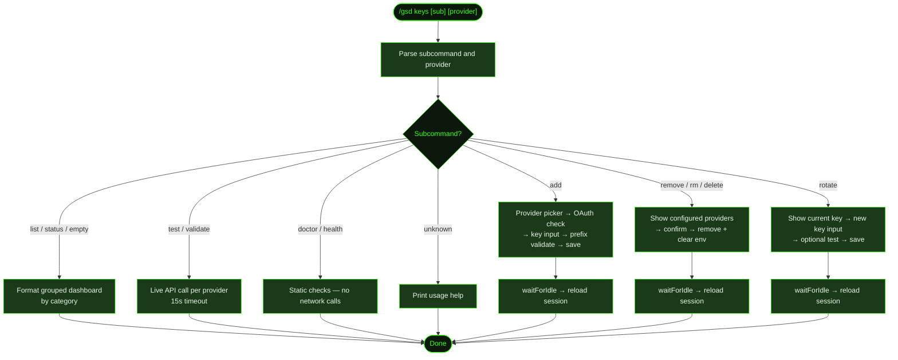

## What It Does

`/gsd keys` manages the API credentials GSD uses to call external services. It covers every category GSD needs: LLM providers, search engines, tool APIs, and remote bot integrations. All keys are stored in `~/.gsd/agent/auth.json` with `600` permissions — the doctor subcommand enforces this automatically.

Keys can come from two sources: `auth.json` (managed by this command) or environment variables (e.g. `ANTHROPIC_API_KEY`). `auth.json` takes priority. When multiple keys are stored for the same provider, GSD uses them in round-robin order. Providers that support OAuth (like Anthropic and GitHub Copilot) show a prompt directing you to use [`/login`](../login/) for browser-based authentication instead.

Keys are always masked in output — only the first 4 and last 4 characters are shown (e.g. `sk-a***cdef`). Keys with 8 or fewer characters show only the first 2 and last 2.

## Usage

```
/gsd keys [subcommand] [provider]
```

With no arguments, shows the full key status dashboard.

```
/gsd keys                      Show key status dashboard
/gsd keys list                 Same as above (aliases: status)
/gsd keys add [provider]       Add a key interactively
/gsd keys remove [provider]    Remove a key (aliases: rm, delete)
/gsd keys test [provider]      Validate key(s) with a live API call (alias: validate)
/gsd keys rotate [provider]    Replace an existing key
/gsd keys doctor               Health check all keys (alias: health)
```

The `provider` argument is optional for all subcommands — omitting it triggers an interactive picker.

## How It Works

### Command Flow



### Subcommands

#### `list` / `status` (default)

Prints a grouped dashboard of all known providers organized by category. Each row shows whether the key is configured, its source (`auth.json` or env), and a masked credential description. Backed-off providers are flagged. Categories are displayed in this order: LLM Providers → Search Providers → Tool Keys → Remote Integrations.

#### `add [provider]`

Prompts for a provider (if not given), then:

1. If the provider supports OAuth, offers a choice between API key and browser login. Choosing "Browser login (OAuth)" shows a message directing you to use `/login` for the full browser authentication flow.
2. Prompts for the API key via text input.
3. Validates the key format against known prefixes (e.g. Anthropic keys must start with `sk-ant-`). If the prefix doesn't match, a warning is shown but the key is saved anyway.
4. Stores the key in `auth.json` and sets the corresponding environment variable in the current process.

After saving, the session reloads so the new credential is immediately active.

#### `remove [provider]` / `rm` / `delete`

Shows only currently configured providers. For providers with a single key, a confirmation dialog is shown before removal. For providers with multiple keys, presents a per-key picker (or "Remove all"). Removes the key from `auth.json` and clears the environment variable.

After removing, the session reloads so the change takes effect immediately.

#### `test [provider]` / `validate`

Makes a live API call to validate the key. Tests all configured providers when no argument is given. Each provider has a specific test endpoint — for example, Anthropic uses `POST /v1/messages` with a minimal payload, OpenAI uses `GET /v1/models`. Results are reported as:

| Status | Meaning |
|--------|---------|
| `valid` | HTTP 200 received |
| `invalid` | HTTP 401 or 403 |
| `rate_limited` | HTTP 429 |
| `error` | Network error, timeout (15s), or unexpected status |
| `skipped` | No test endpoint configured, or key uses credential chain |

#### `rotate [provider]`

Shows only providers with API key credentials. Shows the current masked key, prompts for a new one, then optionally validates it with a live API call before saving. If the new key returns `invalid` (HTTP 401/403), rotation is cancelled. Any other test outcome (`error`, `rate_limited`, `skipped`) shows a warning but proceeds. OAuth credentials for the same provider are preserved when the API key is replaced.

After rotating, the session reloads so the new key is immediately active.

#### `doctor` / `health`

Runs static checks without making network calls:

1. **Permissions** — `auth.json` must be `chmod 600`. Fixes automatically if wrong.
2. **Empty keys** — Flags keys stored as empty strings (from skipped onboarding).
3. **Expired OAuth** — Warns on expired tokens; reports tokens expiring within 5 minutes as info.
4. **Env conflicts** — Warns when `auth.json` and an environment variable hold different values for the same provider (`auth.json` wins).
5. **Backed-off keys** — Flags providers where all keys are in rate-limit backoff, including remaining backoff time if known.
6. **Missing LLM** — Errors if no LLM provider has any credential at all.
7. **Duplicate keys** — Warns if the same key value is registered for multiple providers.

### Provider Registry

| Category | Providers |
|----------|-----------|
| LLM | Anthropic (Claude), OpenAI, GitHub Copilot, ChatGPT Plus/Pro (Codex), Google Gemini CLI, Antigravity, Google (Gemini), Groq, xAI (Grok), OpenRouter, Mistral, Ollama Cloud, Custom (OpenAI-compat), Cerebras, Azure OpenAI |
| Search | Tavily Search, Brave Search |
| Tool | Context7 Docs, Jina Page Extract |
| Remote | Discord Bot, Slack Bot, Telegram Bot |

Providers with OAuth support (Anthropic, GitHub Copilot, ChatGPT Plus/Pro, Google Gemini CLI, Antigravity) redirect to [`/login`](../login/) instead of accepting an API key directly.

### Storage Details

Keys are stored in `~/.gsd/agent/auth.json`. The file is created automatically on first use. Its directory is created with `mkdirSync({ recursive: true })` if missing.

When `auth.json` holds a key, GSD also injects it into the current process's environment (e.g. `process.env.ANTHROPIC_API_KEY = key`) so downstream tooling picks it up without requiring a shell restart.

## What Files It Touches

### Creates

| File | Purpose |
|------|---------|
| `~/.gsd/agent/auth.json` | Credential store — created on first `add` if absent |
| `~/.gsd/agent/` | Directory created if missing |

### Reads

| File | Purpose |
|------|---------|
| `~/.gsd/agent/auth.json` | Existing credentials for list, test, rotate, remove |

### Writes

| File | Purpose |
|------|---------|
| `~/.gsd/agent/auth.json` | Updated on `add`, `remove`, and `rotate` |

## Examples

Show the key status dashboard:

```
> /gsd keys

GSD API Key Manager

  LLM Providers
  ✓ anthropic             — API key (sk-a***cdef)
  ✗ openai                — not configured (platform.openai.com/api-keys)
  ✓ google                — env GEMINI_API_KEY
  …

  Search Providers
  ✗ tavily                — not configured (tavily.com/app/api-keys)
  …

  Source: /Users/you/.gsd/agent/auth.json
  2 configured | 1 in auth.json | 1 from env
```

Add a key interactively:

```
> /gsd keys add openai

API key for OpenAI: [input]
● Key saved for OpenAI: sk-p***7890
```

Add a key for a provider that supports OAuth:

```
> /gsd keys add anthropic

Anthropic (Claude) — how do you want to authenticate?
  ○ API key
  ○ Browser login (OAuth)
```

Choosing "Browser login (OAuth)" shows:

```
Use /login to authenticate via OAuth with Anthropic (Claude).
The /login command handles the full browser flow.
```

Test all configured keys:

```
> /gsd keys test

Testing 3 keys...

API Key Test Results

  ✓ anthropic             — valid  312ms
  ✗ openai                — invalid key (401)  88ms
  — google                — skipped (uses credential chain)

  1 valid | 1 invalid | 1 skipped
```

Run the health check:

```
> /gsd keys doctor

API Key Health Check

  ✓ auth.json permissions were 644 — fixed to 600
  ⚠ OpenAI: empty key stored (from skipped setup) — run /gsd keys add openai
  ✗ No LLM provider configured — run /gsd keys add or /login

  1 error | 1 warning | 1 fixed
```

Rotate a key with validation:

```
> /gsd keys rotate anthropic

Current key: sk-a***cdef
New API key for Anthropic (Claude): [input]
Test key? Validate the new key before saving? [yes]
● Key validated successfully (287ms).
● Key rotated for Anthropic (Claude): sk-a***9999
```

Remove a specific key:

```
> /gsd keys remove openai

Remove API key (sk-p***7890) for OpenAI? [yes]
● Key removed for OpenAI.
```

## Related Commands

- [`/gsd doctor`](../doctor/) — Full GSD health check including key status
- [`/gsd prefs`](../prefs/) — Configure GSD preferences and model settings
- [`/gsd setup`](../setup/) — Global setup status, including `setup keys` shortcut
