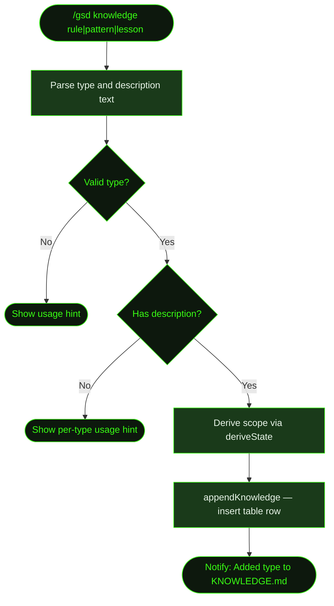

## What It Does

`/gsd knowledge` appends an entry to `.gsd/KNOWLEDGE.md`. This file is injected into both the base system context and each individual unit prompt — research, planning, execution, slice completion, milestone completion, reassess, and more — so rules, patterns, and lessons you add here influence all future agent work without needing to repeat them.

Each entry is typed as a `rule`, `pattern`, or `lesson` and assigned an auto-incrementing ID (`K001`, `P001`, `L001`) scoped to the active milestone and slice. The scope helps future agents understand the context where the knowledge was discovered.

Use `/gsd knowledge` when you discover something that would save time if the next agent knew it — a recurring gotcha, a non-obvious pattern in the codebase, or a constraint that should always be respected.

## Usage

```
/gsd knowledge <type> <description>
```

Where `<type>` is one of:

| Type | Use for |
|------|---------|
| `rule` | Hard constraints — things that must always or never be done |
| `pattern` | Recurring approaches — how to handle a specific category of work |
| `lesson` | One-time discoveries — gotchas, workarounds, non-obvious behavior |

```
/gsd knowledge rule Always use parameterized queries for database access
/gsd knowledge pattern API endpoints follow controller-service-repository layering
/gsd knowledge lesson The CI runner has 4GB RAM — large test suites need splitting
```

## How It Works

### Entry Flow



1. **Parse arguments** — Extracts the type (`rule`, `pattern`, or `lesson`) and the description text. Shows usage help if either is missing or the type is invalid.
2. **Derive scope** — Reads the current project state to determine the active milestone and slice. The scope is formatted as `M001/S01`, `M001`, or `global` if no milestone is active.
3. **Append to KNOWLEDGE.md** — Calls `appendKnowledge()` which inserts a new table row with an auto-incrementing ID into the appropriate section of the file.

### File Structure

`KNOWLEDGE.md` is organized into three typed sections, each with its own table schema. When the file doesn't exist yet, all three sections are created together on first write:

```markdown
# Project Knowledge

Append-only register of project-specific rules, patterns, and lessons learned.
Agents read this before every unit. Add entries when you discover something worth remembering.

## Rules

| # | Scope | Rule | Why | Added |
|---|-------|------|-----|-------|
| K001 | M001/S01 | Always use parameterized queries | — | manual |

## Patterns

| # | Pattern | Where | Notes |
|---|---------|-------|-------|
| P001 | API endpoints follow controller-service-repository layering | — | M001 |

## Lessons Learned

| # | What Happened | Root Cause | Fix | Scope |
|---|--------------|------------|-----|-------|
| L001 | CI runner has 4GB RAM — large test suites need splitting | — | — | M001/S03 |
```

### ID Scheme

Each type has its own auto-incrementing ID prefix:

| Type | Prefix | Example IDs |
|------|--------|-------------|
| `rule` | `K` | K001, K002, K003 |
| `pattern` | `P` | P001, P002, P003 |
| `lesson` | `L` | L001, L002, L003 |

The implementation scans existing entries for the highest current ID and increments by one. IDs never reuse.

### Append-Only Design

Entries are never removed or modified. If a rule becomes obsolete, add a new entry that supersedes it rather than editing the old one. This preserves the full history of what was learned and when.

### How Knowledge Is Used

KNOWLEDGE.md is surfaced to agents in two ways:

**Base system context** — At the start of every agent session, the file is read from disk and injected under a `[PROJECT KNOWLEDGE — Rules, patterns, and lessons learned]` block, appended after preferences and before memory/skills context. This gives every agent session passive awareness of all recorded knowledge.

**Unit prompts** — The file is also inlined directly into the prompt for each unit. Most unit types (research, plan milestone, research slice, plan slice, complete slice, complete milestone, validate milestone, reassess roadmap) use a simple full-file inline. The execute-task prompt uses **smart chunking**: if KNOWLEDGE.md exceeds 3,000 characters, it's truncated at a section boundary rather than cut off mid-entry, with the task and slice titles used as relevance hints.

The following unit types inject KNOWLEDGE.md:

| Unit | Injection method |
|------|-----------------|
| Research milestone | Full file inline |
| Plan milestone | Full file inline |
| Research slice | Full file inline |
| Plan slice | Full file inline |
| Execute task | Smart-chunked (3,000-char threshold, query = task + slice title) |
| Complete slice | Full file inline |
| Complete milestone | Full file inline |
| Validate milestone | Full file inline |
| Reassess roadmap | Full file inline |

Replan-slice and discuss-milestone do not inject KNOWLEDGE.md.

If `.gsd/KNOWLEDGE.md` doesn't exist, both injection points are silently skipped — no error, no empty block. The file only appears in prompts once at least one entry has been added.

## What Files It Touches

### Creates

| File | Purpose |
|------|---------|
| `.gsd/KNOWLEDGE.md` | Created on first entry if it doesn't exist, with all three section headers |

### Reads

| File | Purpose |
|------|---------|
| `.gsd/` directory | Derives active milestone/slice scope via `deriveState()` |
| `.gsd/KNOWLEDGE.md` | Existing content to find the highest ID and append the new row |

### Writes

| File | Purpose |
|------|---------|
| `.gsd/KNOWLEDGE.md` | New table row inserted into the appropriate section |

## Examples

Adding a rule:

```
> /gsd knowledge rule Always use parameterized queries for database access

● Added rule to KNOWLEDGE.md: "Always use parameterized queries for database access"
```

Adding a pattern with active scope:

```
> /gsd knowledge pattern API endpoints follow controller-service-repository layering

● Added pattern to KNOWLEDGE.md: "API endpoints follow controller-service-repository layering"
```

Adding a lesson:

```
> /gsd knowledge lesson The Stripe webhook needs idempotency keys — duplicate events cause double charges

● Added lesson to KNOWLEDGE.md: "The Stripe webhook needs idempotency keys — duplicate events cause double charges"
```

Invalid type — shows usage hint:

```
> /gsd knowledge fix the tests

● Usage: /gsd knowledge <rule|pattern|lesson> <description>
  Example: /gsd knowledge rule Use real DB for integration tests
```

Missing description — shows per-type hint:

```
> /gsd knowledge rule

● Usage: /gsd knowledge rule <description>
```

## Related Commands

- [`/gsd capture`](../capture/) — Quick thought capture (triaged later, not direct knowledge)
- [`/gsd steer`](../steer/) — Override active plans (knowledge is long-term, steer is immediate)
- [`/gsd discuss`](../discuss/) — Discuss before deciding what to record as knowledge
