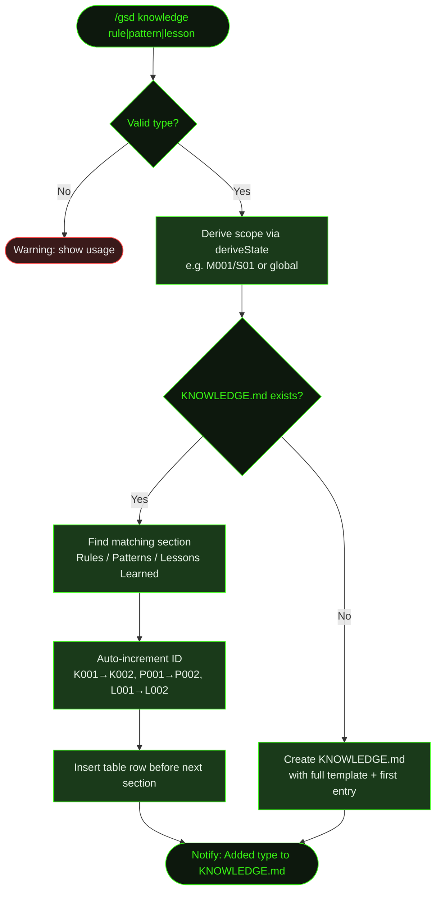

## What It Does

`/gsd knowledge` appends an entry to `.gsd/KNOWLEDGE.md` and tags it with the currently active milestone and slice. Agents read this file before every unit, so anything you record here becomes standing context for all future work.

There are three entry types:

- **rule** — A constraint or policy the agent must follow (`K001`, `K002`, …)
- **pattern** — A recurring design or code approach the agent should apply (`P001`, `P002`, …)
- **lesson** — Something that went wrong and what the fix was (`L001`, `L002`, …)

The scope is derived automatically from the active milestone and slice. If no milestone is active, the entry is tagged `global`.

GSD also supports a second, cross-project knowledge file at `~/.gsd/agent/KNOWLEDGE.md`. Entries there are injected before the project-level file and apply to every project you work on.

## Usage

```
/gsd knowledge <rule|pattern|lesson> <description>
```

Everything after the type keyword is the entry text. Quotes are optional.

```
/gsd knowledge rule Use real DB for integration tests — never SQLite in-memory
/gsd knowledge pattern Middleware chain: auth → validation → handler → response
/gsd knowledge lesson API times out on payloads above 10MB — compress before upload
```

Running the command without a valid type shows usage:

```
/gsd knowledge
→ Usage: /gsd knowledge <rule|pattern|lesson> <description>
   Example: /gsd knowledge rule Use real DB for integration tests
```

Tab completion offers the three subtypes after `/gsd knowledge `.

## How It Works


```mermaid
flowchart TD
    Start(["/gsd knowledge rule|pattern|lesson <text>"]) --> Validate{Valid type?}
    Validate -->|No| Warn([Warning: show usage])
    Validate -->|Yes| Scope[Derive scope via deriveState<br/>e.g. M001/S01 or global]
    Scope --> Exists{KNOWLEDGE.md exists?}
    Exists -->|Yes| Find[Find matching section<br/>Rules / Patterns / Lessons Learned]
    Find --> NextID[Auto-increment ID<br/>K001→K002, P001→P002, L001→L002]
    NextID --> Insert[Insert table row before next section]
    Insert --> Done([Notify: Added type to KNOWLEDGE.md])
    Exists -->|No| Create[Create KNOWLEDGE.md<br/>with full template + first entry]
    Create --> Done

    style Start fill:#0d180d,stroke:#39ff14,color:#39ff14
    style Validate fill:#0d180d,stroke:#39ff14,color:#39ff14
    style Exists fill:#0d180d,stroke:#39ff14,color:#39ff14
    style Warn fill:#3a1a1a,stroke:#ff4444,color:#e8e8e8
    style Scope fill:#1a3a1a,stroke:#39ff14,color:#e8f4e8
    style Find fill:#1a3a1a,stroke:#39ff14,color:#e8f4e8
    style NextID fill:#1a3a1a,stroke:#39ff14,color:#e8f4e8
    style Insert fill:#1a3a1a,stroke:#39ff14,color:#e8f4e8
    style Create fill:#1a3a1a,stroke:#39ff14,color:#e8f4e8
    style Done fill:#0d180d,stroke:#39ff14,color:#39ff14
```

### Entry Format

`KNOWLEDGE.md` has three markdown table sections. Each type uses a different schema:

**Rules** — constraints the agent must follow:
```markdown
## Rules

| # | Scope | Rule | Why | Added |
|---|-------|------|-----|-------|
| K001 | M001/S01 | Use real DB for integration tests | SQLite in-memory hides constraint bugs | manual |
```

**Patterns** — design or code approaches to apply:
```markdown
## Patterns

| # | Pattern | Where | Notes |
|---|---------|-------|-------|
| P001 | Middleware chain: auth → validation → handler | API routes | — |
```

**Lessons Learned** — what went wrong and how it was fixed:
```markdown
## Lessons Learned

| # | What Happened | Root Cause | Fix | Scope |
|---|--------------|------------|-----|-------|
| L001 | API timed out on large payloads | No payload size limit | Compress before upload | M001/S02 |
```

IDs are assigned by scanning the existing file for the highest-numbered entry of the matching prefix (`K`, `P`, or `L`) and incrementing by one. The number is zero-padded to three digits.

When `KNOWLEDGE.md` does not exist, the command creates it from scratch with the full header and all three table sections, placing the first entry in the correct section.

### Scope Derivation

The scope field is set automatically using `deriveState()`:

- If an active milestone and slice are found: `M001/S01`
- If only a milestone is active: `M001`
- If nothing is active: `global`

This lets you look at a knowledge entry later and know exactly where in the project it was discovered.

### System Prompt Injection

KNOWLEDGE.md is injected into every agent system prompt via `loadKnowledgeBlock()` in the `before_agent_start` hook. Two files are merged, in order:

1. **Global knowledge** — `~/.gsd/agent/KNOWLEDGE.md`, injected as `## Global Knowledge`
2. **Project knowledge** — `.gsd/KNOWLEDGE.md`, injected as `## Project Knowledge`

The combined block is wrapped as:

```
[KNOWLEDGE — Rules, patterns, and lessons learned]

## Global Knowledge
...

## Project Knowledge
...
```

If neither file exists, no block is injected. If the global file exceeds 4 KB, GSD shows a warning prompting you to trim it — large knowledge files add cost to every request.

KNOWLEDGE.md is also included in the unit brief that GSD prepares before dispatching each task.

## What Files It Touches

### Creates

| File | Purpose |
|------|---------|
| `.gsd/KNOWLEDGE.md` | Created with full template if it doesn't exist — header, all three sections, and the first entry |

### Reads

| File | Purpose |
|------|---------|
| `.gsd/KNOWLEDGE.md` | Scanned to find the highest-numbered ID for the target type before appending |
| `.gsd/` directory | Scanned by `deriveState()` to determine the active milestone and slice for the scope field |

### Writes

| File | Purpose |
|------|---------|
| `.gsd/KNOWLEDGE.md` | New table row appended in the correct section with auto-incremented ID and derived scope |

## Examples

Adding a rule during active work:

```
> /gsd knowledge rule Use real DB for integration tests — never SQLite in-memory

● Added rule to KNOWLEDGE.md: "Use real DB for integration tests — never SQLite in-memory"
```

The resulting entry in `.gsd/KNOWLEDGE.md`:

```markdown
## Rules

| # | Scope | Rule | Why | Added |
|---|-------|------|-----|-------|
| K001 | M002/S01 | Use real DB for integration tests — never SQLite in-memory | — | manual |
```

Recording a code pattern:

```
> /gsd knowledge pattern Always wrap Supabase calls in a service layer — never call from UI components

● Added pattern to KNOWLEDGE.md: "Always wrap Supabase calls in a service layer..."
```

Recording a lesson after a failed deployment:

```
> /gsd knowledge lesson Build failed because .env.production wasn't committed — keep a secrets manifest

● Added lesson to KNOWLEDGE.md: "Build failed because .env.production wasn't committed..."
```

After several entries, the file looks like:

```markdown
# Project Knowledge

Append-only register of project-specific rules, patterns, and lessons learned.
Agents read this before every unit. Add entries when you discover something worth remembering.

## Rules

| # | Scope | Rule | Why | Added |
|---|-------|------|-----|-------|
| K001 | M002/S01 | Use real DB for integration tests | SQLite hides constraint bugs | manual |
| K002 | M002/S02 | Never mutate shared state across worktrees | Race conditions in parallel mode | manual |

## Patterns

| # | Pattern | Where | Notes |
|---|---------|-------|-------|
| P001 | Service layer wraps all Supabase calls | src/services/ | — |

## Lessons Learned

| # | What Happened | Root Cause | Fix | Scope |
|---|--------------|------------|-----|-------|
| L001 | Build failed in CI | .env.production not committed | Add secrets manifest | M001/S03 |
```

## Related Commands

- [`/gsd steer`](../steer/) — Course correction for active plans; affects plan documents rather than standing knowledge
- [`/gsd capture`](../capture/) — Fire-and-forget thought capture for ideas that need triage before becoming rules
- [`/gsd discuss`](../discuss/) — Explore an architecture decision before committing it to knowledge
- [`/gsd doctor`](../doctor/) — Health checks for the project; surfaces issues that may warrant a knowledge entry
