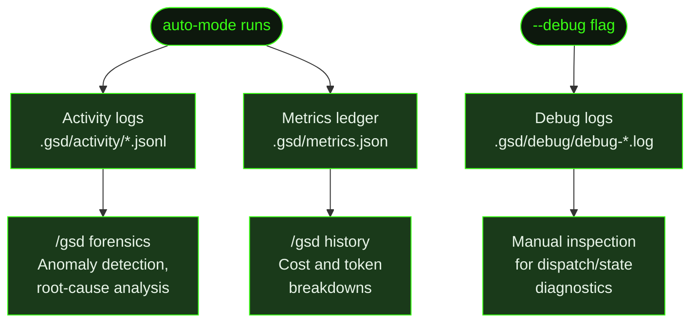

## What It Does

`/gsd logs` is the entry point for browsing the three diagnostic data streams GSD writes during auto-mode execution: **activity logs**, **debug logs**, and the **metrics ledger**. These are the raw data sources that power forensics investigation, cost reporting, and post-mortem analysis.

Each log type serves a different purpose. Activity logs capture the full session transcript for each unit — every tool call, reasoning trace, and file write. Debug logs capture internal timing and dispatch diagnostics when `--debug` mode is enabled. The metrics ledger records cost, token count, and duration for every completed unit.

Understanding where these files live and what they contain is useful when [`/gsd forensics`](../forensics/) doesn't give enough detail, or when you want to understand cost patterns beyond what [`/gsd history`](../history/) shows.

## Usage

```
/gsd logs
```

The command presents an interactive browser for the three log types. You can also reach the same underlying data through more focused commands:

```
/gsd history            # metrics ledger — cost, tokens, duration by unit
/gsd history --cost     # aggregated by slice
/gsd history --phase    # aggregated by phase
/gsd history --model    # aggregated by model
/gsd forensics          # activity log analysis with anomaly detection
```

## How It Works

### The Three Log Types



### Activity Logs

Activity logs live in `.gsd/activity/` and are written automatically during auto-mode — before each context wipe, GSD dumps the full session as JSONL. These are the most detailed diagnostic artifacts: no formatting, no truncation, no information loss.

**File naming:** `<seq>-<unit-type>-<unit-id>.jsonl`

Examples:
- `001-execute-task-M001-S01-T01.jsonl`
- `002-plan-slice-M001-S02.jsonl`
- `003-complete-slice-M001-S01.jsonl`

The sequence number is monotonically increasing across units in the same session. Higher numbers are more recent. Each file is a stream of JSON lines, one per session entry. An entry can be a tool call, a tool result, an assistant message, or a user message.

When running parallel milestones, activity logs are written to the **worktree's** `.gsd/activity/` directory, not the project root. Forensics merges both locations automatically — the top 5 most recent files from each directory are included.

**Retention:** Old activity log files accumulate on disk. Use [`/gsd cleanup`](../cleanup/) to remove them, or configure log retention via preferences. The most recent log for the highest sequence number is always preserved.

### Debug Logs

Debug logs are off by default. Enable them by passing `--debug` when starting auto-mode:

```
/gsd auto --debug
/gsd next --debug
```

Or set the environment variable before launching GSD:

```bash
GSD_DEBUG=1 gsd
```

When enabled, a timestamped JSONL file is created at `.gsd/debug/debug-<timestamp>.log`. GSD keeps a maximum of 5 debug log files and prunes older ones when a new session starts with `--debug`.

Each line is a structured JSON event:
```json
{ "ts": "2026-03-19T10:30:00.000Z", "event": "derive-state-impl", "elapsed_ms": 12.4, "phase": "executing", "milestone": "M001" }
```

The debug log captures:
- State derivation timing and results
- Dispatch decisions and unit selections
- Token-to-size-ratio checks (context pressure monitoring)
- Roadmap and plan parse timings
- Dashboard render timings

A summary is written as the final entry when auto-mode stops, showing aggregate counters: total elapsed time, number of dispatches, average `deriveState` duration, average token-to-size-ratio check duration, peak buffer size, and total renders.

### Metrics Ledger

The metrics ledger at `.gsd/metrics.json` records one entry per completed unit. It persists across sessions — when auto-mode starts, it loads the ledger from disk and appends new units to it.

Each unit record contains:

| Field | Description |
|-------|-------------|
| `type` | Unit type (e.g. `execute-task`, `plan-slice`) |
| `id` | Unit ID (e.g. `M001/S01/T01`) |
| `model` | Model used for this unit |
| `startedAt` | Start timestamp (ms) |
| `finishedAt` | Finish timestamp (ms) |
| `tokens.input` | Input tokens |
| `tokens.output` | Output tokens |
| `tokens.cacheRead` | Cache-read tokens |
| `tokens.cacheWrite` | Cache-write tokens |
| `tokens.total` | Total tokens |
| `cost` | Total USD cost |
| `toolCalls` | Number of tool calls made |
| `tier` | Complexity tier (`light`/`standard`/`heavy`) if dynamic routing is active |
| `modelDowngraded` | `true` if dynamic routing used a cheaper model than configured |

The `/gsd history` command is the primary way to read the metrics ledger. The dashboard overlay (`/gsd status`) also reads it for the Cost & Usage section.

### Log Locations

| Location | Log Type | When Written |
|----------|----------|--------------|
| `.gsd/activity/*.jsonl` | Activity logs | Before each context wipe in auto-mode |
| `.gsd/worktrees/<MID>/.gsd/activity/*.jsonl` | Activity logs (parallel) | Same, but scoped to a worktree |
| `.gsd/metrics.json` | Metrics ledger | After each unit completes |
| `.gsd/debug/debug-<timestamp>.log` | Debug logs | When `--debug` flag or `GSD_DEBUG=1` is set |

## What Files It Touches

### Reads

| File | Purpose |
|------|---------|
| `.gsd/activity/*.jsonl` | Activity logs for all completed units |
| `.gsd/worktrees/<MID>/.gsd/activity/*.jsonl` | Worktree activity logs (parallel mode) |
| `.gsd/metrics.json` | Metrics ledger |
| `.gsd/debug/debug-*.log` | Debug diagnostic logs |

### Creates

None — `/gsd logs` is read-only.

## Examples

Browsing the metrics ledger via `/gsd history`:

```
> /gsd history

Last 20 of 47 units | Total: $14.22 · 2.4M tokens

Time           Type                ID               Model         Cost       Tokens     Duration
──────────────────────────────────────────────────────────────────────────────────────────────
2m ago         execute-task        M001/S02/T03     sonnet-4-6    $0.31      48K        8m 12s
18m ago        execute-task        M001/S02/T02     sonnet-4-6    $0.27      41K        6m 44s
31m ago        plan-slice          M001/S02         sonnet-4-6    $0.18      29K        3m 02s
```

Cost breakdown by slice:

```
> /gsd history --cost

Cost by slice:

Slice            Units    Cost       Tokens
──────────────────────────────────────────
M001/S01         8        $3.41      512K
M001/S02         4        $1.20      189K
M001/S03         2        $0.58      91K
```

Inspecting an activity log directly (most recent first):

```bash
ls -lt .gsd/activity/ | head -5
cat .gsd/activity/047-execute-task-M001-S02-T03.jsonl | python3 -m json.tool | head -50
```

Enabling debug logging for a single unit:

```
> /gsd next --debug

● Debug logging enabled: .gsd/debug/debug-2026-03-19T10-30-00-000Z.log
```

After the unit completes:

```bash
cat .gsd/debug/debug-2026-03-19T10-30-00-000Z.log | python3 -c "
import sys, json
for line in sys.stdin:
    e = json.loads(line)
    print(f'{e[\"event\"]}: {e.get(\"elapsed_ms\", \"\")}ms')
"
```

Running a deep investigation on a failing session:

```
> /gsd forensics auto-mode got stuck on T03
```

## Related Commands

- [`/gsd history`](../history/) — Tabular view of the metrics ledger with cost/phase/model breakdowns
- [`/gsd forensics`](../forensics/) — Deep activity log analysis with anomaly detection and LLM investigation
- [`/gsd status`](../status/) — Live dashboard including cost totals from the metrics ledger
- [`/gsd doctor`](../doctor/) — Structural health checks (reads planning files, not activity logs)
