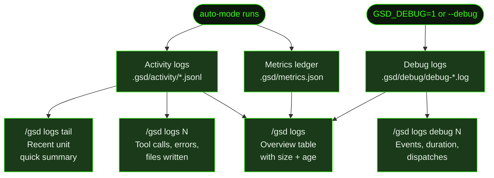

## What It Does

`/gsd logs` gives you a live index of everything GSD has recorded: activity logs, debug logs, and a summary of the metrics ledger. It's the starting point for any diagnostic investigation — run it to see what's been captured, then drill into specific entries to understand what happened inside a unit.

Unlike [`/gsd forensics`](../forensics/), which uses an LLM to investigate anomalies, `/gsd logs` is purely mechanical: it reads the raw data and presents it. Use it when you want to browse what exists, spot an unexpected error count, or quickly check how much a session cost. Use forensics when you need to understand *why* something went wrong.

GSD writes three diagnostic data streams automatically during auto-mode:

- **Activity logs** (`.gsd/activity/*.jsonl`) — Full session transcript for each unit: every tool call, tool result, and assistant message. Written before each context wipe.
- **Debug logs** (`.gsd/debug/debug-*.log`) — Internal timing and dispatch diagnostics. Only written when debug mode is enabled.
- **Metrics ledger** (`.gsd/metrics.json`) — Cost, token count, and duration for every completed unit. Persists across sessions.

## Usage

```
/gsd logs              # Overview: activity logs, debug logs, metrics summary
/gsd logs <N>          # Detailed summary of activity log #N
/gsd logs tail [N]     # Show last N activity log entries (default 5)
/gsd logs debug        # List debug log files
/gsd logs debug <N>    # Show detailed summary of debug log #N
/gsd logs clear        # Remove old activity and debug logs
```

## How It Works

### Overview (`/gsd logs`)

The default view shows three sections:

1. **Activity Logs** — A table of the 15 most recent `.jsonl` files, showing sequence number, unit type, unit ID, file size, and age. If there are more than 15, the count of older entries is shown below the table.
2. **Debug Logs** — Listed only when present. Each entry shows the filename, size, and age.
3. **Metrics summary** — A one-line count of total units tracked, cumulative cost, and total tokens from the metrics ledger.



### Activity Log Detail (`/gsd logs <N>`)

Pass the sequence number from the overview table to drill into a specific unit's log:

- File path, size, and age
- Total entry count, tool call count, and error count
- Files written or edited during the unit (up to 10)
- Bash commands run, flagged if they failed (up to 10)
- Last reasoning excerpt (up to 200 characters)

**File naming:** `<seq>-<unit-type>-<unit-id>.jsonl`

Examples:
- `001-execute-task-M001-S01-T01.jsonl`
- `002-plan-slice-M001-S02.jsonl`
- `003-complete-slice-M001-S01.jsonl`

The sequence number is monotonically increasing across units in the same session. Higher numbers are more recent. Each file is a stream of JSON lines — one per session entry — representing tool calls, tool results, assistant messages, and user messages.

**Deduplication:** GSD skips writing a log file if the session content hasn't changed since the last write for that unit. It uses a lightweight fingerprint — entry count plus a hash of the last three entries — to detect identical sessions without serializing potentially hundreds of megabytes.

When running parallel milestones, activity logs are written to the **worktree's** `.gsd/activity/` directory, not the project root. Forensics merges both locations automatically — the top 5 most recent files from each directory are included.

### Tail (`/gsd logs tail [N]`)

Shows a one-line summary for each of the last N activity logs (default 5, max 20):

```
#<seq> <unitType> <unitId> — <toolCalls> tools, <ok|N err>, <age>
```

Useful for a quick health check after a long auto-mode session.

### Debug Logs (`/gsd logs debug` / `/gsd logs debug <N>`)

Debug logging is off by default. Enable it with the `GSD_DEBUG=1` environment variable or the `--debug` flag:

```
GSD_DEBUG=1 gsd auto
GSD_DEBUG=1 gsd next
/gsd auto --debug
/gsd next --debug
```

When enabled, a timestamped log file is created at `.gsd/debug/debug-<timestamp>.log`. GSD keeps a maximum of 5 debug log files, pruning the oldest when a new session starts.

Each log line is a structured JSON event:

```json
{ "ts": "2026-03-19T10:30:00.000Z", "event": "derive-state-impl", "elapsed_ms": 12.4, "phase": "executing", "milestone": "M001" }
```

The debug log captures state derivation timing, dispatch decisions, token-to-size-ratio (TTSR) checks, roadmap and plan parse timings, and dashboard render timings.

`/gsd logs debug <N>` shows a summary for the Nth debug log (1-indexed, oldest-first):

- File size and age
- Total event count, session duration, and dispatch count
- Any error or failure events captured (up to 10, shown as `[event] message`)

A `debug-summary` event is written as the final entry when auto-mode stops:

| Counter | Description |
|---------|-------------|
| `totalElapsed_ms` | Wall-clock time for the entire session |
| `dispatches` | Number of units dispatched |
| `deriveStateCalls` / `avgDeriveState_ms` | State derivation call count and average duration |
| `parseRoadmapCalls` / `avgParseRoadmap_ms` | Roadmap parse call count and average duration |
| `parsePlanCalls` | Plan parse call count |
| `ttsrChecks` / `avgTtsrCheck_ms` | Token-to-size-ratio check count and average duration |
| `ttsrPeakBuffer` | Peak buffer size observed during TTSR checks |
| `renders` | Total dashboard renders |

### Clearing Logs (`/gsd logs clear`)

Removes old log files using a tiered retention policy:

- **Activity logs**: Keeps the 5 most recent files. Removes any older files that are more than 7 days old.
- **Debug logs**: Keeps the 2 most recent files. Removes any older files that are more than 3 days old.

If nothing is old enough to remove, reports "No old logs to clear."

### Metrics Ledger

The metrics ledger at `.gsd/metrics.json` records one entry per completed unit. It persists across sessions — when auto-mode starts, it loads the ledger from disk and appends new units to it.

Each unit record contains:

| Field | Description |
|-------|-------------|
| `type` | Unit type (e.g. `execute-task`, `plan-slice`) |
| `id` | Unit ID (e.g. `M001/S01/T01`) |
| `model` | Model used for this unit |
| `startedAt` | Start timestamp (ms) |
| `finishedAt` | Finish timestamp (ms) |
| `tokens.input` | Input tokens |
| `tokens.output` | Output tokens |
| `tokens.cacheRead` | Cache-read tokens |
| `tokens.cacheWrite` | Cache-write tokens |
| `tokens.total` | Total tokens |
| `cost` | Total USD cost |
| `toolCalls` | Number of tool calls made |
| `assistantMessages` | Number of assistant messages in the session |
| `userMessages` | Number of user messages in the session |
| `apiRequests` | Total API requests made (each assistant message = one request) |
| `cacheHitRate` | Cache hit rate as a percentage (0–100), computed from `cacheRead / (cacheRead + input)` |
| `tier` | Complexity tier (`light`/`standard`/`heavy`) if dynamic routing is active |
| `modelDowngraded` | `true` if dynamic routing used a cheaper model than configured |
| `contextWindowTokens` | Context window token count at unit close (if budget tracking is active) |
| `truncationSections` | Number of sections truncated for context management |
| `continueHereFired` | `true` if a continue-here checkpoint fired during this unit |
| `promptCharCount` | Character count of the unit prompt |
| `baselineCharCount` | Character count of the baseline context |
| `skills` | Skill names loaded/available during this unit |
| `compressionSavings` | Character savings from prompt compression as a percentage (0–100) |

Phase classification for `/gsd history --phase` grouping:

| Phase | Unit Types |
|-------|-----------|
| `research` | `research-milestone`, `research-slice` |
| `planning` | `plan-milestone`, `plan-slice` |
| `execution` | `execute-task` |
| `completion` | `complete-slice` |
| `reassessment` | `reassess-roadmap` |

The [`/gsd history`](../history/) command is the primary way to read the metrics ledger. The dashboard overlay ([`/gsd status`](../status/)) also reads it for the Cost & Usage section.

### Log Locations

| Location | Log Type | When Written |
|----------|----------|--------------|
| `.gsd/activity/*.jsonl` | Activity logs | Before each context wipe in auto-mode |
| `.gsd/worktrees/<MID>/.gsd/activity/*.jsonl` | Activity logs (parallel) | Same, but scoped to a worktree |
| `.gsd/metrics.json` | Metrics ledger | After each unit completes |
| `.gsd/debug/debug-<timestamp>.log` | Debug logs | When debug mode is enabled |

## What Files It Touches

### Reads

| File | Purpose |
|------|---------|
| `.gsd/activity/*.jsonl` | Activity logs for all completed units |
| `.gsd/worktrees/<MID>/.gsd/activity/*.jsonl` | Worktree activity logs (parallel mode) |
| `.gsd/metrics.json` | Metrics ledger — unit count, cost, token totals |
| `.gsd/debug/debug-*.log` | Debug diagnostic logs |

### Deletes

| File | Purpose |
|------|---------|
| `.gsd/activity/*.jsonl` | Old activity logs removed by `/gsd logs clear` (>7 days old, beyond 5 most recent) |
| `.gsd/debug/debug-*.log` | Old debug logs removed by `/gsd logs clear` (>3 days old, beyond 2 most recent) |

## Examples

Running the overview:

```
> /gsd logs

Activity Logs (.gsd/activity/):
  #   Unit Type         Unit ID              Size    Age
  ──────────────────────────────────────────────────────────────────────────
   45 execute-task       M001/S02/T03          82.4KB  2m ago
   44 execute-task       M001/S02/T02          71.1KB  18m ago
   43 plan-slice         M001/S02              38.8KB  31m ago
  ... and 40 older entries

  View details: /gsd logs <#>

Metrics: 47 units tracked · $14.22 · 2400K tokens

Tip: Enable debug logging with GSD_DEBUG=1 before /gsd auto
```

Drilling into a specific activity log:

```
> /gsd logs 45

Activity Log #45: execute-task — M001/S02/T03
────────────────────────────────────────────────────────────
File: 045-execute-task-M001-S02-T03.jsonl
Size: 82.4KB  |  Age: 2m ago
Entries: 214  |  Tool calls: 38  |  Errors: 1

Files written/edited:
  /Users/me/project/src/api/routes.ts
  /Users/me/project/src/api/handlers.ts
  /Users/me/project/tests/api.test.ts

Commands run:
  npm run lint
  npm test -- --testPathPattern=api FAILED

1 error(s) encountered during this unit.

Last reasoning:
  "The test failure is due to a missing mock for the database connection. I'll add..."

Full log: /Users/me/project/.gsd/activity/045-execute-task-M001-S02-T03.jsonl
```

Quick health check with tail:

```
> /gsd logs tail 3

Last 3 activity log(s):

  #45 execute-task M001/S02/T03 — 38 tools, 1 err, 2m ago
  #44 execute-task M001/S02/T02 — 31 tools, ok, 18m ago
  #43 plan-slice M001/S02 — 14 tools, ok, 31m ago
```

Listing debug logs after a session with debug enabled:

```
> /gsd logs debug

Debug Logs (.gsd/debug/):

  1. debug-2026-03-19T10-30-00-000Z.log  48.2KB  2h ago
  2. debug-2026-03-22T14-15-30-000Z.log  12.1KB  3m ago

View details: /gsd logs debug <#>
```

Inspecting a debug log summary:

```
> /gsd logs debug 2

Debug Log: debug-2026-03-22T14-15-30-000Z.log
────────────────────────────────────────────────────────────
Size: 12.1KB  |  Age: 3m ago
Events: 312  |  Duration: 8m  |  Dispatches: 1

Full log: /Users/me/project/.gsd/debug/debug-2026-03-22T14-15-30-000Z.log
```

Clearing old logs:

```
> /gsd logs clear

Cleared 38 activity log(s) and 1 debug log(s).
```

Inspecting an activity log directly (when you need raw JSONL):

```bash
cat .gsd/activity/045-execute-task-M001-S02-T03.jsonl | python3 -m json.tool | head -50
```

Running a deep investigation on a failing session:

```
> /gsd forensics auto-mode got stuck on T03
```

## Related Commands

- [`/gsd history`](../history/) — Tabular view of the metrics ledger with cost/phase/model breakdowns
- [`/gsd forensics`](../forensics/) — Deep activity log analysis with anomaly detection and LLM investigation
- [`/gsd status`](../status/) — Live dashboard including cost totals from the metrics ledger
- [`/gsd doctor`](../doctor/) — Structural health checks (reads planning files, not activity logs)
- [`/gsd cleanup`](../cleanup/) — Archive completed phase directories (separate from log retention)
