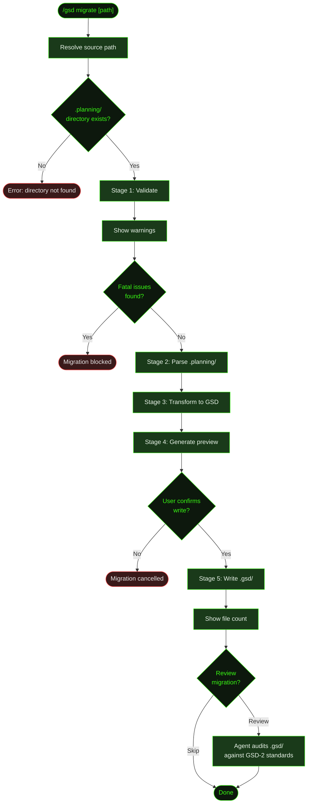

## What It Does

`/gsd migrate` converts a legacy `.planning/` directory (from older GSD versions) into the current `.gsd/` format. It runs a 5-stage pipeline — validate, parse, transform, preview, write — with a confirmation step before any files are created. After writing, it optionally dispatches an agent-driven review that audits the output for GSD-2 standards compliance.

This is a one-shot migration command. You run it once to bring a project forward from the old directory structure, then continue working with `/gsd auto` or `/gsd next` as normal.

## Usage

```
/gsd migrate [path]
```

| Argument | Description | Default |
|----------|-------------|---------|
| `path` | Path to the directory containing `.planning/` | Current directory (`.`) |

The path can be relative or absolute. If it doesn't end with `.planning`, the command appends it automatically. Tilde expansion (`~/projects/myapp`) is supported.

## How It Works



### Stage 1: Validate

Scans the `.planning/` directory for structural issues. Issues are classified as **warnings** (non-blocking) or **fatals** (block migration). The only fatal issue is a missing or non-existent `.planning/` directory — everything else is a warning. Warnings are displayed to the user before proceeding; they indicate reduced data quality but never halt migration.

| Issue | Severity |
|-------|----------|
| `.planning/` directory missing or not a directory | Fatal |
| `ROADMAP.md` missing (milestone structure inferred from `phases/`) | Warning |
| `PROJECT.md` missing (metadata will be empty) | Warning |
| `REQUIREMENTS.md` missing (requirements will be empty) | Warning |
| `STATE.md` missing (state information will be empty) | Warning |
| `phases/` directory missing (no phase data parsed) | Warning |

### Stage 2: Parse

Reads the `.planning/` directory into a typed in-memory representation. The parser handles all subdirectories and file naming conventions used by older GSD versions:

- **Top-level files** — `PROJECT.md`, `ROADMAP.md`, `REQUIREMENTS.md`, `STATE.md`, `config.json`
- **`phases/NN-slug/`** — directories named `NN-slug` (e.g., `29-auth-system`) or `NN.N-slug` (decimal for inserted phases). Within each phase: plan files (`29-01-PLAN.md`), summary files (`29-01-SUMMARY.md`), research files (any file matching `research`), and verification files (any file matching `verification`)
- **`quick/NNN-slug/`** — quick task directories with `NNN-PLAN.md` and `NNN-SUMMARY.md`
- **`milestones/`** — milestone-level files like `v2.2-ROADMAP.md` and `v2.2-REQUIREMENTS.md`
- **`research/`** — top-level research files

Roadmap parsing handles three formats: flat phase checklists, `## vN.N — Title` heading-sectioned milestones, and `<details><summary>` collapsed milestone blocks.

Missing files produce `null` values — they are never errors at this stage.

### Stage 3: Transform

Converts the parsed v1 structure into GSD-2 format. The transformer operates in one of three modes based on what the roadmap contains:

| Roadmap content | Transform mode |
|-----------------|----------------|
| Milestone sections (`## v2.0 —` or `<details>`) | One `GSDMilestone` per roadmap section |
| Flat phase list | Single `M001` milestone containing all phases as slices |
| No roadmap / empty | Phases enumerated from filesystem, all marked not-done |

Within each milestone, **phases become slices** and **plan files become tasks**:

| v1 (`.planning/`) | GSD-2 (`.gsd/`) |
|---|---|
| Roadmap milestone section | `milestones/M001/` directory |
| `ROADMAP.md` milestone entries | `M001-ROADMAP.md` |
| `phases/NN-slug/` directory | `slices/S01/` directory |
| `NN-NN-PLAN.md` (plan file) | `T01-PLAN.md` (task plan) |
| `NN-NN-SUMMARY.md` (summary file) | `T01-SUMMARY.md` (task summary) |
| Phase research files | `S01-RESEARCH.md` |
| `research/` top-level files | `M001-RESEARCH.md` |
| `REQUIREMENTS.md` | `REQUIREMENTS.md` |
| `PROJECT.md` | `PROJECT.md` |
| `STATE.md` | `STATE.md` (stub — recomputed by `deriveState()`) |
| Key decisions from phase summaries | `DECISIONS.md` |

Requirement statuses from the old format are normalized: `complete`, `completed`, `done`, and `shipped` all map to `validated`. Unrecognised statuses default to `active`.

### Stage 4: Preview

Generates a summary of what will be written:

- Milestone count
- Slice count with completion percentage
- Task count with completion percentage
- Requirement count with status breakdown (validated, active, deferred, out-of-scope) — only shown if requirements exist
- Warning if a `.gsd/` directory already exists in the current working directory (it will be overwritten)

The preview is shown via an interactive confirmation UI. You can proceed or cancel.

### Stage 5: Write

Creates the `.gsd/` directory and writes all transformed files. Reports the total file count on completion.

For fully-completed milestones (all slices done), the writer also produces a `M001-VALIDATION.md` stub (so `deriveState()` doesn't enter the validating-milestone phase for historical milestones) and a `M001-SUMMARY.md` stub. Research and summary files are skipped when `null` — no empty stubs are written.

### Optional Agent Review

After writing, the command offers to dispatch an agent-driven review. The agent audits the migrated output against GSD-2 standards — checking structure, content quality, `deriveState()` round-trip integrity, and requirement statuses. It fixes minor issues in-place and reports PASS/FAIL per category.

## What Files It Touches

### Reads

| File | Purpose |
|------|---------|
| `.planning/PROJECT.md` | Project description |
| `.planning/ROADMAP.md` | Milestone and phase structure |
| `.planning/REQUIREMENTS.md` | Requirements list |
| `.planning/STATE.md` | Current execution state |
| `.planning/config.json` | Project config (optional) |
| `.planning/phases/NN-slug/*.md` | Phase plan and summary files |
| `.planning/quick/NNN-slug/*.md` | Quick task files |
| `.planning/milestones/*.md` | Milestone-level roadmaps and requirements |
| `.planning/research/*.md` | Top-level research files |

### Creates

| File | Purpose |
|------|---------|
| `.gsd/PROJECT.md` | Project description (pass-through or stub) |
| `.gsd/STATE.md` | Minimal stub — recomputed by `deriveState()` on first run |
| `.gsd/DECISIONS.md` | Key decisions aggregated from phase summaries |
| `.gsd/REQUIREMENTS.md` | Migrated requirements, grouped by status |
| `.gsd/milestones/M001/M001-ROADMAP.md` | Milestone roadmap with slice checklist |
| `.gsd/milestones/M001/M001-CONTEXT.md` | Minimal context stub |
| `.gsd/milestones/M001/M001-RESEARCH.md` | Consolidated research (only if research exists) |
| `.gsd/milestones/M001/M001-VALIDATION.md` | Pass-through validation stub (completed milestones only) |
| `.gsd/milestones/M001/M001-SUMMARY.md` | Milestone summary stub (completed milestones only) |
| `.gsd/milestones/M001/slices/S01/S01-PLAN.md` | Slice plan with task list |
| `.gsd/milestones/M001/slices/S01/S01-SUMMARY.md` | Slice summary (only if slice is done) |
| `.gsd/milestones/M001/slices/S01/S01-RESEARCH.md` | Per-slice research (only if research exists) |
| `.gsd/milestones/M001/slices/S01/tasks/T01-PLAN.md` | Task plan (always written) |
| `.gsd/milestones/M001/slices/S01/tasks/T01-SUMMARY.md` | Task summary (only if task is done) |

## Examples

Migrating a project in the current directory:

```
> /gsd migrate

● Migration preview
  Milestones: 3
  Slices: 8 (5 done — 62%)
  Tasks: 24 (18 done — 75%)
  Requirements: 12 (6 validated, 4 active, 2 deferred)

  ❯ Write .gsd directory
    Cancel

Writing .gsd directory…
✓ Migration complete — 47 file(s) written to .gsd/

● Migration written
  47 files written to .gsd/

  ❯ Review migration
    Skip review
```

Migrating from a specific path:

```
> /gsd migrate ~/projects/myapp

● Migration preview
  Milestones: 1
  Slices: 6 (6 done — 100%)
  Tasks: 18 (18 done — 100%)

  ❯ Write .gsd directory
    Cancel
```

When `.planning/` doesn't exist:

```
> /gsd migrate ~/projects/myapp

✖ Directory not found: /Users/you/projects/myapp/.planning

Migration converts a .planning/ directory (from older GSD versions)
into .gsd/ format.
If you are starting a new project, use /gsd:new-project instead.
If migrating, ensure the path contains a .planning/ directory.
```

When warnings are present but migration can proceed:

```
> /gsd migrate

⚠ ROADMAP.md not found — milestone structure will be inferred from phases/ directory
⚠ REQUIREMENTS.md not found — requirements will be empty

● Migration preview
  Milestones: 1
  Slices: 4 (0 done — 0%)
  Tasks: 12 (0 done — 0%)

  ❯ Write .gsd directory
    Cancel
```

## Related Commands

- [`/gsd`](../gsd/) — Start a new project or continue an existing one
- [`/gsd auto`](../auto/) — Run auto-mode after migration
- [`/gsd health`](../health/) — Check health of the migrated `.gsd/` directory
