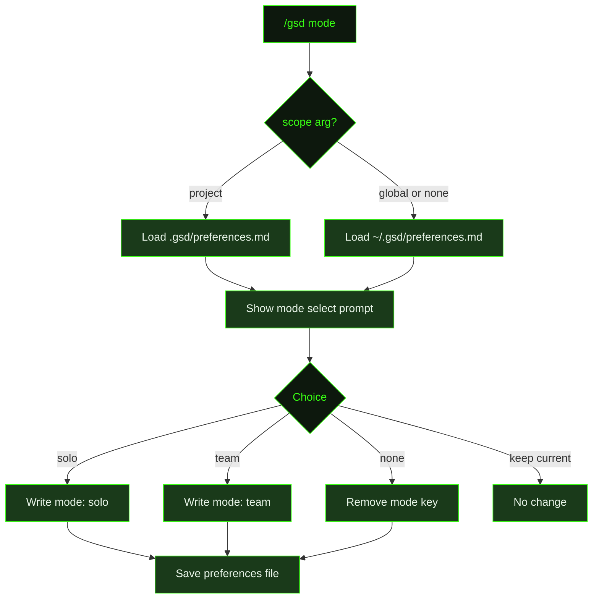

## What It Does

`/gsd mode` is a quick toggle between solo and team workflow modes. Each mode records a single `mode` key in your preferences file and applies a coordinated set of defaults at runtime — saving you from configuring git, isolation, and ID settings individually.

Solo mode is optimized for individual developers — it auto-pushes, uses simple sequential milestone IDs, and keeps documentation lightweight. Team mode is designed for shared repositories — it uses unique milestone IDs to avoid collisions, pushes branches for review, and enables pre-merge checks.

Mode defaults are the **lowest-priority layer**. Any value you've explicitly set in your preferences file overrides the mode default. This means you can use a mode as a starting point and customize individual settings without losing the rest.

## Usage

```
/gsd mode              # Set workflow mode (global scope)
/gsd mode global       # Set workflow mode at global level (same as above)
/gsd mode project      # Set workflow mode at project level only
```

In all cases, a selection prompt opens to choose between solo, team, (none), or keep current.

## How It Works

### Selection Flow



The command presents four options:

1. **solo** — auto-push, squash, simple IDs (personal projects)
2. **team** — unique IDs, push branches, pre-merge checks (shared repos)
3. **(none)** — no mode defaults, configure everything individually
4. **(keep current)** — exit without changes

When you select a mode, only the `mode` key is written to your preferences file (`mode: solo` or `mode: team`). The individual git and ID settings are **not written** — they are resolved at runtime via `applyModeDefaults`, which merges mode defaults as the lowest-priority layer. Any explicitly set preference value wins over the mode default.

### Scope

By default, `/gsd mode` writes to the **global** preferences at `~/.gsd/preferences.md`. Pass `project` to write to `.gsd/preferences.md` in the current project instead. Project-scope preferences take priority over global preferences during merge, so you can have a different mode per project.

### Mode Comparison

| Setting | Solo | Team |
|---------|------|------|
| `auto_push` | `true` — pushes after each commit | `false` — commits stay local |
| `push_branches` | `false` — no feature branches pushed | `true` — milestone branches pushed for review |
| `pre_merge_check` | `false` — merge without CI gate | `true` — wait for CI before merging |
| `merge_strategy` | `squash` | `squash` |
| `isolation` | `worktree` | `worktree` |
| `commit_docs` | `true` | `true` |
| `unique_milestone_ids` | `false` — simple `M001`, `M002` | `true` — `M001-eh88as`, `M002-k4m9xz` (prevents ID collisions) |

### Unique Milestone IDs

In solo mode, milestone IDs are simple sequential numbers: `M001`, `M002`, `M003`. This is clean and easy to reference.

In team mode, milestone IDs include a random 6-character suffix: `M001-eh88as`. This prevents collisions when multiple contributors queue milestones on different branches — two developers creating "M003" independently would get `M003-abc123` and `M003-def456` instead of conflicting.

The unique ID format affects directory names (`.gsd/milestones/M001-eh88as/`), branch names (`milestone/M001-eh88as`), and all references in state files.

## What Files It Touches

### Reads

| File | Purpose |
|------|---------|
| `~/.gsd/preferences.md` | Current global preferences |
| `.gsd/preferences.md` | Current project preferences (when `project` scope) |

### Writes

| File | Purpose |
|------|---------|
| `~/.gsd/preferences.md` | Updated `mode` key (global scope, default) |
| `.gsd/preferences.md` | Updated `mode` key (project scope, when `project` arg passed) |

## Examples

Switching to team mode globally:

```
> /gsd mode

Workflow mode:
  ❯ solo — auto-push, squash, simple IDs (personal projects)
    team — unique IDs, push branches, pre-merge checks (shared repos)
    (none) — no mode defaults, configure individually
    (keep current)

  → team

Mode: team — defaults: auto_push=false, push_branches=true,
  pre_merge_check=true, merge_strategy=squash, isolation=worktree,
  commit_docs=true, unique_milestone_ids=true
```

Switching to project-level solo mode (overrides global team mode for this repo):

```
> /gsd mode project

Workflow mode (current: team):
  ❯ solo — auto-push, squash, simple IDs (personal projects)
    team — unique IDs, push branches, pre-merge checks (shared repos)
    (none) — no mode defaults, configure individually
    (keep current)

  → solo

Mode: solo — defaults: auto_push=true, push_branches=false,
  pre_merge_check=false, merge_strategy=squash, isolation=worktree,
  commit_docs=true, unique_milestone_ids=false
```

Removing mode defaults entirely (configure each preference manually):

```
> /gsd mode

  → (none)

(mode key removed from preferences)
```

## Related Commands

- [`/gsd prefs`](../prefs/) — Full preference wizard (mode is one category alongside models, timeouts, git, and skills)
- [`/gsd config`](../config/) — Configure tool API keys
- [`/gsd doctor`](../doctor/) — Validates preference file structure
