## What It Does

`/gsd new-milestone` is the brownfield equivalent of [`/gsd new-project`](../new-project/). Your project already exists, `PROJECT.md` has history, and phases have shipped — this command starts the next cycle. It loads your existing project context, gathers what you want to build next, updates `PROJECT.md` and `STATE.md`, optionally runs parallel domain research, scopes requirements with REQ-IDs, and spawns the roadmapper to produce a phased execution plan that continues your phase numbering from where the last milestone left off.

The command accepts an optional milestone name as an argument. If no `MILESTONE-CONTEXT.md` file exists (written by [`/gsd discuss-phase`](../discuss-phase/) or a prior discussion), it falls back to interactive Q&A — asking what you want to build next and exploring features, priorities, and constraints.

After the roadmap is approved and committed, you get a clear next step: `/gsd:discuss-phase [N]` or `/gsd:plan-phase [N]` to start execution.

## Usage

```
/gsd new-milestone [milestone name]
```

The milestone name argument is optional. If provided, it pre-fills the milestone label (e.g., `v1.1 Notifications`). If omitted, GSD will prompt for it during the workflow.

```
/gsd new-milestone
/gsd new-milestone "v2.0 Social Features"
/gsd new-milestone v1.1 Notifications
```

## How It Works

### Workflow Overview

```mermaid
flowchart TD
    Start(["/gsd new-milestone"]) --> LoadCtx[Load project context\nPROJECT.md · MILESTONES.md · STATE.md]
    LoadCtx --> ContextFile{MILESTONE-CONTEXT.md\nexists?}
    ContextFile -->|Yes| UseCtx[Use pre-gathered context\nPresent summary for confirmation]
    ContextFile -->|No| QA[Interactive Q&A\nWhat to build next?]
    UseCtx --> Version[Determine milestone version\nv1.0 → v1.1 · confirm with user]
    QA --> Version
    Version --> UpdateFiles[Update PROJECT.md + STATE.md\nCommit]
    UpdateFiles --> Research{Research\nneeded?}
    Research -->|Yes| Parallel[4 parallel researcher agents\nStack · Features · Architecture · Pitfalls]
    Parallel --> Synth[Synthesizer agent\nWrite SUMMARY.md]
    Synth --> Reqs[Scope requirements\nby category with AskUserQuestion]
    Research -->|No| Reqs
    Reqs --> WriteReqs[Write REQUIREMENTS.md\nwith REQ-IDs · Commit]
    WriteReqs --> Roadmap[Spawn gsd-roadmapper\nContinue phase numbering]
    Roadmap --> Approve{Roadmap\napproved?}
    Approve -->|Adjust| Roadmap
    Approve -->|Yes| Commit[Commit ROADMAP.md\nSTATE.md · REQUIREMENTS.md]
    Commit --> Done([Done — next: /gsd:plan-phase N])

    style Start fill:#0d180d,stroke:#39ff14,color:#39ff14
    style Done fill:#0d180d,stroke:#39ff14,color:#39ff14
    style ContextFile fill:#0d180d,stroke:#39ff14,color:#39ff14
    style Research fill:#0d180d,stroke:#39ff14,color:#39ff14
    style Approve fill:#0d180d,stroke:#39ff14,color:#39ff14
    style LoadCtx fill:#1a3a1a,stroke:#39ff14,color:#e8f4e8
    style UseCtx fill:#1a3a1a,stroke:#39ff14,color:#e8f4e8
    style QA fill:#1a3a1a,stroke:#39ff14,color:#e8f4e8
    style Version fill:#1a3a1a,stroke:#39ff14,color:#e8f4e8
    style UpdateFiles fill:#1a3a1a,stroke:#39ff14,color:#e8f4e8
    style Parallel fill:#1a3a1a,stroke:#39ff14,color:#e8f4e8
    style Synth fill:#1a3a1a,stroke:#39ff14,color:#e8f4e8
    style Reqs fill:#1a3a1a,stroke:#39ff14,color:#e8f4e8
    style WriteReqs fill:#1a3a1a,stroke:#39ff14,color:#e8f4e8
    style Roadmap fill:#1a3a1a,stroke:#39ff14,color:#e8f4e8
    style Commit fill:#1a3a1a,stroke:#39ff14,color:#e8f4e8
```



### Step-by-Step

**1. Load context** — Reads `PROJECT.md` (existing stack, decisions, validated requirements), `MILESTONES.md` (what has shipped), and `STATE.md` (pending todos, blockers). Calls `init new-milestone` to resolve agent models and config.

**2. Gather milestone goals** — If `MILESTONE-CONTEXT.md` exists (written by a prior discussion), its features and scope are used and presented for confirmation. Otherwise, GSD shows what shipped in the last milestone and asks: "What do you want to build next?" — using `AskUserQuestion` to explore features, priorities, constraints, and scope.

**3. Determine milestone version** — Parses the last version from `MILESTONES.md`, suggests the next increment (e.g., `v1.0 → v1.1`, or `v2.0` for a major), and confirms with you.

**4. Update PROJECT.md and STATE.md** — Adds a `## Current Milestone` section to `PROJECT.md` with the goal and target features. Resets `STATE.md` with `Phase: Not started (defining requirements)`, preserving the Accumulated Context section from the previous milestone. Commits both files.

**5. Consume MILESTONE-CONTEXT.md** — If the context file existed, it's deleted (consumed).

**6. Research decision** — Asks whether to research the domain ecosystem for new features before defining requirements. The choice is persisted to config so future commands honor it. If "Research first" is selected, 4 parallel `gsd-project-researcher` agents run (see below).

**7. Research (optional)** — Spawns 4 parallel agents, each focused on a different dimension:

| Dimension | Question answered |
|-----------|------------------|
| **Stack** | What library/version additions are needed for the new features? |
| **Features** | How do the target features typically work? Table stakes vs differentiators? |
| **Architecture** | How do new features integrate with the existing architecture? |
| **Pitfalls** | Common mistakes when adding these features to an existing system? |

After all 4 complete, a `gsd-research-synthesizer` agent writes `SUMMARY.md` with key findings displayed inline.

**8. Define requirements** — Presents features by category (from research or gathered via conversation). For each category, `AskUserQuestion` (multi-select) lets you scope what's in vs deferred vs out of scope. Requirements are written with REQ-IDs in `[CATEGORY]-[NUMBER]` format (e.g., `AUTH-01`, `NOTIF-02`), continuing numbering from existing requirements. You confirm the full list before it's committed.

**9. Create roadmap** — Spawns `gsd-roadmapper` with the phase starting number taken from `MILESTONES.md` (e.g., if v1.0 ended at phase 5, v1.1 starts at phase 6). The roadmapper maps every requirement to exactly one phase, derives 2–5 success criteria per phase, and validates 100% coverage. The roadmap is presented inline for approval — you can request adjustments and the roadmapper is re-spawned until you approve.

**10. Final commit** — Commits `ROADMAP.md`, `STATE.md`, and `REQUIREMENTS.md` together. Displays a completion summary with the artifact table and the next command.

### Milestone Version Numbering

GSD reads the last version from `MILESTONES.md` and suggests the next increment:

- `v1.0` → suggests `v1.1` (minor increment)
- Suggest `v2.0` yourself for major reboots

Phase numbering **continues** across milestones — if v1.0 delivered phases 1–5, v1.1's roadmap starts at phase 6. This preserves the full build history in a single continuous phase sequence.

### Context File Shortcut

If you ran [`/gsd discuss-phase`](../discuss-phase/) or another discussion command that wrote `MILESTONE-CONTEXT.md`, the Q&A step is skipped entirely — GSD uses that file's features and scope directly and presents a summary for confirmation. This is the fastest path through new-milestone when the goals are already clear.

## What Files It Touches

### Reads

| File | Purpose |
|------|---------|
| `.planning/PROJECT.md` | Existing stack, decisions, validated requirements |
| `.planning/MILESTONES.md` | What shipped previously; last phase number for continuation |
| `.planning/STATE.md` | Pending todos and blockers from previous milestone |
| `.planning/MILESTONE-CONTEXT.md` | Pre-gathered milestone goals (optional — skips Q&A if present) |
| `.planning/research/SUMMARY.md` | Research findings (if research ran) — used during requirements scoping |

### Creates

| File | Purpose |
|------|---------|
| `.planning/REQUIREMENTS.md` | Scoped requirements with REQ-IDs, categories, future and out-of-scope sections |
| `.planning/ROADMAP.md` | Phased execution plan with success criteria, continuing phase numbering |
| `.planning/research/STACK.md` | Stack additions needed for new features (research only) |
| `.planning/research/FEATURES.md` | Feature analysis: table stakes vs differentiators (research only) |
| `.planning/research/ARCHITECTURE.md` | Integration points and build order (research only) |
| `.planning/research/PITFALLS.md` | Common mistakes and prevention strategies (research only) |
| `.planning/research/SUMMARY.md` | Synthesized research summary (research only) |

### Writes

| File | Purpose |
|------|---------|
| `.planning/PROJECT.md` | Updated with `## Current Milestone` section and active requirements |
| `.planning/STATE.md` | Reset to `Phase: Not started (defining requirements)` for new milestone |
| `.planning/REQUIREMENTS.md` | Traceability section filled by roadmapper after roadmap creation |

### Deletes

| File | Purpose |
|------|---------|
| `.planning/MILESTONE-CONTEXT.md` | Consumed and deleted after goals are extracted |

## Examples

**Start a new milestone with a name:**

```
/gsd new-milestone "v2.0 Social Features"
```

GSD loads your project history, shows what shipped in v1.0, and jumps straight to version confirmation and research decision — saving the "what to build" Q&A since you've named the milestone.

**Start with no name — full interactive flow:**

```
/gsd new-milestone
```

GSD asks what you want to build next, explores priorities and constraints, suggests a version number, then proceeds through research → requirements → roadmap.

**Fastest path — pre-discuss then plan:**

If you've already worked through what to build (e.g., with `/gsd discuss-phase`), a `MILESTONE-CONTEXT.md` file will be present. Running `/gsd new-milestone` then skips the goal-gathering Q&A entirely:

```
/gsd new-milestone

● Found MILESTONE-CONTEXT.md — using pre-gathered scope
  Milestone: v1.1 Notifications
  Features: Push alerts, in-app notification center, digest emails

  Confirm? (yes / adjust)
```

**Research output example:**

When research is selected, GSD runs 4 parallel agents and shows a summary:

```
━━━━━━━━━━━━━━━━━━━━━━━━━━━━━━━━━━━━━━━━━━━━━━━━━━━━━
 GSD ► RESEARCH COMPLETE ✓
━━━━━━━━━━━━━━━━━━━━━━━━━━━━━━━━━━━━━━━━━━━━━━━━━━━━━

Stack additions: expo-notifications 0.28, @supabase/realtime-js
Feature table stakes: delivery receipts, badge counts, opt-out per type
Watch Out For: APNs certificate expiry, notification permission timing
```

**Requirements scoping:**

After research (or Q&A), GSD scopes each category interactively:

```
## Push Notifications
Table stakes: Delivery receipts, Badge counts
Differentiators: Rich media, Scheduled sends

Which features are in scope for v1.1? (multi-select)
✓ Delivery receipts
✓ Badge counts
  Rich media — deferred to v1.2
  Scheduled sends — out of scope
```

## Related Commands

- [`/gsd new-project`](../new-project/) — Greenfield equivalent — initializes a brand-new project from scratch
- [`/gsd complete-milestone`](../complete-milestone/) — Archive the current milestone before running new-milestone
- [`/gsd discuss-phase`](../discuss-phase/) — Gather phase context before planning (also writes MILESTONE-CONTEXT.md)
- [`/gsd plan-phase`](../plan-phase/) — Create a detailed phase plan after the roadmap is ready
- [`/gsd queue`](../queue/) — Add future milestones to the backlog
