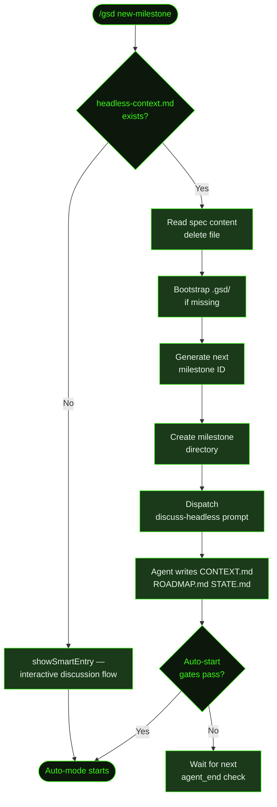

## What It Does

`/gsd new-milestone` is the headless entry point for milestone creation from a specification document. It's the command that `gsd headless new-milestone --context brief.md` dispatches to the RPC session — the headless runner writes your spec to `.gsd/runtime/headless-context.md`, then `/gsd new-milestone` picks it up, bootstraps the project if needed, and runs the full milestone planning pipeline without any interactive Q&A rounds.

When run directly in a TUI session with no headless context file present, the command falls back to interactive smart entry — the same discussion flow you get from running `/gsd` with no active milestone.

The non-interactive path uses the `discuss-headless` prompt, which processes the spec document and writes all milestone artifacts in a single pass: `CONTEXT.md`, `ROADMAP.md`, and the milestone directory structure. After the agent writes `STATE.md` as its final step, auto-mode starts automatically — you don't need to run `/gsd auto` separately.

## Usage

This command is primarily invoked via the headless runner, not typed directly:

```bash
# Create a milestone from a file and start auto-mode
gsd headless new-milestone --context brief.md --auto

# Create from inline text
gsd headless new-milestone --context-text "Build a REST API with JWT auth"

# Pipe from stdin
echo "Add social features: follow, feed, comments" | gsd headless new-milestone --context -
```

If you run it directly in a TUI session, GSD checks for a pending headless context file. If none exists, it falls back to the interactive flow — identical to running `/gsd` with no active milestone.

```
/gsd new-milestone
```

See the [Headless Mode](../headless/) page for the full flag reference and CI integration patterns.

## How It Works

### Dispatch Path Selection

When `/gsd new-milestone` fires, it checks for `.gsd/runtime/headless-context.md`:

- **File exists** → headless path: reads the spec, deletes the file, bootstraps the project, and dispatches the `discuss-headless` prompt.
- **File missing** → interactive fallback: runs `showSmartEntry`, the standard milestone discussion flow used by `/gsd` when no milestone is active.



### Headless Path

The headless runner writes your spec to `.gsd/runtime/headless-context.md` before dispatching `/gsd new-milestone` to the RPC session. When the command fires:

1. **Read spec** — reads the seed context from `headless-context.md`.
2. **Delete file** — removes `headless-context.md` immediately (non-fatal if deletion fails).
3. **Bootstrap project** — calls `bootstrapGsdProject`: ensures `.gsd/milestones/` and `.gsd/runtime/` directories exist, initializes a git repo if missing, ensures `.gitignore` and preferences files exist, and untracks runtime files from git.
4. **Generate milestone ID** — finds existing milestone IDs and increments to the next one (e.g., `M001` if no milestones exist, `M003` if `M001` and `M002` are present). Respects the `unique_milestone_ids` preference for suffix generation.
5. **Create milestone directory** — makes `.gsd/milestones/MXXX/slices/`.
6. **Build prompt** — loads the `discuss-headless` prompt template, inlining all GSD document templates (project, requirements, context, roadmap, decisions) directly into the prompt so the agent can write everything in one pass.
7. **Arm auto-start** — registers a `pendingAutoStart` hook. After each agent turn completes, `checkAutoStartAfterDiscuss()` fires and checks four gates before starting auto-mode (see below).
8. **Dispatch** — sends the prompt to the active session.

### Auto-Start Gates

Auto-mode doesn't fire the moment the agent writes its first file. `checkAutoStartAfterDiscuss()` is called at the end of each agent turn and must pass all gates before triggering:

| Gate | Condition |
|------|-----------|
| **1 — Artifact exists** | The milestone must have a `CONTEXT.md` or `ROADMAP.md` |
| **2 — STATE.md written** | `.gsd/STATE.md` must exist — the agent writes this as its final step |
| **3 — Multi-milestone completeness** | Warns if milestones listed in `PROJECT.md` are missing from the filesystem (non-blocking) |
| **4 — Discussion manifest** | If `DISCUSSION-MANIFEST.json` exists, all gates must be marked complete before auto-start fires |

Gate 2 is the primary completion signal — it prevents auto-start from triggering mid-session while the agent is still writing artifacts. For single-milestone discussions, gates 3 and 4 are effectively no-ops.

### `discuss-headless` vs Interactive Discussion

The normal discussion flow (`showSmartEntry`) runs multiple adaptive Q&A rounds before writing any files. The `discuss-headless` prompt skips all interactive rounds — it processes the spec document directly and produces all milestone artifacts in a single session. The spec document substitutes for the Q&A: the richer the spec, the better the output.

This means headless milestone creation is faster but produces plans that are only as detailed as the spec you supply. Vague specs produce shallower roadmaps; detailed specs with constraints, user stories, and known trade-offs produce richer ones.

### Project Bootstrapping

If `.gsd/` doesn't exist yet (a fresh project), `bootstrapGsdProject` initializes the full structure before creating the milestone:

- Initializes a git repo (using the `git.main_branch` preference, defaulting to `main`) if the directory is not already a repo.
- Creates `.gsd/milestones/` and `.gsd/runtime/` directory trees.
- Writes `.gitignore` entries for GSD runtime files (respects the `git.commit_docs` preference).
- Writes a default preferences file if none exists.
- Adds `.gsd/runtime/` to git's untracked list so session files don't appear in status.

This makes `gsd headless new-milestone` usable in a completely empty directory — no manual setup required.

## What Files It Touches

### Reads

| File | Purpose |
|------|---------|
| `.gsd/runtime/headless-context.md` | Spec document written by the headless runner — consumed and deleted on read |
| `.gsd/milestones/` | Scanned to determine the next milestone ID |

### Creates

| File | Purpose |
|------|---------|
| `.gsd/milestones/MXXX/slices/` | Milestone directory created before dispatching the prompt |
| `.gsd/milestones/MXXX/MXXX-CONTEXT.md` | Milestone scope, goals, and constraints — written by the dispatched agent |
| `.gsd/milestones/MXXX/MXXX-ROADMAP.md` | Slice plan with risk ordering, success criteria, and boundary map — written by the dispatched agent |

### Creates (bootstrap only, if missing)

| File | Purpose |
|------|---------|
| `.gsd/` | Root GSD directory — created if project is uninitialized |
| `.gsd/milestones/` | Milestones container |
| `.gsd/runtime/` | Runtime files directory (not tracked in git) |
| `.gitignore` | Updated with GSD runtime entries |
| `.gsd/preferences.json` | Default preferences file |

### Writes

| File | Purpose |
|------|---------|
| `.gsd/STATE.md` | Written by the agent as its final step — satisfies Gate 2 and triggers auto-mode start |

## Examples

**Create a milestone from a spec document and immediately start execution:**

```bash
gsd headless new-milestone --context brief.md --auto
```

Where `brief.md` might contain:

```markdown
# v2 Social Features

Add social capabilities to Cookmate:
- Users can follow other cooks
- Activity feed showing new recipes from followed users
- Comment on recipes (threaded, not nested)
- Share recipes via link (no auth required to view)

Constraints:
- Supabase for all backend (no new services)
- Feed must work on cached data, not real-time at launch
- Mobile-first — all interactions touch-friendly
```

GSD reads this spec and produces a full milestone plan without any questions.

**Create from inline text:**

```bash
gsd headless new-milestone --context-text "Build a CLI tool for managing dotfiles with profiles and sync"
```

**Pipe from a generation script:**

```bash
cat product-brief.md | sed 's/## Internal Notes.*//' | \
  gsd headless new-milestone --context -
```

**Run in CI after pushing a spec file:**

```yaml
# .github/workflows/plan.yml
- name: Plan new milestone
  run: |
    gsd headless new-milestone \
      --context .gsd/specs/next-milestone.md \
      --timeout 600000 \
      --auto
```

**Run directly (falls back to interactive):**

If no `headless-context.md` file exists, running `/gsd new-milestone` in a TUI session starts the same discussion flow as `/gsd` — GSD asks "What's the vision?" and proceeds with adaptive Q&A.

## Related Commands

- [`/gsd`](../gsd/) — Interactive entry point — routes to discussion when no milestone is active
- [Headless Mode](../headless/) — Full CLI reference for `gsd headless new-milestone` flags and CI patterns
- [`/gsd queue`](../queue/) — Queue additional future milestones before or after planning
- [`/gsd discuss`](../discuss/) — Re-open discussion for the current milestone
- [`/gsd auto`](../auto/) — Start auto-mode manually if it didn't fire automatically
