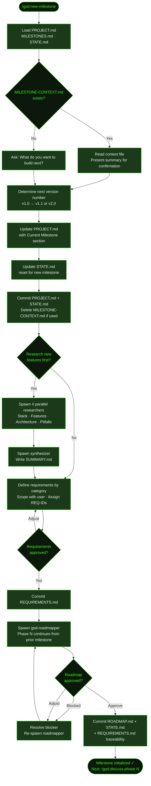

## What It Does

`/gsd new-milestone` is the brownfield equivalent of `/gsd new-project`. The project already exists, `PROJECT.md` carries the full history, and `MILESTONES.md` records what has shipped. Running this command opens the next milestone cycle: it gathers your goals (through conversation or a pre-written context file), updates `PROJECT.md` and `STATE.md`, optionally runs parallel domain research, defines scoped requirements with stable REQ-IDs, and spawns the roadmapper to create a phased execution plan that picks up where the previous milestone's phase numbering left off.

Prior work stays intact. The command adds new requirements to `REQUIREMENTS.md` without touching existing ones, and appends new phases to `ROADMAP.md` continuing from the last phase of the prior milestone.

There are two entry paths:

- **Interactive path** — No pre-written context. GSD asks what you want to build next, explores features and priorities through conversation, and lets you scope each category before writing requirements.
- **Pre-discussed path** — A `MILESTONE-CONTEXT.md` file already exists from a prior [`/gsd:discuss-milestone`](../discuss/) run. GSD reads it, presents a summary for confirmation, then proceeds directly to research or requirements — skipping the Q&A.

After the roadmap is approved and committed, GSD tells you the first phase number and suggests [`/gsd:discuss-phase`](../discuss/) or [`/gsd:plan-phase`](../plan-phase/) to start execution.

## Usage

```
/gsd:new-milestone [milestone name]
```

The milestone name is optional — GSD will prompt if not provided. When you pass a name, it is used as a suggestion for the milestone title (e.g., `"v1.1 Notifications"`).

```
/gsd:new-milestone
/gsd:new-milestone "v2.0 Teams"
/gsd:new-milestone v1.1 Notifications
```

## How It Works


```mermaid
flowchart TD
    Start(["/gsd:new-milestone"]) --> LoadCtx[Load PROJECT.md\nMILESTONES.md · STATE.md]
    LoadCtx --> CheckContext{MILESTONE-CONTEXT.md\nexists?}
    CheckContext -->|Yes| UseContext[Read context file\nPresent summary for confirmation]
    CheckContext -->|No| GatherGoals[Ask: What do you want to build next?]
    UseContext --> DetermineVersion
    GatherGoals --> DetermineVersion[Determine next version number\nv1.0 → v1.1 or v2.0]
    DetermineVersion --> UpdateProject[Update PROJECT.md\nwith Current Milestone section]
    UpdateProject --> UpdateState[Update STATE.md\nreset for new milestone]
    UpdateState --> Cleanup[Commit PROJECT.md + STATE.md\nDelete MILESTONE-CONTEXT.md if used]
    Cleanup --> ResearchDecision{Research new\nfeatures first?}
    ResearchDecision -->|Yes| Parallel4[Spawn 4 parallel researchers\nStack · Features · Architecture · Pitfalls]
    ResearchDecision -->|No| DefineReqs
    Parallel4 --> Synthesizer[Spawn synthesizer\nWrite SUMMARY.md]
    Synthesizer --> DefineReqs[Define requirements by category\nScope with user · Assign REQ-IDs]
    DefineReqs --> ReqsConfirm{Requirements\napproved?}
    ReqsConfirm -->|Adjust| DefineReqs
    ReqsConfirm -->|Yes| CommitReqs[Commit REQUIREMENTS.md]
    CommitReqs --> SpawnRoadmapper[Spawn gsd-roadmapper\nPhase N continues from prior milestone]
    SpawnRoadmapper --> RoadmapResult{Roadmap\napproved?}
    RoadmapResult -->|Blocked| ResolveBlocker[Resolve blocker\nRe-spawn roadmapper]
    RoadmapResult -->|Adjust| ResolveBlocker
    ResolveBlocker --> SpawnRoadmapper
    RoadmapResult -->|Approve| CommitRoadmap[Commit ROADMAP.md + STATE.md\n+ REQUIREMENTS.md traceability]
    CommitRoadmap --> Done([Milestone initialized ✓\nNext: /gsd:discuss-phase N])

    style Start fill:#0d180d,stroke:#39ff14,color:#39ff14
    style CheckContext fill:#0d180d,stroke:#39ff14,color:#39ff14
    style ResearchDecision fill:#0d180d,stroke:#39ff14,color:#39ff14
    style ReqsConfirm fill:#0d180d,stroke:#39ff14,color:#39ff14
    style RoadmapResult fill:#0d180d,stroke:#39ff14,color:#39ff14
    style Done fill:#0d180d,stroke:#39ff14,color:#39ff14
    style LoadCtx fill:#1a3a1a,stroke:#39ff14,color:#e8f4e8
    style UseContext fill:#1a3a1a,stroke:#39ff14,color:#e8f4e8
    style GatherGoals fill:#1a3a1a,stroke:#39ff14,color:#e8f4e8
    style DetermineVersion fill:#1a3a1a,stroke:#39ff14,color:#e8f4e8
    style UpdateProject fill:#1a3a1a,stroke:#39ff14,color:#e8f4e8
    style UpdateState fill:#1a3a1a,stroke:#39ff14,color:#e8f4e8
    style Cleanup fill:#1a3a1a,stroke:#39ff14,color:#e8f4e8
    style Parallel4 fill:#1a3a1a,stroke:#39ff14,color:#e8f4e8
    style Synthesizer fill:#1a3a1a,stroke:#39ff14,color:#e8f4e8
    style DefineReqs fill:#1a3a1a,stroke:#39ff14,color:#e8f4e8
    style CommitReqs fill:#1a3a1a,stroke:#39ff14,color:#e8f4e8
    style SpawnRoadmapper fill:#1a3a1a,stroke:#39ff14,color:#e8f4e8
    style ResolveBlocker fill:#1a3a1a,stroke:#39ff14,color:#e8f4e8
    style CommitRoadmap fill:#1a3a1a,stroke:#39ff14,color:#e8f4e8
```

### Context Loading

Before anything else, GSD reads the three files that carry forward project state:

| File | What it contributes |
|------|-------------------|
| `PROJECT.md` | Existing validated requirements, architectural decisions, what was built, current stack |
| `MILESTONES.md` | What shipped in each prior milestone, the last phase number used |
| `STATE.md` | Pending todos and blockers from the previous cycle |

If `MILESTONE-CONTEXT.md` exists (from a prior `/gsd:discuss-milestone` run), its features and scope are used directly and a summary is presented for confirmation. If it doesn't exist, GSD presents what shipped in the last milestone and asks what you want to build next. The tool asks about features, priorities, and constraints before moving forward.

### Version Numbering

GSD parses the last milestone version from `MILESTONES.md` and suggests the next logical version:

- Minor increment: `v1.0` → `v1.1`
- Major increment: `v1.x` → `v2.0` (for breaking changes or significant scope shifts)

You confirm the version before anything is written.

### PROJECT.md and STATE.md Updates

Before research or requirements begin, GSD commits two file updates:

**`PROJECT.md`** gets a `## Current Milestone: v[X.Y] [Name]` section with a one-sentence goal and the target feature list.

**`STATE.md`** is reset to "Defining requirements" status, preserving the Accumulated Context section from the previous milestone but clearing the phase-tracking fields.

`MILESTONE-CONTEXT.md` is deleted at this point if it was consumed.

### Optional Research Phase

GSD asks whether to run domain research before defining requirements. This is recommended when the milestone adds genuinely new capabilities — new libraries, new integration patterns, or features outside your existing expertise. It is safe to skip when extending established patterns.

**If research is selected**, GSD spawns 4 parallel `gsd-project-researcher` agents writing into `.planning/research/`. Each focuses on a distinct dimension:

| Agent | Output file | Focus |
|-------|-------------|-------|
| Stack researcher | `STACK.md` | Libraries and versions needed for new features, integration points |
| Features researcher | `FEATURES.md` | How target features work, table stakes vs differentiators, anti-features |
| Architecture researcher | `ARCHITECTURE.md` | Integration with existing system, new components, suggested build order |
| Pitfalls researcher | `PITFALLS.md` | Common mistakes when adding these features, prevention strategies |

After all four complete, a `gsd-research-synthesizer` agent writes `SUMMARY.md` with key findings. GSD presents the summary in chat — stack additions, feature table stakes, and notable pitfalls — before proceeding to requirements.

The research choice is persisted to `config.json` so future plan-phase runs respect it.

### Requirements Definition

GSD reads `PROJECT.md` for what already exists and `FEATURES.md` (if research ran) for feature categories. It presents features grouped by category with their classification — table stakes, differentiators, or anti-features — then scopes each category with you via a multi-select.

Selected features become this milestone's active requirements. Unselected table stakes are deferred to future milestones. Unselected differentiators are explicitly marked out of scope.

After scoping, GSD checks for gaps: anything not covered by the research categories. You can add additional requirements through conversation.

**REQ-ID format:** `[CATEGORY]-[NUMBER]` — continuing from the highest existing ID in `REQUIREMENTS.md`. For example, if the existing file already has `AUTH-03`, a new auth requirement becomes `AUTH-04`. Categories match the feature groupings from the discussion (e.g., `NOTIF-01`, `SEARCH-02`).

**Quality criteria for each requirement:**
- Specific and testable: "User can reset password via email link"
- User-centric: "User can X" (not "System does Y")
- Atomic: one capability per requirement
- Independent: minimal dependencies on other requirements

The full requirements list is printed in chat for explicit confirmation before committing.

### Roadmap Creation

GSD spawns a `gsd-roadmapper` agent with the phase starting number derived from `MILESTONES.md`. If the prior milestone ended at phase 5, this milestone's first phase is phase 6. Phase numbering is continuous across all milestones.

The roadmapper reads `PROJECT.md`, `REQUIREMENTS.md`, the research summary (if present), `MILESTONES.md`, and `config.json`. It produces a phased plan where:

- Every requirement maps to exactly one phase
- Each phase has 2–5 observable success criteria
- 100% requirement coverage is validated before output

GSD presents the roadmap as a table in chat — phase number, phase name, goal, mapped requirements, success criteria count — before writing any files. You can request adjustments; GSD re-spawns the roadmapper with revision context. Once approved, the roadmap is committed along with updated `STATE.md` and the traceability section of `REQUIREMENTS.md`.

## What Files It Touches

### Creates

| File | Purpose |
|------|---------|
| `.planning/research/STACK.md` | Library and version recommendations for new features (research path only) |
| `.planning/research/FEATURES.md` | Feature categories, table stakes vs differentiators (research path only) |
| `.planning/research/ARCHITECTURE.md` | Integration points, new components, build order (research path only) |
| `.planning/research/PITFALLS.md` | Common mistakes and prevention strategies (research path only) |
| `.planning/research/SUMMARY.md` | Synthesized research summary (research path only) |
| `.planning/research/` | Directory created if research is selected |

### Reads

| File | Purpose |
|------|---------|
| `.planning/PROJECT.md` | Existing requirements, decisions, stack, and milestone goals |
| `.planning/MILESTONES.md` | Prior milestone history and last phase number used |
| `.planning/STATE.md` | Pending todos and blockers from the prior cycle |
| `.planning/MILESTONE-CONTEXT.md` | Pre-written milestone goals from `/gsd:discuss-milestone` (deleted after reading) |
| `.planning/config.json` | Model profiles, workflow settings |

### Writes

| File | Purpose |
|------|---------|
| `.planning/PROJECT.md` | Updated with `## Current Milestone` section and new goals |
| `.planning/STATE.md` | Reset to "Defining requirements" for the new milestone |
| `.planning/REQUIREMENTS.md` | New requirements added with REQ-IDs; traceability updated after roadmap |
| `.planning/ROADMAP.md` | New phases appended (continuing phase numbering from prior milestone) |

### Deletes

| File | Purpose |
|------|---------|
| `.planning/MILESTONE-CONTEXT.md` | Consumed and deleted after its goals are incorporated |

## Examples

Starting a milestone when the previous one has shipped:

```
> /gsd:new-milestone

━━━━━━━━━━━━━━━━━━━━━━━━━━━━━━━━━━━━━━━━━━━━━━━━━━━━━
 GSD ► STARTING NEW MILESTONE
━━━━━━━━━━━━━━━━━━━━━━━━━━━━━━━━━━━━━━━━━━━━━━━━━━━━━

✓ Loaded PROJECT.md — v1.0 shipped recipe management (phases 1–5)
✓ Loaded MILESTONES.md — last phase: 5

What do you want to build next?
```

After you describe the scope, GSD suggests the version and presents a summary:

```
Suggesting v1.1: Social Features

Target features:
- User follows and follower graph
- Activity feed (follows, new recipes)
- Push notifications for feed events

Confirm version and scope? (yes / adjust)
```

---

Choosing to run research before requirements:

```
━━━━━━━━━━━━━━━━━━━━━━━━━━━━━━━━━━━━━━━━━━━━━━━━━━━━━
 GSD ► RESEARCHING
━━━━━━━━━━━━━━━━━━━━━━━━━━━━━━━━━━━━━━━━━━━━━━━━━━━━━

◆ Spawning 4 researchers in parallel...
  → Stack, Features, Architecture, Pitfalls

...

━━━━━━━━━━━━━━━━━━━━━━━━━━━━━━━━━━━━━━━━━━━━━━━━━━━━━
 GSD ► RESEARCH COMPLETE ✓
━━━━━━━━━━━━━━━━━━━━━━━━━━━━━━━━━━━━━━━━━━━━━━━━━━━━━

Stack additions: expo-notifications, @supabase/realtime-js
Feature table stakes: follow/unfollow, feed pagination, notification opt-out
Watch out for: fan-out on write at scale — use async queue for feed updates
```

---

Scoping requirements by category before confirming:

```
━━━━━━━━━━━━━━━━━━━━━━━━━━━━━━━━━━━━━━━━━━━━━━━━━━━━━
 GSD ► DEFINING REQUIREMENTS
━━━━━━━━━━━━━━━━━━━━━━━━━━━━━━━━━━━━━━━━━━━━━━━━━━━━━

## Social Graph
Table stakes: Follow/unfollow users, Follower count display
Differentiators: Suggested follows, Mutual followers badge

## Activity Feed
Table stakes: Feed of followed-user activity, Pagination
Differentiators: Notification grouping, Read receipts

[multiSelect per category...]

## Milestone v1.1 Requirements

### Social Graph
- [ ] **SOCIAL-01**: User can follow another user
- [ ] **SOCIAL-02**: User can unfollow a user they follow
- [ ] **SOCIAL-03**: User can view their follower and following counts

### Activity Feed
- [ ] **FEED-01**: User can view an activity feed of users they follow
- [ ] **FEED-02**: Feed paginates on scroll

Does this capture what you're building? (yes / adjust)
```

---

Roadmap presented for approval before any files are written:

```
━━━━━━━━━━━━━━━━━━━━━━━━━━━━━━━━━━━━━━━━━━━━━━━━━━━━━
 GSD ► CREATING ROADMAP
━━━━━━━━━━━━━━━━━━━━━━━━━━━━━━━━━━━━━━━━━━━━━━━━━━━━━

## Proposed Roadmap

3 phases | 5 requirements mapped | All covered ✓

| # | Phase              | Goal                          | Requirements                | Criteria |
|---|--------------------|-------------------------------|-----------------------------|----------|
| 6 | Social graph       | Follow/unfollow with counts   | SOCIAL-01, SOCIAL-02, SOCIAL-03 | 3    |
| 7 | Activity feed      | Feed of followed-user events  | FEED-01, FEED-02            | 3        |
| 8 | Push notifications | Delivery pipeline + opt-out   | NOTIF-01, NOTIF-02          | 4        |

Approve, adjust phases, or review full file?
```

---

After approval, GSD commits everything and prints next steps:

```
━━━━━━━━━━━━━━━━━━━━━━━━━━━━━━━━━━━━━━━━━━━━━━━━━━━━━
 GSD ► MILESTONE INITIALIZED ✓
━━━━━━━━━━━━━━━━━━━━━━━━━━━━━━━━━━━━━━━━━━━━━━━━━━━━━

Milestone v1.1: Social Features

| Artifact     | Location                    |
|--------------|-----------------------------|
| Project      | .planning/PROJECT.md        |
| Research     | .planning/research/         |
| Requirements | .planning/REQUIREMENTS.md   |
| Roadmap      | .planning/ROADMAP.md        |

3 phases | 5 requirements | Ready to build ✓

## ▶ Next Up

Phase 6: Social graph — Follow/unfollow with counts

/gsd:discuss-phase 6 — gather context and clarify approach

/clear first → fresh context window

Also: /gsd:plan-phase 6 — skip discussion, plan directly
```

---

Using a pre-written context file from `/gsd:discuss-milestone`:

```
> /gsd:new-milestone

● Found MILESTONE-CONTEXT.md — loading goals from prior discussion

  Summary: v1.1 Social Features
  - User follows and follower graph
  - Activity feed for followed-user events
  - Push notifications for new followers and comments

  Confirm this scope? (yes / adjust)
```

## Related Commands

- [`/gsd:new-project`](../new-project/) — Greenfield equivalent — initializes a brand-new project from scratch
- [`/gsd:complete-milestone`](../complete-milestone/) — Archive the current milestone into `MILESTONES.md` before starting the next
- [`/gsd:discuss-milestone`](../discuss/) — Pre-gather milestone goals into `MILESTONE-CONTEXT.md` before running this command
- [`/gsd:plan-phase`](../plan-phase/) — Create a detailed phase plan once the roadmap is ready
- [`/gsd:discuss-phase`](../discuss/) — Run a guided discussion for a specific phase before planning it
