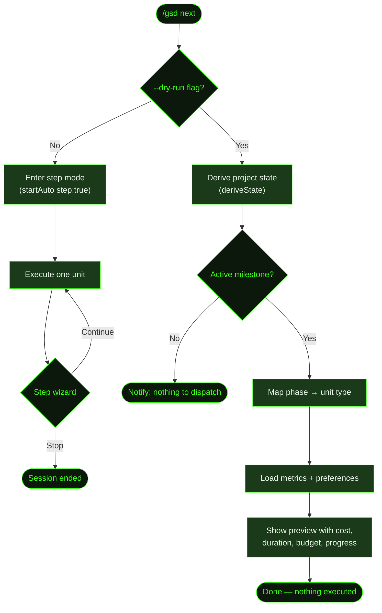

## What It Does

`/gsd next` executes one unit of work and pauses for your decision, exactly like bare [`/gsd`](../gsd/). It exists as an explicit alias — when you type `/gsd next`, the intent is clear: "give me the next unit."

The key addition over bare `/gsd` is the `--dry-run` flag, which previews what would be dispatched next — unit type, ID, milestone, phase, estimated cost, estimated duration, budget remaining, and overall progress — without executing anything. Useful when you want to see what's coming before committing, or after making manual edits to plan files.

## Usage

```
/gsd next
/gsd next --dry-run
/gsd next --verbose
/gsd next --debug
```

| Flag | Effect |
|------|--------|
| `--dry-run` | Show what the next unit would be without executing it |
| `--verbose` | Increase logging detail during dispatch and execution |
| `--debug` | Enable debug-level tracing and write a debug log to `.gsd/` |

## How It Works

`/gsd next` calls the same `startAuto()` function with `step: true`. The initialization sequence, dispatch engine, and step wizard are all identical to [`/gsd`](../gsd/). See that page for the full flow.

The `--dry-run` branch is the distinguishing feature. Instead of dispatching a unit for execution, it reads the project's current state and maps the active phase to its corresponding unit type, then displays a richly annotated preview.



### Dry-run preview

When `--dry-run` is active, GSD:

1. **Derives project state** — Calls `deriveState()`, which reads all roadmap and plan files under `.gsd/` to determine the active milestone, active slice, active task, and current phase.
2. **Checks for an active milestone** — If there's no active milestone (e.g. all milestones are complete and the registry is empty), it exits with "nothing to dispatch." Note: when phase is `complete`, `activeMilestone` is still set to the last milestone entry, so the dry-run does proceed — it will display `nextType: complete`.
3. **Maps phase to unit type** — Uses a direct phase-to-unit-type mapping (not the full dispatch loop):

| Phase | Unit type dispatched | Notes |
|-------|----------------------|-------|
| `pre-planning` | `research-milestone` | |
| `planning` | `plan-slice` | Requires `activeSlice` to be set |
| `executing` | `execute-task` | Requires both `activeSlice` and `activeTask` |
| `summarizing` | `complete-slice` | Requires `activeSlice` to be set |
| `completing-milestone` | `complete-milestone` | |
| `validating-milestone` | `validating-milestone` | Falls through to verbatim |
| `replanning-slice` | `replanning-slice` | Falls through to verbatim |
| `needs-discussion` | `needs-discussion` | Falls through to verbatim |
| `blocked` | `blocked` | Falls through to verbatim |
| `discussing`, `researching`, `verifying`, `advancing`, `complete` | phase name verbatim | Falls through to verbatim |
| any other phase | phase name verbatim | Catch-all for unknown phases |

4. **Loads historical metrics** — Reads the in-memory metrics ledger (or falls back to the ledger on disk at `.gsd/metrics.json`) to calculate average cost and duration for units of the same type. Loads preferences to check the budget ceiling.
5. **Shows preview** — Displays the unit type, ID, milestone, phase, estimated cost and duration (computed as averages over historical units of the same type), total spent, budget remaining, and task/slice progress.

### Step mode (no --dry-run)

Without `--dry-run`, `/gsd next` behaves identically to [`/gsd`](../gsd/): executes one unit, auto-commits, and presents the step wizard (continue / stop / check status).

## What Files It Touches

### With --dry-run

Read-only. Writes nothing.

| File | Purpose |
|------|---------|
| `.gsd/milestones/<MID>/<MID>-ROADMAP.md` | Read to derive active milestone and phase |
| `.gsd/milestones/<MID>/slices/<SID>/<SID>-PLAN.md` | Read to derive active slice and task |
| `.gsd/milestones/<MID>/slices/<SID>/<SID>-SUMMARY.md` | Read to determine slice completion |
| `.gsd/metrics.json` | Read for historical unit cost and duration averages |
| `.gsd/preferences.md` | Read for budget ceiling (`budget_ceiling`) |

### Without --dry-run

Same as [`/gsd`](../gsd/#what-files-it-touches) — identical file behavior since the underlying engine is the same.

## Examples

Previewing the next unit:

```
> /gsd next --dry-run

● Dry-run preview:

  Next unit:     execute-task
  ID:            M001/S02/T03
  Milestone:     M001: Core Recipe Platform
  Phase:         executing
  Est. cost:     $0.82 (avg of 4 similar)
  Est. duration: 18m
  Spent so far:  $6.40
  Budget left:   $43.60
  Progress:      8/12 tasks, 1/4 slices
```

When no budget ceiling is configured, the budget line reads `no ceiling set`:

```
  Budget left:   no ceiling set
```

When the unit type has never been executed before, estimates are unavailable:

```
  Est. cost:     unknown (first of this type)
  Est. duration: unknown
```

Running the next unit:

```
> /gsd next

● Dispatching unit: execute-task M001/S02/T03
  ─────────────────────────────────

  ... agent executes T03 (Delete endpoint) ...

  ✓ T03 complete — 3 files changed
  ✓ Auto-committed: "T03: Delete endpoint with soft-delete"

● What next?
  ❯ Continue to next unit (T04: Recipe search)
    Check status
    Stop
```

When there's nothing to dispatch:

```
> /gsd next --dry-run

● No active milestone — nothing to dispatch.
```

## Related Commands

- [`/gsd`](../gsd/) — Identical behavior (bare entry point)
- [`/gsd auto`](../auto/) — Continuous execution without pausing
- [`/gsd stop`](../stop/) — Terminate the session gracefully
- [`/gsd status`](../status/) — View progress dashboard
- [`/gsd history`](../history/) — Review past unit cost and timing data
