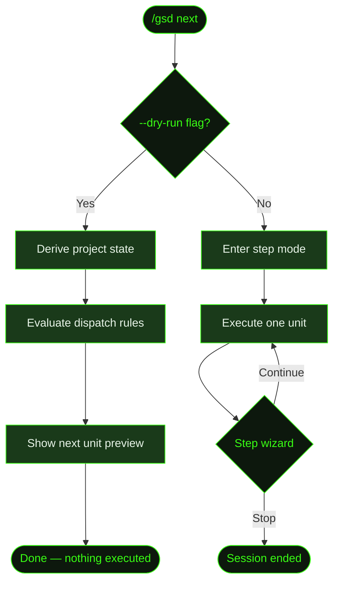

## What It Does

`/gsd next` executes one unit of work and pauses for your decision, exactly like bare [`/gsd`](../gsd/). It exists as an explicit alias — when you type `/gsd next`, the intent is clear: "give me the next unit."

The key addition over bare `/gsd` is the `--dry-run` flag, which previews the next unit (type, ID, estimated cost, estimated duration) without actually executing it. Useful when you want to see what's coming before committing.

## Usage

```
/gsd next
/gsd next --dry-run
/gsd next --verbose
```

| Flag | Effect |
|------|--------|
| `--dry-run` | Show what the next unit would be without executing it |
| `--verbose` | Increase logging detail during dispatch and execution |

## How It Works

`/gsd next` calls the same `startAuto()` function with `step: true`. The initialization sequence, dispatch engine, and step wizard are all identical to [`/gsd`](../gsd/). See that page for the full flow.

The `--dry-run` branch is the distinguishing feature. Instead of dispatching the unit for execution, it evaluates the dispatch rules, determines what *would* be dispatched, and shows a preview.



### Dry-run preview

When `--dry-run` is active, GSD:

1. **Derives project state** — Reads all `.gsd/` files to determine the current phase, active milestone, active slice, and next task.
2. **Evaluates dispatch rules** — Runs the same 13-rule dispatch table used by [`/gsd auto`](../auto/#the-dispatch-loop) to determine what type of unit comes next.
3. **Shows preview** — Displays the unit type, ID, estimated cost, and estimated duration. Then exits without executing anything.

This is helpful for checking what auto mode would do next before committing to it — especially after making manual edits to plan files.

### Step mode (no --dry-run)

Without `--dry-run`, `/gsd next` behaves identically to [`/gsd`](../gsd/): executes one unit, auto-commits, and presents the step wizard (continue / stop / status).

## What Files It Touches

### With --dry-run

Read-only. Reads `.gsd/STATE.md`, roadmap files, and plan files to derive state and evaluate dispatch rules. Writes nothing.

### Without --dry-run

Same as [`/gsd`](../gsd/#what-files-it-touches) — identical file behavior since the underlying engine is the same.

## Examples

Previewing the next unit:

```
> /gsd next --dry-run

● Deriving project state...
  Active milestone: M001 (Core Recipe Platform)
  Active slice: S02 (Recipe CRUD API)
  Phase: executing

● Next unit preview
  ┌────────────────────────────────────┐
  │ Type:     task-execution           │
  │ Unit:     T03 (Delete endpoint)    │
  │ Est. cost:  ~$0.85                 │
  │ Est. time:  ~20 minutes            │
  └────────────────────────────────────┘

  Run /gsd next (without --dry-run) to execute.
```

Running the next unit:

```
> /gsd next

● Dispatching unit: execute T03 (Delete endpoint)
  Type: task-execution
  Est: 20 minutes
  ─────────────────────────────────

  ... agent executes T03 ...

  ✓ T03 complete — 2 files changed
  ✓ Auto-committed: "T03: Delete endpoint with soft-delete"

● What next?
  ❯ Continue to next unit (T04: Recipe search)
    Check status
    Stop
```

## Related Commands

- [`/gsd`](../gsd/) — Identical behavior (bare entry point)
- [`/gsd auto`](../auto/) — Continuous execution without pausing
- [`/gsd stop`](../stop/) — Terminate the session
- [`/gsd status`](../status/) — View progress dashboard
