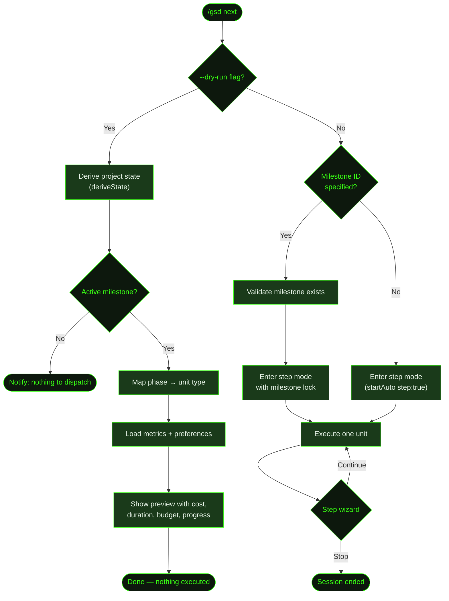

## What It Does

`/gsd next` executes one unit of work and pauses for your decision, exactly like bare [`/gsd`](../gsd/). It exists as an explicit alias — when you type `/gsd next`, the intent is clear: "give me the next unit."

The key addition over bare `/gsd` is the `--dry-run` flag, which previews what would be dispatched next — unit type, ID, milestone, phase, estimated cost, estimated duration, budget remaining, and overall progress — without executing anything. Useful when you want to see what's coming before committing, or after making manual edits to plan files.

You can also target a specific milestone by passing its ID (`/gsd next M003`). This locks dispatch to that milestone and ignores others, which is useful when multiple milestones are active or queued.

## Usage

```
/gsd next
/gsd next --dry-run
/gsd next <MID>
/gsd next --verbose
/gsd next --debug
```

| Flag / Argument | Effect |
|----------------|--------|
| `--dry-run` | Show what the next unit would be without executing it |
| `<MID>` | Target a specific milestone (e.g. `M003`) — locks dispatch to that milestone |
| `--verbose` | Increase logging detail during dispatch and execution |
| `--debug` | Enable debug-level tracing and write a debug log to `.gsd/` |

## How It Works

`/gsd next` calls the same `startAuto()` function with `step: true`. The initialization sequence, dispatch engine, and step wizard are all identical to [`/gsd`](../gsd/). See that page for the full flow.

The `--dry-run` branch is the distinguishing feature. Instead of dispatching a unit for execution, it reads the project's current state and maps the active phase to its corresponding unit type, then displays a richly annotated preview.


```mermaid
flowchart TD
    Start(["/gsd next"]) --> DryRun{"--dry-run flag?"}
    DryRun -->|Yes| DeriveState["Derive project state\n(deriveState)"]
    DryRun -->|No| MilestoneLock{"Milestone ID\nspecified?"}
    MilestoneLock -->|Yes| ValidateMid["Validate milestone exists"]
    MilestoneLock -->|No| StepMode["Enter step mode\n(startAuto step:true)"]
    ValidateMid --> StepModeLocked["Enter step mode\nwith milestone lock"]
    StepMode --> Execute["Execute one unit"]
    StepModeLocked --> Execute
    Execute --> Wizard{"Step wizard"}
    Wizard -->|Continue| Execute
    Wizard -->|Stop| Done(["Session ended"])
    DeriveState --> NoMilestone{"Active milestone?"}
    NoMilestone -->|No| Noop(["Notify: nothing to dispatch"])
    NoMilestone -->|Yes| MapPhase["Map phase → unit type"]
    MapPhase --> LoadMetrics["Load metrics + preferences"]
    LoadMetrics --> Preview["Show preview with cost,\nduration, budget, progress"]
    Preview --> Exit(["Done — nothing executed"])

    style Start fill:#0d180d,stroke:#39ff14,color:#39ff14
    style DryRun fill:#0d180d,stroke:#39ff14,color:#39ff14
    style Wizard fill:#0d180d,stroke:#39ff14,color:#39ff14
    style NoMilestone fill:#0d180d,stroke:#39ff14,color:#39ff14
    style MilestoneLock fill:#0d180d,stroke:#39ff14,color:#39ff14
    style DeriveState fill:#1a3a1a,stroke:#39ff14,color:#e8f4e8
    style ValidateMid fill:#1a3a1a,stroke:#39ff14,color:#e8f4e8
    style MapPhase fill:#1a3a1a,stroke:#39ff14,color:#e8f4e8
    style LoadMetrics fill:#1a3a1a,stroke:#39ff14,color:#e8f4e8
    style Preview fill:#1a3a1a,stroke:#39ff14,color:#e8f4e8
    style StepMode fill:#1a3a1a,stroke:#39ff14,color:#e8f4e8
    style StepModeLocked fill:#1a3a1a,stroke:#39ff14,color:#e8f4e8
    style Execute fill:#1a3a1a,stroke:#39ff14,color:#e8f4e8
    style Done fill:#0d180d,stroke:#39ff14,color:#39ff14
    style Exit fill:#0d180d,stroke:#39ff14,color:#39ff14
    style Noop fill:#0d180d,stroke:#39ff14,color:#39ff14
```

### Dry-run preview

When `--dry-run` is active, GSD:

1. **Derives project state** — Calls `deriveState()`, which reads the SQLite database (with filesystem fallback) to determine the active milestone, active slice, active task, and current phase.
2. **Checks for an active milestone** — If there's no active milestone (e.g. all milestones are complete and none is queued), it exits with "nothing to dispatch."
3. **Maps phase to unit type** — Uses a direct phase-to-unit-type mapping (not the full dispatch loop):

| Phase | Unit type dispatched | Notes |
|-------|----------------------|-------|
| `pre-planning` | `research-milestone` | |
| `planning` | `plan-slice` | Requires `activeSlice` to be set |
| `executing` | `execute-task` | Requires both `activeSlice` and `activeTask` |
| `summarizing` | `complete-slice` | Requires `activeSlice` to be set |
| `completing-milestone` | `complete-milestone` | |
| Any other phase | phase name verbatim | Includes `needs-discussion`, `discussing`, `researching`, `evaluating-gates`, `verifying`, `advancing`, `validating-milestone`, `replanning-slice`, `complete`, `paused`, `blocked` |

4. **Loads historical metrics** — Reads the in-memory metrics ledger (or falls back to the ledger on disk at `.gsd/metrics.json`) to calculate average cost and duration for units of the same type. Loads preferences to check the budget ceiling.
5. **Shows preview** — Displays the unit type, ID, milestone, phase, estimated cost and duration (computed as averages over historical units of the same type), total spent, budget remaining, and task/slice progress.

### Milestone targeting (no --dry-run)

When a milestone ID is passed (`/gsd next M003`), GSD first validates that the milestone exists. If not, it reports the available IDs and stops. If valid, dispatch is locked to that milestone — `deriveState()` only considers the targeted milestone's work, ignoring others in the queue.

### Step mode (no --dry-run)

Without `--dry-run`, `/gsd next` behaves identically to [`/gsd`](../gsd/): executes one unit, auto-commits, and presents the step wizard (continue / stop / check status).

## What Files It Touches

### With --dry-run

Read-only. Writes nothing.

| File | Purpose |
|------|---------|
| `.gsd/<project-hash>/gsd.db` | Primary source for milestone, slice, and task state (DB-backed) |
| `.gsd/milestones/<MID>/<MID>-ROADMAP.md` | Filesystem fallback — read to derive active milestone and phase |
| `.gsd/milestones/<MID>/slices/<SID>/<SID>-PLAN.md` | Filesystem fallback — read to derive active slice and task |
| `.gsd/metrics.json` | Read for historical unit cost and duration averages |
| `.gsd/preferences.md` | Read for budget ceiling (`budget_ceiling`) |

### Without --dry-run

Same as [`/gsd`](../gsd/#what-files-it-touches) — identical file behavior since the underlying engine is the same.

## Examples

Previewing the next unit:

```
> /gsd next --dry-run

● Dry-run preview:

  Next unit:     execute-task
  ID:            M001/S02/T03
  Milestone:     M001: Core Recipe Platform
  Phase:         executing
  Est. cost:     $0.82 (avg of 4 similar)
  Est. duration: 18m
  Spent so far:  $6.40
  Budget left:   $43.60
  Progress:      8/12 tasks, 1/4 slices
```

When no budget ceiling is configured, the budget line reads `no ceiling set`:

```
  Budget left:   no ceiling set
```

When the unit type has never been executed before, estimates are unavailable:

```
  Est. cost:     unknown (first of this type)
  Est. duration: unknown
```

Running the next unit:

```
> /gsd next

● Dispatching unit: execute-task M001/S02/T03
  ─────────────────────────────────

  ... agent executes T03 (Delete endpoint) ...

  ✓ T03 complete — 3 files changed
  ✓ Auto-committed: "T03: Delete endpoint with soft-delete"

● What next?
  ❯ Continue to next unit (T04: Recipe search)
    Check status
    Stop
```

Targeting a specific milestone:

```
> /gsd next M003

● Dispatching unit: plan-slice M003/S01
  ─────────────────────────────────

  ... agent plans S01 for milestone M003 ...
```

When the milestone ID doesn't exist:

```
> /gsd next M099

● Milestone M099 does not exist. Available: M001, M003
```

When there's nothing to dispatch:

```
> /gsd next --dry-run

● No active milestone — nothing to dispatch.
```

## Related Commands

- [`/gsd`](../gsd/) — Identical behavior (bare entry point)
- [`/gsd auto`](../auto/) — Continuous execution without pausing
- [`/gsd stop`](../stop/) — Terminate the session gracefully
- [`/gsd status`](../status/) — View progress dashboard
- [`/gsd history`](../history/) — Review past unit cost and timing data
