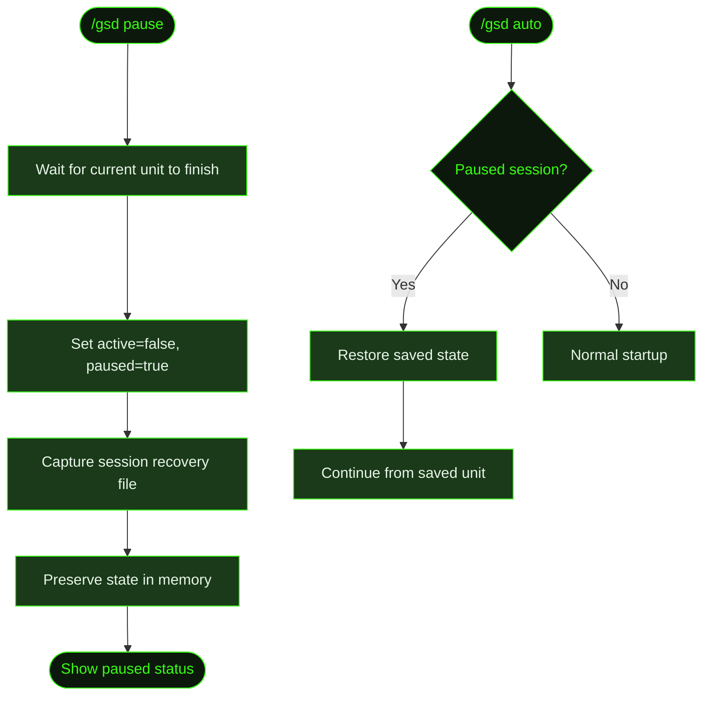

## What It Does

`/gsd pause` suspends auto mode while keeping the entire session alive. Unlike [`/gsd stop`](../stop/) (which tears everything down), pause preserves all state — the current unit, completed units, base path, worktree, and metrics session. You drop back to the normal agent conversation, do whatever you need, then resume exactly where you left off with [`/gsd auto`](../auto/).

This is useful when you need to inspect something mid-run, make a manual change, have a quick conversation with the agent, or step away and come back later.

## Usage

```
/gsd pause
```

No flags. Only works in the terminal where auto mode is running.

## How It Works



### Pause sequence

1. **Wait for current unit** — Like stop, GSD lets the active unit finish and commit before pausing. No work is lost.
2. **Set session flags** — Marks the session as `active=false, paused=true`. The dispatch loop stops evaluating new units.
3. **Capture recovery file** — Writes a session recovery file containing everything needed to resume: base path, current unit position, list of completed units, worktree location, and session ID.
4. **Preserve in-memory state** — The worktree, metrics DB, and branch remain intact. Nothing is torn down.

### Resume path

When you run `/gsd auto` again after pausing:

1. GSD detects the `paused=true` flag and the recovery file.
2. It restores the saved state — base path, current unit, completed units.
3. The dispatch loop resumes from exactly where it left off, skipping already-completed units.
4. A brief recovery summary shows what was completed and what's next.

### What you can do while paused

While auto mode is paused, you have a normal agent session. You can:

- Read files, run commands, inspect state
- Edit `.gsd/` plan files (changes take effect on resume)
- Mark tasks done manually in the plan
- Have a conversation about the project
- Run [`/gsd status`](../status/) to check progress

When you're ready, `/gsd auto` picks up right where it left off.

## What Files It Touches

| Action | Files |
|--------|-------|
| Writes | Session recovery file in `.gsd/runtime/` |
| Preserves | All `.gsd/` files, worktree, metrics DB, branch |
| Does NOT touch | Worktree directory, git branch, lock files |

## Examples

Pausing mid-run to inspect something:

```
> /gsd pause

● Waiting for current unit to finish...
  ✓ T02 complete — committed

● Auto mode paused
  Session: sess_a8f3k2
  Completed: T01, T02
  Next on resume: T03 (Signup and login pages)

  You can interact normally. Run /gsd auto to resume.
```

Making a manual edit, then resuming:

```
> Can you show me what S01-PLAN.md looks like?

  ... agent reads and shows the file ...

> Looks good. Let's continue.

> /gsd auto

● Detected paused session (sess_a8f3k2)
  Resuming from: T03 (Signup and login pages)
  Completed: T01, T02
  ─────────────────────────────────

● Dispatching unit: execute T03
  ...
```

## Related Commands

- [`/gsd auto`](../auto/) — Start or resume autonomous execution
- [`/gsd stop`](../stop/) — Fully terminate instead of pausing
