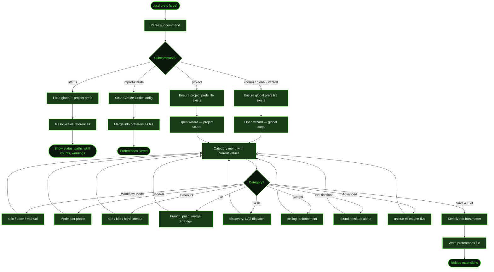

## What It Does

`/gsd prefs` opens an interactive wizard for configuring GSD's behavior. Preferences control model selection per phase, auto-mode timeouts, git commit behavior, skill discovery, budget ceilings, and notification settings. Preferences can be set at two levels:

- **Global** (`~/.gsd/preferences.md`) — Applies to all projects. Default when no scope is specified.
- **Project** (`.gsd/preferences.md`) — Overrides global settings for this project only.

Project preferences take precedence over global when both exist. The wizard shows current values for each category so you can see what's configured before making changes.

## Usage

```
/gsd prefs                   # Global wizard (default)
/gsd prefs global            # Explicit global wizard
/gsd prefs project           # Project-level wizard
/gsd prefs status            # Show current preference status
/gsd prefs import-claude     # Import Claude Code settings into global prefs
/gsd prefs import-claude project  # Import into project prefs
```

## How It Works



### Preference Categories

| Category | What It Configures | Key Fields |
|----------|-------------------|------------|
| **Workflow Mode** | Solo or team workflow with coordinated defaults | `mode` (solo/team) |
| **Models** | Model selection per execution phase | `models.research`, `models.plan`, `models.execute`, etc. |
| **Timeouts** | Auto-mode supervisor timeouts | `auto_supervisor.soft_timeout_minutes`, `idle_timeout_minutes`, `hard_timeout_minutes` |
| **Git** | Branch naming, push behavior, merge strategy | `git.main_branch`, `git.auto_push`, `git.merge_strategy` |
| **Skills** | Skill discovery and UAT dispatch behavior | `skill_discovery`, `uat_dispatch`, `always_use_skills`, `prefer_skills`, `avoid_skills` |
| **Budget** | Cost ceiling and enforcement policy | `budget_ceiling`, `budget_enforcement` (warn/pause/stop) |
| **Notifications** | Sound and desktop alert behavior | `notifications.sound`, `notifications.desktop` |
| **Advanced** | Unique milestone IDs and other toggles | `unique_milestone_ids` |

### Status Subcommand

`/gsd prefs status` loads both global and project preference files and reports their paths, whether they exist, and skill resolution status. It shows how many skills resolved successfully vs how many are unresolved, helping diagnose skill reference issues.

### Import Claude

`/gsd prefs import-claude` scans your Claude Code configuration (CLAUDE.md files, model settings) and imports relevant settings into GSD preferences. This is useful when migrating from Claude Code to GSD — it carries over model preferences and custom instructions.

## What Files It Touches

### Reads

| File | Purpose |
|------|---------|
| `~/.gsd/preferences.md` | Global preferences |
| `.gsd/preferences.md` | Project preferences |
| Claude Code config files | For import-claude subcommand |

### Writes

| File | Purpose |
|------|---------|
| `~/.gsd/preferences.md` | Updated global preferences |
| `.gsd/preferences.md` | Updated project preferences |

## Examples

Opening the wizard:

```
> /gsd prefs

GSD preferences (global) — pick a category to configure.

  Workflow Mode   solo
  Models          research: claude-sonnet-4-20250514, execute: claude-sonnet-4-20250514
  Timeouts        soft: 20m, idle: 10m, hard: 30m
  Git             main: main, push: on
  Skills          discovery: auto
  Budget          $50.00 (warn)
  Notifications   (defaults)
  Advanced        unique IDs: false
  ── Save & Exit ──

❯ Budget

  Budget ceiling (current: $50.00):
  > 100

  Enforcement (current: warn):
  ❯ warn — notify but continue
    pause — pause auto-mode at ceiling
    stop — stop auto-mode at ceiling
```

Checking status:

```
> /gsd prefs status

GSD skill prefs — global present: ~/.gsd/preferences.md; project present: .gsd/preferences.md
Skills: 3 resolved, 1 unresolved
Unresolved: my-custom-skill (not found in any skill directory)
```

## Related Commands

- [`/gsd mode`](../mode/) — Quick solo/team toggle (shortcut for the Workflow Mode category)
- [`/gsd config`](../config/) — Configure tool API keys (separate from skill preferences)
- [`/gsd doctor`](../doctor/) — Validates preference file structure
- [`/gsd skill-health`](../skill-health/) — Skill usage and performance metrics
