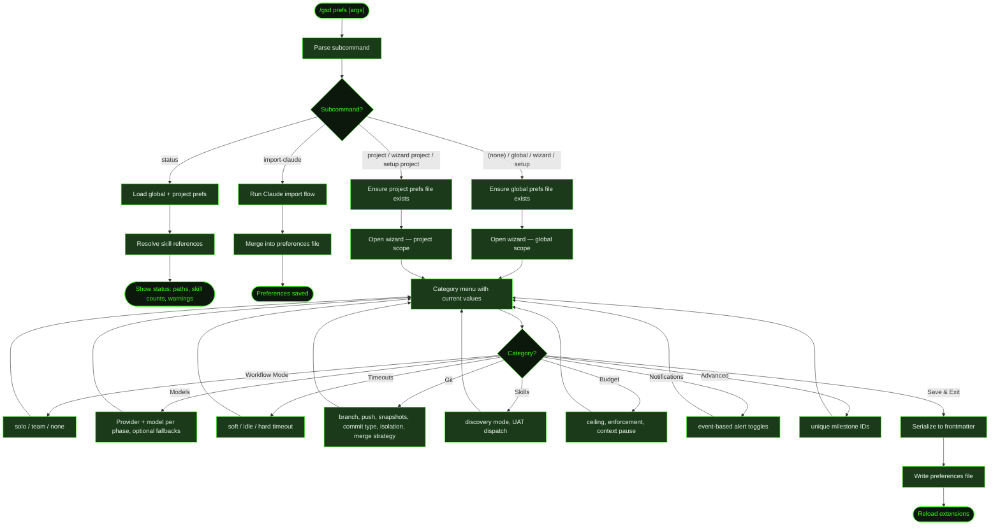

## What It Does

`/gsd prefs` opens an interactive wizard for configuring GSD's behavior. Preferences are stored as YAML frontmatter in markdown files and control model selection per phase, auto-mode timeouts, git commit behavior, skill discovery, budget ceilings, and notification settings. Preferences can be set at two levels:

- **Global** (`~/.gsd/preferences.md`) — Applies to all projects. Default when no scope is specified. The base directory can be overridden with the `GSD_HOME` environment variable.
- **Project** (`.gsd/preferences.md`) — Overrides global settings for this project only.

Project preferences take precedence over global when both exist. The wizard shows current values for each category so you can see what's configured before making changes. After saving, extensions are reloaded automatically.

Many preference fields not exposed by the wizard (such as `token_profile`, `always_use_skills`, `prefer_skills`, `avoid_skills`, `skill_rules`, `custom_instructions`, `verification_commands`, `parallel`, and others) can be set by editing the preferences file directly. See `~/.gsd/agent/extensions/gsd/docs/preferences-reference.md` for full field documentation.

## Usage

```
/gsd prefs                         # Global wizard (default)
/gsd prefs global                  # Explicit global wizard
/gsd prefs project                 # Project-level wizard
/gsd prefs wizard                  # Same as global (alias)
/gsd prefs setup                   # Same as global (alias)
/gsd prefs status                  # Show current preference status
/gsd prefs import-claude           # Import Claude Code settings into global prefs
/gsd prefs import-claude project   # Import into project prefs
```

## How It Works



### Preference Categories

| Category | What It Configures | Key Fields |
|----------|-------------------|------------|
| **Workflow Mode** | Solo or team workflow with coordinated defaults | `mode` (`solo`/`team`) |
| **Models** | Model selection per execution phase, with optional per-phase fallbacks | `models.research`, `models.planning`, `models.execution`, `models.completion` |
| **Timeouts** | Auto-mode supervisor timeouts | `auto_supervisor.soft_timeout_minutes`, `idle_timeout_minutes`, `hard_timeout_minutes` |
| **Git** | Branch naming, push behavior, WIP snapshots, commit type, isolation, merge strategy | `git.main_branch`, `git.auto_push`, `git.push_branches`, `git.snapshots`, `git.remote`, `git.pre_merge_check`, `git.commit_type`, `git.merge_strategy`, `git.isolation` |
| **Skills** | Skill discovery mode and UAT dispatch behavior | `skill_discovery` (`auto`/`suggest`/`off`), `uat_dispatch` |
| **Budget** | Cost ceiling, enforcement policy, context pause | `budget_ceiling`, `budget_enforcement` (`warn`/`pause`/`halt`), `context_pause_threshold` |
| **Notifications** | Event-based alert toggles | `notifications.enabled`, `on_complete`, `on_error`, `on_budget`, `on_milestone`, `on_attention` |
| **Advanced** | Unique milestone IDs | `unique_milestone_ids` |

### Workflow Mode Defaults

Selecting `solo` or `team` sets a bundle of git defaults as the lowest-priority layer. Explicit values you've set always win. Choosing `(none)` removes the mode field and lets you configure everything manually.

| Setting | `solo` | `team` |
|---------|--------|--------|
| `git.auto_push` | `true` | `false` |
| `git.push_branches` | `false` | `true` |
| `git.pre_merge_check` | `false` | `true` |
| `git.merge_strategy` | `squash` | `squash` |
| `git.isolation` | `worktree` | `worktree` |
| `unique_milestone_ids` | `false` | `true` |

### Models Category

The model wizard groups available models by provider. For each of the four phases (`research`, `planning`, `execution`, `completion`) you pick a provider first, then select a specific model ID from that provider's list. You can also type a model ID manually or clear the phase back to the inherited default.

Each phase can be configured as a plain model ID string or as an object with a primary model, an optional `provider` hint (to disambiguate when the same ID exists across providers), and an ordered `fallbacks` list that GSD tries in sequence when the primary fails due to rate limits or exhausted credits.

### Git Category

The Git category exposes all git-related settings in one place:

| Field | Default | Description |
|-------|---------|-------------|
| `main_branch` | `main` | Branch name used for merge operations |
| `auto_push` | `false` | Push commits to remote after each commit |
| `push_branches` | `false` | Push milestone branches to remote |
| `snapshots` | `false` | Create WIP snapshot commits during long tasks |
| `remote` | `origin` | Git remote name |
| `pre_merge_check` | `false` | Run checks before merging (`true`/`false`/`auto`) |
| `commit_type` | *(inferred)* | Default conventional-commit type (`feat`, `fix`, `chore`, etc.) |
| `merge_strategy` | *(unset)* | `squash` or `merge` |
| `isolation` | `worktree` | `worktree`, `branch`, or `none` |

`pre_merge_check: "auto"` lets GSD detect whether CI checks are configured and run them only when present.

### Skills Category

The wizard configures:

- **`skill_discovery`** (`auto`/`suggest`/`off`) — Controls how GSD discovers and loads skills at dispatch time. `auto` loads relevant skills silently; `suggest` proposes them for confirmation; `off` disables discovery entirely.
- **`uat_dispatch`** — When `true`, GSD dispatches a UAT agent after each slice completes.

`skill_staleness_days` (skills deprioritized after this many days of disuse; defaults to `60`) is not exposed in the wizard and must be set by editing the preferences file directly.

### Status Subcommand

`/gsd prefs status` loads both global and project preference files and reports their paths, whether they exist, and skill resolution status. It shows how many skills resolved successfully vs how many are unresolved, helping diagnose skill reference issues. When the global path is a legacy file (`~/.pi/agent/gsd-preferences.md`), the status notes it as a legacy fallback.

### Import Claude

`/gsd prefs import-claude` scans your Claude Code configuration (CLAUDE.md files, model settings) and imports relevant settings into GSD preferences. This is useful when migrating from Claude Code to GSD — it carries over model preferences and custom instructions. If no preferences file exists yet, one is created from the template before the import runs.

### File Format

Preferences are stored as YAML frontmatter in a markdown file. The wizard serializes values in a consistent key order. The body content after the closing `---` delimiter is preserved across saves — you can add documentation notes there without them being overwritten.

## What Files It Touches

### Creates

| File | Purpose |
|------|---------|
| `~/.gsd/preferences.md` | Created from template if missing when wizard opens |
| `.gsd/preferences.md` | Created from template if missing when `project` scope is selected |

### Reads

| File | Purpose |
|------|---------|
| `~/.gsd/preferences.md` | Global preferences (canonical path) |
| `~/.gsd/PREFERENCES.md` | Uppercase fallback for global preferences (bootstrap artifact) |
| `~/.pi/agent/gsd-preferences.md` | Legacy global preferences (fallback) |
| `.gsd/preferences.md` | Project preferences |
| `.gsd/PREFERENCES.md` | Uppercase fallback for project preferences (bootstrap artifact) |
| Claude Code config files | For `import-claude` subcommand |

### Writes

| File | Purpose |
|------|---------|
| `~/.gsd/preferences.md` | Updated global preferences |
| `.gsd/preferences.md` | Updated project preferences |

## Examples

Opening the wizard:

```
> /gsd prefs

GSD preferences (global) — pick a category to configure.

  Workflow Mode   solo
  Models          research: claude-opus-4-6, planning: claude-sonnet-4-5
  Timeouts        soft: 20m, idle: 10m, hard: 30m
  Git             main: main, push: on
  Skills          discovery: auto
  Budget          $50 / pause
  Notifications   6/6 enabled
  Advanced        unique IDs: off
  ── Save & Exit ──

❯ Budget

  Budget ceiling (USD) (current: $50):
  > 100

  Budget enforcement (current: pause):
  ❯ warn
    pause
    halt

  Context pause threshold (0-100%, 0=disabled) (current: 0):
  > 80
```

Checking status:

```
> /gsd prefs status

GSD skill prefs — global present: ~/.gsd/preferences.md; project present: .gsd/preferences.md
Skills: 3 resolved, 1 unresolved
Unresolved: my-custom-skill (not found in any skill directory)
```

Setting project-scoped preferences:

```
> /gsd prefs project

● Created project GSD skill preferences at .gsd/preferences.md
GSD preferences (project) — pick a category to configure.
```

## Related Commands

- [`/gsd mode`](../mode/) — Quick solo/team toggle (shortcut for the Workflow Mode category)
- [`/gsd config`](../config/) — Configure tool API keys (separate from skill preferences)
- [`/gsd doctor`](../doctor/) — Validates preference file structure
- [`/gsd skill-health`](../skill-health/) — Skill usage and performance metrics
