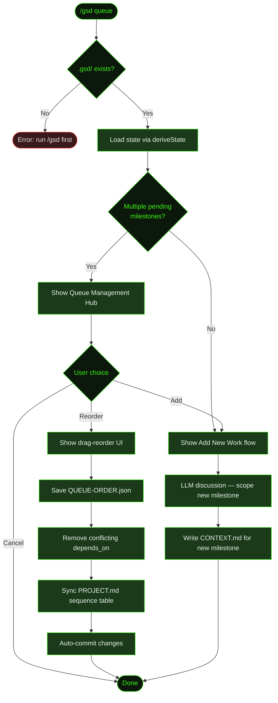

## What It Does

`/gsd queue` opens the queue management hub for organizing upcoming milestones. It lets you reorder pending milestones by priority, add new milestones via LLM-assisted discussion, and automatically resolves dependency conflicts when you change the order.

The queue is safe to use while auto-mode is running. Queued milestones are picked up naturally when auto-mode advances past the current work — no restart needed. This makes `/gsd queue` the primary way to shape what comes next without interrupting what's happening now.

When you have multiple pending milestones, the hub presents two options: reorder the existing queue or add new work. If only one milestone exists, it skips straight to the add-new-work flow.

## Usage

```
/gsd queue
```

No arguments — the command opens an interactive hub. From there you choose to reorder or add.

## How It Works



### State Loading

The command reads the full project state via `deriveState()`, which scans the milestone registry to determine which milestones are complete, active, and pending. It uses this to build the list of reorderable items.

### Reorder Flow

The reorder UI shows all pending milestones in their current execution order. You drag items to set the new sequence. When you confirm:

1. **QUEUE-ORDER.json** — The new order is saved to `.gsd/QUEUE-ORDER.json` as a simple array of milestone IDs.
2. **Dependency cleanup** — If reordering puts a milestone before its `depends_on` target, that dependency is removed from the milestone's `CONTEXT.md`. This prevents deadlocks where a milestone waits for something that now comes after it.
3. **PROJECT.md sync** — The milestone sequence table in `PROJECT.md` is updated to reflect the new order.
4. **Auto-commit** — All changes are committed with the message `docs: reorder queue`.

### Add Flow

The add flow dispatches an LLM-assisted discussion where you describe the new work. The LLM assesses scope, asks clarifying questions, and writes a `CONTEXT.md` file for the new milestone. No roadmap is created — roadmaps are generated just-in-time when auto-mode reaches that milestone.

## What Files It Touches

### Creates

| File | Purpose |
|------|---------|
| `.gsd/milestones/MXXX/MXXX-CONTEXT.md` | Brief for newly queued milestones |

### Reads

| File | Purpose |
|------|---------|
| `.gsd/STATE.md` | Current project state |
| `.gsd/milestones/*/` | Milestone registry for status and ordering |

### Writes

| File | Purpose |
|------|---------|
| `.gsd/QUEUE-ORDER.json` | Persisted milestone execution order |
| `.gsd/PROJECT.md` | Milestone sequence table updated on reorder |
| `.gsd/milestones/*/MXXX-CONTEXT.md` | `depends_on` removed when reordering creates conflicts |

## Examples

Reordering milestones in a Cookmate project:

```
> /gsd queue

● GSD — Queue Management
  2 complete, 3 pending.

  ❯ Reorder queue
    Add new work

● Reorder Queue
  Drag to set execution order:

  1. M003 — API rate limiting
  2. M004 — Recipe sharing
  3. M005 — Mobile responsive

  ↕ Move M005 above M003

  New order:
  1. M005 — Mobile responsive
  2. M003 — API rate limiting
  3. M004 — Recipe sharing

  ✓ Queue reordered: M005 → M003 → M004
    Removed 1 depends_on (M005 no longer waits for M003)
```

Adding new work to the queue:

```
> /gsd queue

● GSD — Queue Management
  1 complete, 1 pending.

  ❯ Add new work

● Describe the new milestone...

  User: Add email notifications for recipe comments

  ● Assessing scope...
    Created M004 — Email notifications
    Context written to .gsd/milestones/M004/M004-CONTEXT.md
    Queued after M003
```

## Related Commands

- [`/gsd auto`](../auto/) — Executes milestones in queue order
- [`/gsd steer`](../steer/) — Override plans during execution
- [`/gsd status`](../status/) — See current progress and upcoming milestones
- [`/gsd capture`](../capture/) — Quick thought capture without queue management
