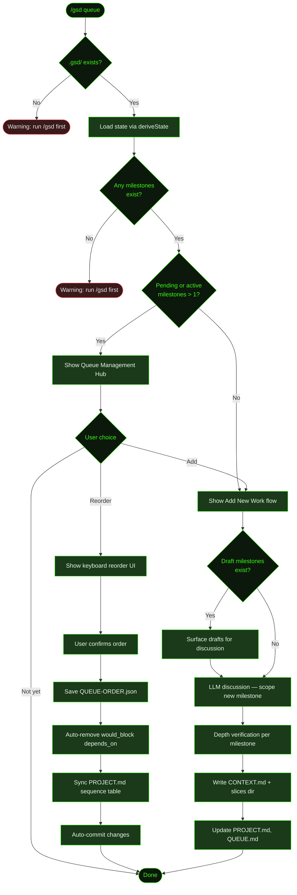

## What It Does

`/gsd queue` is the hub for managing upcoming milestones. It lets you reorder pending milestones by priority, add new milestones through LLM-assisted discussion, and automatically resolve dependency conflicts when you change the order.

The queue is safe to use while auto-mode is running. Queued milestones are picked up naturally when auto-mode advances past the current work — no restart needed. This makes `/gsd queue` the primary way to shape what comes next without interrupting what's happening now.

When you have more than one non-complete, non-parked milestone (active or queued), the hub presents two options: reorder the existing queue or add new work. If only one such milestone exists, it skips straight to the add-new-work flow.

## Usage

```
/gsd queue
```

No arguments — the command opens an interactive hub. From there you choose to reorder or add.

## How It Works



### State Loading

The command reads the full project state via `deriveState()`, which scans the milestone registry to determine which milestones are complete, active, pending, or parked. The hub appears when there are more than one milestone with status `active` or `pending` — the currently running milestone counts toward this total. If the number is one or less, the command skips the hub and goes straight to the add-new-work flow.

### Reorder Flow

The reorder UI shows completed milestones (dimmed) and all non-complete, non-parked milestones in their current execution order. Parked milestones are excluded from both lists. Use the keyboard to navigate and reposition items:

| Key | Action |
|-----|--------|
| `↑` / `↓` | Move cursor |
| `Space` | Grab / release the cursor item for moving |
| `↑` / `↓` (while grabbed) | Swap the grabbed item with its neighbor |
| `d` | Remove the first active `depends_on` from the cursor item |
| `Enter` | Confirm new order |
| `Esc` | Cancel |

The `d` hint only appears in the status bar when the cursor item has active (non-completed) dependencies. When `would_block` violations exist, Enter shows a count — e.g. `enter (fixes 2 dep)` — so you know how many dependencies will be cleaned up on confirm.

When you confirm:

1. **QUEUE-ORDER.json** — The new order is saved to `.gsd/QUEUE-ORDER.json` as `{ order: string[], updatedAt: string }`. This file is committed to git and shared across sessions.
2. **Dependency cleanup** — Any `depends_on` entry that a reorder has made contradictory (a milestone now appears before its dependency) is flagged as `would_block`. These are annotated inline in the UI as "— auto-removed on confirm" so you can see what will be cleaned up before pressing Enter. On confirm, the entries are automatically removed from the milestone's `CONTEXT.md` frontmatter.
3. **Redundant deps** — Dependencies that are already satisfied by queue position (the dep comes earlier) are shown dimmed as "redundant" — they are not removed, just surfaced for awareness.
4. **Missing/circular deps** — Dependencies referencing non-existent milestones or forming cycles are shown as errors in the UI.
5. **PROJECT.md sync** — The milestone sequence table in `PROJECT.md` is updated to reflect the new order.
6. **Auto-commit** — All changes are committed with the message `docs: reorder queue`.

> **Non-interactive terminals**: If the reorder UI cannot display (RPC mode or headless context), a warning is shown with the current order and reordering is skipped. The add flow still works in all environments.

### Add Flow

The add flow dispatches an LLM-assisted discussion session. Before asking "What do you want to add?", the LLM checks for any draft milestones — milestones that have a `CONTEXT-DRAFT.md` seed file (created when a prior discussion chose "Needs own discussion" instead of finalizing). If drafts exist, the LLM surfaces them first and offers to either discuss them now (completing the context file and deleting the draft) or leave them for later.

Once past any drafts, the discussion flow:

1. **Investigates** — The LLM researches your codebase, relevant libraries, and existing milestones before each question round, so its questions are grounded in reality rather than assumptions.
2. **Checks for overlap** — Dedup check against existing milestones, extension check for work that belongs with a pending milestone, and dependency check for prerequisites.
3. **Assesses scope** — Determines whether the work is single-milestone (2–12 slices) or multi-milestone. If multi-milestone, proposes a split for your approval before writing anything.
4. **Verifies before writing** — For each new milestone, a mandatory depth verification step presents the proposed scope and any technical risks. You confirm or correct before the context file is written. This gate cannot be skipped.
5. **Writes artifacts** — Uses `gsd_generate_milestone_id` to get a fresh ID (never invented manually), creates `.gsd/milestones/<ID>/slices/`, and writes `<ID>-CONTEXT.md`. If the new work has dependencies on other milestones, YAML frontmatter with `depends_on` is added to the context file.

No roadmap is created — roadmaps are generated just-in-time when auto-mode reaches that milestone. The add flow does not auto-commit; artifacts are committed by auto-mode's normal post-unit commit cycle.

### CONTEXT.md Dependency Frontmatter

When a queued milestone depends on another, its context file gets YAML frontmatter:

```yaml
---
depends_on: [M003, M005]
---
```

Auto-mode reads this field to enforce execution order. Without it, milestones may execute out of order.

## What Files It Touches

### Creates

| File | Purpose |
|------|---------|
| `.gsd/milestones/<ID>/<ID>-CONTEXT.md` | Brief for newly queued milestones |
| `.gsd/milestones/<ID>/slices/` | Slices directory created alongside each new context file |

### Reads

| File | Purpose |
|------|---------|
| `.gsd/milestones/*/` | Milestone registry for status, ordering, and context |
| `.gsd/PROJECT.md` | Project overview and milestone sequence |
| `.gsd/DECISIONS.md` | Architectural decisions (for add-flow LLM context) |
| `.gsd/QUEUE.md` | Previous queue entries (for add-flow LLM context) |
| `.gsd/QUEUE-ORDER.json` | Current custom execution order |
| `.gsd/milestones/*/<ID>-CONTEXT-DRAFT.md` | Draft seed files surfaced during add flow |

### Writes

| File | Purpose |
|------|---------|
| `.gsd/QUEUE-ORDER.json` | Persisted milestone execution order (reorder only) |
| `.gsd/PROJECT.md` | Milestone sequence table updated on reorder; new entries added on queue-add |
| `.gsd/QUEUE.md` | New queue log entries appended after each add |
| `.gsd/milestones/*/<ID>-CONTEXT.md` | `depends_on` removed when reordering creates `would_block` conflicts |
| `.gsd/REQUIREMENTS.md` | Updated if new work introduces or promotes requirements |
| `.gsd/DECISIONS.md` | Appended if the discussion surfaces relevant decisions |

### Deletes

| File | Purpose |
|------|---------|
| `.gsd/milestones/*/<ID>-CONTEXT-DRAFT.md` | Removed after a draft milestone is fully discussed and its `CONTEXT.md` is written |

## Examples

Reordering milestones in a project with three pending:

```
> /gsd queue

● GSD — Queue Management
  2 complete, 3 pending.

  ❯ Reorder queue (Recommended)
    Add new work

● Queue Reorder
  Completed:
    ✓ M001  Auth system
    ✓ M002  Data layer

  Queue (space to grab, ↑/↓ to navigate):
    ❯ 1. M003  API rate limiting
      2. M004  Recipe sharing
         ↳ depends_on: M003 (redundant)
      3. M005  Mobile responsive

  [space — grab M003, move it down]

  Queue (space to release, ↑/↓ to move):
    ▸▸ 1. M003  API rate limiting   ← grabbed

  [↓ twice — M003 moves to position 3]

    1. M004  Recipe sharing
    2. M005  Mobile responsive
    ▸▸ 3. M003  API rate limiting

  [enter to confirm]

● Queue reordered: M004 → M005 → M003 (removed 1 depends_on)
```

Adding new work when only one milestone is pending (skips hub):

```
> /gsd queue

● What do you want to add?

  User: Add push notifications for recipe comments

  ● Investigating codebase and notification landscape...
    [1-3 question rounds]

  ● Depth verification for M006:
    Scope: Push notifications via Expo Notifications + Supabase edge functions.
    Risk: Requires APNs/FCM credentials — not yet in project.
    Ready to queue?

  ✓ Queued 1 milestone.
    Created M006 — Push notifications
    Context: .gsd/milestones/M006/M006-CONTEXT.md

Queued 1 milestone(s). Auto-mode will pick them up after current work completes.
```

Surfacing a draft milestone before adding new work:

```
> /gsd queue

● I found 1 draft milestone from a previous discussion:

  M005 — Analytics dashboard (Draft context available)
  Seed: "Real-time recipe view counts and user engagement metrics"

  Discuss now (Recommended) — finalize context in this session
  Leave for later — keep draft, auto-mode will pause when it reaches M005

  [User selects "Discuss now"]

  ● Picking up from draft context for M005...
```

## Prompts Used

- [`queue`](../../prompts/queue/) — Roadmap queuing prompt

## Related Commands

- [`/gsd auto`](../auto/) — Executes milestones in queue order
- [`/gsd steer`](../steer/) — Override plans during execution
- [`/gsd status`](../status/) — See current progress and upcoming milestones
- [`/gsd capture`](../capture/) — Quick thought capture without queue management
