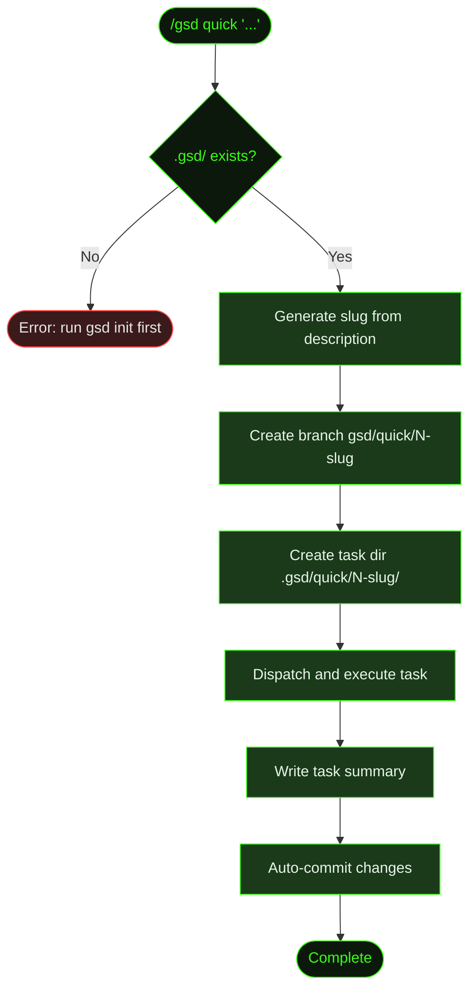

## What It Does

`/gsd quick` is the lightweight path for small, self-contained changes. Instead of creating a milestone, roadmap, slices, and tasks, it skips the entire hierarchy and dispatches a single task directly.

You describe what you want in plain English, and GSD creates a numbered task directory, a dedicated git branch, executes the task, writes a summary, and commits. The full GSD guarantees — atomic commits, state tracking, task summaries — apply, just without the milestone ceremony.

Use `/gsd quick` when the change is small enough that planning overhead isn't worth it: fixing a color, adding a config option, updating a dependency, writing a utility function.

## Usage

```
/gsd quick <task description>
```

The description is a plain-English sentence. Quotes are optional — GSD captures everything after `quick` as the description.

```
/gsd quick fix the login button color
/gsd quick "add dark mode toggle to the settings page"
/gsd quick update the README with new API endpoints
```

## How It Works

Quick mode bypasses the milestone/slice/task hierarchy entirely. No roadmap, no slice plan, no dispatch loop. It's a direct path from description to execution.



### Setup

1. **Validate `.gsd/`** — Checks that a GSD project exists. If not, tells you to run `gsd init` first. Quick tasks still need the GSD project structure, even though they skip milestones.
2. **Generate slug** — Converts your description into a URL-safe slug (e.g., "fix the login button color" → `fix-the-login-button-color`).
3. **Create branch** — Creates a git branch named `gsd/quick/N-slug`, where N is an auto-incrementing number. This keeps quick tasks isolated from your main branch.
4. **Create task directory** — Creates `.gsd/quick/N-slug/` to hold the task's summary and any artifacts.

### Execution

The task dispatches with a focused prompt that includes the description and relevant project context (KNOWLEDGE.md, DECISIONS.md, and the project brief). The agent executes the task in a single session — no multi-unit dispatch, no research/plan/execute phases.

On completion, a task summary is written to `.gsd/quick/N-slug/` and all changes are committed to the quick branch.

### After completion

The quick branch is ready to merge. You can review the diff, merge it, or discard it — same as any feature branch. GSD doesn't auto-merge quick branches; that's your call.

## What Files It Touches

### Creates

| File | Purpose |
|------|---------|
| `.gsd/quick/N-slug/` | Task directory with summary |
| `gsd/quick/N-slug` branch | Git branch for the change |

### Reads

| File | Purpose |
|------|---------|
| `.gsd/PROJECT.md` | Project context for the task prompt |
| `.gsd/KNOWLEDGE.md` | Patterns and gotchas |
| `.gsd/DECISIONS.md` | Architectural decisions |

### Writes

| File | Purpose |
|------|---------|
| Task summary in `.gsd/quick/N-slug/` | Documents what was done |
| Application files | Whatever the task requires |

## Examples

Adding a dark mode toggle to a Cookmate project:

```
> /gsd quick add dark mode toggle to the settings page

● Generating quick task
  Slug: add-dark-mode-toggle-to-the-settings-page
  Branch: gsd/quick/3-add-dark-mode-toggle-to-the-settings-page
  Task dir: .gsd/quick/3-add-dark-mode-toggle-to-the-settings-page/

● Switched to branch gsd/quick/3-add-dark-mode-toggle-to-the-settings-page
  ─────────────────────────────────

  ... agent executes task ...

  ✓ Added ThemeToggle component
  ✓ Wired into settings page
  ✓ Dark mode CSS variables added
  ✓ Task summary written

● Quick task complete
  ┌────────────────────────────────────┐
  │ Branch: gsd/quick/3-add-dark-...  │
  │ Files changed: 4                   │
  │ Ready to merge                     │
  └────────────────────────────────────┘
```

## Related Commands

- [`/gsd auto`](../auto/) — Full milestone execution with planning ceremony
- [`/gsd`](../gsd/) — Step mode for milestone-based work
