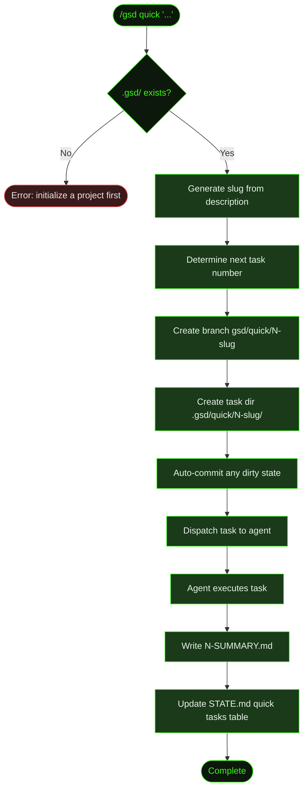

## What It Does

`/gsd quick` is the lightweight path for small, self-contained changes. Instead of creating a milestone, roadmap, and slices, it skips the entire planning hierarchy and dispatches a single task directly.

You describe what you want in plain English, and GSD creates a numbered task directory, a dedicated git branch, and dispatches the task to the agent. The agent executes it, writes a summary, commits the changes, and records the result in `STATE.md`. The full GSD guarantees — atomic commits, state tracking, task summaries — apply, just without the milestone ceremony.

Use `/gsd quick` when the change is small enough that planning overhead isn't worth it: fixing a bug, adding a config option, updating a dependency, writing a utility function.

## Usage

```
/gsd quick <task description>
```

The description is plain English. Everything after `quick` is captured as the description — quotes are optional.

```
/gsd quick fix the login button color
/gsd quick "add dark mode toggle to the settings page"
/gsd quick update the README with new API endpoints
```

## How It Works

Quick mode bypasses the milestone/slice/task hierarchy entirely. No roadmap, no slice plan, no dispatch loop. It's a direct path from description to execution.



### Setup

1. **Validate `.gsd/`** — Checks that a GSD project exists. If not, prompts you to initialize a project first. Quick tasks still need the GSD project structure, even though they skip milestones.
2. **Generate slug** — Converts your description into a URL-safe slug (e.g., `"fix the login button color"` → `fix-the-login-button-color`), truncated to 40 characters.
3. **Determine task number** — Scans `.gsd/quick/` for existing numbered directories and increments the highest number found.
4. **Create branch** — Creates a git branch named `gsd/quick/N-slug`, where N is the task number. If your working tree has uncommitted changes, GSD auto-commits them before switching. If branch creation fails for any reason, GSD continues on the current branch with a warning.
5. **Create task directory** — Creates `.gsd/quick/N-slug/` to hold the task summary.

### Execution

The task is dispatched as a focused prompt containing the description, branch name, summary path, and task metadata. The agent:

- Reads relevant code before modifying — no stubs or placeholders
- Writes or updates tests where appropriate
- Commits changes atomically using conventional commit messages (`feat:`, `fix:`, `refactor:`, etc.)
- Writes a structured summary to `.gsd/quick/N-SUMMARY.md`
- Adds a row to the "Quick Tasks Completed" table in `.gsd/STATE.md`

The agent finishes by saying `"Quick task N complete."` — no multi-unit dispatch, no research/plan/execute phases.

### Summary Format

Each quick task produces a `N-SUMMARY.md` file in its task directory:

```markdown
# Quick Task: fix the login button color

**Date:** 2026-01-15
**Branch:** gsd/quick/3-fix-the-login-button-color

## What Changed
- Updated primary button color token in theme.ts
- Fixed hover state for disabled buttons

## Files Modified
- src/styles/theme.ts
- src/components/Button.tsx

## Verification
- Ran component tests — all passing
- Visually verified in Storybook
```

### STATE.md Tracking

After completion, the agent updates `.gsd/STATE.md` to record the task in a "Quick Tasks Completed" table:

```
| # | Description | Date | Commit | Directory |
|---|-------------|------|--------|-----------|
| 3 | fix the login button color | 2026-01-15 | a1b2c3d | [3-fix-the-login-button-color](./quick/3-fix-the-login-button-color/) |
```

If the section doesn't exist yet, the agent creates it after the "Blockers/Concerns" section.

### After Completion

The quick branch is ready to merge. You can review the diff, merge it, or discard it — same as any feature branch. GSD does not auto-merge quick branches; that's your call.

## What Files It Touches

### Creates

| File | Purpose |
|------|---------|
| `.gsd/quick/N-slug/` | Task directory |
| `.gsd/quick/N-slug/N-SUMMARY.md` | Summary of what was done |
| `gsd/quick/N-slug` branch | Git branch for the change |

### Reads

| File | Purpose |
|------|---------|
| `.gsd/quick/` | Scanned to determine the next task number |
| `.gsd/STATE.md` | Read before updating the quick tasks table |

### Writes

| File | Purpose |
|------|---------|
| `.gsd/quick/N-slug/N-SUMMARY.md` | Task summary written by agent |
| `.gsd/STATE.md` | "Quick Tasks Completed" table updated |
| Application files | Whatever the task requires |

## Examples

Adding a dark mode toggle:

```
> /gsd quick add dark mode toggle to the settings page

● Quick task 3: add dark mode toggle to the settings page
  Directory: .gsd/quick/3-add-dark-mode-toggle-to-the-settings
  Branch: gsd/quick/3-add-dark-mode-toggle-to-the-settings

  ... agent executes task ...

  ✓ Added ThemeToggle component
  ✓ Wired into settings page
  ✓ Dark mode CSS variables added
  ✓ Summary written to .gsd/quick/3-add-dark-mode-toggle-to-the-settings/3-SUMMARY.md
  ✓ STATE.md updated

Quick task 3 complete.
```

Fixing a bug quickly:

```
> /gsd quick fix null pointer in user profile loader

● Quick task 4: fix null pointer in user profile loader
  Directory: .gsd/quick/4-fix-null-pointer-in-user-profile-lo
  Branch: gsd/quick/4-fix-null-pointer-in-user-profile-lo

  ... agent executes task ...

Quick task 4 complete.
```

Running without a description shows usage:

```
> /gsd quick

● Usage: /gsd quick <task description>

  Example: /gsd quick fix login button not responding on mobile
```

## Related Commands

- [`/gsd capture`](../capture/) — Save a thought for later without executing immediately
- [`/gsd next`](../next/) — Step through the current milestone one task at a time
- [`/gsd auto`](../auto/) — Full continuous execution for milestone-based work
- [`/gsd steer`](../steer/) — Direct override when active work needs redirecting
