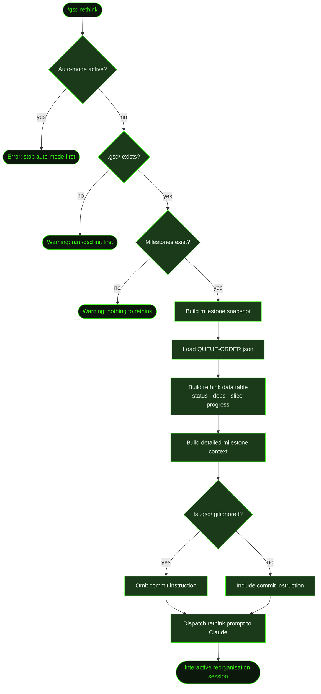

## What It Does

`/gsd rethink` opens a conversational session for restructuring your project's milestone plan. It builds a full snapshot of your milestone landscape — statuses, dependencies, slice progress, and queue order — then turns Claude into a reorganisation assistant.

You can reorder priorities, park milestones you're not ready for, discard work that's no longer relevant, add new milestones, skip individual slices, and update dependency relationships — all through conversation.

`/gsd rethink` operates outside of auto-mode. It cannot run while auto-mode is active, and changes are applied interactively rather than through the automated pipeline.

## Usage

```
/gsd rethink
```

No arguments. The command runs interactively — Claude presents your current milestone order and asks what you'd like to change.

## How It Works

### Rethink Flow



### Snapshot Building

Before starting the conversation, the command builds two pieces of context:

1. **Rethink data table** — a structured summary including:
   - Summary counts: complete, active, pending, parked
   - Whether the queue order comes from an explicit `QUEUE-ORDER.json` or default numeric order
   - The active milestone, if any
   - A milestone table with: position, ID, title, status (with park reason if applicable), dependencies, and slice progress (`done/total complete, N skipped`)
   - Any dependency violations detected in the current order

2. **Detailed milestone context** — the full context for each milestone, including goals and scope, loaded via `buildExistingMilestonesContext`.

### Session Behaviour

Once the context is assembled, Claude presents your milestones as a numbered list with status indicators and asks what you'd like to change. Each change is applied immediately to the filesystem. After each operation, Claude shows the updated order and asks if there's anything else.

Destructive operations (discard) require explicit confirmation before proceeding.

### Supported Operations

| Operation | What Happens |
|-----------|-------------|
| **Reorder** | Writes `.gsd/QUEUE-ORDER.json` with the new milestone order |
| **Park** | Creates `{ID}-PARKED.md` in the milestone directory with a reason and timestamp |
| **Unpark** | Removes `{ID}-PARKED.md` to reactivate the milestone |
| **Skip a slice** | Marks a slice as skipped via `gsd_skip_slice` — auto-mode advances past it without executing |
| **Discard** | Permanently deletes the milestone directory and prunes it from `QUEUE-ORDER.json` |
| **Add** | Generates the next ID via `gsd_milestone_generate_id`, writes context via `gsd_summary_save`, positions it in `QUEUE-ORDER.json` |
| **Update dependencies** | Edits `depends_on` in the YAML frontmatter of the milestone's `{ID}-CONTEXT.md` |

### Dependency Validation

Before applying any reorder, Claude validates the proposed order against dependency constraints:

- A milestone cannot be scheduled before any milestone it depends on (`would_block`)
- Circular dependencies are forbidden
- Dependencies on non-existent milestones are invalid (`missing_dep`)
- Completed milestones always satisfy dependencies regardless of position

If a proposed order would violate constraints, Claude explains the issue and suggests alternatives (remove the dependency, reorder differently, or park the blocker).

### Bias Toward Parking

When a milestone has any completed slices or tasks, Claude is biased toward parking over discarding. Parking is reversible; discarding is not. Completed milestones cannot be parked — doing so would corrupt dependency satisfaction.

### Gitignore-Aware Commit Instruction

If `.gsd/` is gitignored in the project, Claude is told to skip committing planning artifacts. Otherwise, it is prompted to run `git add .gsd/ && git commit -m "docs(gsd): rethink milestone plan"` after changes are applied. Since rethink runs interactively outside auto-mode, no system auto-commit fires.

## What Files It Touches

### Reads

| File | Purpose |
|------|---------|
| `.gsd/QUEUE-ORDER.json` | Current explicit queue order (if present) |
| `.gsd/milestones/MXXX/MXXX-CONTEXT.md` | Milestone scope, goals, and `depends_on` frontmatter |
| `.gsd/milestones/MXXX/MXXX-PARKED.md` | Park status and reason |
| `.gsd/milestones/MXXX/slices/SXX/SXX-PLAN.md` | Slice content for context |
| GSD DB | Slice progress (complete/skipped counts) when available |

### Writes

| File | Purpose |
|------|---------|
| `.gsd/QUEUE-ORDER.json` | Updated execution order after reorder or add operations |
| `.gsd/milestones/MXXX/MXXX-PARKED.md` | Created on park, deleted on unpark |
| `.gsd/milestones/MXXX/MXXX-CONTEXT.md` | Updated `depends_on` frontmatter when dependencies are edited |

### Creates

| File | Purpose |
|------|---------|
| `.gsd/milestones/MXXX/` | New milestone directory when adding a milestone |
| `.gsd/milestones/MXXX/MXXX-CONTEXT.md` | Context file for a newly added milestone |

### Deletes

| File | Purpose |
|------|---------|
| `.gsd/milestones/MXXX/` | Entire milestone directory on discard |
| `.gsd/milestones/MXXX/MXXX-PARKED.md` | Removed when unparking |

## Examples

Starting a rethink session:

```
> /gsd rethink

● Building project snapshot for rethink...
```

Claude then presents something like:

```
Here's your current milestone plan:

1. ▶ M001 — Auth & user management (active, S02/S04 complete)
2. ⏳ M002 — Dashboard MVP (pending)
3. ⏳ M003 — Notifications (pending, depends on M001)
4. ⏸ M004 — Analytics (parked — blocked on data pipeline)
5. ⏳ M005 — Billing integration (pending)

What would you like to change?
```

Reordering to move billing before dashboard:

```
> Move M005 before M002

I'll update the queue order to: M001, M005, M002, M003, M004.

Checking dependencies... no violations found.

Updated order:
1. ▶ M001 — Auth & user management (active)
2. ⏳ M005 — Billing integration
3. ⏳ M002 — Dashboard MVP
4. ⏳ M003 — Notifications (depends on M001)
5. ⏸ M004 — Analytics (parked)

Anything else to adjust?
```

Parking a milestone:

```
> Park M003 — we're not building notifications this quarter

Parking M003 (Notifications) with reason: not building notifications this quarter.

Created .gsd/milestones/M003/M003-PARKED.md

Updated order:
1. ▶ M001 — Auth & user management (active)
2. ⏳ M005 — Billing integration
3. ⏳ M002 — Dashboard MVP
4. ⏸ M003 — Notifications (parked — not building notifications this quarter)
5. ⏸ M004 — Analytics (parked)

Anything else?
```

## Related Commands

- [`/gsd park`](../park/) — park a single milestone without a full reorganisation session
- [`/gsd queue`](../queue/) — view and manage the milestone execution queue
- [`/gsd discuss`](../discuss/) — gather context for a phase before planning
- [`/gsd new-milestone`](../new-milestone/) — start a new milestone cycle
